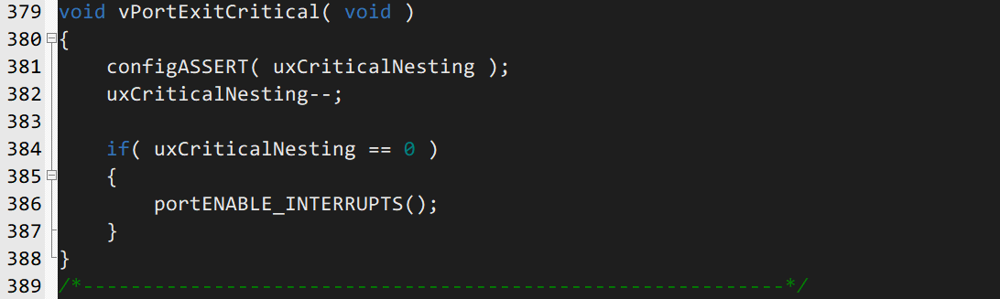
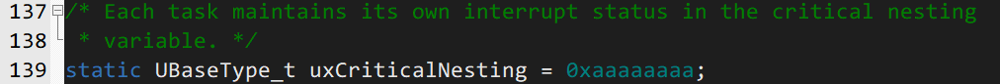

# 临界段代码保护

临界段代码也称临界区，一般为了保证某段代码必须完整运行，不能被打断的代码段。

## API 函数

| 函数名           | 函数描述                      |
| ---------------- | ----------------------------- |
| 任务级进入临界段 | taskENTER_CRITICAL()          |
| 任务级退出临界段 | taskEXIT_CRITICAL()           |
| 中断级进入临界段 | taskENTER_CRITICAL_FROM_ISR() |
| 中断级退出临界段 | taskEXIT_CRITICAL_FROM_ISR()  |

**临界区是直接屏蔽了中断，系统任务调度靠中断，ISR 也靠中断，因此这些都会暂停**

## 内部机制

### 进入临界区

进入临界区函数经过各种宏定义来到这个函数

- 关闭中断
- uxCriticalNesting 是用来计数的
- 当 uxCriticalNesting 为 1 时，

关闭中断函数实现如下：

使用了汇编语言，赋予 basepri 寄存器值为 `FreeRTOSConfig.h` 中的 `configLIBRARY_MAX_SYSCALL_INTERRUPT_PRIORITY`

### 退出临界区

进入临界区函数经过各种宏定义来到这个函数

- 判断
- uxCriticalNesting 是用来计数的
- 当 uxCriticalNesting 为 0 时，开启中断

unCriticalNesting 值为 0xaaaaaaaa

