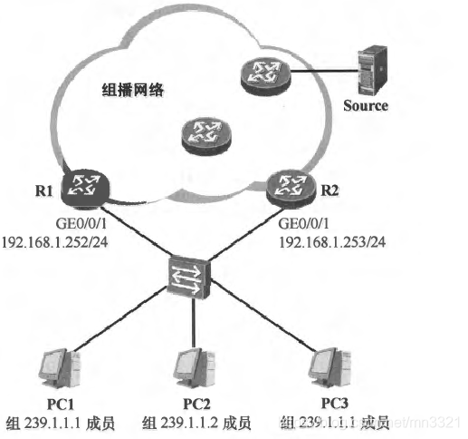

# IGMP协议

## 组播

对于二层交换机来说，它在转发报文时只有四种类型的报文：未知单播、已知单播、组播、广播。

*   广播：报文的目的MAC地址**全为 FF**
*   组播：报文的目的MAC地址**开头为 01:00:5e**
*   单播：报文的目的MAC地址不是以上两种情况

    *   未知单播指的是在MAC地址转换表中没有表项的单播报文，如果 MAC 地址转换表中有该表项则为已知单播报文。

二层交换机对这些报文的处理一视同仁：全部泛洪处理。**当一个端口收到上面所说的任何一种报文以后，就会从所有在同一个 VLAN 里、UP 的端口转发出去。**

> [wireshark抓组播数据\_一分钟了解交换机四种报文中的三种：广播、组播、未知单播...-CSDN博客](https://blog.csdn.net/weixin_34069265/article/details/112207362)

传统网络进行地址分配时，将 IPv4 网络分为5类：

|  类别 |               范围               |
| :-: | :----------------------------: |
|  A类 |        1.0.0.0-126.0.0.0       |
|  B类 |      128.0.0.0-191.254.0.0     |
|  C类 |     192.0.0.0-223.255.255.0    |
|  D类 |    224.0.0.0-239.255.255.255   |
|  E类 | 240.0.0.0-255.255.255.254，保留地址 |

[RFC1918](https://datatracker.ietf.org/doc/rfc1918/) 规定了三个保留地址段落：10.0.0.0-10.255.255.255；172.16.0.0-172.31.255.255；192.168.0.0-192.168.255.255。这三个范围分别处于A,B,C类的地址段，不向特定的用户分配，被 IANA 作为私有地址保留。这些地址可以在任何组织或企业内部使用，和其他 Internet 地址的区别就是，**仅能在内部使用，不能作为全球路由地址。**

其中D类地址称为组播IP，组播IP又可进行如下划分：&#x20;

|                           范围                          |                 解释                 |
| :---------------------------------------------------: | :--------------------------------: |
|                 224.0.0.0-224.0.0.255                 |          预留永久组播地址，通常为协议所使用         |
| 224.0.1.0-231.255.255.255 和 233.0.0.0-238.255.255.255 |    ASM(Any Source Multicast)模型使用   |
|               232.0.0.0-232.255.255.255               | SSM(Source-Specific Multicast)模型使用 |
|               239.0.0.0-239.255.255.255               |          本地管理组地址，也即私网组播IP。         |

常用协议组播地址：

|         组播地址        | 使用者                                          |
| :-----------------: | :------------------------------------------- |
|    **224.0.0.1**    | **所有主机及路由器监听地址**                             |
|    **224.0.0.2**    | **所有路由器监听地址**                                |
|      224.0.0.4      | DVMRP协议使用                                    |
| 224.0.0.5、224.0.0.6 | OSPFv2协议使用                                   |
|      224.0.0.9      | RIPv2协议使用                                    |
|      224.0.0.12     | DHCP协议特定场景使用                                 |
|      224.0.0.13     | PIM协议使用                                      |
|      224.0.0.14     | RSVP协议特定场景使用                                 |
|      224.0.0.18     | VRRPv2协议使用                                   |
|      224.0.0.22     | IGMPv3协议使用                                   |
|   **224.0.0.251**   | **mDNS协议使用**                                 |
|   **224.0.0.252**   | **Link-local Multicast Name Resolution协议使用** |

> IPv4 组播地址空间分类：[IPv4 Multicast Address Space Registry (iana.org)](https://www.iana.org/assignments/multicast-addresses/multicast-addresses.xhtml)

## IGMP协议

如果没有启用 IGMP 协议，网络设备（如OLT/ONU，即光线路终端/光网络单元）将**无法区分哪些端口需要接收特定的多播流量**。在这种情况下，网络设备通常会采取“**泛洪**”（Flooding）的处理方式，即将多播流量发送到所有端口，不管这些端口是否有设备需要这些流量。

*   IGMP 通信协议有效地将多播数据传输到接收方，因此，不会将垃圾数据包传输到主机，从而显示出最佳性能。连接所有共享链接后，带宽将被完全消耗。主机可以离开多播组并加入另一个。
*   IGMP 有个不好的地方是，它在过滤和安全性方面没有提供良好的效率。由于缺少 TCP，可能会发生网络拥塞。IGMP 容易受到 DOS攻击（拒绝服务）等攻击的攻击。

> [网络协议！Wireshark抓包分析IGMP协议及代码实现\_igmp报文抓包-CSDN博客](https://blog.csdn.net/chen1415886044/article/details/112383815)

### IGMPv2报文类型

在 IGMPv2 报文中，一共有四种报文：

1.  **成员关系查询（membership query）**：IGMPv2 定义了两种成员关系查询报文的子类型：**常规查询(General Query**)报文及**特定组查询(Group-Specific Query**)报文。&#x20;

    *   **常规查询**：IGMP 查询器使用该报文向直连网段进行查询，以**确认该网段中是否存在组播组成员。由于该报文查询的是所有组播组，因此也被称为**普遍组查询报文。常规查询报文的**目的IP地址为 224.0.0.1（标识所有组播节点）。**&#x20;
    *   **特定组查询**：运行 IGMPv2 的**主机在离开其所加入的组播组**时，会**主动发送**一个 **IGMPv2 离组报文**，用于宣告自己离开组播组，当网络中的**查询器收到**这个离组报文后，**需要确认该组播组中是否存在其他成员**，此时该查询器便会**发送特定组查询报文**，该报文只针对特定的组播组进行查询，报文的目的 IP 地址为其所查询的组播组地址，而且报文载荷中的“组地址”字段也记录了这个组播组地址。&#x20;
2.  **成员关系报告（membership report）**：当主机**加入组播组**时，或者当其**收到查询器发送的常规查询报文**时，主机将发送成员关系报告报文，该报文的目的 IP 地址是主机所加入的组播组地址，而且报文载荷中的“组地址”字段也记录了该组播组地址。
3.  **离组报文（leave group）**：IGMPv2 在 IGMPv1 的基础上增加了**离组报文**，当**主机离开**其所加入的组播组时，便会**主动发送离组报文**。离组报文的**目的 IP 地址为 224.0.0.2（标识所有组播路由器）**，报文载荷中的“组地址”字段记录了主机所要离开的组播组地址。
4.  **版本 1 成员关系报告（version1 membership report）**：该报文用于兼容 IGMPv1，报文中的类型字段值是 0x12。

### IPGMPv1 v2

**IGMPv1 没有定义查询器的选举机制，而 IGMPv2 则定义了查询器的选举机制：接口 IP 地址最小的路由器成为该网段的 IGMPv2 查询器，它将负责向这个网段执行查询操作。**

两个版本主要区别在于 v2 版本定义了查询器的选举机制：**接口 IP 地址最小的路由器成为该网段的 IGMPv2 查询器，它将负责向这个网段执行查询操作。**

如下图所示，R1 及 R2 都是最后一跳路由器，两者都在各自的 GE0/0/ 1 接口上激活了 IGMPv2。

*   在初始情况下，双方都认为自己是 GE0/0/1 接口所直连的网段的 IGMPv2 查询器，因此都向该网段发送 IGMPv2 常规查询报文。&#x20;
*   R1 及 R2 都会收到对方发送的常规查询报文，它们将报文的源 IP 地址与自己的接口 IP 地址进行比较，**由于 R1 的接口 IP 地址更小，因此在本例中 R1 胜出成为查询器**，而 R2 则是非查询器(Non-Querier)。R1 的 GE0/0/1 接口继续周期性地发送常规查询报文，而 R2 则停止发送。&#x20;
*   非查询器会为当前的查询器启动一个**其他查询器存活计时器**(Other Querier Present Timer)，该计时器的时间缺省为 125 秒（可配置），每次收到查询器发送的查询报文时（缺省时 60s），该计时器将被重置。**如果长时间没有收到查询器发送的查询报文并导致该计时器超时，那么非查询器将认为当前的查询器已经发生故障，此时新一轮查询器的选举过程将被触发。**&#x20;

> [组播技术基础——IGMPv2简介-CSDN博客](https://blog.csdn.net/mn3321/article/details/105604386)       &#x20;
>
> [计算机网络-IGMPv2工作原理介绍\_igmp2-CSDN博客](https://blog.csdn.net/weixin_43483442/article/details/140513611?spm=1001.2101.3001.6650.3\&utm_medium=distribute.pc_relevant.none-task-blog-2%7Edefault%7Ebaidujs_baidulandingword%7ECtr-3-140513611-blog-105604386.235%5Ev43%5Epc_blog_bottom_relevance_base6\&depth_1-utm_source=distribute.pc_relevant.none-task-blog-2%7Edefault%7Ebaidujs_baidulandingword%7ECtr-3-140513611-blog-105604386.235%5Ev43%5Epc_blog_bottom_relevance_base6)

## IGMP Snopping

**IGMP Snooping** 是一种在交换机上运行的机制，用于**优化多播流量的传输**。它通过监听主机和路由器之间的 IGMP 消息，来**决定如何转发多播数据包**。

IGMP 负责主机和路由器之间的多播组管理，而 IGMP Snooping 则在交换机层面优化多播流量的转发，确保多播数据能够高效地传输到需要的接收者。

> [02-IGMP Snooping配置-新华三集团-H3C](https://www.h3c.com/cn/d_202402/2054682_30005_0.htm#_Toc159241534)

