# OLT\&ONU

## OLT

### EPON

EPON（Ethernet Passive Optical Network）技术沿用了**以太网**的数据格式，但在传统的以太网帧结构基础上进行了**扩展**，以适应光纤接入网络的需求。**在以太网包头增加了 64 字节的 MPCP（点到多点控制协议）来实现 EPON 系统中的**带宽分配。

**EPON 的标准是 IEEE802.3ah**，标准中定义了 EPON 的物理层、MPCP(多点控制协议)、OAM(运行管理维护)等相关内容。

下图描述了 EPON 系统的协议分层及其与 OSI 参考模型之间的关系。

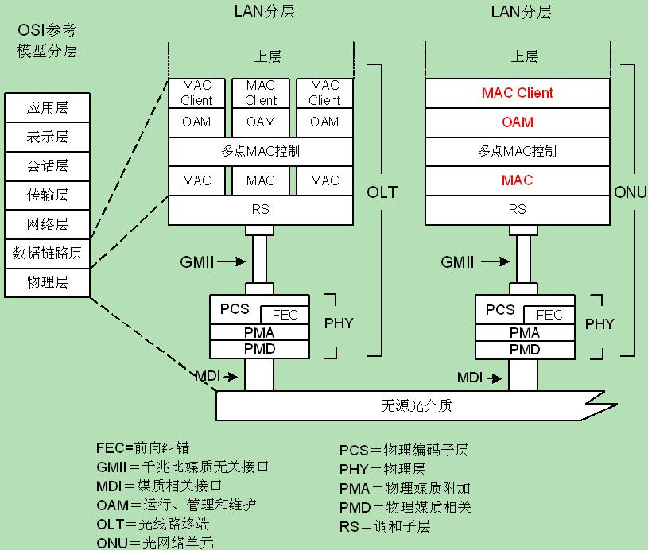 

*   OAM 层：使用 **OAM 协议**数据单元，管理、测试和诊断已激活 OAM 功能的链路；定义了 EPON 各种告警事件和控制处理；
*   多点 MAC 控制：使用 **MPCP（多点控制协议）**，实现点对多点的 MAC 控制；实现在不同的 ONU 中分配上行资源、在网络中发现和注册 ONU、允许 DBA 调度；
*   MAC：实现对 Media 的控制；
*   RS：调和子层，为 EPON 扩展了字节定义，调和多种数据链路层能够使用统一的物理层接口；
*   PCS：物理编码子层，支持在点对多点物理介质中的突发模式 ＋ 支持 FEC 算法；
*   FEC：使用二进制运算（例如Galois算法），附加一定的纠错码用于在接收端进行数据校验和纠错；
*   PMA：物理媒质附加子层，支持 P2MP 功能，实现 PMD 的扩展；
*   PMD：物理媒质相关子层（使用 1000BASE-PX 接口）PMD 子层定义了 EPON 兼容器件的指标，实现 PMD 服务接口和 MDI 接口之间的数据收发功能。&#x20;

#### EPON 帧结构

##### LLID

**LLID（Logical Link Identifier**）是用于无源光网络（PON）中的一个重要标识符，特别是在 EPON（Ethernet Passive Optical Network）和 GPON（Gigabit Passive Optical Network）系统中。**LLID 用于在 PON 网络中唯一标识每个 ONU（Optical Network Unit），确保数据包能够正确地传输到目标 ONU。**

LLID 在帧的位置：

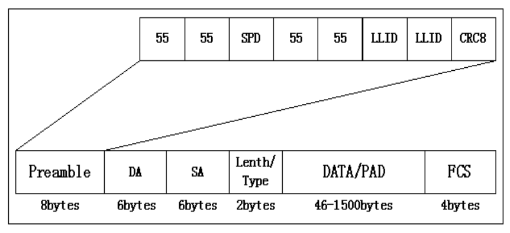

在 PON 网络中，多个 ONU 共享同一根光纤，通过 OLT（Optical Line Terminal）进行集中管理。为了区分不同的 ONU，每个 ONU 被分配一个唯一的 LLID。LLID 的作用包括：

1.  **标识 ONU**：LLID 用于唯一标识每个 ONU，确保数据包能够正确地传输到目标 ONU。
2.  **数据包过滤**：OLT 根据 LLID 对数据包进行过滤，只将属于特定 ONU 的数据包转发到该 ONU。
3.  **冲突避免**：通过为每个 ONU 分配唯一的 LLID，可以避免多个 ONU 同时发送数据包导致的冲突。

LLID 的分配和管理通常由 OLT 负责，具体过程如下：

1.  **ONU 注册**：当 ONU 首次连接到 PON 网络时，它会向 OLT 发送注册请求。
2.  **OLT 分配 LLID**：OLT 接收到 ONU 的注册请求后，会为该 ONU 分配一个唯一的 LLID，并将其发送给 ONU。
3.  **ONU 配置**：ONU 接收到分配的 LLID 后，会将其配置为自身的标识符，并在后续的数据传输中使用该 LLID。

在 EPON 中，数据的传输遵照IEEE 802.3以太网协议，采用**可变长度的分组格式**进行传输，分组的**最大长度为 1518 字节**。没有改变以太网帧的结构，只是**利用以太网帧的前 8 个字节的前缀对数据帧作了标识**。

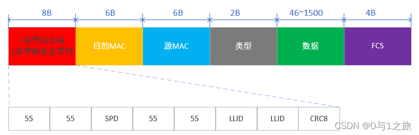

从EPON帧结构图可以看出：

*   LLID：在前导码第 6、7 个字节中携带了 LLID（Logical Link Identifier，逻辑链路标记）信息，用于在 OLT 上标识 ONU，
*   SPD：第 3 个字节 SPD(或称 SLD，LLID 定界符在 EPON 中为 0XD5)，第 3 个字节**标识它不是普通以太网帧而是一个 EPON 帧**。EPON 定义了广播 LLID(LLID=0xFF)作为单拷贝广播(SCB)信道，用于高效传输下行视频广播/组播业务。

##### MPCP子层

**EPON 建立在 MPCP（Muti-Point Control Protocol多点控制协议）基础上**，该协议是 MAC control 子层的一项功能。在 P2MP（点到多点）拓扑中的每个 ONU 都包含一个 MPCP 的实体，用以和 OLT 中的 MPCP 的一个实体相互通信。EPON 通过在每个数据报的前面加上一个 LLID（Logical Link Identification）逻辑链路标识，实现了一个 P2P 仿真子层。

*   PON 将拓扑结构中的**根结点**认为是**主设备**，即 OLT；
*   将位于边缘部分的为是**从设备**，即 ONU。
*   MPCP 在点对多点的主从设备之间规定了一种控制机制以协调数据有效的发送和接收。
*   EPON 系统通过 MPC PDU 来实现 OLT 与 ONU 之间的带宽请求、带宽授权、测距等。

MPCP 在 MAC 控制层实现，引入了 5 条新的控制消息：

*   GATE（Opcode＝0002）（OLT 发出）：允许接收到 GATE 帧的 ONU 立即或者在指定的时间段发送数据；
*   REPORT（Opcode＝0003）（ONU 发出）：向 OLT 报告 ONU 的状态，包括该 ONU 同步于哪一个时间戳、以及是否有数据需要发送；
*   REGISTER\_REQ（Opcode＝0004）（ONU 发出）：在注册规程处理过程中请求注册；
*   REGISTER（Opcode＝0005）（OLT 发出）：在注册规程处理过程中通知 ONU 已经识别了注册请求；
*   REGISTER\_ACK（Opcode＝0006）（ONU 发出）：在注册规程处理过程中表示注册确认。

#### EPON 注册

EPON 终端的注册认证通过 **OAM 报文**与 OLT 交互，在 Wireshark 可用过滤条件"oam-ctc"进行过滤。

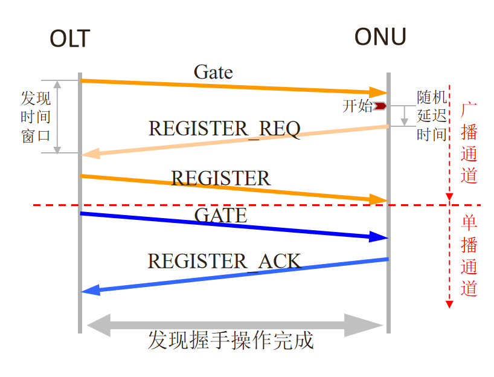

新连接或非在线的 ONU 接入 OLT，OLT 为各 ONU 分配唯一的身份标识 LLID（Logical Link ID，逻辑链路标志）。

**ONU 注册流程如下：**

1.  OLT 通过广播一个发现 `GATE` 消息来通知 ONU 发现窗口的周期。发现 `GATE` 消息包含发现窗口的开始时间和长度；
2.  非在线 ONU 接收到该消息后将等待该周期的开始，然后向 OLT 发送 `REGISTER_REQ` 消息（`REGISTER_REQ` 消息中包括 ONU 的 MAC 地址以及最大等待授权（Pending Grant）的数目）；
3.  OLT 接收到有效的 `REGISTER_REQ` 消息后，将注册该 ONU，**分配和指定新端口的标识(LLID)**，并**将相应的 MAC 和 LLID 绑定**。OLT 向新发现的 ONU 发送注册(Register)消息，该消息包含 ONU 的 LLID 以及 OLT 要求的同步时间。同时，OLT 还对 ONU 最大等待授权的数目进行响应；
4.  此时 OLT 已经有足够的信息用于调度 ONU 访问 PON，并发送标准的 GATE 消息允许 ONU 发送 `REGISTER_ACK`。
5.  当接收到 `REGISTER_ACK`，该 ONU 的发现进程完成，该 ONU 注册成功并且可以开始发送正常的消息流。

#### EPON 拓展 OAM 连接&#x20;

扩展的 OAM 连接建立完成后，OLT 才能向 ONU 传送数据，对 ONU 进行远程配置管理。

扩展 OAM 连接的建立过程如下：

1.  ONU 和 OLT 完成标准 OAM 连接。
2.  ONU 向 OLT 上报所支持的 OUI（Organizationally Unique Identifier，机构统一标识）及扩展 OAM 版本号。
3.  OLT 确认该 ONU 上报的 OUI 及扩展 OAM 版本号是否在本地支持的 OUI 及扩展 OAM 版本号列表中。如果存在，则该 ONU 的扩展 OAM 连接建立成功。

#### EPON 动态带宽分配

**各 ONU 发送数据所需的数据传输时隙（上行带宽）由 OLT 根据 DBA（Dynamic Bandwidth Allocation，动态带宽分配）算法统一分配，可以避免上行数据冲突。**

OLT 为 ONU 分配上行带宽的过程如下：

1.  OLT 发送普通 GATE 消息，告知 ONU 发送 REPORT 消息的时隙。
2.  ONU 在所分配的时隙内发送 REPORT 消息，向 OLT 报告自己的本地状况（如缓存占用量）， 以帮助 OLT 智能分配时隙。
3.  OLT 收到 ONU 的 REPORT 消息，根据当前带宽状况，为 ONU 分配数据传输时隙（带宽）。
4.  ONU 收到授权 GATE 消息后，在 OLT 分配的传输时隙内发送数据。

### GPON

#### GPON 帧结构

GPON	的物理层是**定长的 TDM 帧（125 us）**。GPON 帧由**帧头**和**净荷**组成，内含数据信息和控制信息。

*   **GPON 帧数据信息**：数据信息都在净荷中。

    *   上行帧净荷部分有三种：ATM 信元、GEM 信元、DBA 帧
    *   下行帧净荷部分有两种：ATM 信元、GEM 信元
*   **GPON 帧控制信息**：控制信息有的在净荷中，有的在帧头中，包括 OMCI、EOAM、PLOAM。

##### GEM 帧

GPON 标准中定义了一种特殊的封装方法：GEM（GPON Encapsulation Mode），而采用 GEM 封装形成的帧，我们称之为 GEM 帧。

对到来的以太网帧，GPON 系统对其进行解析，将以太网帧中所有重要关键数据（目的 MAC 地址、源 MAC 地址、类型、数据、FCS 封装）直接映射到 GEM 帧的 Payload 中，GEM 帧再自动封装头部信息。&#x20;

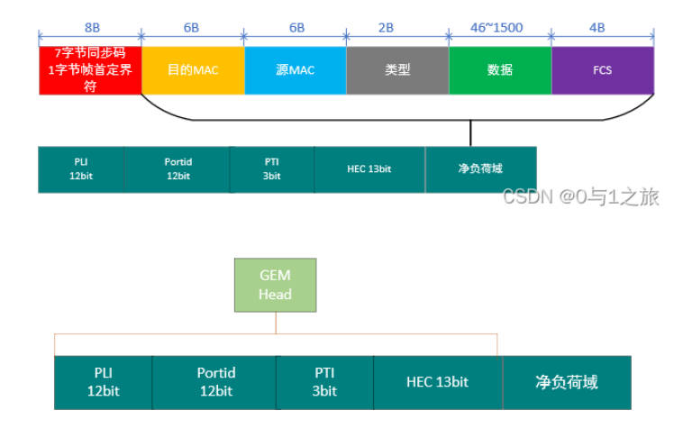

GEM 帧头由 PLI（净负荷长度指示）、PortID（端口ID）、PTI（净负荷类型指示）和 HEC（头差错校验）组成。

PLI（Payload Length Indicator）：表示**头部后面的净负荷域的长度**，**共 12 bit**，最多指示到 4095 字节，所以大于这个值的用户数据帧必须要采用**分片机制**传送。

Port-ID（Port Identifier）：表示 **GEM 帧所在的 GEM Port**。

PTI（Payload Type Indicator）：表示**数据净荷类型**，同时用于指示在净荷分段时是否为最后一帧。

HEC（Header Error Check）：表示信头差错控制，用于帧头的错误检测和纠正。

GPON 系统**保留以太网帧**中 DA（destination MAC address）、SA（source MAC address）、Ethernet Type 以太网类型、MAC client data 数据负载、FCS（Frame Check Sequence）帧校验序列等信息，**再封装头部，最终组成 GEM 帧**。GEM 帧中不包含前导和 SFD 字节。

##### 上行帧（待定）

上行 GTC 帧由多个突发（burst）组成。每个上行传输突发由上行物理层开销（PLOu）以及与 Alloc-ID 对应的一个或多个带宽分配时隙组成。上行帧长为 125 us，即 19440 字节。&#x20;

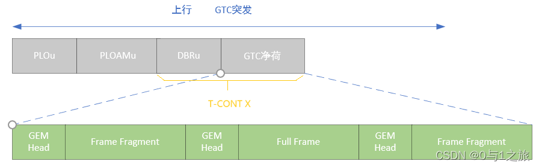

##### 下行帧（待定）

下行 GTC 帧由下行物理控制块（PCBd）和GTC 净荷部分（一系列GEM帧）组成。下行帧长为 125us，即 38880 字节。

ONU 根据 GEM 帧头中携带的 12 比特 Port-ID 值过滤下行 GEM 帧。ONU 经过配置后可识别出属于自己的 Port-ID，只接收属于自己的GEM 帧并将其送到 GEM 客户端处理进程作进一步处理。&#x20;

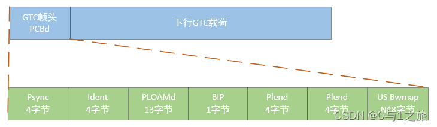

#### GPON 注册

GPON 终端的注册认证**通过 OMCI 报文与 OLT 交互**，在 Wireshark 可用"omci"进行过滤（需安装 lua 插件）。

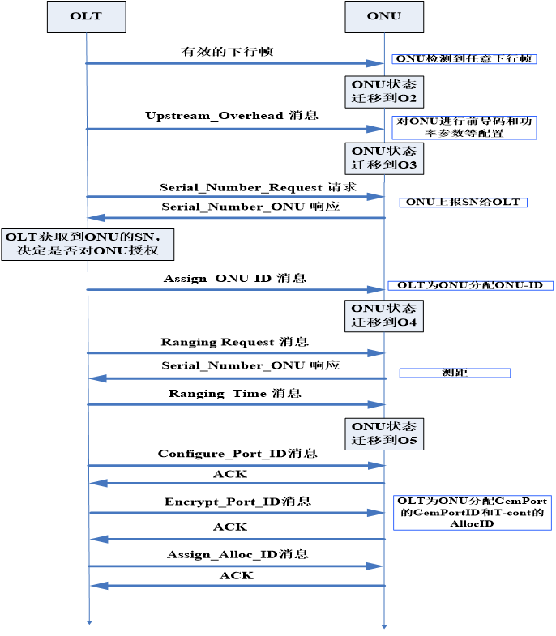

正常注册流程大致分为三个阶段：参数获取阶段（O1-O3）、序列号获取（O3-O4）、测距（O4-O5）。

1.  开始 ONU 上电运行，倾听下行传输以获得 Psync 物理帧同步。\[O1]
2.  ONU 接收 PON 运行参数，参数通过下行的 Upstream\_Overhead 和 Extended\_Burst\_Length(可选)消息传送。(广播所有 ONU)

    1.  ONU 设置自己的传输光功率以及预置均衡时延等等网络参数。\[O3]
3.  OLT 通过 Serial\_Number\_Request 消息要求 ONU 上报 SN。 (广播所有ONU)

    1.  ONU 通过 Serial\_Number\_ONU 消息回复自己的 SN。
4.  OLT 收到 Serial\_Number\_ONU 后，并通过下行的 Assign\_ONU-ID 消息给它分配一个 ONU-ID。（广播所有ONU）\[O4]
5.  OLT 向新接入 ONU 单播 Ranging\_Request 消息并精确算反应时间（单播）

    1.  OLT 计算 EqD，并通过 Ranging\_Time 消息将 EqD 传给 ONU
6.  ONU 根据 EqD 设置它的上行传输的初始时钟。ONU 完成激活过程并开始常规运行\[O5]&#x20;

### DBA（**动态带宽分配）**

**DBA（Dynamically Bandwidth Assignment(动态带宽分配)**），DBA 是一种能在微秒或毫秒级的时间间隔内完成对**上行带宽**的动态分配的机制。

*   可以提高 PON 端口的上行线路带宽利用率
*   可以在 PON 口上增加更多的用户

#### 上行带宽类型

*   **固定带宽(Fixed bandwidth)**：在 T-CONT 激活之后，OLT 就为其分配该带宽，**不管 T-CONT 上是否有上行流量**。
*   **保证带宽(Assured bandwidth)**：当 T-CONT **有带宽需求**时，必须分配给它的带宽。**如果 T-CONT 的带宽需求小于配置的保证带宽，多出来的配置带宽可以被其他的 T-CONT 使用**。
*   **非保证带宽(Non-Assured bandwidth)**：当 T-CONT 有带宽需求时，也不一定分配给它的带宽。**只有在所有的固定带宽和保证带宽都分配完之后，才会进行非保证带宽的分配。**
*   **尽力而为带宽(Best-Effort bandwidth)**：是**优先级最低**的带宽类型。在固定带宽、保证带宽和非保证带宽都分配完之后，如果带宽还有剩余，才会进行尽力而为带宽的分配。
*   **最大带宽(Maximum bandwidth)**：不管该 T-CONT 上的实际上行流量有多大，**分配的带宽值都不能大于最大带宽**。**等于固定带宽、保证带宽、非保证带宽和尽力而为带宽的和。**

#### DBA 类型

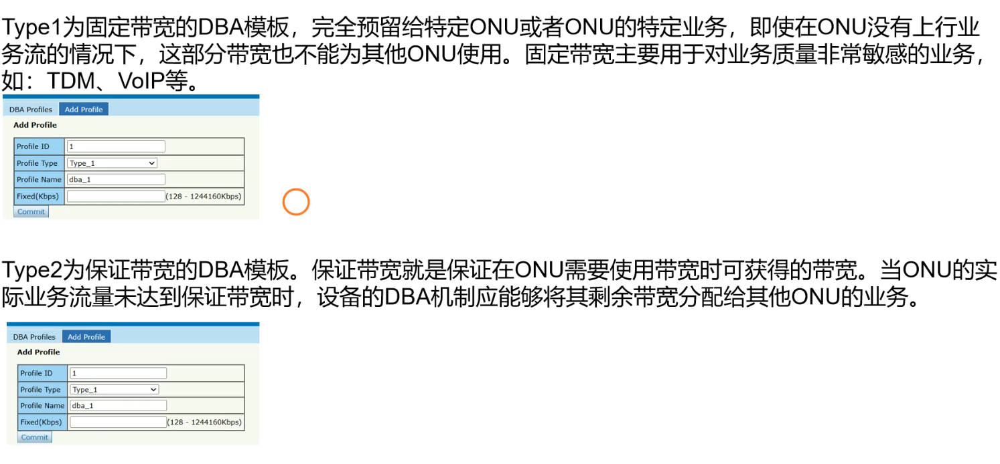

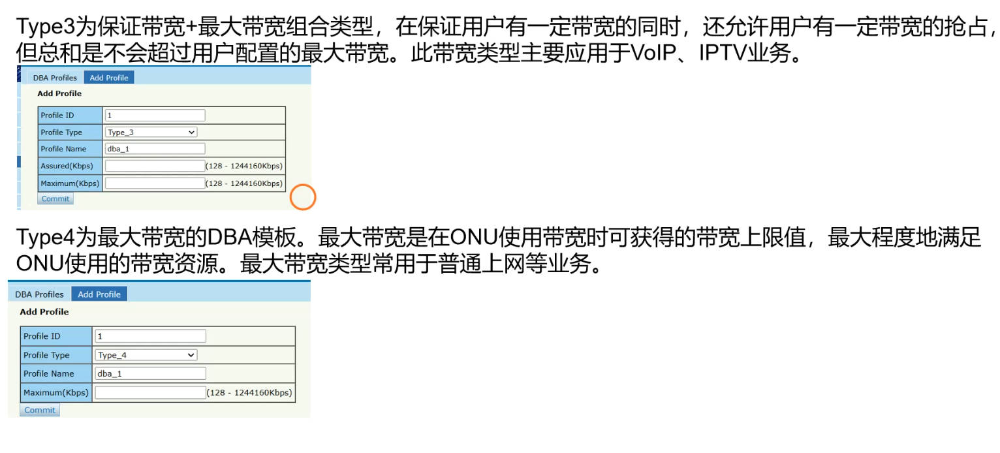

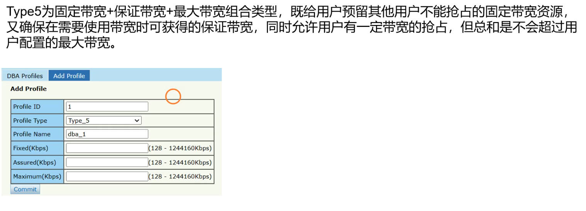

## ONU

### ONU介绍

ONU（Optical Network Unit，光网络单元）是光网络中的用户端设备，放置在用户端与OLT 配合使用。

### ONU类型区分

在不区分用户侧设备具体形态时，PON 系统用户侧设备可统称为 ONU，因此一般为了方便都统称为 ONU。

宽带光纤接入的主要应用类型包括：FTTH、FTTO 和 FTTB，不同应用类型下用户侧设备的形态也不同。FTTH、FTTO 的用户侧设备由单个用户使用，称为 **ONT（Optical network terminal，光网络终端）**，FTTB 的用户侧设备由多个用户共享，称为 **ONU（Optical Network Unit，光网络单元）**。

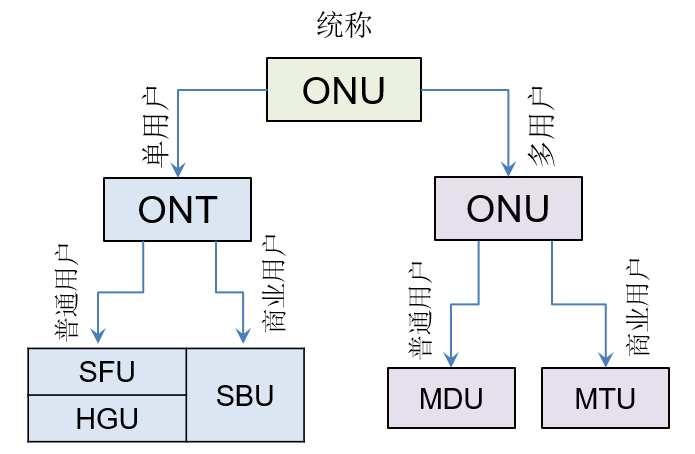

#### ONT

ONT 就是我们俗称的**光猫**，分为 **SFU（Single Family Unit，单个家庭用户单元）**、HGU（Home Gateway Unit，家庭网关单元）和 SBU（Single Business Unit，单个商业用户单元）。

##### HGU 和 SFU 的区别

> 这里重点区分一下 HGU 和 SFU 的区别即可。目前纯 SFU 的设备已经较少了，基本都带点 HGU 的部分功能。

*   HGU 属于**网关设备，便于家庭内部组网**；而 **SFU 则是一个透传设备，不具备网关能力**，在家庭组网时一般需要如家用路由器的网关类设备配合。
*   HGU 支持**路由模式，具备 NAT 功能，是一个三层设备**；而 SFU 型仅支持**二层桥接模式**，相当于一个二层交换机。
*   HGU 可以**实现自身宽带拨号应用**，下挂的电脑、移动终端等可以不拨号直接上网；而 SFU 则必须由用户电脑或手机等终端拨号，或通过家用路由器拨号上网。
*   HGU 更易于大规模运维管理。
*   HGU 通常自带 wifi，并带有USB接口。

#### ONU

ONU 分为 MDU（Multi-Dwelling Unit，多住户单元）和 MTU（Multi-Tenant Unit，多租户单元）。

**MDU 主要应用于 FTTB 应用类型下的多个住宅用户的接入**，一般具有至少 4 个用户侧接口，通常具有 8 路、16 路、24 路 FE 或 FE+POTS（固定电话）接口。

**MTU 主要用于 FTTB 场景下的多个企业用户或同一企业内多个终端的接入**，除具有以太网接口、固定电话接口外，还可能具有 E1 接口；MTU 的外形和功能通常与 MDU 并无区别，但**电气防护性能更好、稳定性更高**。随着 FTTO 的普及，MTU 的应用场景也越来越小。

> [ONU、ONT、SFU、HGU有什么区别？ (china-cic.cn)](https://www.china-cic.cn/Detail/15/208/4477)
>
> [(80 条消息) 光猫和路由器有什么区别？ - 知乎 (zhihu.com)](https://www.zhihu.com/question/363713005)

### ONU型号区分（不同厂家不同）

*   R：支持路由模式
*   B：支持桥接模式
*   W：支持 WiFi
*   T：支持 CATV
*   E：有百兆（FE）网口
*   G：有千兆（GE）网口
*   AC：有 AC 功能用来管理 AP

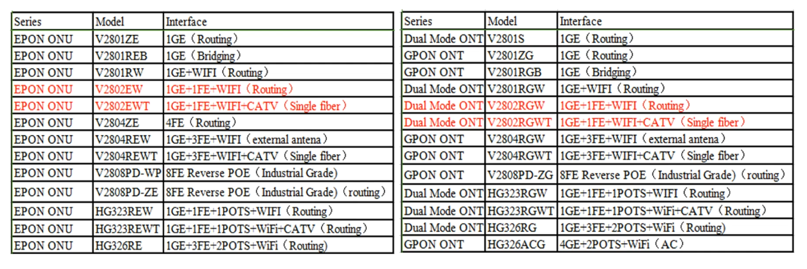

### ONU 注册过程的七种状态

1.  **O1：初始状态（Initial-state）。**此时 ONU 刚刚上电，仍处于 LOS/LOF 状态。
2.  **O2：待机状态（Standby-state）。**此时 ONU 已经收到下行流，准备接收 OLT 发送的网络参数消息。
3.  **O3：序列号状态（Serial-Number-state）。**此时 ONU 已接收到网络参数（Upstream\_Overhead 消息），并根据参数进行了相关配置（如定界符、功率模式、预置均衡时延等），等待 OLT 发送的序列号获取消息（Serial-Number Request 消息）。
4.  **O4：测距状态（Ranging-state）。**此时 ONU 已被 OLT 发现，并获取了 OLT 指配的 ONU-ID（Assign\_ONU-ID 消息），最后需要通过测距获取一个均衡时延（Ranging\_Time 消息）。
5.  **O5：运行状态（Operation-state）。**此时 ONU 测距成功，可以在 OLT 控制下发送上行数据和 PLOAM 消息。不同 ONU 根据自身均衡时延发送信号，在不同时间到达 OLT 以避免相互干扰。
6.  **O6：POPUP 状态（POPUP-state）。**ONU 正常运行时（O5）检测到 LOS 或 LOF 时，立即停止发送信号。当光纤中断时许多 ONU 会进入该状态，此时

    1.  若 PON 网络使用了保护倒换技术，所有 ONU 将切换到备用光纤上，OLT 会发送 Broadcast POPUP 消息，所有 ONU 会进入测距状态（O4）。
    2.  若无保护倒换技术，但 ONU 具备内部保护能力，OLT 会发送 Directed POPUP 消息，ONU 恢复到运行状态（O5）。
    3.  若 ONU 未收到 Broadcast POPUP消息或 Directed POPUP 消息，经过 TO2 时间会回复初始状态（O1）。
7.  **O7：紧急停止状态（Emergency-Stop-state）。**ONU 收到带有"Disable"选项的 Disable\_Serial\_Number 消息，被禁止发送信号，关闭激光器。&#x20;

### ONU 认证

PON 认证方式分为**物理标识认证**和**逻辑表示认证**。

*   物理标识认证：包括 SN 认证、Password 认证、SN+Password 认证
*   逻辑标识认证：包括 LOID 认证、LOID+Password。

**表**

ONU 的五种认证方式

*   SN 认证：SN 即 serial number，由厂商出厂时设置，每个 ONU 唯一，可唯一标识一个 ONU，**共 12 个字符**，**前 4 个字符为厂商 ID**。
*   Password 认证：密码认证又称为 key 认证。GPON 支持 1-10 个字符，16 进制 HEX 时支持 1-20 个字符。Password 认证分为 always on 和 once on 两种模式。

    *   always on：（方便维护，安全性不高）第一次认证使用密码认证，认证通过后，不会自动匹配序列号，后续每一次认证也都使用密码认证。ONU 的序列号修改后，仍然可以上线。
    *   once on：（不方便维护，安全性高）第一次认证使用密码认证，认证通过后，自动匹配序列号，后续每一次认证使用序列号方式或序列号+密码方式，在采用序列号方式时，只有 ONU 的密码匹配时才能上线；在采用序列号+密码方式时，只有 ONU 的序列号和密码都匹配时才能上线。这个可以通过命令设置，默认为序列号+密码方式。
*   SN+Password 认证：通过序列号加密码双重认证。
*   LOID 认证：由运营商提出的一种认证方式，LOID 由运营商内部统一规划，1～24 个字符，和 Password 实现类似，区别是 Password 还是采用 PLOAM 消息交互，而 LOID 在 O5 状态时采用 OMCI 消息交互。
*   LOID+Password 认证：是由中国电信定义的一种方式。&#x20;

#### 物理标识认证

##### SN认证

图

OLT 收到 ONU 的序列码回应消息后，判断 OLT 上是否有相同 SN 的 ONU 在线。

*   如果有相同 SN 的 ONU 在线，则向主机命令行和网管上报SN冲突告警；
*   否则，直接给 ONU 分配指定的 ONUID。

ONU 进入操作状态后，对于 SN 认证方式的 ONU，OLT 不进行 Password 请求，主机命令行或者网管直接上报 ONU 上线告警。&#x20;

##### SN+Password认证

图

OLT 收到 ONU 的序列码回应消息后，判断 OLT 上是否有相同 SN 的 ONU 在线。

*   如果有相同 SN 的 ONU 在线，则向主机命令行和网管上报SN冲突告警；
*   否则，直接给 ONU 分配指定的 ONUID。

ONU 进入操作状态后，OLT 会向 ONU 进行 Password 请求，并将 ONU 回应的 Password 与本地配置的 Password 进行比较：

*   如果 Password 本地配置**相同**，则直接让 ONU 上线，并向主机命令行或者网管上报 ONU 上线告警；
*   如果 Password 与本地配置**不同**，则向主机命令行或者网管上报 Password 错误告警。&#x20;

#### 逻辑标识认证

OLT 对 ONU 上报的 LOID 与 Password 进行校验。

基于逻辑表示的认证流程如图所示：

1.  ONU 跳转到 O5 状态后，其认证状态仍然为“unauthorized"。
2.  OMCC 通道建立后，OLT 根据当前采用的认证类型，向 ONU 发送 Get 消息发起对 ONU 的认证(如果 OLT 采用 LOID 认证方式，则 OLT 仅需发送 Get(LOID)消息，不必再发送 Get(Password)消息)。
3.  ONU 收到 Get 消息后发送 Get Response 消息向 OLT 上报 LOID 和 Password，OLT 对该 ONU 的逻辑标识的合法性和正确性进行验证。

    *   （正常流程）如果验证通过，则 OLT 将 ONU 设置为“授权(authorized)”状态，并向 ONU 发送 Set(Authenticationstatus=0x01)消息通知 ONU 认证成功。
    *   （异常流程）如果验证错误，则 OLT 保持 ONU 在 unauthorized 状态，并向 ONU 发送 Set 消息(Authenticationstatus=0x02/03/04)，通知 ONU 认证失败和失败的原因。当 ONU 返回 Set 消息配置成功后，OLT 下发 DeactivateONU-ID 消息，ONU 跳转到 O2 状态。
    *   如果出现两个 ONU 认证时使用的 LOID 冲突，则先通过认证的 ONU 正常使用 OLT 应拒绝后发起认证的 ONU，并发送认证失败Authenticationstatus=0x04，同时，OLT 应向网管上报告警。如果先通过认证的 ONU 下线后，OLT 应能允许其他 ONU 采用相同的 LOID 进行认证。

**ONU 上电后会创建一个管理实体 ME（LOID authentication）用于实现逻辑标识认证。**

逻辑标识认证（LOID authentication）消息格式：

*   ME ID：0x0000（2Bytes）
*   Operator ID：标识运营商的标识符，默认配置有 C、T、NULL（4bytes）
*   LOID：ONU 的逻辑标识，默认为 NULL（0x00）（24Bytes）
*   Password：ONU 的认证密码，默认为 NULL（12Bytes）
*   Authentication status：ONU 的认证状态

    *   0x00：初始状态
    *   0x01：认证成功
    *   0x02：LOID 不存在
    *   0x03：LOID 存在，但 Password 错误
    *   0x04：LOID 冲突
    *   0x05-0xff：Reserved

### 长发光检测

长发光 ONU 是模块不受控制的 ONU，长发光 ONU 也叫流氓（rogue）ONU。

PON **上行**采用的是**时分复用**的技术，如果流氓 ONU 存在，**流氓 ONU 上行长时间或短时间占用其他 ONU 的通信时隙**，带来的影响就是流氓 ONU 所在 PON 口下的其他 ONU 无法正常工作。

*   如果流氓 ONU 是**长发光**，则同一 PON 口下其他的 ONU 将一直**无法上线**；
*   如果流氓 ONU 是**乱发光**，则同一 PON 口下其他 ONU 可能会出现**反复上线和下线**的现象。

长发光 ONU 出现原因大致归结为两类：PON 芯片控制软件故障和光模块硬件故障。

OLT 检测长发光 ONU 的一种过程如下：

*   检测 OLT 在线表中是否有长发光 ONU：

    1.  OLT 向遍历 ONU 在线表，向 ONU 的 SN 发送命令为 DISABLE 的 PLOAM 消息；
    2.  ONU 收到 PLOAM 消息，进入 O7（紧急停止）状态，关闭自身激光器；

        1.  若关闭的 ONU 为长发光 ONU，OLT 将能重新收到其他正常 ONU 的 SN 查询消息，可判断该 ONU 为长发光 ONU；
        2.  若关闭的 ONU 为正常 ONU，则 OLT 仍不能收到其他 ONU 的 SN 查询消息，重新使能该 ONU，并进行下一个 ONU 的检测。
*   OLT 的 ONU 在线表遍历完，仍未检测到长发光 ONU 时，说明 ONU 是全新上电就长发光的，则进行如下处理：

    1.  OLT 对 PON 口下**所有 ONU** 发送命令 ID 为 DISABLE 的 PLOAM 广播消息；
    2.  ONU 收到 PLOAM 广播消息，进入 O7 状态，关闭自身激光器。这样 PON 口下所有在线的 ONU 都关闭了激光器；
    3.  OLT 开始遍历授权表，并逐一对每个已授权的 ONU 发送命令 ID 为 ENABLE 的 PLOAM 消息，使能所有已授权的 ONU；
    4.  ONU 收到 PLOAM 消息，重新打开自身激光器，从 O7 状态回到 O2 状态，再重新测距激活到 O5，恢复正常工作。

