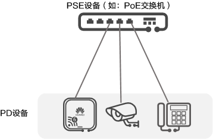

# POE供电\&POF供电

## 为什么需要PoE or PoF

多数情况下，终端设备需要直流供电，而终端设备通常安装在距离地面比较高的天花板或室外，附近很难有合适的电源插座，即使有插座，终端设备需要的交直流转换器也难有位置安置。因此这种既传输数据又能供电的技术就产生了，而为了能传输更远的距离，又从 PoE 演变到了 PoF。

## PoE

**PoE（Power over Ethernet）是指通过网线传输电力的一种技术，借助现有以太网通过网线同时为IP终端设备（如：IP电话、AP、IP摄像头等）进行**数据传输和供电。
PoE又被称为基于局域网的供电系统(Power over LAN，简称PoL)或有源以太网( Active Ethernet)，有时也被简称为**以太网供电**。

**PoE的优点：**

*   可靠：一台PoE设备可以同时为多个终端设备供电，实现电源集中供电的同时，还可以进行电源备份。
*   连接简捷：终端设备不需外接电源，只需要一根网线。
*   标准：符合国际标准，使用全球统一的RJ45电源接口，可保证与不同厂商的设备对接

**PoE 的缺点：**

*   PoE 可能比传统电源更昂贵。&#x20;
*   如果供电出现问题，则 PoE 的故障排除可能会更加困难。
*   PoE 只能用于支持 PoE 的设备。&#x20;

如下图所示，PoE供电系统包括如下两个设备角色：

*   供电设备PSE（Power-sourcing Equipment）：通过以太网给受电设备供电的PoE设备，提供检测、分析、智能功率管理等功能，例如：PoE交换机。
*   受电设备PD（Powered Device）：如无线AP、便携设备充电器、刷卡机、摄像头等受电方设备。按照是否符合IEEE标准，PD分为标准PD和非标准PD。

> <https://info.support.huawei.com/info-finder/encyclopedia/zh/PoE.html>

## PoF

**PoF 供电，即光纤供电（Power over Fiber）**，是一种通过光纤传输电力和数据的技术。它与以太网供电（PoE）类似，但使用的是不同类型的光缆。PoF 电缆设计用于同时传输电力和数据，能够以**高达10 Gbps**的速度传输数据。这种技术特别适合于需要**避免电磁场干扰**的应用场景，例如医院和实验室。

PoF 的优点：

*   **不受电磁干扰**影响，使其成为需要考虑电磁干扰的应用的理想选择。
*   **传输距离更长。**
*   比铜缆更能抵抗损坏，从而可以延长网络的使用寿命。
*   比铜缆更轻、更薄，因此更易于安装和管理。

**PoF 的缺点：**

*   PoF 不像 PoE 那样得到广泛支持。&#x20;
*   PoF 设备比传统的以太网设备更昂贵。&#x20;
*   PoF 电缆不像铜质以太网电缆那样广泛使用。

> [什么是光电混合缆? 一根线缆同时解决数据传输和设备供电的问题。 - 华为](https://info.support.huawei.com/info-finder/encyclopedia/zh/%E5%85%89%E7%94%B5%E6%B7%B7%E5%90%88%E7%BC%86.html)
>
> [POE和POF的概述\_pof供电-](https://blog.csdn.net/z306417888/article/details/131014687)[CSDN]()[博客](https://blog.csdn.net/z306417888/article/details/131014687)

