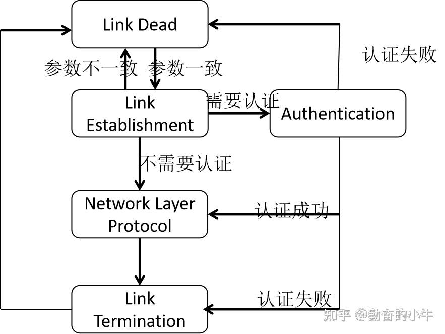
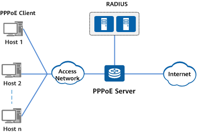
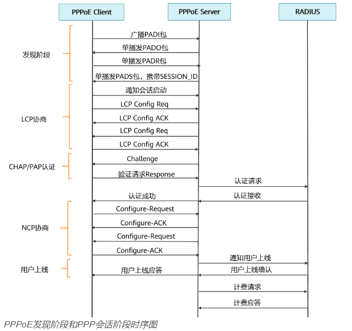

# PPPoE协议

## PPP协议

PPP协议(Point to Point 协议)，点对点协议，是**数据链路层**封装协议的一种，PPP协议**没有纠错和重传机制。**

PPP协议的一个重要功能便是提供了**身份验证**功能。但是PPP协议虽然提供了通信双方身份验证的功能，其**协议中没有提供地址信息**，而以太网是一个广播类型的多路访问网络，因而PPP协议是无法直接应用在以太网链路上的。

**PPP链路建立分为5个阶段：**

**PPP 协议认证有 PAP（明文传输）和 CHAP（密文传输）两种方式。**

1.  如果采取 PAP 认证方式，在 Link Establishment 阶段中，一方会对另一方发送包含用户名和密码的 **Authentication Request 报文**，
2.  另一方会在自己的用户名密码列表中查找是否存在该用户名和密码。如果**认证通过**，则会向对方发送一个 **Authentication ACK 报文**，
3.  如果**认证不通过**，则会向对方发送一个 **Authentication Nak 报文**。而到了Authentication阶段，验证方和被验证方会交互重复上述过程。

注意，如果采用 **PAP** 认证方式，认证的用户名和口令都是采用**明文传输**，在安全性上存在一定的风险。

**CHAP 认证**与 PAP 方式相比，CHAP 认证方式大体与之相同，但是 CHAP 认证方式会将用户名和密码以**密文**的形式包含在报文中，因此在安全性方面有很大的提升。

## PPPoE概念

宽带拨号上网，需要登陆运营商提供的账号和密码才能上网。目前一般不用手动拨号，一般在光猫路由器上实现了自动拨号上网。

PPPoE(PPP over Ethernet)，即在以太网上的 PPP 协议，将 PPP 数据帧封装在以太网数据帧里边，在数据链路层。

## PPPoE建立流程

PPPoE 协议采用 Client/Server 模式，如 PPPoE 接入组网图所示，基本的 PPPoE 组网中的角色有 PPPoE Client，PPPoE Server（通常为[BRAS](https://info.support.huawei.com/info-finder/encyclopedia/zh/BRAS.html "BRAS")设备），以及[RADIUS](https://info.support.huawei.com/info-finder/encyclopedia/zh/RADIUS.html "RADIUS")设备。

PPPoE 的建立分为 **Discover 阶段**和 **PPP Session 阶段**。

*   **Discover 阶段**：主要是选择 PPPoE 服务器，并确定所要建立的会话标识符 Session ID。
*   **PPP Session 阶段**：即执行标准的 PPP 过程，包括 LCP协商、PAP/CHAP认证、NCP 协商等阶段。

PPPoE 发现阶段和 PPP 会话阶段时序图：

**发现阶段**

发现阶段是指设备为用户分配接入的Session ID，用来标识一条用户与设备之间的PPPoE虚拟链路。

1.  PPPoE Client广播一个PADI（PPPoE Active Discovery Initiation，PPPoE激活发现起始）报文，在此报文中包含用户想要得到的服务类型信息。
2.  以太网内的所有PPPoE Server在收到这个初始化报文后，将其中请求的服务与自己能提供的服务进行比较，其中可以为PPPoE Client提供此服务的PPPoE Server会回应PADO（PPPoE Active Discovery Offer，PPPoE激活发现服务）报文。
3.  PPPoE Client可能会收到多个PPPoE Server回应的PADO报文。PPPoE Client会根据一定的条件从返回PADO报文的PPPoE Server中选定符合条件的PPPoE Server，并向它返回一个会话请求报文PADR（非广播）（PPPoE Active Discovery Request，PPPoE激活发现请求），在PADR报文中封装所需的服务信息。
4.  被选定的PPPoE Server在收到PADR报文后，PPPoE Server会产生一个唯一的会话标识以标识它和PPPoE Client的这段PPPoE会话。并把这个特定的会话标识包含在会话确认报文PADS（PPPoE Active Discovery Session-confirmation，PPPoE激活发现会话确认）中回应给PPPoE Client，如果没有错误发生就进入到PPP会话阶段，而PPPoE Client在收到会话确认报文后如果没有错误发生也进入到PPP会话阶段。

**PPP会话阶段**

PPP会话阶段包括LCP协商、PAP/CHAP认证、NCP协商等阶段。

*   **LCP协商**

    进入PPP会话阶段之后，首先进行LCP协商，LCP协商过程如下。

    1.  PPPoE Client与PPPoE Server互相发送LCP Configure-Request报文。
    2.  双方收到Configure-Request报文后，根据报文中协商选项支持情况做出适当的回应（请参见下表）。若两端都回应了Configure-ACK，则标志LCP链路建立成功，否则会继续发送Request报文：

        *   如果在设定的LCP协商间隔与协商次数内，对端回应了Configure-ACK，则LCP链路建立成功。
        *   如果在超过了设定的LCP协商次数后，对端尚未回应Configure-ACK，则终止LCP协商。
    3.  LCP链路建立成功后，PPPoE Server会周期性地向PPPoE Client发送LCP Echo-Request报文，然后接收PPPoE Client回应的Echo-Reply报文，来探测LCP链路是否正常，以维持LCP连接。

    表1-2 回应报文类型列表

    | 回应报文类型           | 含义                                                                                                                           |
    | :--------------- | :--------------------------------------------------------------------------------------------------------------------------- |
    | Configure-ACK    | 若完全支持对端的LCP选项，则回应Configure-ACK报文，报文中必须完全协带对端Request报文中的选项。                                                                   |
    | Configure-NAK    | 若支持对端的协商选项，但不认可该项协商的内容，则回应Configure-NAK报文，在Configure-NAK的选项中填上本端期望的内容，如：对端MRU值为1500，而本端期望MRU值为1492，则在Configure-NAK报文中填上1492。 |
    | Configure-Reject | 若不能支持对端的协商选项，则回应Configure-Reject报文，报文中带上不能支持的选项。                                                                             |
*   **PAP/CHAP认证**

    LCP协商完成后，会进入认证阶段，该阶段支持PAP认证和CHAP认证两种认证方式。

    **PAP认证**

    PAP为两次握手协议，是通过用户名和密码来对用户进行认证，并且是以明文的方式传递用户名和密码。PPPoE Server（或者RADIUS服务器）根据本端的用户表查看用户名和密码是否正确。适用于网络安全要求相对较低的环境。

    **CHAP认证**

    CHAP为三次握手协议，也是由PPPoE Server（或者RADIUS服务器）根据本端的用户表查看用户名和密码是否正确。但是CHAP认证方式只在网络上传输用户名，不传输用户密码，安全性比PAP要高。
*   **NCP协商**

    NCP协商的主要功能是协商PPP报文的网络层参数，如IPCP、IPv6CP等。PPPoE Client主要通过IPCP协议来获取访问网络的IP地址或IP地址段。

    NCP协商的流程与LCP流程类似。NCP协商成功之后，PPPoE Client可以正常访问网络。

NCP协商成功之后，即为PPPoE Client上线，此时PPPoE Server（通常为BRAS设备），会给RADIUS服务器发送计费请求报文，通过RADIUS服务器对PPPoE Client进行计费。

> [什么是PPPoE？PPPoE解决了哪些问题？ - 华为 (huawei.com)](https://info.support.huawei.com/info-finder/encyclopedia/zh/PPPoE.html)

pppoe || pppoed || pppoes

[pppoe抓包流程和拨号流程\_pppoe拨号的网络包怎么看-CSDN博客](https://blog.csdn.net/yipie/article/details/46575443)

[PPPoE抓包分析-CSDN博客](https://blog.csdn.net/u013688006/article/details/88913891)
