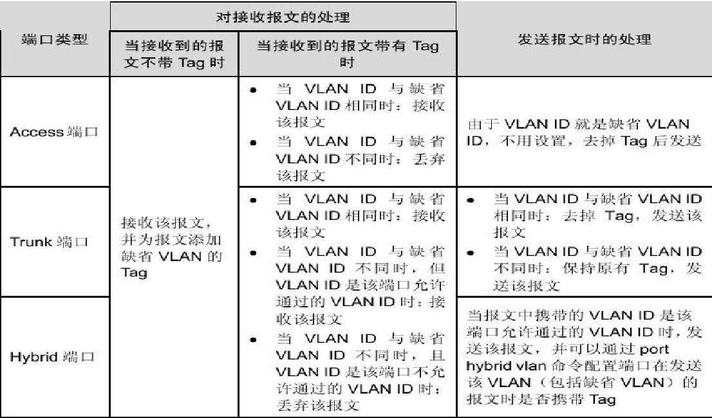
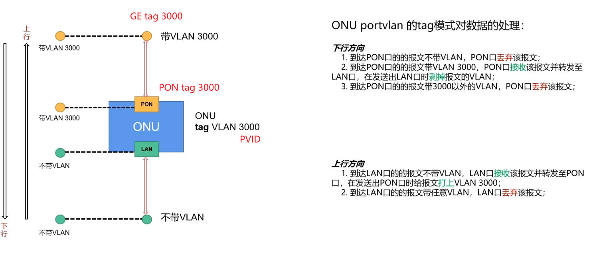
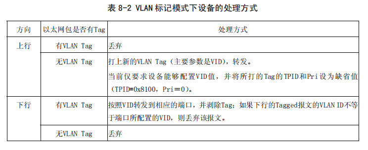
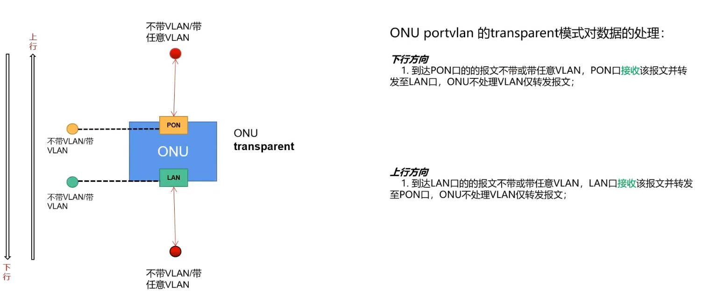
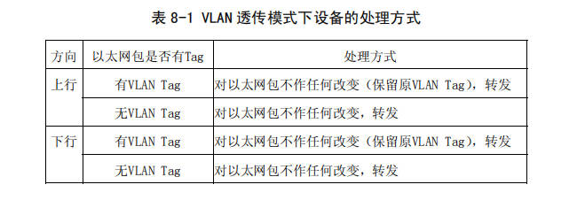
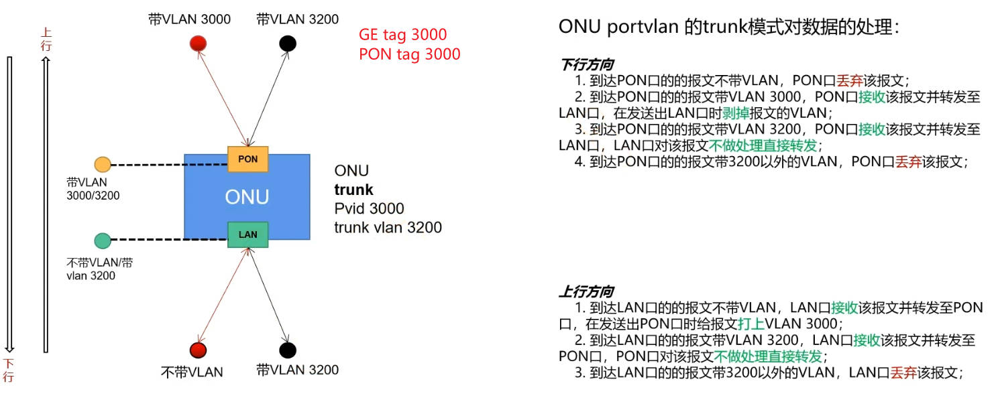
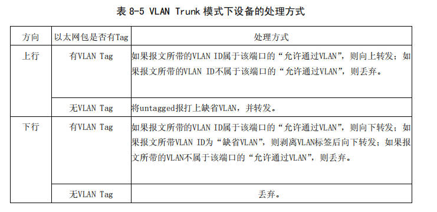
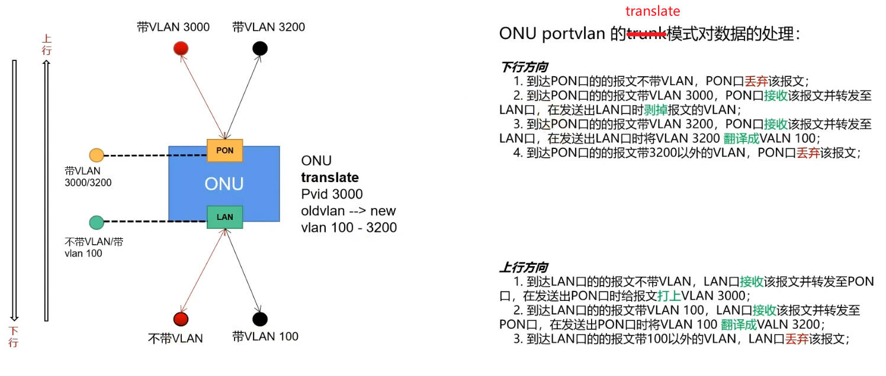
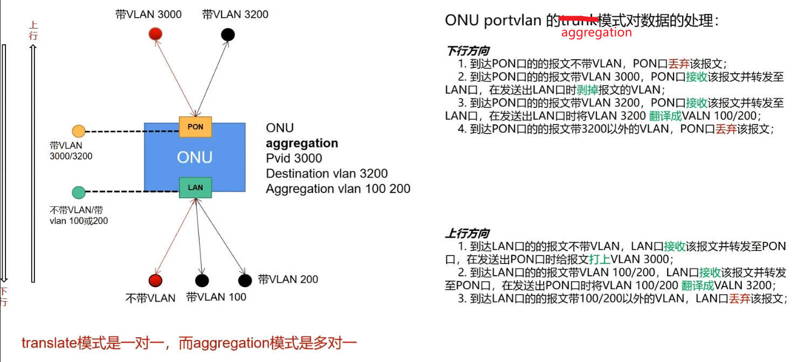

# VLAN

PVID 针对接受的数据，目的是为无标签的数据打上标签。

OLT 上联口配置时 tag 和 untag，tag 是允许对应的 VLAN ID 的数据通过，untag 是将对应 VLAN ID 的数据剥离标签进行发送。

## VLAN概念

## PVID（缺省VLAN）

**缺省 VLAN 又称 PVID**，交换机处理的数据帧都带 Tag，当交换机收到 Untagged 帧时，就需要给该帧添加 Tag，添加什么 Tag，就由接口上的 PVID（缺省 VLAN）决定。

**作用：**

*   **接收时**：

    *   如果接口接收到一个 **Untagged 帧**，交换机会**添加一个 PVID 对应的 Tag**。
    *   如果接口接收到一个 **Tagged 帧**，交换机则不会再给该帧添加接口上 PVID 对应的 Tag。
*   **发送时**：
    *   当接口**发送**数据帧时，如果发现此**数据帧的 Tag 的 VID 值与 PVID 相同**，则交换机会**将 Tag 去掉，然后再转发**。每个接口都有一个 PVID。**缺省情况下**，所有接口的 PVID 均为 VLAN 1，但用户可以根据需要进行配置。

## 端口类型

**各个端口模式下配置缺省 VLAN 的含义：**

端口的类型有三种：

*   Access 端口：只能收发 Untagged 帧，且只能为 Untagged 帧添加唯一 VLAN 的 Tag。
*   Trunk 端口：它可以允许多个 VLAN 的帧带 Tag 通过（**接收**），但只允许属于缺省 VLAN 的帧从该类接口上发出时不带 Tag(即剥除 Tag)，**且只能设置一个 Untagged**。
*   Hybrid 端口：它可以允许多个 VLAN 的帧带 Tag 通过（**接收**），且允许发帧根据需要配置某些 VLAN 的帧带Tag(即不剥除Tag)、某些 VLAN 的帧不带 Tag(即剥除Tag)

## SFU 的 VLAN 模式配置

### tag模式

### transparent

### trunk

### translate

一对一

### aggregation

多对一

### GPON SFU VLAN

GPON 上是设置 portvlan mode，EPON 是设置 vlan。

GPON 有 transparent、trunk（无 pvid 配置，只能配置放行 vlan）、tag、hybrid（可配置 pvid 和放行 vlan）、translate（不支持）。

在VLAN Trunk模式下，上行和下行对不带VLAN Tag的报文处理方式不同，主要是基于网络设备的工作机制和VLAN的设计逻辑。以下是具体原因：

***

### **上行方向（终端设备到网络核心）**

1.  **为什么上行不带VLAN Tag的报文会打上PVID后转发？**
    *   **终端设备通常不带VLAN Tag**：终端设备（如PC、服务器等）通常不会主动为发送的报文添加VLAN Tag。这是因为终端设备通常连接到交换机的Access端口，而Access端口默认会将报文打上端口的PVID（Port VLAN ID，即默认VLAN ID）。
    *   **PVID的作用**：PVID用于标识端口的默认VLAN。当上行报文不带VLAN Tag时，交换机需要为这些报文分配一个VLAN ID，以便在网络中正确处理和转发。PVID就是用来完成这个任务的。
    *   **确保报文能够被正确处理**：如果不为不带VLAN Tag的报文打上PVID，这些报文将无法在VLAN网络中被识别和处理，可能会导致报文被丢弃或无法到达目标设备。

***

### **下行方向（网络核心到终端设备）**

1.  **为什么下行不带VLAN Tag的报文会直接丢弃？**
    *   **终端设备无法处理VLAN Tag**：终端设备通常无法识别或处理VLAN Tag。如果下行报文带有VLAN Tag，交换机需要剥离VLAN Tag后再发送给终端设备；如果下行报文不带VLAN Tag，说明它可能不属于终端设备的默认VLAN，因此直接丢弃。
    *   **避免错误转发**：如果下行报文不带VLAN Tag，交换机无法确定该报文应该属于哪个VLAN。为了避免错误地将报文转发给错误的终端设备，交换机选择直接丢弃这些报文。
    *   **网络设计的逻辑**：在VLAN网络中，报文通常需要明确属于某个VLAN。如果下行报文不带VLAN Tag，说明它可能是一个异常报文（例如，来自错误的VLAN或未正确处理的报文），因此直接丢弃是合理的。

***

### **总结**

*   **上行不带VLAN Tag的报文打上PVID后转发**：是为了确保终端设备发送的报文能够在VLAN网络中被正确处理和转发。
*   **下行不带VLAN Tag的报文直接丢弃**：是为了避免错误转发，确保只有明确属于终端设备默认VLAN的报文才能到达终端设备。

这种设计逻辑符合VLAN网络的工作机制，能够有效隔离不同VLAN的流量，并确保网络的稳定性和安全性。
