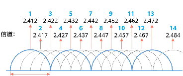

# WiFi基础知识

AP/AC

*   功能简化、不能独立工作的 AP 称为“瘦 AP”或“集中控制型 AP”，把管理“瘦 AP”的设备称为 AC（AP Controller，AP 控制器）。&#x20;
*   对应的，把功能齐备、能独立工作的 AP 称为“胖 AP”。

AC＋瘦AP的组网架构，适用于AP较多的场景。AC能统一管控、配置各个瘦AP，瘦AP可以做到即插即用（相关参数都可以从AC处获取）。其缺点是，AC基本只能管理同厂商的瘦AP，且组网成本较高。

SSID

> [WiFi基本知识总结 --- 通信框架及基础概念说明\_wifi基础知识-CSDN博客](https://blog.csdn.net/wit_732/article/details/103772676)

OFDM 正交频分复用：当载波到达波峰时，其他载波幅度为 0，即为正交无干扰。

载波：一个信道就是一个载波。通过**更高阶的编码方式**调制出的载波信号能**承载的 bit 数量更多**，有效提高了WiFi 速率。

子载波：OFDM（正交频分复用）技术可以将一个信道再细分成多个子信道，每个子信道上使用的载波就是子载波；各子载波是并行传输，可以有效提高信道的频谱利用率。

信道：信道是传输信息的通道，无线信道就是空间中无线电波传输信息的通道。

作用：在使用频段内，更精确划分频率范围，以减少干扰问题。每个频率范围就是信道。

*   重叠信道：在一个空间内同时存在重叠信道，会产生干扰问题。
*   非重叠信道：指频段范围不重叠的信道。

2.4G：共有 1\~14 信道，其中 14 信道在中国未开放。 以频宽 20MHz 计算，则非重叠信道为1、5、9、11。

信道绑定：通过**将相邻的两个甚至多个不重叠信道绑定到一起**，作为一个信道来使用。

作用：可以使传输速率成倍提高。802.11n 的 40Mhz 就是绑定两个 20Mhz。802.11AC 的 80Mhz，802.11AX 的 160Mhz 同理。

信道利用率=信道繁忙时间/周期时间
