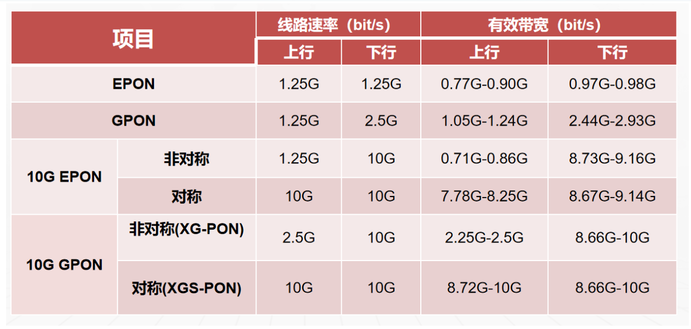

# 光通信基础知识

## PON介绍

*   PON：Passive Optical Networks，无源光网络系统
*   OLT：Optical Line Terminal，光线路终端，中心点设备
*   ONU：Optical Network Unit，光网络单元，远端点设备
*   ODN：Optical Distribution Networks，光分布网络，包括光纤、无源光分配器等。

PON(Passive Optical Network)即无源光网络，一种基于点到多点(P2MP)拓朴的技术。“无源”指 ODN(光分配网络)不含有任何电子器件及电子电源，ODN 全部由光分路器 Splitter 等无源器件组成，不需要贵重的有源电子设备。

**PON 技术优势**：

*   传输距离远：理论 60 KM， 应用 20 KM
*   分路比大：EPON 最高 1：64 GPON 最高 1：128
*   可靠性高：光纤、无源、OAM、OMCI、冗余
*   带宽：**EPON 1.25G 上下行**， **GPON 1.25G 上行 2.5G 下行**

PON 系统采用 **WDM 技术（单纤波分复用技术**），实现单纤传输多个波长的信号。

*   下行数据：1490 nm，采用广播技术，OLT 广播传送，ONU 选择接收属于自身的数据。
*   上行数据：1310 nm，采用 TDMA 技术（时分多址），ONU 在自己的固有时隙发生数据，某一时刻一个 PON 口下仅有一个 ONU 发光（肉眼看不出）。
*   下行CATV：1550 nm

### PON系统模型

PON 系统由局侧的 OLT(光线路终端)、用户侧的光网络单元 ONU/ONT(光网络单元/终端)和 ODN (光分配网络)组成，为单纤双向系统。

*   在下行方向(OLT 到 ONU，广播)，OLT 发送的信号通过 ODN 到达各个 ONU。
*   在上行方向(ONU 到 OLT，点到点)，ONU 发送的信号只会到达 OLT，而不会到达其他 ONU。
*   为了避免数据冲突并提高网络利用效率，上行方向采用 TDMA 多址接入方式并对各 ONU 的数据发送进行仲裁。
*   ODN 也指 POS(Passive Optical Splitter)，由光纤和一个或多个无源光分路器等无源光器件组成，在 OLT 和 ONU 间提供光通道。

一般而言，OLT 位于网络侧，放在中心局端(CentralOffice，CO)，多为以太网络交换机或媒体转换器平台，提供网络集中和接入，能完成光/电转换、带宽分配和控制各信道的连接，并有实时监控、管理及维护功能；ONU 位于用户侧(如路边、建筑物或用户住处)，采用以太网协议，实现以太网第二层第三层交换功能。

PON 系统参考结构如下图所示：

PON 系统构成如下：

### PON工作原理

*   基本思想：在一定的物理限制和带宽限制条件下，让尽可能多的终端设备 ONT 来共享局端设备 OLT 和馈送光纤。
*   工作原理：

    *   OLT 将送达各个 ONU 的**下行**业务组装成帧，以**广播**的方式发给多个 ONU，即通过光分路器分为 N 路独立的信号，每路信号都含有发给所有特定 ONU 的帧，**各个 ONU 只提取发给自己的帧，将其它 ONU 的帧丢弃**；
    *   **上行**方向从各个 ONU 到 OLT 的上行数据通过**时分多址(TDMA)方式共享信道**进行传输，OLT 为每个 ONU 都分配一个传输时隙。这些时隙是同步的，因此当数据包耦合到一根光纤中时，**不同 ONU 的数据包之间不会产生碰撞**。

以 EPON 系统为例，EPON 下行串行传输原理图如下：

*   对应于 N 个 ONU，OLT 有 N 个 MAC 端口(接口)。
*   在下行方向，OLT 为每个已注册成功的 ONU 分配一个**唯一的链路ID(LLID)**。
*   EPON 下行帧由一个被**分成固定长度帧**的**连续信息流**组成，每帧携带多个可变长度的数据包(时隙)。**OLT 在帧中插入发出该帧的 MAC 端口的 LLID**，并将数据以可变长度的数据包广播传送给所有在 EPON 上与 OLT 相连的 ONU。
*   数据到达 ONU 时，由 ONU 的 MAC 层进行地址解析，**提取出符合自己的 LLID 的数据包，丢弃其他的数据包**。注意，每个 ONU 只能在预先分配的时隙内接入并取出属于自己的信息。

EPON 上行串行传输原理图如下：

上行方向采用时分方式共享系统，通过接入控制机制将各个 ONU 有序接入。

*   将上行传输时间分为若干时隙，OLT 在每个时隙只安排一个 ONU 发送信息。
*   各 ONU 在**每个传送帧的前导码中插入分配的 LLID**，并按 OLT 规定的时间顺序依次向 OLT 发送，**多个 ONU 的上行信息组成一个 TDM 信息流传送到 OLT。**
*   这样，各 ONU 的数据包(包含1个或多个以太帧)汇合到公共光纤时，就**不会发生互相碰撞**。OLT 接收数据时比较 LLID 注册列表，基于特定的 LLID 将帧解码到合适的 MAC 端口。 

> [PON系统基础知识简介 - clover\_toeic - 博客园 (cnblogs.com)](https://www.cnblogs.com/clover-toeic/p/3780206.html)

## **几个重要概念**：

*   **测距技术**：OLT 通过 Ranging 测距过程**获取 ONU 的往返延迟 RTD（Round Trip Delay）**，从而**指定合适的均衡延时参数 EqD（Equalization Delay）**，保证每个 ONU 发送数据时**不会在分光器上产生冲突**。 OLT 获取序列号和 Ranging 的过程都需要开窗，即 Quiet Zone，暂停其他 ONU 的上行发送通道。
*   **DBA（Dynamically Bandwidth Assignment(动态带宽分配)**），DBA 是一种能在微秒或毫秒级的时间间隔内完成对**上行带宽**的动态分配的机制。

    *   可以提高 PON 端口的上行线路带宽利用率
    *   可以在 PON 口上增加更多的用户
*   **MPCP（Muti-Point Control Protocol）多点控制协议**

    *   MAC：control 子层
    *   拓扑结构：消息，状态机，定时器来控制访问 P2MP
    *   实现：在每个数据报的前面加上一个 LLID（Logical Link Identification）逻辑链路标识。
    *   根设备：PON 将拓扑结构中的根结点认为是主设备，即 OLT
    *   从设备：将边缘部分的多个节点认为是从设备，即 ONU
    *   EPON 沿用了简单的以太网数据格式，只是在**以太网包头增加了 64 字节**的 **MPCP点到多点控制协议**来实现 EPON 系统中的带宽分配。
*   **T-CONT**: Transmission Containers。是一种承载业务的 Buffer，主要用来传输上行数据的单元。引入T-CONT主要是为了**解决上行带宽动态分配，以提高线路利用率。**

    *   T-CONT 就像是一个**快递箱**用来装载和传输数据，T-CONT 需要**绑定对应的 DBA 模板**来确定这个快递箱的带宽分配大小。
*   **GEM Port**：业务的最小承载单位。

    *   GEM Port 负责把不同类型的数据**打包成统一的格式**（GEM 帧），GEM 帧通过 GEM Port 装进 T-CONT 这个快递箱。
*   **OAM** 是操作(Operation)、维护(Administration)、管理(Management)的统称，是 IEEE(电器与电子工程师协会)标准 IEEE802.3 规定的内容，以增强 EPON 系统的互通性和运营、管理能力为目标。
*   **OMCI**（ONU Management and Control Interface）: GPON 标准中定义的一种 OLT 与 ONT 之间信息交互的协议，用于在 GPON 网络中 OLT 对 ONT 的管理，包括配置管理、故障管理、性能管理和安全管理等。

## ONU 设备注册接收功率

ONU 设备能够正常注册接收功率范围为 -6dBm 到 -26dBm。

ONU 设备的接收光功率范围受多种因素影响，主要包括：

1.  **光纤长度**：光纤长度越长，信号衰减越大，接收光功率越低。
2.  **光纤质量**：光纤的质量和损耗系数会影响信号的衰减。
3.  **连接器质量**：连接器的质量和损耗会影响信号的传输效率。
4.  **光分路器**：光分路器的分光比和损耗会影响信号的分配和衰减。
5.  **环境因素**：温度、湿度等环境因素也会影响光信号的传输。

衰减因素：

*   分路比越高，衰减越高。
*   光纤长度越长，衰减越高。

## 光纤接口 APC/UPC

光纤接口的端面处理方式主要有两种：**UPC（Ultra Physical Contact）和 APC（Angled Physical Contact）**。这两种处理方式主要用于光纤连接器，以确保光信号的高效传输和减少信号损耗。

UPC 和 APC 都是光纤连接器的研磨方式，对于那些需要高精度光纤信号传输的应用，应该选择回波损耗较高的 APC 光纤连接器，而对于对光纤信号不太敏感的应用，可以选择 UPC 光纤连接器。

*   UPC 的整体笔尖更圆。
*   APC 尖端结束有一个 8 度倾斜。

**回波损耗（Return Loss, RL**）是光纤通信和电子通信中的一个重要参数，用于衡量信号在传输过程中反射回源端的程度。回波损耗的值通常以**分贝（dB）为单位**表示，**数值越大表示反射越少，信号质量越好。**

就回波损耗而言，不同的抛光端面造成了它们在光反射方面的差异。

*   UPC 光纤连接器在使用中会**将任何反射光直接反射回光源**，回波损耗值为 -50dB。
*   APC 光纤连接器**使反射光以一定角度反射到包层中**，而**不是直接反射到光源**，回波损耗值为 -60dB。
*   回波损耗越高、反射越小，因此光纤连接器性能越好。由此可知，APC光纤连接器的性能更优良。

应用：

*   **APC 光纤连接器**更适合应用在对**回波损耗要求较高**的区域，例如用于 RF 视频信号传输，尤其是 FTTx 应用以及无源光网络和其他使用高带宽的 WDM 系统应用。
*   而对于那些对**回波损耗要求不高**的领域，**UPC 或 PC 光纤连接器**则是个不错的选择。PC 光纤连接器非常适合应用在电信运营商网络中，而UPC光纤连接器则广泛应用于数字电视、电话和数据系统中。

> [PC vs UPC vs APC光纤连接器：有什么区别？ | 飞速（FS）社区](https://community.fs.com/cn/article/pc-vs-upc-vs-apc-connector-selecting-the-right-fiber-connector-type.html)

## 光模块

光模块是用在光通信的设备，用来实现**光电转换**。

*   发送数据时，将电信号转换为光信号通过光纤发送出去。
*   接收数据时，将光纤传输的光信号转换为电信号进行处理。

### 物理接口类型

光模块的物理接口类型分为 SFP 和 SFP+。

*   SFP（Small Form-factor Pluggable）接口，体积小，便于安装和更换。
*   SFP+（Small Form-factor Pluggable Plus）接口，支持更高的数据传输速率。

PX20+、PX20++、Class B+ 和 Class C+ 是光模块的分类标准，主要用于描述光模块的接收灵敏度和发射功率范围。

### 光模块类型（协议）区分

光模块分为 EPON、GPON、XG-PON 和 XGS-GPON，要做好区分，其中 GPON Class C+ 支持分路比 1:128。

*   EPON（Ethernet Passive Optical Network）
*   GPON（Gigabit Passive Optical Network）
*   XG-PON（10 Gigabit-capable Passive Optical Network）
*   XGS-PON（10 Gigabit Symmetrical Passive Optical Network）

|   特性/技术  |          EPON         |                 10G-EPON                |          GPON         |         XG-PON        |        XGS-PON        |
| :------: | :-------------------: | :-------------------------------------: | :-------------------: | :-------------------: | :-------------------: |
|  **标准**  |      IEEE 802.3ah     |               IEEE 802.3ah              |      ITU-T G.984      |      ITU-T G.987      |     ITU-T G.9807.1    |
| **下行速率** |       1.25 Gbps       |                 10 Gbps                 |        2.5 Gbps       |        10 Gbps        |        10 Gbps        |
| **上行速率** |       1.25 Gbps       |        1.25Gbps（非对称）/10 Gbps（对称）        |       1.25 Gbps       |        2.5 Gbps       |        10 Gbps        |
|  **波长**  | 1310nm(上行)、1490nm(下行) | 1310nm（上行 非对称）/1270nm（上行 对称）、1577nm（下行） | 1310nm(上行)、1490nm(下行) | 1270nm(上行)、1577nm(下行) | 1270nm(上行)、1577nm(下行) |
|    协议    |          以太网          |                   以太网                   |        ATM/GEM        |          GEM          |          GEM          |
|   应用场景   |       企业/住宅宽带接入       |                                         |       电信运营商FTTx       |         高带宽需求         |        对称高带宽需求        |
|    优点    |        成本低，技术成熟       |                                         |       高带宽，多业务支持       |       高带宽，多用户支持       |      对称高带宽，双向数据传输     |

线路速率和带宽对比：

GPON、XG-PON 和 XGS-PON 都是基于 ITU-T G.984.x 和G.987.x 标准的。因此，它们具有良好的互操作性。这意味着，**如果一个用户的设备（如 ONU）支持 GPON，那么它也可以在 XG-PON 或 XGS-PON 的网络中工作。**

> [吉比特无源光网络三巨头：GPON、XG-PON和XGS-PON到底有啥区别？-腾讯云开发者社区-腾讯云 (tencent.com)](https://cloud.tencent.com/developer/article/2423924)

## WDM

**WDM（Wavelength Division Multiplexing） 是一种用于有线电视网络中的波分复用技术，通过在同一根光纤中传输多个不同波长的光信号**，提高光纤的传输容量和效率。WDM 具有高带宽、灵活性、成本效益和可靠性等优势，广泛应用于多频道传输、网络扩展和混合网络等场景。
