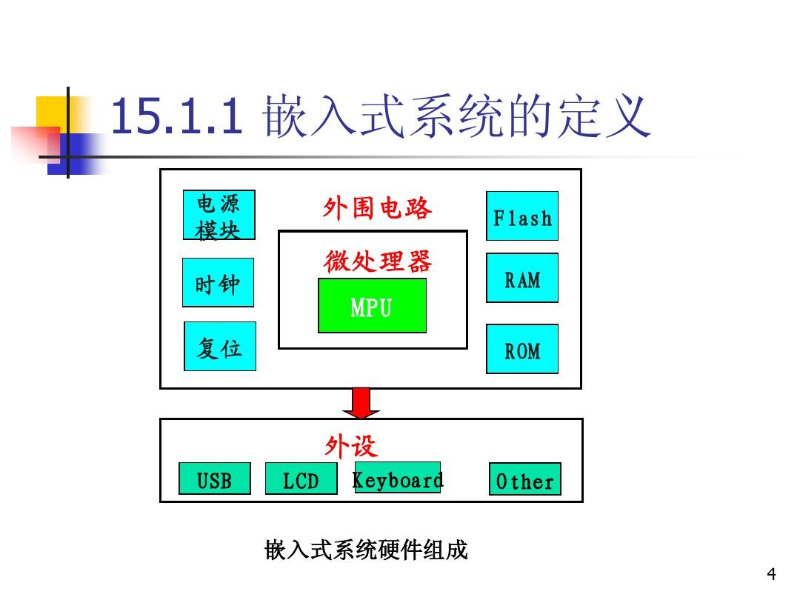
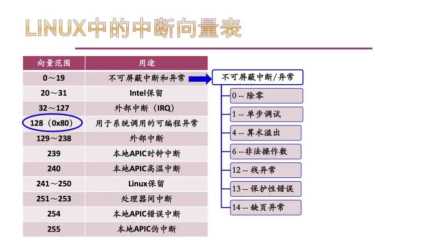
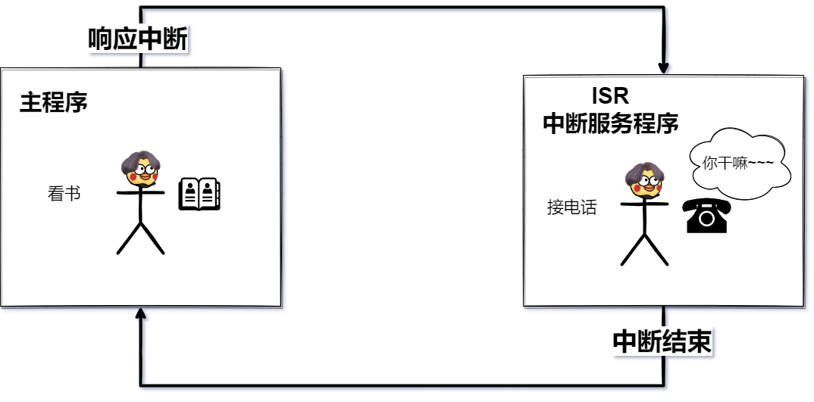

# 嵌入式基础（一）基本概念

## 1. 请说说你对嵌入式的理解⭐

- **以应用为中心**：嵌入式系统的设计是为了满足特定的应用需求。与通用计算机系统不同，嵌入式系统的功能紧密围绕在特定的应用场景中。
- **以计算机技术为基础**：嵌入式系统依赖计算机技术，包括嵌入式微处理器、嵌入式操作系统等。这些技术支持嵌入式系统进行计算和控制。
- **软件硬件可剪裁**：嵌入式系统的设计允许根据具体应用的需求对软件和硬件进行定制和裁剪。这种灵活性有助于优化系统的性能和资源利用。
- **适应应用系统对要求的严格要求**：嵌入式系统通常面临功能、成本、体积和功耗等方面的极端要求。设计过程需要在这些要求之间找到平衡点，以最优化系统性能。
- **由嵌入式微处理器、外围硬件设备、嵌入式操作系统以及用户应用软件等部分组成**：嵌入式系统主要包括嵌入式微处理器、外围硬件设备、嵌入式操作系统和用户应用软件。这些组成部分共同协作，使嵌入式系统能够完成其指定的任务。

## 2. 嵌入式流水线？⭐⭐

#### 嵌入式流水线：

**嵌入式流水线是一种处理器设计技术，旨在将处理器的工作分解成多个阶段，如指令获取、指令解码、执行、访存和写回等。每个阶段执行特定任务，使得不同指令可以并行处理，从而提高处理器的效率和性能。**

1. **取指阶段：**在这个阶段，**处理器从指令存储器中获取一条指令**，并将其送入流水线。这个阶段的主要任务是读取指令、确定指令类型以及确定指令需要的操作数。
2. **译码阶段：**取得的指令会经过译码阶段，处理器会对指令进行译码，**确定指令的操作类型、操作数和执行的具体方式**。这个阶段还会检测指令中是否有数据相关，以便保证流水线的正确运行。
3. **执行阶段：**在执行阶段，指令对应的操作会被执行，可能会涉及到算术逻辑运算、存储器访问等操作。处理器会根据指令的类型和操作数执行相应的操作。
4. **访存阶段：**如果指令涉及到内存读写操作，那么在这个阶段会进行存储器的访问，包括从内存中读取数据或将数据写入内存。
5. **写回阶段：**最后一个阶段是写回阶段，处理器会将执行阶段得到的**结果写回到寄存器文件或者内存中**，以完成整个指令的执行过程。

#### **流水线的好处：**

1. **提高吞吐量：**流水线允许处理多条指令的不同阶段同时进行，从而提高了指令的吞吐量，加快了程序执行速度。
2. **降低延迟：**流水线可以减少单个指令的执行时间，因为不同指令的不同阶段可以并行执行，从而降低了整体处理时间。
3. **高效利用资源：**通过并行处理，流水线可以更充分地利用处理器资源，提高系统整体的效率和性能。

## 3. 什么是乱序执行？⭐⭐

**乱序执行是一种处理器执行指令的技术，其目的是通过动态调度指令的执行顺序，以提高处理器的性能和效率。**

在传统的顺序执行中，指令按照在程序中的顺序依次执行，如果前面的指令有数据依赖关系或者访存等操作需要较长的延迟，处理器会因为等待产生停顿。**乱序执行则可以在指令的执行过程中动态地对指令进行重排序，使得能够并行地执行那些不具有数据依赖关系的指令，从而提高处理器的性能。**

**乱序执行包括以下主要技术：**

1. **指令重排序：**处理器通过检查指令之间的依赖关系，动态调整指令的执行顺序，使得不相关的指令能够并行执行，从而减少指令间的停顿。
2. **乱序执行单元**：乱序执行单元负责对指令进行重新排序和调度。它会根据指令之间的数据依赖关系，将指令分组并重新排序，以实现最大程度的并行执行。
3. **重命名寄存器：**为了解决数据依赖关系的问题，处理器使用重命名寄存器技术，将指令中的寄存器重命名为临时的物理寄存器，从而消除数据依赖性，并使乱序执行得以实现。

**具体来说，处理器在乱序执行时候会：**

1. **根据指令之间的相关性和各功能单元的空闲状态，动态地选择可以立即执行的指令，而不是严格按照程序的指令顺序执行。**
2. **执行完成后，处理器会确保乱序执行的指令的结果会按照程序指定的顺序重新进行排序，以保证程序的结果与顺序执行相同。**

## 4. 什么是超流水线？⭐

超流水线是一种处理器架构设计技术，旨在提高处理器的时钟频率和指令吞吐量。

**在传统的流水线中，每个指令都按照固定的阶段被分配执行，而每个阶段需要等待前一个指令完成后才能开始执行下一个指令。超流水线则进一步细分了指令的执行步骤，将处理器的执行过程分为更多个时钟周期。这样可以使整个流水线更长，每个阶段的时间更短，从而处理器可以在一个时钟周期内完成更多的指令，提高指令吞吐量。**

**超流水线的特点包括：**

1. 更细致的流水线阶段：超流水线将指令的执行过程分为更多个阶段，例如取指令、译码、执行、访存、写回等，以使得每个阶段的时钟周期更短。
2. 更高的时钟频率：由于每个阶段的时钟周期更短，处理器在同样的时间内可以完成更多的阶段，从而可以以更高的时钟频率工作，提高处理器的性能。

**然而，超流水线也面临一些挑战：**

1. 数据相关性：更细致的流水线阶段可能导致更多的数据相关性，需要更多的硬件逻辑来解决相关性冲突，避免错误的结果。
2. 分支预测：超流水线中的分支指令可能影响流水线的正常运行，需要精确的分支预测机制来减小分支带来的停顿。
3. 资源冲突：更长的流水线需要更多的硬件资源，包括功能单元、寄存器等，而这些资源在同一周期可能会被多个指令竞争使用，需要更复杂的调度和分配机制。

## 5. 解释一下嵌入式系统中的时钟同步。⭐⭐⭐

**时钟同步确保多个组件或设备使用相同的时钟信号进行操作，以确保系统的稳定性和可靠性。**

**在嵌入式系统中，时钟同步是关键因素，因为不同组件或设备的时钟必须保持一致以便协同工作。时钟同步可以确保数据在正确的时刻传输、协同操作按照预定的时间顺序进行，同时避免数据损坏和操作错误。**

**常见的嵌入式系统时钟同步方法包括以下几种：**

1. **硬件时钟同步：**在某些嵌入式系统中，可以通过硬件机制实现时钟同步。例如，采用外部时钟源或精确的晶振来提供系统时钟，所有组件或设备通过共享这个硬件时钟来保持同步。
2. **软件时钟同步**：在某些情况下，嵌入式系统通过软件算法来实现时钟同步。使用软件时钟同步需要一个主节点或主控制器，它负责向其他组件发送时间同步消息或数据包，并根据接收的反馈调整各个组件的本地时钟。
3. **网络时钟同步：**在分布式嵌入式系统中，时钟同步可以通过网络协议来实现。例如，使用网络时间协议（NTP）或精确时间协议（PTP）等协议来同步设备的时钟。这种方法通常适用于需要高精度的时钟同步，例如工业自动化系统或通信系统。。

## 6. 嵌入式系统中常见的通信总线有哪些？⭐⭐⭐⭐

| **通讯总线** | **特点**                                                     | **全双工/半双工**    |
| ------------ | ------------------------------------------------------------ | -------------------- |
| I2C 总线     | 两根线进行数据传输，具有主从设备的概念，适合连接低速设备。   | 半双工               |
| SPI 总线     | 通常需要 4 根线，支持高速全双工串行通信，适用于连接外围设备和外部存储器。 | 全双工               |
| UART 总线    | 使用两根线进行异步串行通信，适用于连接串口设备、无线模块等。 | 全双工               |
| CAN 总线     | 用于汽车和工业控制领域的通信总线，支持可靠的实时数据传输和多个节点之间的通信。 | 可以是全双工或半双工 |
| USB 总线     | 提供高速数据传输和连接外部设备的标准接口，可以支持多种传输模式，包括全双工和半双工。 | 可以是全双工或半双工 |
| PCIe 总线    | 高性能的外设连接总线，提供高速全双工数据传输和低延迟的连接。 | 全双工               |
| 以太网       | 用于连接网络接口控制器和外部网络设备，支持局域网或互联网连接。 | 通常是全双工         |

## 7. 什么是嵌入式系统的中断向量表？⭐⭐⭐⭐

**中断向量表是一个存储中断处理程序入口地址的表格或数组，其中每个中断源或中断类型都对应着一个中断处理程序的入口地址。当中断事件发生时，处理器会根据中断号或类型从中断向量表中查找相应的中断处理程序入口地址，并跳转到该地址执行相应的中断处理程序。**

中断向量表通常存储在系统的特定内存区域，如 RAM 或 ROM。在系统初始化期间，中断向量表会被填充或初始化为相应的中断处理程序的入口地址。每个中断源通常有一个唯一的中断向量号或类型号，该号码在中断向量表中作为索引，用于定位对应的中断处理程序的入口地址。

中断向量表在嵌入式系统中起着至关重要的作用，它是实现中断处理机制的核心组成部分。通过中断向量表，系统能够快速、准确地响应和处理各种中断事件，提高系统的实时性和可靠性。

## 8. 什么是中断？⭐⭐⭐⭐

**中断是计算机系统中的一种事件，它打断了正常的程序执行流程，用于响应需要优先处理的事件或请求。中断可以是来自硬件设备的信号或软件生成的信号，在系统发生某种特定事件时触发。**

**中断的作用是使处理器能够及时响应和处理各种事件，提高系统的实时性和并发处理能力。当系统发生中断时，处理器会立即暂停当前正在执行的任务，并跳转到中断处理程序的入口地址，执行相应的中断处理程序。处理程序完成后，处理器会返回原来的执行状态，继续执行被中断的任务。**

**中断可以分为硬件中断和软件中断：**

1. **硬件中断：由外部硬件设备发送给处理器的信号**，表示需要处理器执行某种操作。例如，键盘输入、鼠标点击、定时器溢出等都是硬件中断的例子。
2. **软件中断：由软件程序主动发送给处理器的信号**，引发某种操作或请求。软件中断通常是通过特殊的指令或系统调用来触发。例如，操作系统的系统调用、异常处理等都是软件中断的例子。

## 9.什么是串口通信？⭐⭐⭐⭐

**串口通信是一种通过串行接口进行数据传输的通信方式。在串口通信中，数据以比特流的形式被分割，并通过一对串行线进行传输。串口通信常用于嵌入式系统、计算机外部设备和传感器网络等领域。**

以下是一些常见的串口及其特点的表格：

| **串口名称** | **串口特点**                                                 |
| ------------ | ------------------------------------------------------------ |
| RS-232       | - 同时支持全双工通信，即可以同时发送和接收数据。- 最常用的串口标准之一，适用于短距离通信（几十米）。- 使用不平衡的电压标准，例如正负 12V 表示逻辑 1 和逻辑 0。 |
| RS-485       | - 支持半双工或全双工通信，多设备之间可以共享同一条总线进行通信。- 适用于长距离通信（超过一百米）。- 使用平衡的电压标准，例如两条线之间的电压差表示逻辑 1 和逻辑 0。 |
| USB          | - 支持高速、全双工通信，可以同时进行数据上传和下载。- 提供多种数据传输模式，如控制传输、批量传输和异步传输等。- 可以通过USB集线器实现多个设备之间的连接。 |
| Ethernet     | - 支持高速、全双工通信，适用于局域网和广域网。- 基于互联网协议（IP）的数据传输。- 提供广泛的应用领域，如网络通信、远程控制和数据传输等。 |
| SPI          | - 用于在数字集成电路（IC）之间进行通信。- 支持全双工通信，主设备和从设备通过主时钟进行同步。- 可以通过多个片选信号连接多个从设备。 |
| I2C          | - 用于在数字集成电路（IC）之间进行短距离通信。- 支持半双工通信，采用两条线（SDA 和 SCL）进行数据传输。- 可以通过地址选择位连接多个从设备。 |
| UART         | - 通用异步收发传输器（Universal Asynchronous Receiver/Transmitter）。- 支持点对点的串行通信。- 数据以异步方式传输，不需要时钟信号进行同步。 |

## 10.什么是定时器？⭐⭐⭐⭐

### **什么是定时器？**

定时器是 SoC（系统片上芯片）中常见的外设。

它可以与计数器相结合，用于定时和计数操作。

定时器可以根据计数器的计数值和计数时间周期来实现定时功能。

### 定时器有什么用？

- 定时器允许 SoC 在执行主程序的同时具有计时功能。
- 定时器可以设定一定时间后触发中断，并提醒 CPU 去执行预先设置的事件或任务。
- 定时器在 SoC 中的作用类似于一个秘书，负责计时和提醒 CPU 在一定时间后执行任务。

### 定时器的原理是什么？

- 定时器的计时是通过计数实现的。
- 定时器内部有一个计数器，它根据时钟源提供的时钟信号进行计数。
- **每隔一个时钟周期，计数器就会计数一次，定时器的时间就是计数器计数值乘以时钟周期。**
- 定时器还包含一个寄存器（如 TCNT），初始计数值会存储在寄存器中。
- 每经过一个时钟周期，寄存器中的值会自动减 1，直到寄存器中的值减为 0 时，定时器会触发中断或执行特定的事件。