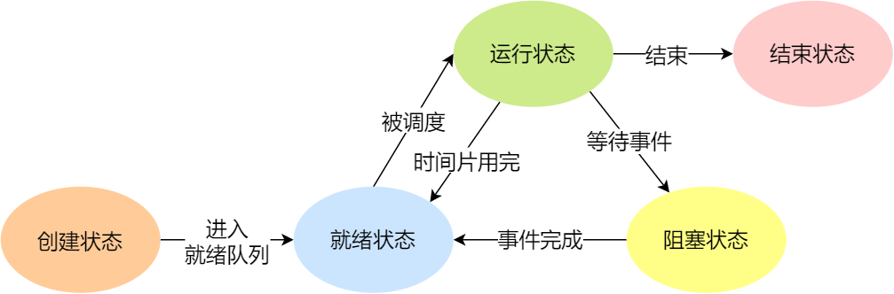
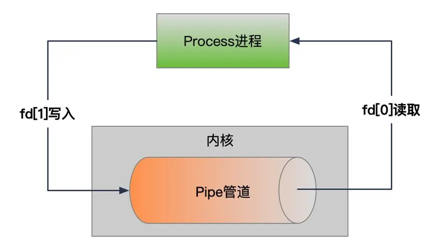

# 操作系统面试高频（二）线程与进程

## **1.父进程、子进程的关系以及区别⭐⭐**

**父子进程的关系：**

父进程是创建子进程的进程。当父进程创建一个新的进程时，该新进程就成为子进程。父进程在创建子进程时，会为子进程分配独立的资源和运行环境。

子进程是由父进程创建的新进程。子进程会继承父进程的大部分属性和资源。它可以独立运行，并且可以执行不同的代码路径。子进程可以创建自己的子进程，形成进程的层次结构。

**父进程和子进程之间有以下几个区别：**

- 进程 ID：每个进程在系统中都有一个唯一的进程 ID。父进程在创建子进程时，会将子进程的进程 ID 分配给子进程。
- 进程关系：父进程与子进程之间建立了一种层次关系，父进程是子进程的创造者和管理者。
- 资源继承：子进程会继承父进程的大部分属性和资源，包括打开的文件、环境变量和当前工作目录等。
- 进程通信：父进程和子进程可以通过进程间通信机制来进行交互和数据共享，如管道、共享内存、消息队列等。
- 生命周期：父进程和子进程的生命周期是相互独立的。子进程可以在父进程退出后继续存在，成为孤儿进程，由系统的 init 进程接管管理。

**代码举例：**

```c++
#include <iostream>
#include <unistd.h>
#include <sys/types.h>

int main() {
  pid_t pid = fork();

  if (pid > 0) {
    // Parent process
    std::cout << "Parent process PID: " << getpid() << std::endl;
    std::cout << "Child process PID: " << pid << std::endl;
  } else if (pid == 0) {
    // Child process
    std::cout << "Child process PID: " << getpid() << std::endl;
    std::cout << "Parent process PID: " << getppid() << std::endl;
  } else {
    // Fork failed
    std::cerr << "Fork failed" << std::endl;
    return 1;
  }

  return 0;
}
这个示例使用了C++的标准库和POSIX（Portable Operating System Interface）的fork函数来创建父子进程。当pid大于0时，表示当前处于父进程，当pid等于0时，表示当前处于子进程。
```

## 2.正确处理僵尸进程的方法⭐⭐

1.关于避免产生僵尸进程的方法，在使用fork()创建子进程后，确实应该及时使用wait()或waitpid()系统调用来回收子进程的资源。同时，可以通过注册SIGCHLD信号的处理函数，在函数内部调用wait()或waitpid()来处理子进程的终止状态，以避免僵尸进程的累积。

2.关于使用kill命令来处理僵尸进程，kill命令主要是用来向进程发送信号。如果父进程在子进程退出后没有处理SIGCHLD信号导致出现僵尸进程，可以使用kill命令发送SIGCHLD信号给父进程来触发父进程处理僵尸进程。可以使用以下命令来找到僵尸进程的PID：

> ps aux | grep Z

3.然后使用以下命令向父进程发送SIGCHLD信号或强制杀死父进程：

> kill -s SIGCHLD <parent_pid>

或者

> kill -9 <parent_pid>

这样父进程就会收到SIGCHLD信号或被强制杀死，并由其父进程（通常是init进程）接管处理僵尸进程的清理工作。

## 3.一个进程可以创建多少线程，和什么有关⭐

**理论上，一个进程可用虚拟空间是2G，默认情况下，线程的栈的大小是1MB，所以理论上一个进程可以创建2048个线程，当然更改编译器的设置可以创建多余2048个线程**

**因此，一个进程可以创建的线程数由可用虚拟空间和线程的栈的大小共同决定，只要虚拟空间足够，那么新线程的建立就会成功。如果需要创建超过2K以上的线程，减小你线程栈的大小就可以实现了，虽然在一般情况下，你不需要那么多的线程。过多的线程将会导致大量的时间浪费在线程切换上，给程序运行效率带来负面影响。**

## 4.什么是进程上下文、中断上下文？**⭐⭐⭐**

### **进程上下文（Process Context）：**

- **进程上下文是指操作系统在执行进程时所需的所有状态信息的集合。**
- 包括程序的代码、数据、进程的标识符、堆栈、寄存器的值等。
- **进程上下文的切换通常发生在操作系统的调度器决定切换到另一个进程运行时。**

使用场景：

- 当操作系统需要切换正在执行的进程，将CPU资源分配给其他进程时，会发生进程上下文切换。
- 当进程阻塞等待某个事件的发生时，进程上下文可能会被保存，因为此时进程无法继续执行。

### 中断上下文（Interrupt Context）：

- **中断上下文是指当发生中断或异常事件时，硬件或操作系统内核自动保存当前被中断程序的执行现场，并切换到中断处理程序执行的上下文环境。**
- 中断上下文包含了被中断程序的寄存器状态、堆栈指针、中断原因等信息。

使用场景：

- 当硬件设备发生某种事件，如I/O完成、定时器中断等，会触发中断，并切换到中断上下文执行中断处理程序。
- 在中断处理程序执行过程中，保存和恢复被中断程序的上下文是必要的，以确保被中断程序的执行能够正确继续。

## 5.如何创建守护进程**⭐⭐⭐⭐⭐**

创建守护进程的过程如下：

1. **创建子进程**：通过在父进程中调用fork()函数来创建子进程。
2. **终止父进程**：子进程创建后，父进程会调用exit()函数或其他方式终止自身执行，从而使子进程成为孤儿进程。
3. **调用setsid()创建新会话**：子进程调用setsid()函数创建一个新的会话。这将使子进程成为会话领导者，并且与其父进程和控制终端解除关系。
4. **更改当前目录为根目录**：守护进程通常将当前工作目录更改为根目录（chdir("/")），这样可以避免后续操作与其他进程的目录关联。
5. **重设文件权限掩码**：守护进程会调用umask()函数来重设文件权限掩码，这样可以确保守护进程创建的文件具有适当的权限。
6. **关闭文件描述符**：守护进程会关闭不再需要的文件描述符，比如标准输入、标准输出和标准错误。这可以防止守护进程意外地与控制终端进行交互。

```c++
#include <stdio.h>
#include <stdlib.h>
#include <unistd.h>
#include <sys/types.h>
#include <sys/stat.h>

int main() {
    // 创建子进程
    pid_t pid = fork();

    if (pid < 0) {
        // 创建子进程失败
        perror("fork");
        exit(1);
    } else if (pid > 0) {
        // 父进程退出，使子进程成为孤儿进程
        exit(0);
    }

    // 在子进程中执行以下操作

    // 创建新的会话并成为会话领导者
    if (setsid() < 0) {
        perror("setsid");
        exit(1);
    }

    // 更改当前目录为根目录
    if (chdir("/") < 0) {
        perror("chdir");
        exit(1);
    }

    // 关闭不再需要的文件描述符
    close(STDIN_FILENO);
    close(STDOUT_FILENO);
    close(STDERR_FILENO);

    // 守护进程逻辑，可以在这里执行系统级别的任务或监听服务

    sleep(10);  // 示例：守护进程休眠10秒

    return 0;
}
```

## **6.孤儿进程、僵尸进程、守护进程的概念⭐⭐⭐**

### 孤儿进程：父进程先于子进程结束运行，子进程成为孤儿进程并由init进程接管。

### 僵尸进程：子进程已经终止，但父进程尚未调用wait()或waitpid()来获取子进程的终止状态，子进程进入僵尸进程状态。

### 守护进程：在后台运行的特殊进程，通常以init进程为父进程，独立于终端或控制终端，用于执行常驻任务。

## **7.进程有哪五种状态，如何转换⭐⭐⭐⭐**

1. **创建状态**：进程刚被创建，系统为其分配所需的资源，创建进程控制块（PCB）来管理进程的信息和状态。
2. **就绪状态**：进程已经准备好开始执行，但还没有获取到处理器资源，处于等待调度的状态。
3. **执行状态**：进程已经获取到处理器资源，正在执行指令和运行程序。
4. **阻塞状态**：在执行状态下，如果进程遇到阻塞操作，例如等待 I/O 完成，它会进入阻塞状态。在此状态下，进程暂时无法继续执行，直到阻塞的操作完成或者条件满足后才能再次进入就绪状态。
5. **终止状态**：进程执行结束或者被系统终止，进入终止状态。在终止状态下，进程的资源会被释放，PCB会被删除。




# 8.说说进程同步的方式？**⭐⭐**

- **互斥锁（Mutex）**：保护共享资源的互斥访问。
- **信号量（Semaphore）**：控制临界资源的访问数量。
- 条件变量（Condition Variable）：进程等待和唤醒。
- 屏障（Barrier）：同步多个进程或线程的执行。
- **读写锁（Read-Write Lock**）：允许多读单写的访问模式。
- 事件（Event）：进程间的通知和同步。
- **消息队列**：通过创建消息队列实现进程间的消息传递，异步通信。
- **管程**：组合互斥锁、条件变量和共享数据结构，确保线程的互斥和同步。

# 9.进程通信中的管道实现原理是什么?**⭐⭐**

管道是一种用于两个进程间同一时刻进行单向通信的机制，也被称为半双工管道。操作系统在内核中开辟一块缓冲区（管道），用于进程之间的通信。由于其特性，同一时刻只能有一个进程进行读或写操作，所以称为半双工。

管道分为无名管道和命名管道。无名管道只能用于具有父子关系或兄弟关系的进程之间通信，它类似于特殊的文件，管道本质上也是一种文件。无名管道的读端由描述符 `fd[0]` 表示，写端由描述符 `fd[1]` 表示。

命名管道允许无亲缘关系的进程间通信，通过文件系统中的特殊文件进行。命名管道的特点是可以通过路径和文件名访问，不仅限于亲缘关系的进程。

可以使用`pipe()`函数创建管道，其原型如下：

```
#include <unistd.h>  
int pipe(int fd[2]);
```

管道的创建后，可以使用文件I/O函数如 `read()`、`write()` 等进行数据读写操作。

通常情况下，一个进程在使用 `pipe()` 创建管道后，会再通过 `fork()` 创建子进程，然后通过管道实现父子进程之间的通信。父子进程都有管道的读端和写端，子进程的描述符是从父进程复制而来的。通过这种方式，父子进程可以进行数据交换和通信。



管道的使用：

1. 调用`pipe()`函数创建管道，获取管道的读端和写端的文件描述符。
2. 调用`fork()`创建子进程，此时子进程会继承父进程的管道描述符。
3. 在父进程中关闭管道的不需要的端口，例如关闭管道的读端，保留管道的写端；在子进程中关闭管道的另一个端口，即关闭管道的写端，保留管道的读端。
4. 父进程通过保留的管道写端，使用`write()`函数向管道写入数据。
5. 子进程通过保留的管道读端，使用`read()`函数从管道中读取数据。
6. 父进程和子进程根据需求进行数据的交换和通信。
7. 当通信结束后，父进程和子进程分别关闭其管道端口，即父进程关闭管道的写端，子进程关闭管道的读端。
8. 父进程通过调用`wait()`等待子进程的结束，确保子进程正确退出。

```c++
#include <iostream>
#include <unistd.h>
#include <sys/wait.h>
#include <cstring>

int main() {
    int pipefd[2]; // 用于存储管道读端和写端的文件描述符

    // 创建管道
    if (pipe(pipefd) == -1) {
        perror("pipe");
        exit(EXIT_FAILURE);
    }

    pid_t pid = fork();

    if (pid == -1) {
        perror("fork");
        exit(EXIT_FAILURE);
    }
    else if (pid == 0) {
        // 子进程读取管道中的数据
        close(pipefd[1]); // 关闭管道写端
        
        char buffer[100];
        ssize_t bytesRead = read(pipefd[0], buffer, sizeof(buffer));

        if (bytesRead == -1) {
            perror("read");
            exit(EXIT_FAILURE);
        }
        else if (bytesRead == 0) {
            std::cout << "管道已关闭" << std::endl;
        }
        else {
            std::cout << "子进程读取到的数据：" << buffer << std::endl;
        }

        close(pipefd[0]); // 关闭管道读端
        exit(EXIT_SUCCESS);
    }
    else {
        // 父进程向管道写入数据
        close(pipefd[0]); // 关闭管道读端

        const char message[] = "Hello, World!";
        ssize_t bytesWritten = write(pipefd[1], message, strlen(message));

        if (bytesWritten == -1) {
            perror("write");
            exit(EXIT_FAILURE);
        }

        close(pipefd[1]); // 关闭管道写端
        wait(NULL); // 等待子进程退出
        exit(EXIT_SUCCESS);
    }
}
在这个示例中，父进程创建了一个无名管道，并创建了子进程。子进程从管道中读取数据，父进程向管道中写入数据。通过管道实现了父子进程之间的通信。
```

## 10.说说进程通信的方式有哪些？**⭐⭐⭐**

- **管道（Pipe）：**适用于有亲缘关系的进程，是一种单向通信方式。
- **命名管道（Named Pipe）**：适用于没有亲缘关系的进程，通过特殊文件实现通信。
- **共享内存（Shared Memory）**：多个进程可以访问同一块物理内存来实现数据共享。
- **信号量（Semaphore）**：用于进程之间的同步和互斥操作。
- **消息队列（Message Queue）**：通过消息队列来发送和接收消息，实现异步通信。
- **套接字（Socket）**：通用的进程间通信机制，可在不同主机间进行通信。
- 文件：通过操作文件来实现进程间的通信和数据交换。