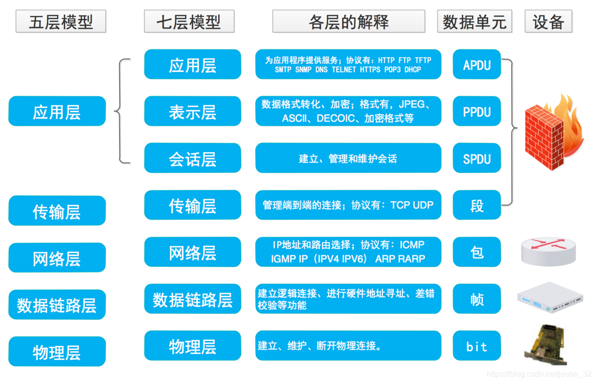
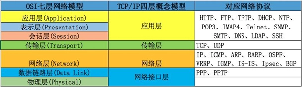

# 计算机网络高频（一）计算机网络基础

## 1、ISO的七层模型⭐⭐⭐

## 2、TCP/IP模型⭐⭐

## 3、计算机网络有哪两种通信方式？⭐⭐

### **客户-服务器(C/S)模型：**

- 客户端是服务的请求方，服务器是服务的提供方。客户端发送请求，服务器接收并处理请求，并将结果返回给客户端。这种方式适用于 Web 应用、数据库访问等场景。

### 对等连接(P2P)模型：

- 两台主机之间的通信不区分谁是服务请求方和谁是服务提供方。两个或多个计算机之间的通信是对等的，可以相互交换信息和资源。这种方式广泛应用于文件共享、实时通信和分布式计算等场景。

## 4、子网掩码的作用⭐

1. **划分网络和主机：**子网掩码通过与 IP 地址进行逻辑与运算，将 IP 地址分为网络地址和主机地址两部分，实现对网络的划分。
2. **确定网络范围：**子网掩码指示了 IP 地址中哪些位表示网络，通过与 IP 地址进行逻辑与运算，可以确定网络的范围和地址空间。
3. **IP 地址分配与管理：**子网掩码用于控制可用的 IP 地址范围和子网大小，帮助实现对 IP 地址的分配和管理，以适应不同的网络规模和需求。
4. **网络路由：**子网掩码在网络路由中起着重要作用。路由器通过与目标 IP 地址进行逻辑与运算，将其与路由表中的子网掩码进行匹配，以确定数据包应该被转发到哪个网络。
5. **网络安全控制：**通过调整子网掩码的设置，可以将不同的 IP 地址范围分配给不同的网络段，实现对不同区域或用户的访问控制。子网掩码可以帮助实现网络安全策略，限制或允许特定IP地址范围的通信。

## 5、网关的作用？⭐

1. **数据转发：**网关接收从源网络发出的数据包，根据目标网络地址的判断，将数据包转发到相应的目标网络。它充当了不同网络之间的**数据传输中转站**，实现网络互联。
2. **网络协议转换：网关可以实现不同网络之间的协议转换**。例如，将局域网上的数据包转换为互联网上使用的协议，使得局域网内的设备能够与互联网进行通信。
3. **安全性与访问控制：**网关常用于实施网络访问控制和安全策略，**充当防火墙的功能**。它可以监测和过滤传入和传出的网络流量，保护网络免受恶意攻击和未授权访问。
4. **数据包过滤与路由：**网关可以根据设定的规则过滤和路由数据包。通过检查数据包的源地址、目标地址、端口等信息，网关可以对数据进行选择性地转发、丢弃或重定向，实现网络流量的管理和控制。

## 6、TCP 与 UDP 的区别？⭐⭐⭐

1. **连接性：**TCP 是一种面向连接的协议，需要在通信双方建立稳定的连接，而 UDP 是无连接的，每个数据包都是独立传输的。
2. **通信模式：**TCP 是一对一通信模式，即一个发送端与一个接收端建立连接。而 UDP 可以是一对一、一对多、多对多的通信模式。
3. **可靠性**：TCP 提供可靠的传输，通过序列号、确认应答和超时重传等机制保证数据的完整性和正确性。UDP 则是不保证可靠传输的，尽最大努力交付数据，不进行重传。
4. **头部大小：**TCP 头部的字节数为 20 字节，而 UDP 头部只有 8 个字节。
5. **开销：**由于 TCP 提供的功能较为复杂，所以在传输过程中的开销较大。而 UDP 的头部较简单，开销较小。
6. **适用场景：**由于 TCP 提供可靠的传输保证，适用于对通信质量要求较高的场景，如文件传输和网页浏览等。而 UDP 的传输效率较高，适用于对传输速度和实时性要求较高的场景，如音视频流媒体和在线游戏等。

## 7、什么是分组交换？优缺点？⭐

**分组交换（Packet Switching）是计算机网络中一种数据传输的方式，将数据划分为小的数据包（或称为分组），每个分组独立传输，并根据目标地址逐跳转发，最终到达目标节点。**

分组交换的优点：

1. **高效利用网络资源：**由于数据被划分为分组进行传输，不需要占用完整的传输链路资源。多个分组可以同时在网络中传输，提高了网络的利用率。
2. **灵活性和可靠性：**分组交换可以根据网络状况和负载情况动态地选择传输路径，避免了传统电路交换中固定的连接路径。如果某个分组传输失败，可以重新发送该分组，提高了传输的可靠性。
3. **支持不同类型的应用：**分组交换可以适应不同类型的应用，支持多种数据类型的传输，如实时音视频、文件传输等。

分组交换的缺点：

1. **延迟和抖动：**由于分组交换需要将数据划分为分组，并且每个分组须独立传输和重新组装，导致传输延迟相对较高。此外，不同分组的传输路径可能不同，会引入抖动（延迟变化）。
2. **需要额外的开销：**每个分组都需要额外的头部信息，用于存储目标地址、校验和等信息，增加了传输的开销。
3. **分组丢失和重排序：**分组传输过程中，可能会出现分组丢失或者分组到达目标节点的顺序与发送顺序不一致的情况。

## 8、网络调试的工具⭐⭐

1. **Ping**：用于测试网络的连通性和测量往返时间（RTT）。可以通过发送 ICMP 回显请求消息并等待目标主机的回复来检查主机之间的通信状态。
2. Traceroute：用于跟踪数据包从源主机到目标主机经过的路径。它通过发送一系列的数据包，每个包在路由器上记录其经过的地址，以示路径和延迟。
3. **nslookup/dig：**用于执行 DNS 查询，获取目标主机的 IP 地址或执行反向查询来获取主机名。
4. **Wireshark**：是一个功能强大的网络协议分析工具，可以捕获、查看和分析网络中的数据包。它可以帮助排查网络故障、分析网络流量以及调试网络协议。

## 9、什么是 IP 地址？IP 地址的分类和表示方式有哪些？⭐

**IP地址（Internet Protocol Address）是用于在互联网中唯一标识设备（如计算机、服务器、路由器等）的一组数字标识。它是由32位（IPv4）或128位（IPv6）的二进制数字组成，以便于在网络中进行寻址和路由。**

#### IP地址的分类：

1. IPv4 地址：IPv4 采用 32 位地址格式，通常以四段十进制数表示（例如：192.168.0.1）。IPv4 的地址空间有限且已经耗尽，但它仍然广泛应用于现有的网络中。
2. IPv6 地址：IPv6 采用 128 位地址格式，通常以八组十六进制数表示，每组之间用冒号分隔（例如：2001:0db8:85a3:0000:0000:8a2e:0370:7334）。IPv6 地址空间巨大，为未来网络提供了更广阔的寻址空间。

#### IP 地址的表示方式：

1. 十进制表示法：每个 IPv4 地址的 32 位二进制数可以转换为 4 个十进制数字，每个数字的取值范围是 0 到 255。例如，192.168.0.1 是一个四段十进制表示的IPv4地址。
2. 二进制表示法：将每个 IPv4 地址的 32 位二进制数表示出来，例如，11000000.10101000.00000000.00000001 是一个四段二进制表示的IPv4地址。

## 10、什么是子网？如何划分子网？⭐

### 什么是子网

- 子网是根据网络规划和管理的需要，在一个网络中将 IP 地址划分成多个较小的网络。
- 子网通过划分，可以更灵活地管理网络资源、控制网络流量，并提高网络的安全性。

### 子网的划分步骤如下：

1. 确定网络地址范围：首先确定整个网络的 IP 地址范围，这通常由网络管理员定义。
2. 确定子网掩码长度：根据需求确定子网掩码的长度。子网掩码是一个与 IP 地址相关联的 32 位二进制数，用于区分网络地址和主机地址。
3. 进行逻辑与操作：将 IP 地址与子网掩码进行逻辑与操作，以获得子网的网络地址。
4. 确定广播地址和可用地址范围：基于子网的网络地址和子网掩码，确定该子网的广播地址和可用地址范围。
