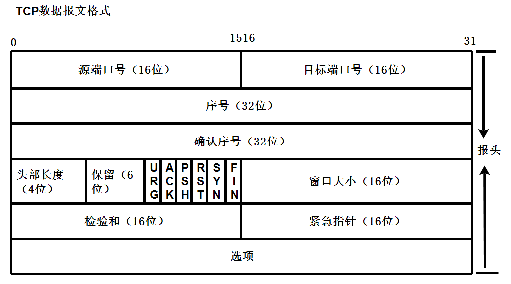
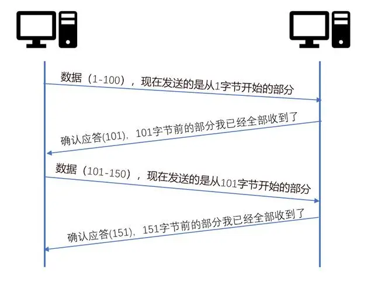
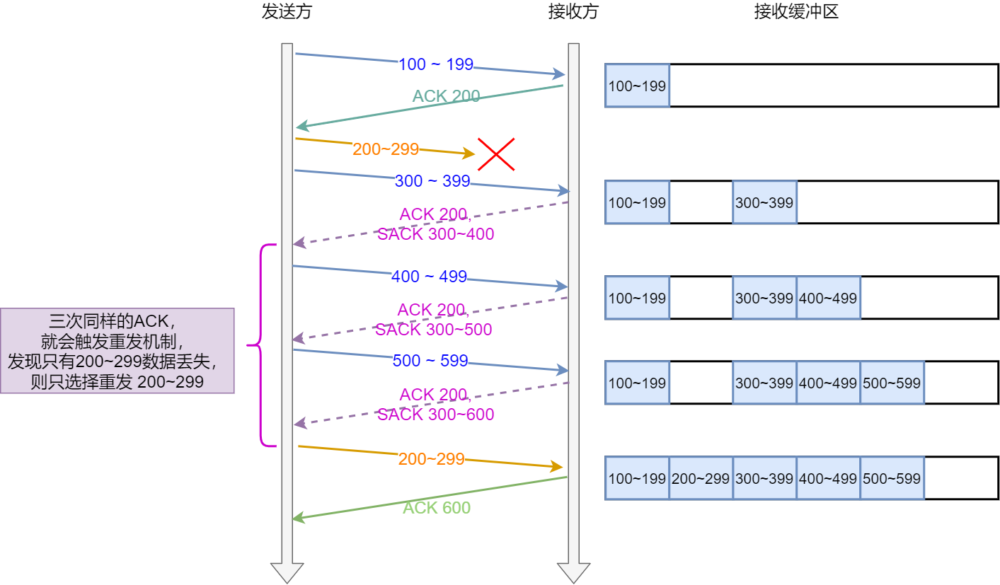
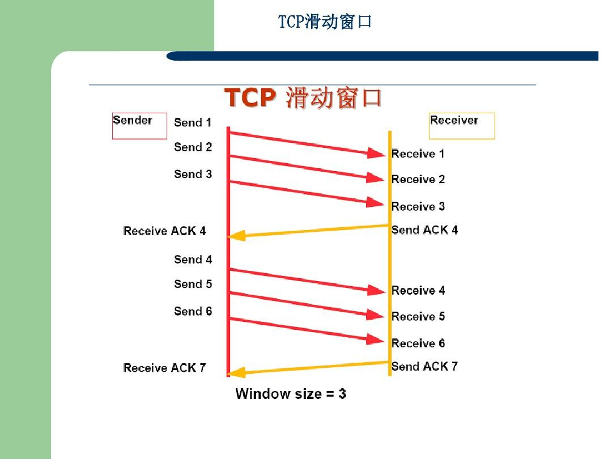
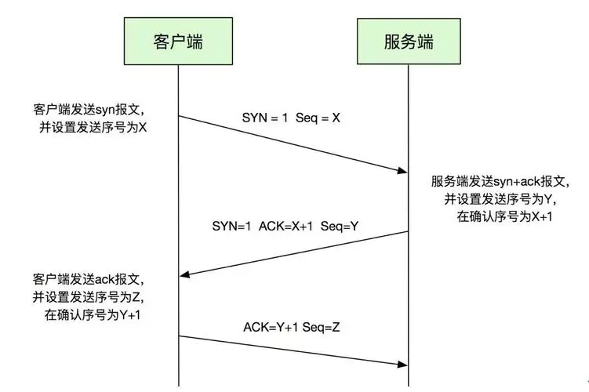
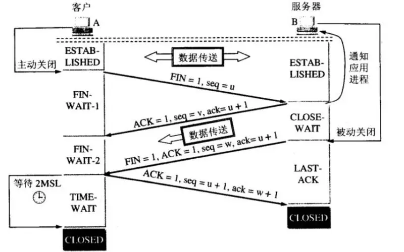

# 计算机网络高频（二）TCP/IP基础

## 1.什么是TCP/IP⭐⭐

**TCP/IP是一种网络通信协议，它是互联网中最常用的协议之一。TCP/IP有两个基本的协议：TCP（传输控制协议）和IP（互联网协议）。**

- TCP（Transmission Control Protocol，传输控制协议）是一种可靠的、面向连接的协议。它负责在网络上将数据分割成小的数据包，并且确保这些数据包按照正确的顺序传输到目标设备。TCP还提供了丢包重传、拥塞控制和流量控制等功能，以保证数据的可靠传输。
- IP（Internet Protocol，互联网协议）是一种网络层协议，它负责在网络上将数据包从源设备路由到目标设备。IP使用唯一的IP地址标识设备，并且通过路由器将数据包从一个网络传递到另一个网络。IP还负责处理分组的分片和重组，以适应不同网络的最大传输单元（MTU）。

**TCP/IP将这两个协议结合在一起，提供了可靠的、端到端的数据传输。它是互联网通信的基础，支持各种应用程序（如Web浏览器、电子邮件、文件传输等）进行网络通信。TCP/IP还支持多种其他协议，如UDP（用户数据报协议）、FTP（文件传输协议）、SMTP（简单邮件传输协议）等等。**

#### **TCP报文格式**

1. 源端口（Source Port）：16位字段，表示发送端口号，用于标识发送方的应用程序或服务。
2. 目标端口（Destination Port）：16位字段，表示接收端口号，用于标识接收方的应用程序或服务。
3. 序列号（Sequence Number）：32位字段，用于按顺序组装数据报文，保证数据可靠传输。
4. 确认号（Acknowledgment Number）：32位字段，表示期望接收的下一个字节的序列号，用于确认接收到的数据。
5. 数据偏移（Data Offset）：4位字段，表示TCP头部的长度，用于指示TCP报文中数据区的起始位置。
6. 保留位（Reserved）：6位字段，保留供将来使用，目前保持为0。
7. 控制位（Flags）：6位字段，用于标识TCP报文的控制信息，包括：URG（Urgent）：表示紧急指针字段是否有效。ACK（Acknowledgment）：表示确认号字段是否有效。PSH（Push）：表示接收方应尽快将数据交给应用程序。RST（Reset）：表示重置连接。SYN（Synchronize）：用于建立连接。FIN（Finish）：用于关闭连接。
8. 窗口大小（Window Size）：16位字段，表示发送方期望接收的字节量，用于流量控制。
9. 校验和（Checksum）：16位字段，用于检测TCP头部和数据的完整性。

10.紧急指针（Urgent Pointer）：16位字段，仅在URG标志为1时有效，表示紧急数据的末尾位置。

11.选项（Options）：可选字段，用于提供额外的功能，如选择确认、最大段大小等。

## 2.说说TCP的可靠机制。⭐⭐⭐

### 序列号和确认机制：

- TCP报文使用序列号和确认号字段来实现数据的可靠传输。发送方的TCP将每个字节的数据进行编号，并按序发送。接收方根据接收到的字节进行确认，并回复确认号，表示期望接收的下一个字节的序列号。如果发送方未收到确认，或者收到的数据有丢失、重复或损坏，发送方将重传数据。

### 超时重传机制：

- TCP使用超时重传机制来处理丢失的数据或确认。发送方设置一个定时器，在发送数据后等待一段时间，如果在该时间内未收到确认，发送方会假设数据丢失，并重传数据。接收方通过确认号来判断是否有丢失的数据，如果接收到重复的数据，将丢弃并发送确认。

### 滑动窗口：

- TCP使用滑动窗口机制来进行流量控制。每个TCP报文中包含一个窗口大小字段，发送方根据接收方的窗口大小来控制发送的数据量。接收方根据自身处理能力和可用缓冲区大小来设置窗口大小，发送方根据接收方窗口大小来调整发送速率，以避免数据的拥塞和丢失。

### 拥塞控制机制：

- TCP使用拥塞控制机制来适应网络拥塞情况。通过动态调整发送速率和窗口大小，TCP可以避免网络拥塞并提供公平共享带宽。TCP使用拥塞窗口和慢启动、拥塞避免、快速重传、快速恢复等算法来控制拥塞，并根据网络状况进行自适应调整。

### 数据校验和错误检测：

- TCP使用校验和字段来检测数据在传输过程中的错误。接收方在接收到TCP报文后计算校验和，如果校验和不匹配，则认为数据出现错误，并请求发送方重新发送数据

## 3.说说TCP三次握手的过程。⭐⭐⭐⭐

TCP三次握手是建立TCP连接的过程，步骤如下：

1. **第一次握手（SYN）：**客户端向服务器发送一个包含SYN（同步序列号）标志的报文段。这表示客户端请求建立连接，并指定初始序列号（初始的随机值）。
2. **第二次握手（SYN+ACK）**：服务器收到客户端的请求后，会返回一个包含SYN和ACK（确认应答）标志的报文段。ACK应答号为客户端请求的序列号加1，表示服务器已经接受了客户端的请求，并希望建立连接。
3. **第三次握手（ACK）**：客户端收到服务器的应答后，会发送一个确认报文段给服务器，确保服务器收到了自己的确认应答。

**值得注意的是，TCP三次握手是为了确保双方都做好了发送和接收数据的准备工作，建立了全双工的连接。四次挥手是用于关闭连接的过程，通过交换FIN（结束）和ACK报文段完成。**

## 4. 说说TCP四次挥手的过程。⭐⭐⭐⭐

TCP四次挥手是关闭TCP连接的过程，步骤如下：

1. **第一次挥手（FIN）**：当一方（通常是客户端）决定关闭连接时，发送一个FIN（结束）标志的报文段给对方（通常是服务器）。这表示该方不会再发送数据，但仍然可以接收数据。
2. **第二次挥手（ACK）**：接收到关闭请求的一方（通常是服务器）收到FIN后，发送一个确认报文段给对方，确认收到了关闭请求。
3. **第三次挥手（FIN）：**被动关闭连接的一方（通常是服务器）也准备关闭连接，发送一个FIN标志的报文段给对方（通常是客户端）。表示服务器也不会再发送数据。
4. **第四次挥手（ACK）**：接收到第三次挥手的一方（通常是客户端）发送一个确认报文段给对方，确认收到了关闭请求。

通过这个过程，双方都可以安全地关闭连接，释放资源。需要注意的是，四次挥手中的前两次和后两次挥手是独立进行的，因此总共需要四次交互来完成连接的关闭。

## 5.为什么三次握手中客户端还要发送一次确认呢？可以二次握手吗⭐⭐

**2次握手时，假设客户端的TCP连接请求在网络中滞留导致客户端重发，若当该连接通信成功后结束时第一次的TCP连接请求才到达服务器，此时服务器会认为这是一次新的请求。**

**然后同意建立连接，直接进入连接已建立状态，然后给客户端回复确认请求。**

**客户端此时仍处于关闭状态，不会理睬该报文，这将导致服务器一直处于等待客户端传输数据的状态，白白浪费资源**

## 6.为什么服务端易受到SYN攻击？⭐

**SYN攻击（SYN flood）是一种常见的网络攻击方式，其利用TCP协议的三次握手过程中的漏洞，通过发送大量伪造的SYN请求包给服务端，耗尽服务端资源，使其无法响应正常的请求。**

下面是一些可能导致服务端易受到SYN攻击的原因：

1. **半开连接：**在正常的TCP连接建立过程中，当服务端收到客户端的SYN包后，会分配一些资源来处理未完成连接的请求，这种连接称为半开连接。攻击者可以利用这一点，伪造大量的源IP地址，同时发送大量的SYN请求，使得服务端一直等待，无法释放资源，最终资源耗尽。
2. **容易预测的序列号**：在TCP三次握手过程中，客户端和服务端会交换初始序列号（ISN），用于后续的数据传输。如果服务端使用简单的算法或固定的初始序列号生成方式，攻击者可以很容易地猜测到服务端的序列号，从而伪造大量的连接请求。
3. **资源限制：**服务端可能存在连接数量、带宽、内存等资源限制。攻击者利用SYN攻击可以消耗这些资源，使服务端无法正常处理其他的合法请求。

**为了应对SYN攻击，通常采取以下防御措施：**

1. SYN cookies：SYN cookies是一种机制，用于在三次握手过程中隐藏服务端的真实序列号，以抵御SYN攻击。它使用哈希函数生成一个虚假的序列号，在接收到SYN请求后，服务端可以验证请求的合法性并恢复真实的序列号。

## 7.为什么客户端最后还要等待2MSL？⭐⭐

**第四次挥手之所以要等待2MSL时间，是为了保证双方都能正常关闭连接，并避免对后续的连接造成干扰。具体来说：**

- **确认最后一个ACK包是否传输丢失：在TCP协议中，发送端发送的每个数据包都有一个TTL（Time To Live）属性，当网络发生拥塞时会导致该报文被重传或丢弃。因此，在客户端向服务器发送最后一个ACK包之后，需要等待一段时间以确保这个ACK包已经顺利被服务器接收到并处理完毕。**
- **避免"旧连接"的数据混乱：如果一个新连接恰好使用了旧连接的端口和IP地址，且旧连接的某些信息没有及时清除，就可能产生数据混乱的情况。例如，如果新连接采用同样的源端口号，对于服务端而言这就是"旧连接"重新启动了，如果等待这个"旧连接"的状态信息释放完成(TCP 4分组的最大时间)才重新使用这个端口，自然可以避免数据混乱问题。**

**因此，根据TCP协议的规定，在客户端发送最后一个ACK包后，需要等待2倍的报文段最大生存期MSL时间，以确保服务器完全关闭连接。在这段时间内，如果服务器还有数据需要发送，它可以通过老的连接发送，而不会被某个处于TIME_WAIT状态的TCP占用，也就避免了"旧连接"的数据混淆问题。**

## 8.为什么建立连接是三次握手，关闭连接确是四次挥手呢？⭐⭐

### TCP为什么需要三次握手?

- **TCP是可靠的传输控制协议，而三次握手是保证数据可靠传输又能提高传输效率的最小次数。**

#### 为什么TCP的挥手需要四次？

- **TCP是全双工的连接，必须两端同时关闭连接，连接才算真正关闭。**

## 9. 什么是TCP粘包现象？⭐⭐⭐

#### 什么是粘包

tcp粘包是指发送方发送的若干包数据到接收方接受时粘成一包，从接收缓冲去看，后一包数据的头紧接着前一包数据的尾。

#### 产生粘包的原因

发送方原因：Nagle算法导致了发送方有可能出现粘包现象

接收方原因：当tcp接收分组的速度大于应用程序读分组的速度，多个包就会被存至缓存，应用程序读时，就会读到多个首尾相接粘到一起的包

#### 如何处理

1. 发送方：通过TCP_NODELAY选项关闭Nagle算法
2. 接收方：在应用层进行粘包处理

## 10. 请说说TCP的ACK机制，有什么好处？⭐⭐⭐

**TCP的ACK（确认）机制是指在TCP连接中，接收方通过发送ACK报文来确认已成功接收到发送方的数据。ACK机制的主要作用是保证数据的可靠传输和实现流量控制。**

好处如下：

1. **可靠性确认**：接收方通过发送ACK报文来确认已成功接收到发送方的数据。发送方收到ACK报文后，可以确认数据已经正确传输到接收方，如果没有收到ACK报文，发送方会认为数据丢失，会进行重传，保证数据可靠性。
2. **流量控制**：ACK机制可以帮助控制数据发送的速率。在接收方的ACK报文中，会包含一个窗口字段（接收窗口），表示接收方所能接收的数据量。发送方根据接收窗口的大小来调整发送数据的速率，以避免发送方持续发送过多的数据，导致接收方无法及时处理和接收，从而实现流量控制，避免网络拥塞和数据丢失。
3. **乱序处理**：ACK机制可以用于处理乱序到达的数据包。接收方在收到乱序的数据包后，可以通过发送ACK报文来通知发送方已经接收到哪些数据包，以便发送方进行数据包的重排和重传，确保数据的顺序性。
4. **建立和维护连接**：通过ACK机制，发送方和接收方可以相互确认对方的存在和可达性，进而建立和维护TCP连接。
5. **拥塞控制**：ACK机制可以用于拥塞控制。当网络发生拥塞时，接收方的ACK报文会延迟发送或丢失，从而减少发送方的数据传输速率，避免进一步加剧网络拥塞。