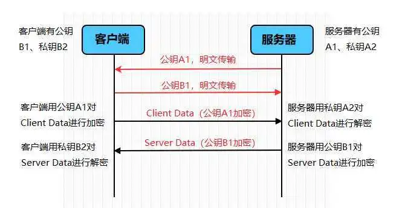
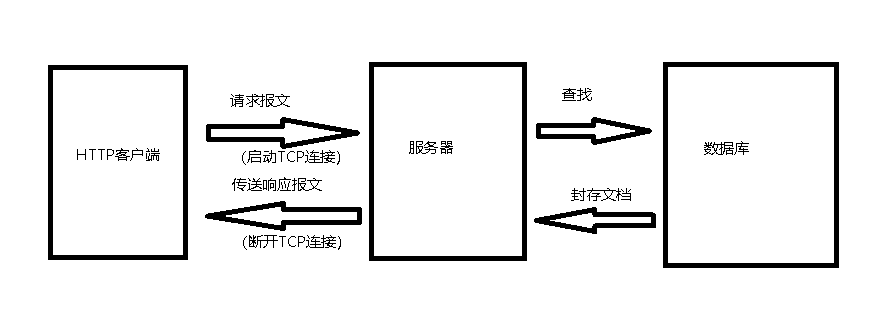
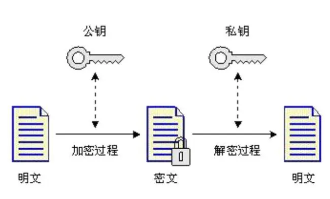
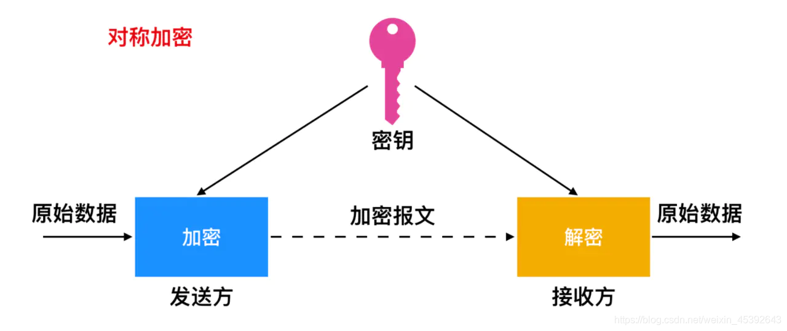

# 计算机网络高频（六）HTTP和HTTPS

## 1.HTTPS 的加密原理⭐⭐⭐

**客户端和服务器端使用握手协议来建立安全连接。具体流程如下：**

- 客户端发送一个连接请求，表示希望与服务器建立安全连接。
- 服务器将自己的数字证书发送给客户端。
- 客户端验证服务器的证书，包括确认证书的合法性和验证证书颁发机构的信任。
- 客户端生成一个随机的对称密钥，此对称密钥将用于后续的通信加密。
- 客户端使用服务器的公钥加密该对称密钥，并将加密后的密钥发送给服务器。
- 服务器使用自己的私钥解密客户端发来的对称密钥。

## 2.请说说 HTTP 的工作原理。⭐⭐

1. **客户端发起请求：**Web 浏览器作为 HTTP 的客户端，向 Web 服务器发送请求。请求包括一个 URL（Uniform Resource Locator），用于标识所请求的资源，以及请求方法，如 GET、POST等。
2. **服务器响应请求：**Web 服务器收到请求后，根据请求的 URL 和方法，处理请求。服务器会查找所请求的资源，并生成一个 HTTP 响应。
3. **建立连接：**在发送请求和接收响应之前，客户端和服务器需要建立一个 TCP/IP 连接。这个过程称为三次握手。
4. **发送请求报文：**客户端将请求包装成一个 HTTP 请求报文，并通过建立的 TCP/IP 连接发送给服务器。请求报文包括请求行（URL和HTTP方法）、请求头（包含请求的附加信息）和请求体（对于POST方法，包含要发送的数据）。
5. **服务器处理请求：**服务器接收到请求报文后，根据请求行和头部中的信息，处理请求。它可能会查询数据库、读取文件或执行其他操作来生成响应。
6. **发送响应报文：**服务器将生成的响应信息打包成一个 HTTP 响应报文，并通过 TCP/IP 连接发送给客户端。响应报文包括响应状态码、响应头（包含响应的附加信息）和响应体（包含实际的响应数据）。
7. **关闭连接：**在响应发送完成后，服务器和客户端都可以选择关闭连接，释放资源。也可以选择保持持久连接，以便在后续请求中复用。

## 3.HTTP的无连接是什么意思？⭐⭐⭐

**HTTP 的无连接（Connectionless）指的是每次 HTTP 请求都是独立的，没有持久连接状态。这意味着在 HTTP 请求的每个阶段都需要建立一个新的连接，发送请求并接收响应后立即关闭连接。具体来说，HTTP 的无连接特性表现在以下几个方面：**

| 特性                 | 解析                                                         |
| -------------------- | ------------------------------------------------------------ |
| 短暂会话             | 每个 HTTP 请求-响应交互都是短暂的，服务器在接收到请求并发送响应后立即关闭连接。 |
| 无状态               | HTTP 不跟踪客户端的状态信息，每个请求都是独立的，服务器不记住之前的请求。 |
| 资源消耗较少         | 每个请求生命周期短暂，不需要维持持久连接，减少服务器的负载和资源占用。 |
| 完全解耦             | 无连接特性使得客户端和服务器之间解耦，其通信可以非常灵活，不存在先后关系或依赖性。 |
| 可扩展性和灵活性     | 每次请求都是独立的，服务器不需要维护连接状态，使得增加、减少服务器节点等扩展性操作更加方便。 |
| 适应低可靠性网络环境 | 无连接特性使其适合在互联网等低可靠性网络环境下进行通信。     |

## 4.HTTP的无状态是什么意思？⭐⭐

**HTTP的无状态（Stateless）指的是服务器在处理客户端请求时，不保存关于客户端的任何状态信息。每个 HTTP 请求都是独立的，服务器不能从之前的请求中推断出客户端的上下文或状态。**

具体来说，无状态意味着以下几点：

1. 每个请求都是独立的：服务器不能确定两个请求是否来自同一个客户端，因为它没有保存关于客户端的状态信息。
2. 服务器不存储客户端状态：服务器不会保存客户端的任何状态信息，如登录状态、会话数据等。每个请求都需要提供足够的信息来完成处理。
3. 无法跟踪客户端会话：由于服务器不存储客户端状态，它无法跟踪客户端的会话，也无法确保在多个请求之间保持用户身份验证状态。

## 5.在浏览器地址栏键入 URL，按下回车之后会经历哪些流程？⭐⭐⭐

1. **URL 解析：**浏览器解析 URL，提取出域名。
2. **DNS 解析：**浏览器向 DNS 服务器发送请求，将域名解析为对应的 IP 地址。
3. **建立TCP连接：**浏览器使用获取到的 IP 地址和默认的 HTTP 端口（通常为 80）建立 TCP 连接。
4. **发起 HTTP 请求：**浏览器发送 HTTP 请求，包括请求方法（如 GET、POST 等）、路径、查询参数、请求头（如 User-Agent、Accept 等）和请求体（如 POST 请求中的数据）。
5. **服务器响应：**目标服务器接收到请求后，处理请求并生成 HTTP 响应，包括响应状态码、响应头和响应体。
6. **接收响应：**浏览器接收到响应，解析响应头和响应体。
7. **渲染页面：**如果响应是一个 HTML 页面，浏览器解析 HTML、加载 CSS 和 JavaScript 文件，并构建 DOM 树和 CSSOM 树，最终渲染页面。
8. **关闭连接：**请求和响应完成后，浏览器关闭 TCP 连接，释放资源。

## 6.cookie和session对于HTTP有什么用？⭐⭐

|          | **Cookie**                               | **Session**                                     |
| -------- | ---------------------------------------- | ----------------------------------------------- |
| 定义     | 存储在客户端的小型文本数据               | 存储在服务器端的会话状态信息                    |
| 存储位置 | **客户端的浏览器中**                     | **服务器端**的内存或持久化存储                  |
| 传递方式 | 通过 HTTP 请求头的 Cookie 字段传递       | 通过 Cookie 存储的 Session ID 传递              |
| 功能     | 会话管理、用户认证、偏好设置、跟踪分析等 | 会话管理、用户认证、存储会话状态信息等          |
| 安全性   | Cookie 可以设置 HTTPOnly 属性保护        | Session ID 只在 Cookie 中传递，减少信息暴露风险 |
| 存储容量 | 进行大小限制，一般为几KB                 | 能够存储更大的数据，不受浏览器限制              |
| 生命周期 | 可以设置指定的过期时间                   | 生命周期与会话相关，一般在会话结束时销毁        |

## 7.HTTP1.0、HTTP1.1的区别⭐⭐⭐⭐

|           | **HTTP 1.0**                                               | **HTTP 1.1**                                                 |
| --------- | ---------------------------------------------------------- | ------------------------------------------------------------ |
| 持久连接  | 默认情况下，每个请求/响应都需要建立和关闭一个单独的连接    | 引入了持久连接，允许多个请求/响应复用同一个连接              |
| 流水线化  | 不支持                                                     | 支持通过同时发送多个请求来提高效率                           |
| 响应方式  | 响应无序，无法确定响应与请求的对应关系                     | 引入了序号，以确保每个响应与其对应的请求一一对应             |
| 压缩      | 不支持                                                     | 引入了 gzip 等压缩算法，以减少传输的数据量                   |
| 缓存      | 有限的支持，靠 Expires 和 Last-Modified 字段来进行缓存控制 | 引入了更强大的缓存处理机制，包括 Cache-Control 和 ETag 字段等 |
| Host 字段 | 不支持                                                     | 引入了 Host 字段，支持一台服务器上的多个虚拟主机，提供更好的多站点管理能力 |
| 错误处理  | 错误处理机制简单，主要通过响应状态码进行处理               | 引入了更多的状态码和错误处理机制，包括重定向、范围请求、条件请求等 |
| 安全性    | 不支持                                                     | 引入了更强的安全机制，如基本认证、摘要认证、SSL/TLS 等       |

## 8.什么是对称加密？什么是非对称加密？两者区别？⭐⭐⭐⭐

#### 公钥加密（非对称加密）：

- a. 服务器端生成一对密钥：公钥和私钥。
- b. 服务器将公钥放在数字证书中并发送给客户端。
- c. 客户端接收到服务器发来的数字证书后，验证证书的合法性，包括证书是否由可信机构签发、证书是否过期等。
- d. 客户端从证书中获取服务器的公钥，用于后续的加密操作。
- e. 客户端使用服务器的公钥对一个随机生成的对称密钥进行加密，并将加密后的密钥发送给服务器。
- f. 服务器使用私钥对加密后的对称密钥进行解密，获取对称密钥。

#### 对称密钥加密：

- a. 客户端和服务器通过握手过程协商一个对称密钥，该对称密钥只在本次通信过程中使用。
- b. 客户端和服务器使用对称密钥对通信的数据进行加密和解密。
- 

## 9.数字证书用来干嘛的？⭐⭐

服务器会给客户端发出数字证书来证明自己的身份。**客户端在接受到服务端发来的SSL证书时，会对证书的真伪进行校验**。这样我们通过数字证书，就可以安全交换对称秘钥了。

|          | **数字证书**                                             |
| -------- | -------------------------------------------------------- |
| 用途     | **验证网络实体身份和建立安全通信**                       |
| 内容     | - **证书持有者的信息（如名称、组织、电子邮件等）**       |
|          | **- 证书颁发机构（CA）的信息**                           |
|          | **- 证书持有者的公钥**                                   |
|          | **- 数字签名**                                           |
| 作用     | - 身份验证：确认服务器、个人的身份                       |
|          | - 数据加密：使用公钥加密数据                             |
|          | - 安全通信：建立安全加密通信通道                         |
|          | - 可信性和信任链建立                                     |
| 颁发机构 | 由受信任的证书颁发机构（CA）签发和管理                   |
| 安全性   | - 私钥的保护：证书持有者需要妥善保护私钥                 |
|          | - CA信任链的建立和验证                                   |
|          | - 防止伪造和篡改：通过数字签名来验证证书的完整性和真实性 |

## 10.HTTPS为什么比HTTP更安全⭐⭐

关键点：

1. 数据加密：HTTPS 使用 SSL/TLS 协议对通信进行加密，而 HTTP 不对通信进行加密，数据传输是明文的。
2. 身份验证：HTTPS 使用数字证书对服务器进行身份验证，确保客户端连接到真实的服务器。HTTP 没有身份验证机制，容易被中间人攻击。
3. 数据完整性：HTTPS 使用消息摘要算法和数字签名来确保数据的完整性，防止数据在传输过程中被篡改。HTTP 没有数据完整性保护，数据容易被篡改。
4. 默认端口号：HTTPS 使用默认的安全端口 443，而 HTTP 使用端口 80。
5. 排名和SEO影响：搜索引擎更倾向于将采用 HTTPS 的网站排名更高，HTTP 网站可能在搜索结果中排名较低。

下面是关于HTTPS和HTTP的比较表格：

|            | **HTTPS**                              | **HTTP**                              |
| ---------- | -------------------------------------- | ------------------------------------- |
| 安全性     | 通信数据加密，保护隐私和数据安全       | 通信数据明文传输，容易被窃听和篡改    |
| 身份验证   | 使用数字证书对服务器进行身份验证       | 没有身份验证机制，容易受到中间人攻击  |
| 数据完整性 | 使用消息摘要和数字签名保证数据完整性   | 没有数据完整性保护，数据容易被篡改    |
| 端口号     | 默认使用安全端口 443                   | 默认使用非安全端口 80                 |
| 排名效果   | HTTPS 网站可能在搜索引擎结果中更高排名 | HTTP 网站可能在搜索引擎结果中排名较低 |

## 11.HTTP2.0有哪些改动？⭐

下面是 HTTP/2.0 和 HTTP/1.1 的对比表格：

|            | **HTTP/2.0**                                             | **HTTP/1.1**                             |
| ---------- | -------------------------------------------------------- | ---------------------------------------- |
| 多路复用   | 允许同时发送多个请求和响应                               | 每个请求需要使用独立的连接               |
| 二进制传输 | 使用二进制格式传输数据                                   | 使用文本格式传输数据                     |
| Header压缩 | 提供有效的头部压缩机制，减少重复的头部传输               | 头部数据无压缩，重复传输                 |
| 服务器推送 | 具备服务器推送功能，主动推送相关资源                     | 无法主动推送资源，需要额外的请求获取资源 |
| 流量控制   | 支持流量控制机制，管理和控制发送和接收的数据流量         | 没有流量控制机制，可能导致网络拥塞和延迟 |
| 请求优先级 | 支持客户端指定请求的优先级，保证重要资源和请求的优先处理 | 所有请求平等处理，没有请求优先级的概念   |