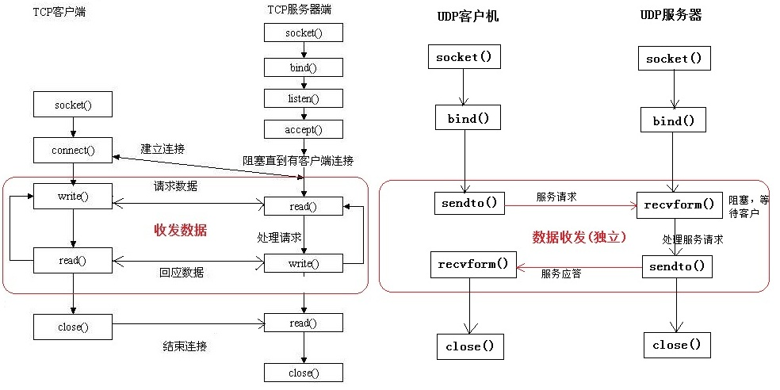

# 计算机网络高频（四）socket网络编程

## 1.请说说socket网络编程的步骤。⭐⭐⭐

### UDP的网络编程：

#### 客户端的基本流程如下：

1. 创建UDP套接字（socket）：使用 socket 库的 `socket()` 函数创建一个 UDP 套接字。
2. 可选地绑定本地地址和端口：使用 `bind()` 函数将套接字绑定到一个本地地址和端口。
3. 发送数据包给服务端：使用 `sendto()` 函数将数据包发送给服务端，需要指定目标地址和端口。
4. 等待接收来自服务端的响应数据包（可选）：使用 `recvfrom()` 函数从服务端接收数据包，这是一个阻塞操作，直到接收到数据或超时。
5. 关闭套接字：使用 `close()` 函数关闭客户端的套接字。

#### 服务端的基本流程如下：

1. 创建UDP套接字（socket）：使用 socket 库的 `socket()` 函数创建一个UDP套接字。
2. 将套接字绑定到一个本地地址和端口：使用 `bind()` 函数将套接字绑定到一个本地地址和端口，使其可以接收来自客户端的数据包。
3. 开始监听来自客户端的数据包：使用 `recvfrom()` 函数从客户端接收数据包，这是一个阻塞操作，直到接收到数据或超时。
4. 接收客户端发送的数据包：使用 `recvfrom()` 函数接收客户端发送的数据包，并获取客户端的地址和端口。
5. 可选地处理接收到的数据包并给客户端发送响应数据包：对接收到的数据包进行处理，并使用sendto()函数将响应数据包发送给客户端。
6. 可选地继续监听并处理其他客户端的请求：使用一个循环来持续监听和处理多个客户端的请求。
7. 关闭套接字：使用 `close()` 函数关闭服务端的套接字

### TCP的网络编程：

#### 服务端流程：

1. 创建服务端的 TCP 套接字：使用 `socket()` 函数，指定地址类型（IPv4 或 IPv6）、socket 类型（如SOCK_STREAM）和协议（如IPPROTO_TCP）。
2. 绑定套接字到指定的 IP 地址和端口号：使用`bind()` 函数，传入套接字、本地地址和端口号。
3. 开始监听连接请求：使用 `listen()` 函数，传入套接字和等待连接的最大数量。
4. 接受来自客户端的连接请求：使用 `accept()` 函数，在一个循环中等待客户端连接，并创建新的套接字来与客户端通信。
5. 与客户端通信：使用新的套接字进行数据传输，如使用 `read()` 函数接收客户端发送的数据并使用 `write()` 函数发送响应数据给客户端。
6. 当通信结束时，关闭与客户端的套接字：使用 `close()` 函数，传入套接字。

#### 客户端流程：

1. 创建客户端的 TCP 套接字：使用 `socket()` 函数，指定地址类型（IPv4 或 IPv6）、socket 类型（如SOCK_STREAM）和协议（如IPPROTO_TCP）。
2. 连接到服务端的IP地址和端口号：使用 `connect() ` 函数，传入套接字、服务端地址和端口号。
3. 向服务端发送请求或数据：使用 `write()` 函数向服务端发送请求或数据。
4. 等待接收服务端返回的响应数据：使用 `read()` 函数接收服务端发送的响应数据。
5. 处理服务端的响应数据。
6. 当通信结束时，关闭客户端的套接字：使用 `close()` 函数，传入套接字。

#### 

## 2.请说说socket网络编程的接口。⭐⭐

1. **创建套接字**：`socket()` 函数。
2. **绑定套接字**：`bind()` 函数。
3. **监听连接**：`listen()` 函数。
4. **接受连接：**`accept()` 函数。在接受连接后，会返回一个新的套接字用于与客户端通信。
5. **连接服务器：**`connect()` 函数。
6. **发送数据：**使用 `write()` 函数，将数据从套接字发送给目标主机。写入的字节数可以通过返回值进行检查。
7. **接收数据：**使用 `read()` 函数，从套接字读取数据。读取的字节数可以通过返回值进行检查。
8. **关闭套接字：**`close()` 函数。

## 3. 什么是Socket⭐

**Socket（套接字）是一种在计算机网络中进行通信的抽象概念。它提供了一种机制，使得不同计算机之间能够建立连接并进行数据交换。**

**在网络通信中，Socket 可以被视为一个端点，它通过网络连接与其他应用程序进行通信。Socket 可以分为两种类型：服务器端套接字（Server Socket）和客户端套接字（Client Socket）。**

## 4.socket属于网络的哪个层面⭐⭐

**Socket属于传输层。**

1. Socket 是应用程序和网络传输层之间的接口，它提供了一套编程接口，允许应用程序通过传输协议（如TCP 或 UDP）进行网络通信。通过 Socket，应用程序可以创建连接、发送和接收数据。
2. 具体来说，当应用程序使用 TCP 协议时，它可以使用 Socket 接口来建立一个 TCP 连接，并通过 Socket 发送和接收可靠的字节流数据。当应用程序使用 UDP 协议时，它可以使用 Socket 接口来发送和接收不可靠的数据报。
3. 由于 Socket 直接与传输协议交互，并提供了对传输层功能的访问，因此它被认为属于传输层。它将应用程序和网络层之间进行了解耦，使得应用程序可以方便地进行网络通信操作，无需关注底层的网络细节。

## 5.Socket的常用类⭐⭐

Socket 的常用类包括以下几个：

1. **Socket**：Socket类是Java中最基本的Socket类，用于客户端与服务器之间的通信。它提供了一套方法，可以用于建立连接、发送和接收数据。
2. **ServerSocket**：ServerSocket类用于在服务器端监听指定的端口，接受客户端的连接请求。一旦有客户端连接上来，ServerSocket会返回一个对应的Socket实例，用于与该客户端进行通信。
3. **InetAddress**：InetAddress类表示IP地址，可以用于解析域名、获取主机名等。它提供了一系列静态方法，用于获取本地主机地址、远程主机地址等。
4. **DatagramSocket**：DatagramSocket类用于支持UDP协议的网络通信。它提供了一套方法，可以用于发送和接收UDP数据报。
5. **MulticastSocket**：MulticastSocket类继承自DatagramSocket，专用于支持多播（Multicast）通信。它提供了一套方法，用于加入和离开多播组、发送和接收多播数据报。

## 6.什么是长链接、短连接⭐⭐⭐

**长连接（Keep-Alive连接）：**

1. 长连接指在一次连接中可以进行多次数据传输的连接方式。在建立连接后，客户端和服务器保持该连接，可以连续发送和接收数据。
2. 长连接通常使用 TCP 协议，因为 TCP 是一种可靠的、面向连接的协议，适合长时间的持续通信。
3. 长连接可以减少连接的建立和关闭的开销，提高通信效率，适用于实时性较高、频繁通信的场景，如聊天应用、实时数据传输等。

**短连接：**

1. 短连接是一次性的、即时的连接。在完成一次数据传输后，连接会被立即关闭。
2. 短连接可以使用 TCP 或 UDP 协议，但更常见的是使用 UDP 协议，因为 UDP 是一种无连接的协议，不需要保持持久连接。
3. 短连接适用于数据传输较少的场景，如发送一次请求获取某个资源，数据传输完成后连接即可关闭。

## 7.如何应对短连接、高并发的场景？⭐⭐

1. **优化主机系统设置：**降低 SYN timeout 时间，以便尽快释放占用的半连接。使用 SYN cookie 设置，为每个连接请求的 IP 地址分配一个 Cookie，当连续收到一个 IP 地址的重复 SYN 报文时，认为可能受到攻击，并拒绝来自该 IP 地址的后续包。
2. **使用长连接：**在使用长连接的情况下，客户端和服务器之间的 TCP 连接在一个网页打开后不会立即关闭，而是保持连接状态，如果客户端再次访问服务器上的网页，可以继续使用已经建立的连接，避免频繁建立和关闭连接的开销。

### **对于服务器高并发的场景，可以使用以下处理手段：**

1. **采用多 IO 复用模型**：使用 select、epoll 等多路复用技术处理多个连接的读写操作。这样可以在一个线程或进程内同时处理多个连接，提高系统的并发能力。
2. **使用队列进行削峰和缓存**：引入消息队列，将请求加入队列中，然后使用多个消费者进行处理。这种方式可以平滑处理峰值请求，并提高系统的可伸缩性和容错性。使用缓存来存储一些频繁访问的数据或计算结果，减少对后端系统的访问，提高系统响应速度。
3. **采用多服务器负载均衡：**使用负载均衡技术将请求分发到多个服务器上，确保每个服务器都能均衡处理请求，提高系统的吞吐量和可靠性。
4. **使用缓存：**使用缓存系统如 Redis 来缓存经常访问的数据，减少对后端系统的访问，提高系统的响应速度和并发处理能力。

## 8.什么是负载均衡？⭐⭐

当一台服务器的单位时间内的访问量越大时，服务器压力就越大，直至超过其自身的承载能力，这可能导致服务器崩溃。为了避免这种情况发生，并提供更好的用户体验，我们可以利用负载均衡来分担服务器的压力。

**负载均衡是一种通过建立服务器集群来分担服务器压力的技术。具体过程是，当用户访问网站时，先访问一个位于前端的负载均衡器（也称为调度器），然后负载均衡器会根据配置的算法（如轮询、权重轮询、IP-Hash等）选择一个压力较小的后端服务器，并将该访问请求引导到被选中的服务器上进行处理。这样，用户的每个请求都会导向服务器集群中压力相对平衡的服务器上，从而分担了服务器的压力，避免了服务器崩溃的情况。**

1. **轮询（Round Robin）**：将请求依次轮流分配给每个应用服务器，分配策略比较简单。但可能会出现某些服务器接受的请求较重，负载压力重的问题。并且需要进行会话（Session）同步，以确保用户的连续请求能够被正确处理。
2. **权重轮询（Weighted Round Robin）**：给每个服务器分配一个权重值，权重越高的服务器被选中的几率越大。通过调整权重值，可以根据实际情况对服务器进行负载均衡。同样需要进行会话同步。
3. **IP-Hash**：使用客户端的 IP 地址进行哈希计算，将同一个 IP 的请求分发到同一台服务器。可以避免会话同步的问题，但如果存在 IP 集中的情况，可能会导致负载不均衡的问题。
4. **Fair：**根据服务器处理请求的速度进行负载均衡分配，处理请求最早结束的服务器会获得下一个请求。这种方式会自适应地调整负载，并且不需要会话同步。但由于网络不稳定因素，一般不常使用。
5. **URL-Hash**：根据请求的 URL 进行哈希计算，使得同一个 URL 的请求总是发送到同一台服务器，可以利用服务器的缓存。但是由于 URL 的哈希值分布不均匀或业务侧重，可能会造成负载不均衡的情况，同样需要会话同步。

## 9.什么是洪泛攻击？⭐⭐⭐

**洪泛攻击（Flood Attack）是一种旨在压倒目标系统的网络攻击形式。在洪泛攻击中，攻击者发送大量的请求或数据包到目标系统，使其资源（如带宽、处理能力、存储空间等）被消耗殆尽，导致服务无法正常响应合法用户的请求。**

洪泛攻击通常通过大量的恶意流量或请求来使目标系统过载。攻击者可能利用多台计算机组成一个攻击网络（也称为僵尸网络或僵尸军团），从而可以同时进行大规模的洪泛攻击。这种攻击方式的目的是耗尽目标系统的网络带宽、计算资源、内存等，导致系统服务变得不稳定甚至崩溃。

**洪泛攻击可以采用多种方式进行，如：**

1. **TCP SYN Flood：攻击者发送大量的 TCP 连接请求（SYN包）到目标系统上，但不完整建立连接，从而消耗系统资源。**
2. **UDP Flood：攻击者发送大量的 UDP 数据包到目标系统上，由于 UDP 是无连接协议，目标系统会试图处理这些数据包，导致资源耗尽。**
3. **ICMP Flood：攻击者发送大量的 ICMP 请求（Ping）到目标系统上，使其消耗大量的带宽和处理能力。**

### **怎么预防洪泛攻击？**

1. **降低SYN timeout时间：**将主机系统的 SYN timeout 时间设置为较短的值，可以使主机更快地释放占用的半连接资源。这样可以减小洪泛攻击造成的资源占用，提高系统的可用性。
2. **使用SYN cookie：**采用 SYN cookie 技术可以有效抵御 SYN 洪泛攻击。当主机收到 SYN 请求时，使用加密算法和时间信息生成一个特定的 Cookie，并将其发送给客户端。客户端在后续的 ACK 请求中返回该 Cookie 作为验证，从而识别和拒绝恶意的洪泛攻击请求。
3. **使用防火墙和 DDoS 防护设备：**设置防火墙规则和使用专门的 DDoS 防护设备，可以帮助识别和过滤恶意洪泛攻击流量，保护主机系统的正常运行。防火墙可以通过过滤源IP地址、端口、协议等信息来限制来自恶意攻击者的访问。
4. **使用长连接**：在通信协议中采用长连接的方式可以减少连接建立和释放的开销。长连接可以使得客户端和服务器之间复用已经建立的连接，减少了频繁建立和关闭连接的次数，从而降低了洪泛攻击对主机系统的压力。

## 10.简述一下 Nagle 算法⭐⭐⭐

**Nagle算法是一种改善TCP传输效率的流量控制算法。它的目标是减少带宽的浪费，提高网络传输效率。Nagle算法在发送端对数据进行缓冲和合并，在一定条件下将多个小数据包合并成一个较大的数据包进行发送。**

Nagle 算法的工作原理如下：

1. **数据缓冲**：当应用程序发送了一个小数据包时，TCP 协议栈会将数据先放入发送缓冲区而不是立即发送。这样可以积累一些数据，减少单个数据包的数量。
2. **数据合并：**在缓冲区中积累了一定量的数据之后，TCP 协议栈会检查是否可以发送数据。判断的依据是，要么已经收到了对之前数据包的 ACK 确认，要么达到了最大传输窗口的半满状态。
3. **发送数据：**当合并的数据包满足发送条件时，TCP 协议栈将缓冲区中的数据一次性发送出去。

**Nagle 算法通过缓冲和合并数据，减少小数据包的发送次数，提高带宽利用率。但在特定场景下，需要权衡实时性和传输效率，选择是否启用或禁用 Nagle 算法。**