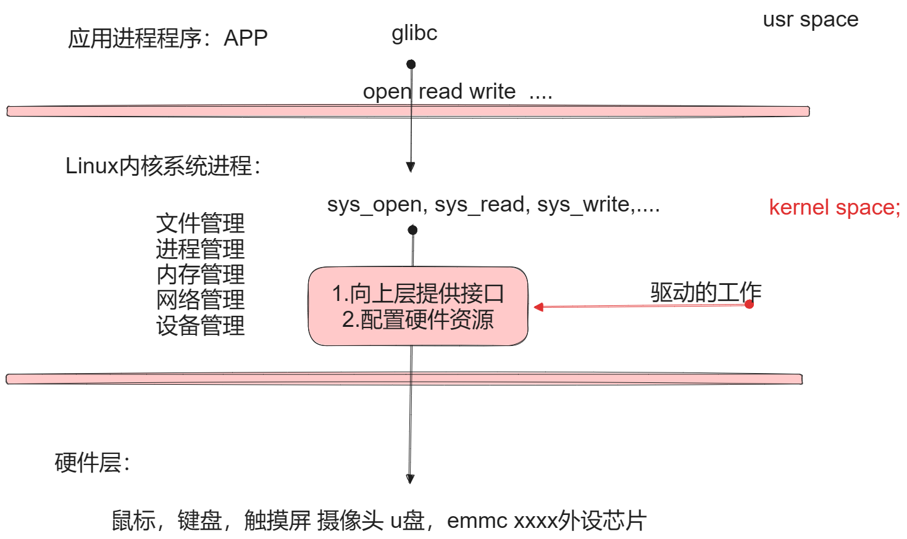

# 第一节、驱动程序的概述：

环境搭建参考PDF:

[Linux驱动开发的学习环境搭建：.pdf](attachments/WEBRESOURCEaf1d0fe934cc7a949d8191f2dbd6afeaLinux驱动开发的学习环境搭建：.pdf)

## 1.一句话总结驱动是什么？

驱动就是做两件事：

**1. 初始化硬件及配置硬件。**

**2.通过操作系统向上层应用程序提供接口函数。**

如图所示：



## 2.linux中驱动的大体分类：

### 1.字符设备驱动：

按照字节流访问，只能顺序访问，不能无序访问。会产生设备文件节点/dev/xxx设备节点，应用层进程访问字符设备时，需要能过vfs与之交互，open read write... 无缓冲。

### 2.块设备驱动：

按照块来访问（块= 512byte）可以顺序访问，也可以无序访问，产生设备节点，应用层进程能过vfs文件系统进行交互。有缓冲。

### 3.网络设备：通过网络进行数据收发的设备 网卡

不产生vfs中产生设备节点，通过socket节点进行交互。

# 第二节、内核模块

## 1.内核模块必须满足的三要素：

1. 模块的入口：

入口：对资源进行初始化。

2.模块的出口：

出口：对使用到的资源的清理。

3.许可：GPL

## 2.如何构建自己的内核模块文件：

my_test_module.c:

```cpp
#include <linux/module.h>
#include <linux/init.h>

//入口函数：
int __init my_test_module_init(void)
{
    printk("入口函数执行了\n");
    //申请资源，初始化并配置资源。
    return 0;
}


//出口函数：
void __exit my_test_module_exit(void)
{
    printk("出口口函数执行了\n");//把调试信息放在了日志文件
    //清理资源。
}


//指定许可：
MODULE_LICENSE("GPL");
MODULE_AUTHOR("gaowanxi, email:gaonetcom@163.com");
//指定入口及出口函数：
module_init(my_test_module_init);
module_exit(my_test_module_exit);
```

Makefile:

```cpp
arch = x86

kernel_dir = /lib/modules/5.4.0-150-generic/build

pwd = $(shell pwd)

all:
    make -C $(kernel_dir) modules M=$(pwd) 
clean:
    make -C $(kernel_dir) clean M=$(pwd)

obj-m += my_test_module.o
```

## 3.动态加载内核目模块：*.ko

1.insmod命令：

insmod 模块名.ko方式直接加载,卸载：rmmod 模块名

通过调试信息的命令dmesg查看

# 第三节、模块依赖与导出符号：

## 1.模块依赖：

A模块中使用了B模块中的相关的函数符号。

## 2.导出符号的宏：

```cpp
EXPORT_SYMBOL(name);
EXPORT_SYMBOL_GPL(name);
以下两者任选其一，即可导出符号到全局符号表中
```

## 3.让extern找到符号表文件中的符号：

```cpp
在Makefile中添加：
KBUILD_EXTRA_SYMBOLS += 依赖的符号表所在的路径
```

## 4.使用modprobe命令前，加通过module_install安装一下：

在Makefile:

```javascript
install:
    make -C $(kernel_dir) modules_install M=$(pwd) INSTALL_MOD_PATH=/home/linux/rootfs
```

## 5.modprobe指令与insmod有区别：

insmod是直接加载，不检查依赖项，而modprobe是检查的，当使用modprobe安装某个模块时，它的所有依赖模块也会自动被安装。

如果删除使用modprobe -r 模块名进行自动删除，所有的依赖模块也会被一同删除。

但是modpro使用之前，必须能过 make module_insall安装模块的结构，modpro才可以使用。