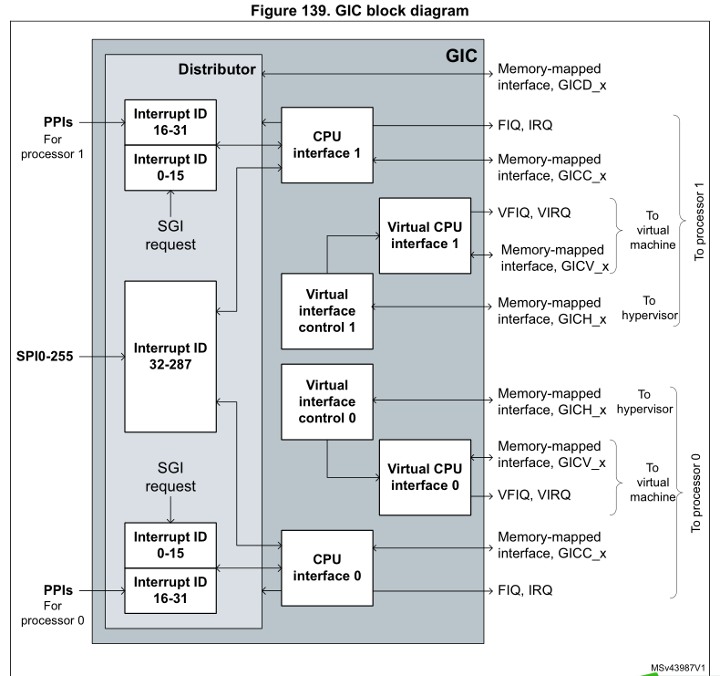
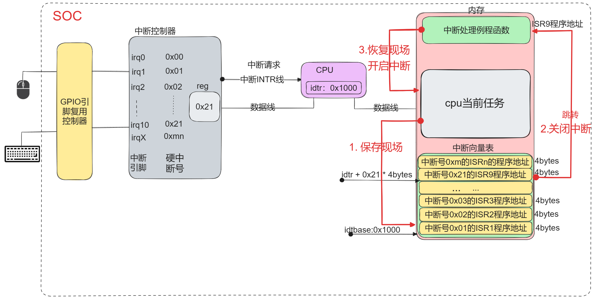
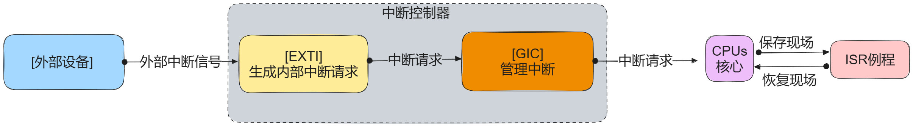
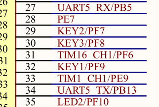
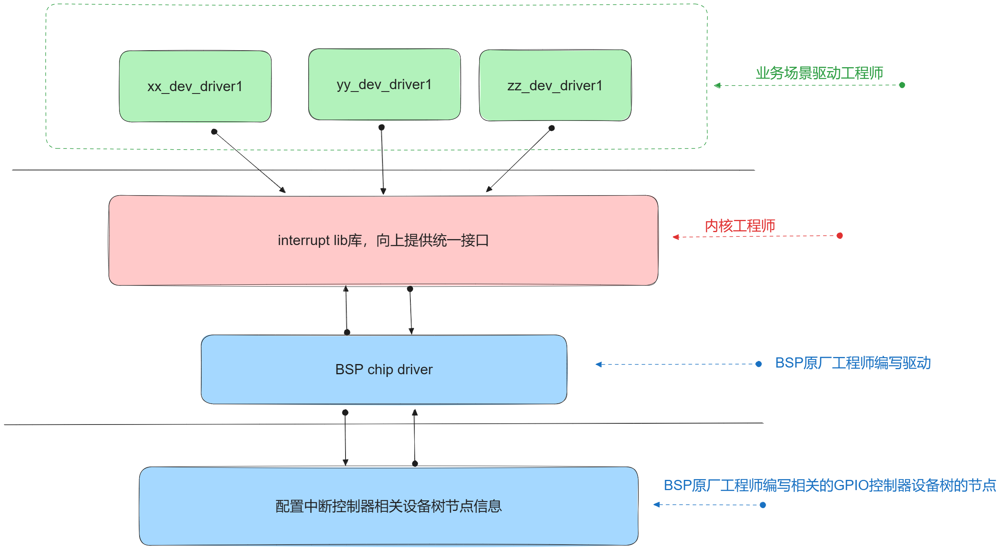
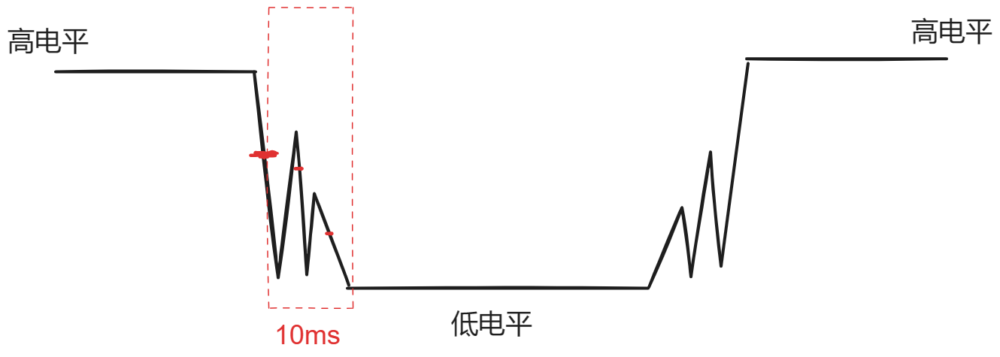
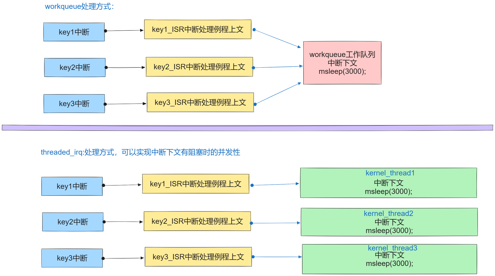
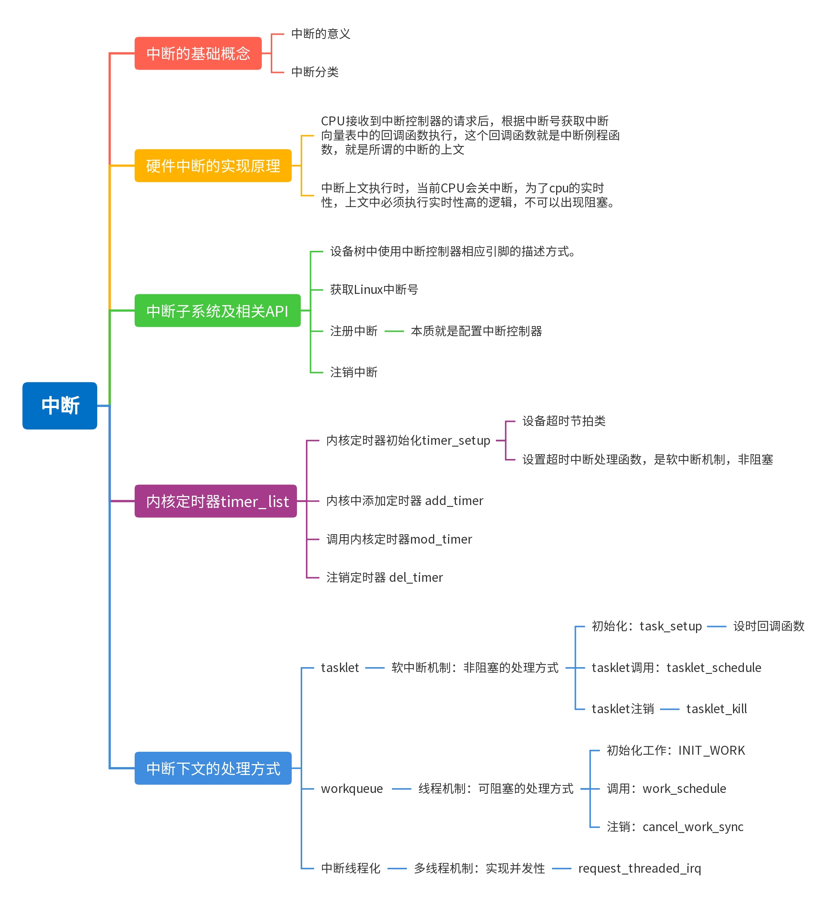

# 第一节、中断概念：

## 1. 什么是中断：

### 1.1为什么要有中断?**🤔**

处理器速度很快，外围设备速度往往不在一个数量级上，如果处理器给硬件发出一个请求，再专门等回应，显然是浪费了cpu的处理其它事务的能力，所以采取当外围硬件处理好自己的事件，再来发请求的时候，处理器再回头处理它。

比如：网卡接收到数据时，可能会因为网络传输的问题，会等待一段时间才能接收到完整的数据，但是cpu不会等网卡设备接收完再来处理的，而是继续执行cpu的任务，当网卡接收完数据之后，网卡给cpu的中断控制器发一个电信号，中断控制器再根据电信号给cpu发出请求，cpu接收中断请求之后，会保存当前执行的任务的上下文，然后去处理这个中断请求对应的处理函数，处理完成之后，再根据之前保存的上下文再次回任务执行处。

这种由硬件当满足一定条件就向中断控制器发出的电信号就是一个中断。

通过以上的中断的方式，可以大大提高cpu的实时处理任务的能力，而非等待或轮询。所以这就是为什么要有中断的原因。

现在操作系统关于中断已经广义的说法了，对于系统而言，为了对进程的调度及状态切换，在系统软件层也实现了不依赖于中断控制器的软件中断，通常是程序通过特定指令（如x86架中的INT汇编指令，ARM架构中SWI汇编指令）主动触发的中断。比如允许用户程序请求操作系统提供服务的系统调用就是软件中断。

所以说中断是系统实现实时性的核心。

那么硬件中断与软件中断有什么区别吗？

## **2.中断的分类： **

### 2.1硬件中断（Hardware Interrupt）

**定义**

**特点**

1. **异步：**不依赖于CPU当前执行的指令，可以在任何时候发生。

1. **高优先级**：通常比普通的程序执行优先级高，能够打断当前执行的指令序列。

1. **响应速度快：**硬件中断的设计目的是为了快速响应外部设备的请求。

**应用场景**

- 当键盘被按下时，生成键盘中断。

- 当网络接口接收到数据包时，生成网络中断。

- 硬盘读取或写入完成时，生成硬盘中断。

**处理过程**

1. 硬件设备发送中断信号给中断控制器，中断控制器分配CPU处理相应的中断任务。

1. CPU暂时停止当前的指令执行，保存当前状态。

1. CPU跳转到对应的中断处理程序（Interrupt Service Routine，ISR）来处理中断。

1. 处理完成后，恢复之前的状态并继续执行被打断的程序。

### 2.2软件中断（Software Interrupt）

**定义**

**特点**

1. **同步：**由程序执行特定指令触发，发生在程序控制之内。

1. **可控性：**程序员可以决定何时触发软件中断。

1. **与硬件无关：**不依赖于外部硬件设备，完全由软件逻辑控制。

**应用场景**

- 用户程序需要操作系统的服务（如文件读写、内存分配等）时，触发软件中断进行系统调用。

- 程序异常处理（如除零错误、非法访问等），通过软件中断处理异常情况。

**处理过程**

1. 程序执行触发中断的指令。

1. CPU响应中断，保存当前状态。

1. CPU跳转到对应的中断处理程序（通常是操作系统提供的系统调用处理程序）。

1. 处理完成后，恢复之前的状态并继续执行程序。

### 2.3对比总结：

- **触发方式：**

- 硬件中断：由外部硬件设备触发。

- 软件中断：由程序指令触发。

- **时机：**

- 硬件中断：异步，可以在任何时候发生。

- 软件中断：同步，在程序执行中主动触发。

- **应用：**

- 硬件中断：响应外部设备的请求。

- 软件中断：实现系统调用和异常处理。

**总结**

**不过软件中断都已经由系统构建好，我们这里主要学习的是硬件中断。**

## **3.其它的分类方式（根据中断号分类）：**


MP157a芯片中断控制器GIC内部框图：




# 第二节、**中断处理实现原理：**

## 1.硬件中断的处理的结构框图：

以按键设备点击一下出现的中断为例：



## 2.硬件中断处理的简化流程：



## 3.**设备树节点中断引脚资源的描述方式，示例按键：**



key1 = PF9,   key2 = PF7, Key3 = PF8

```cpp
//在设备树中的设备节点使用中断资源的方式。
/{
    ...
    mykey{
        compatible = "WX,my_device_key";
        dev_type = "KEY";
        interrupt-parent = <&gpiof>;
        //key1 = PF9,   key2 = PF7, Key3 = PF8
        interrupts = <9 0>,<7 0>,<8 0>;
        status = "okay";
    };
};
```

# 第三节、Linux中断子系统使用：

## 1. 中断子系统框架：



## 2. linux系统中断号：Linux IRQ number:

Linux把中断控制器相关的寄存器进行上层的抽象与封装，实现了上层的统一，屏蔽了硬件的中断控制器的差异，给驱动的编写带来了统一。Linux子系统对于中断资源的描述使用中断号来表示指定的中断资源。中断号是系统唯一的，代表了某个设备某个引脚上的中断的使用。

在linux系统中的中断号是唯一的，也是中断子系统标识中断资源的唯一的方式。linux中断子系统提供的接口会根据相应的中断引脚编号解释出相应的系统中断号。

### **2.1API获取linux中断号的方式：**

#### **1. 如果设备树节点可以转换为platform_device节点的，可以使用platform_get_resource指定中断资源类型IRQRESOURCE即可获得。**

#### **2. 如果不能转换为platform_device节点的设备，也可以使用of_get_irq获得，当然platform_device更可以用：**

```cpp
int of_irq_get(struct device_node *dev, int index);
解析一个节点的IRQ并将其作为Linux IRQ编号返回 
@dev: 指向设备树节点的指针 
@index: IRQ的从零开始的索引 
返回值: * 成功时返回Linux IRQ编号； 
如果IRQ映射失败，则返回0；
如果IRQ域尚未创建，则返回-EPROBE_DEFER；
其他任何失败情况下返回错误代码。 
```

## 常用的解释设备树节点的of操作函数：获取device_node:

```cpp
struct device_node *of_find_node_by_path(const char *path);
//功能：通过是字符串描述的节点路径，返回一个设备节点结构体对象指针。
//成功：找到返回指向结构体对象的指针，没有找到则返回NULL;
```

其它的of操作函数，大家自行百度查找。

## 2.请求Linux中断号资源及指定中断服务例程ISR（中断上文）:request_irq:

```cpp
int __must_check
request_irq(unsigned int irq, irq_handler_t handler, unsigned long flags,
const char *name, void *dev);
函数作用：请求中断并注册中断处理程序的函数，给调用BSP原厂中断控制器的驱动进行相关寄存器进行设置。
函数参数：
1.irq:中断号，是指要请求的Linux中断号。
2.handle:中断处理函数，类型：typedef irqreturn_t (*irq_handler_t)(int irq, void* dev),就是一个函数指针.
回调函数的中的参数irq 即为中断号，参数dev即传递过来的dev最后一个参数。
回调函数返回值是irqreturn_t 是一个枚举类型有三个值：
enum irqreturn{
    IRQ_NONE = 0(0 << 0),
    IRQ_HANDLE = (1 << 0),
    IRQ_WAKE_THREAD = (1 << 1)
};
同文件中还有个宏定义：
#define IRQ_RETVAL(x) ((x) ? IRQ_HANDLED : IRQ_NONE)
所以也可以使用此宏做为返回值。

3.flags:中断标志，就是标记什么情况下发生的中断，Linux中提供了相应的标记:/include/linux/interrupt.h下定义
#define IRQF_TRIGGER_NONE   0x00000000
#define IRQF_TRIGGER_RISING 0x00000001  上升沿
#define IRQF_TRIGGER_FALLING    0x00000002 下降沿
#define IRQF_TRIGGER_HIGH   0x00000004 高电平
#define IRQF_TRIGGER_LOW    0x00000008 低电平
#define IRQF_TRIGGER_MASK   (IRQF_TRIGGER_HIGH | IRQF_TRIGGER_LOW | \
                 IRQF_TRIGGER_RISING | IRQF_TRIGGER_FALLING)
#define IRQF_TRIGGER_PROBE  0x00000010

4.name:中断的名字，在/proc/irq下可以看到，由程序员定义
5.dev:中断发生后调用中断处理函数传递给中断处理函数的参数。如果中断设置标志为共享（IRQF_SHARED）的话，此参数用来区分具体的中断
共享中断只有在释放最后中断处理函数的时候才会被禁止掉，即传递具体那个设备的地址，说明是那个设备发出的中断。
返回值：成功返回0，失败返回非零错误码。
```

因为ISR中断处理例程在执行前系统为关闭当前cpu的中断，所以在ISR执行时，不可以有阻塞的操作。执行实时性比较高的任务，如果任务需要延迟处理，则应该放在中断的下文tasklet或workqueue中执行。

## 3.中断应用：按键中断驱动实例：

```cpp
#include <linux/module.h>
#include <linux/init.h>
#include <linux/platform_device.h>
#include <linux/mod_devicetable.h>
#include <linux/fs.h>
#include <linux/cdev.h>
#include <linux/slab.h>
#include <linux/io.h>

#include <linux/of.h>
#include <linux/of_gpio.h>
#include <linux/gpio.h>
#include <asm-generic/gpio.h>
#include <linux/of_platform.h>
#include <linux/interrupt.h>
#include <linux/of_irq.h>

struct MyLED{
    //向上提供操作接口的cdev
    struct cdev* c_dev;
    //创建设备节点的：
    struct class* class;
    struct device* dev;
    //记录gpio资源的gpio号：
    u32 led1_gpios;
    u32 led2_gpios;
    u32 led3_gpios;
};

//定义一个MyLed设备对象：
struct MyLED myled = {0};

int myled_open(struct inode *inode, struct file *file)
{
    printk("myled_open 执行了\n");
    return 0;
}
ssize_t myled_write(struct file *file, const char *usrbuf, size_t size, loff_t *offset)
{
    char k_buf[32] = {0};
    printk("myled_write 执行了\n");
    copy_from_user(k_buf + *offset, usrbuf, size);

    if(k_buf[0] == '1')
    {
        gpio_set_value(myled.led1_gpios, 1);
    }else if(k_buf[0] == '2')
    {
        gpio_set_value(myled.led2_gpios, 1);
    }else if(k_buf[0] == '3')
    {
        gpio_set_value(myled.led3_gpios, 1);
    }else{
        gpio_set_value(myled.led1_gpios, 0);
        gpio_set_value(myled.led2_gpios, 0);
        gpio_set_value(myled.led3_gpios, 0);
    }
    return size;
}
ssize_t myled_read(struct file *file, char *usrbuf, size_t size, loff_t *offset)
{
    printk("myled_read 执行了\n");
    return size;
}

int myled_close(struct inode *inode, struct file *file)
{
    printk("myled_close 执行了\n");
    return 0;
}

struct file_operations fops = {
    .open = myled_open,
    .read = myled_read,
    .write = myled_write,
    .release = myled_close,
};

struct MyKey
{
    u32 key1_interrupts;
    u8 key1_status;
    u32 key2_interrupts;
    u8 key2_status;
    u32 key3_interrupts;
    u8 key3_status;
};
struct MyKey mykey = {0};
irqreturn_t key_ISR(int irq, void * dev)
{
    if(irq == mykey.key1_interrupts)
    {
        if(!mykey.key1_status)
        {
            //key1按下了：开1灯
            gpio_set_value(myled.led1_gpios, 1);
            mykey.key1_status = !mykey.key1_status;
        }
        else{
            //key1抬起了：关1灯：
            gpio_set_value(myled.led1_gpios, 0);
            mykey.key1_status = !mykey.key1_status;
        }
    }
    if(irq == mykey.key2_interrupts)
    {
        if(!mykey.key2_status)
        {
            //key1按下了：开1灯
            gpio_set_value(myled.led2_gpios, 1);
            mykey.key2_status = !mykey.key2_status;
        }
        else{
            //key1抬起了：关1灯：
            gpio_set_value(myled.led2_gpios, 0);
            mykey.key2_status = !mykey.key2_status;
        }
    }
    if(irq == mykey.key3_interrupts)
    {
        if(!mykey.key3_status)
        {
            //key1按下了：开1灯
            gpio_set_value(myled.led3_gpios, 1);
            mykey.key3_status = !mykey.key3_status;
        }
        else{
            //key1抬起了：关1灯：
            gpio_set_value(myled.led3_gpios, 0);
            mykey.key3_status = !mykey.key3_status;
        }
    }

    return IRQ_HANDLED;
}


int my_dev_driver_probe(struct platform_device *pdev)
{
    struct device_node* key_node;
    printk("my_dev_driver_probe probe函数执行\n");
    //1.对myled对象中的属性进行初始化：
    myled.c_dev = cdev_alloc();
    cdev_init(myled.c_dev,&fops);
    //申请设备号：
    alloc_chrdev_region(&myled.c_dev->dev, 0, 1, "myled");
    //把cdev放在内核管理链表中：
    cdev_add(myled.c_dev,myled.c_dev->dev,1);

    //2.自动创建设备节点：
    myled.class = class_create(THIS_MODULE,"MYLED");
    myled.dev = device_create(myled.class,NULL, myled.c_dev->dev,NULL, pdev->name);
    printk("文件名=%s\n",pdev->name);

    //3.对gpio资源进行初始化：
    myled.led1_gpios = of_get_named_gpio(pdev->dev.of_node,"myled_gpios",0);
    gpio_request(myled.led1_gpios, "led1_gpios");
    gpio_direction_output(myled.led1_gpios,0);
    myled.led2_gpios = of_get_named_gpio(pdev->dev.of_node,"myled_gpios",1);
    gpio_request(myled.led2_gpios, "led2_gpios");
    gpio_direction_output(myled.led2_gpios,0);
    myled.led3_gpios = of_get_named_gpio(pdev->dev.of_node,"myled_gpios",2);
    gpio_request(myled.led3_gpios, "led3_gpios");
    gpio_direction_output(myled.led3_gpios,0);


    //获取key设备树象节点的对象指针：
    key_node = of_find_node_by_path("/mykey");

    //4.获取Key对象的linux中断号：
    mykey.key1_interrupts = of_irq_get(key_node,0);
    mykey.key2_interrupts = of_irq_get(key_node,1);
    mykey.key3_interrupts = of_irq_get(key_node,2);

    //5.请求中断并注册中断处理程序的函数;
    request_irq(mykey.key1_interrupts,key_ISR,IRQF_TRIGGER_RISING | IRQF_TRIGGER_RISING,"key-interrupts",NULL);
    request_irq(mykey.key2_interrupts,key_ISR,IRQF_TRIGGER_RISING | IRQF_TRIGGER_RISING,"key-interrupts",NULL);
    request_irq(mykey.key3_interrupts,key_ISR,IRQF_TRIGGER_RISING | IRQF_TRIGGER_RISING,"key-interrupts",NULL);

    return 0;
}

int my_dev_driver_remove(struct platform_device *pdev)
{
    printk("my_dev_driver_remover函数执行了\n");
    gpio_free(myled.led3_gpios);
    gpio_free(myled.led2_gpios);
    gpio_free(myled.led1_gpios);
    device_destroy(myled.class,myled.c_dev->dev);
    class_destroy(myled.class);
    cdev_del(myled.c_dev);
    unregister_chrdev_region(myled.c_dev->dev,1);
    kfree(myled.c_dev);
    return 0;
}

struct platform_device_id id_table_match[] = {
    [0] = {"WX,my_device_01", 1},
    [1] = {"WX,my_device_02", 2},
    [2] = {/*最后一个一定要给一个空元素，代表结束*/}
};

//设备树匹配方式：
struct of_device_id of_node_match_table[] = {
    [0] = {.compatible = "WX,my_device_01"},
    [1] = {.compatible = "WX,my_device_02"},
    [2] = {/*最后一个一定要给一个空元素，代表结束*/}
};

// 1.定义一个平台驱动对象：
struct platform_driver my_platform_driver = {
    .probe = my_dev_driver_probe,
    .remove = my_dev_driver_remove,
    .driver = {
        .name = "WX,my_device_driver",
        //设备树的匹配方式：
        .of_match_table = of_node_match_table,
    },
    .id_table = id_table_match,
};

// 入口函数：
int __init my_test_module_init(void)
{
    int ret = 0;
    ret = platform_driver_register(&my_platform_driver);
    if (ret < 0)
    {
        return -1;
    }
    return 0;
}

// 出口函数：
void __exit my_test_module_exit(void)
{
    platform_driver_unregister(&my_platform_driver);
}

// 指定许可：
MODULE_LICENSE("GPL");
MODULE_AUTHOR("gaowanxi, email:gaonetcom@163.com");
// 指定入口及出口函数：
module_init(my_test_module_init);
module_exit(my_test_module_exit);
```

## 4.按键按下的抖动问题及解决方法：

由于材料的物理特性及电学特性，当按键按下的瞬间，会短时间出现电平的高低变化，如图所示：



# 第四节、内核定时器timer_list:

## 1. 关于内核定时器的介绍：

**Linux 内核定时器采用系统时钟来实现，与硬件定时器功能一样，当超时时间到了以后设**

**置的定时处理函数就会执行。内核定时器不需要一大堆寄存器的配置工作，并且内核定时器执行完超时处理函数以后就会自动关闭。若需要周期运行，则需要在处理函数中再次打开内核定时器。**

**内核定时器的超时中断处理函数是基于一种软中断实现的，处理过程中不可以出现阻塞操作。**

**Linux 内核使用 timer_list 结构体表示内核定时器， timer_list 定义在文件include/linux/timer.h 中，定义如下：**

### 1. 内核定时器的结构体对象timer_list：

```c
#include <linux/timer.h>
struct timer_list {
	    /*
	     * All fields that change during normal runtime grouped to the
	     * same cacheline
	     */
	    struct hlist_node	entry; //内核链表节点
	    unsigned long		expires;//定时器超时时间。
	    void			(*function)(struct timer_list *); //内核定时器处理函数
	    u32			flags; //一般填写为0;
#ifdef CONFIG_LOCKDEP
	    struct lockdep_map	lockdep_map;
#endif
};
```

## 2.使用内核定时器的API:

### 1. 定时器对象的初始化：

```c
struct timer_list mytimer;
//给定定义时的超时时间：
mytimer.expires = jiffies + x数。（或直接使用内核中的HZ宏来表示内核的频率）

void timer_setup(struct timer_list *timer, void (*callback)(struct timer_list *), unsigned int flags);
*struct timer_list timer: 这是指向要初始化的定时器结构的指针。
void (*callback)(struct timer_list *): 这是定时器到期时要调用的回调函数。该回调函数接受一个指向 struct timer_list 的指针作为参数。
unsigned int flags: 这是初始化定时器时的标志位，目前通常设为 0。
关于jiffies节拍数介绍：
jiffies 的单位是“时钟节拍”（tick），但它所代表的具体时间长度取决于内核配置中的 CONFIG_HZ 值。CONFIG_HZ 定义了一秒内的时钟节拍数，也就是说，每个时钟节拍的时间长度是 1/CONFIG_HZ 秒。
例如：
如果 CONFIG_HZ 是 100，那么每个 jiffies 就是 10 毫秒（ms）。
如果 CONFIG_HZ 是 250，那么每个 jiffies 就是 4 毫秒（ms）。
```

### 2.内核定里器的启动方式：内核定时器执行完超时处理函数以后就会自动关闭。若需要周期运行，则需要在处理函数中使用mod_timer再次打开内核定时器。

```c
//添加定时器到内核定时器链表中
void add_timer(struct timer_list* timer);启动定时器，千万要注意，定时器只能启动一次，多次调用会发生崩溃。
//修改定时器：
int mod_timer(struct timer_list* timer, unsigned long expires);在处理函数中再次启动定时器。
```

### 3.删除定时器，当定时器不再使用时，记得删除定时器：

```c
//从内核中的定时器列表中删除，不再使用此定时器时使用。
int del_timer(struct timer_list* timer);
```

## 3.定时器消抖应用示例：

```cpp
#include <linux/module.h>
#include <linux/init.h>
#include <linux/platform_device.h>
#include <linux/mod_devicetable.h>
#include <linux/fs.h>
#include <linux/cdev.h>
#include <linux/slab.h>
#include <linux/io.h>

#include <linux/of.h>
#include <linux/of_gpio.h>
#include <linux/gpio.h>
#include <asm-generic/gpio.h>
#include <linux/of_platform.h>
#include <linux/interrupt.h>
#include <linux/of_irq.h>
#include <linux/timer.h>
#include <linux/jiffies.h>

struct MyLED{
    //向上提供操作接口的cdev
    struct cdev* c_dev;
    //创建设备节点的：
    struct class* class;
    struct device* dev;
    //记录gpio资源的gpio号：
    u32 led1_gpios;
    u32 led2_gpios;
    u32 led3_gpios;
};

//定义一个MyLed设备对象：
struct MyLED myled = {0};

int myled_open(struct inode *inode, struct file *file)
{
    printk("myled_open 执行了\n");
    return 0;
}
ssize_t myled_write(struct file *file, const char *usrbuf, size_t size, loff_t *offset)
{
    char k_buf[32] = {0};
    printk("myled_write 执行了\n");
    copy_from_user(k_buf + *offset, usrbuf, size);

    if(k_buf[0] == '1')
    {
        gpio_set_value(myled.led1_gpios, 1);
    }else if(k_buf[0] == '2')
    {
        gpio_set_value(myled.led2_gpios, 1);
    }else if(k_buf[0] == '3')
    {
        gpio_set_value(myled.led3_gpios, 1);
    }else{
        gpio_set_value(myled.led1_gpios, 0);
        gpio_set_value(myled.led2_gpios, 0);
        gpio_set_value(myled.led3_gpios, 0);
    }
    return size;
}
ssize_t myled_read(struct file *file, char *usrbuf, size_t size, loff_t *offset)
{
    printk("myled_read 执行了\n");
    return size;
}

int myled_close(struct inode *inode, struct file *file)
{
    printk("myled_close 执行了\n");
    return 0;
}

struct file_operations fops = {
    .open = myled_open,
    .read = myled_read,
    .write = myled_write,
    .release = myled_close,
};

struct MyKey
{
    u32 key1_interrupts;
    u8 key1_gpios;
    u32 key2_interrupts;
    u8 key2_gpios;
    u32 key3_interrupts;
    u8 key3_gpios;
    //添加一个定时器：
    struct timer_list timer;
    //添加一下irq属性：
    volatile u32 irq;
};
struct MyKey mykey = {0};

void timerout_function(struct timer_list * timer)
{
    if(mykey.irq == mykey.key1_interrupts)
    {
        if(gpio_get_value(mykey.key1_gpios) == 0)
        {
            //key1按下了：开1灯
            gpio_set_value(myled.led1_gpios, 1);
        }
        else{
            //key1抬起了：关1灯：
            gpio_set_value(myled.led1_gpios, 0);
        }
    }
    if(mykey.irq == mykey.key2_interrupts)
    {
        if(gpio_get_value(mykey.key2_gpios) == 0)
        {
            //key1按下了：开1灯
            gpio_set_value(myled.led2_gpios, 1);
        }
        else{
            //key1抬起了：关1灯：
            gpio_set_value(myled.led2_gpios, 0);
        }
    }
    if(mykey.irq == mykey.key3_interrupts)
    {
        if(gpio_get_value(mykey.key3_gpios) == 0)
        {
            //key1按下了：开1灯
            gpio_set_value(myled.led3_gpios, 1);
        }
        else{
            //key1抬起了：关1灯：
            gpio_set_value(myled.led3_gpios, 0);
        }
    }
}

irqreturn_t key_ISR(int irq, void * dev)
{
    mykey.irq = irq;

    //启动定时器：
    mod_timer(&mykey.timer,mykey.timer.expires);
    return IRQ_HANDLED;
}


int my_dev_driver_probe(struct platform_device *pdev)
{
    struct device_node* key_node;
    printk("my_dev_driver_probe probe函数执行\n");
    //1.对myled对象中的属性进行初始化：
    myled.c_dev = cdev_alloc();
    cdev_init(myled.c_dev,&fops);
    //申请设备号：
    alloc_chrdev_region(&myled.c_dev->dev, 0, 1, "myled");
    //把cdev放在内核管理链表中：
    cdev_add(myled.c_dev,myled.c_dev->dev,1);

    //2.自动创建设备节点：
    myled.class = class_create(THIS_MODULE,"MYLED");
    myled.dev = device_create(myled.class,NULL, myled.c_dev->dev,NULL, pdev->name);
    printk("文件名=%s\n",pdev->name);

    //3.对gpio资源进行初始化：
    myled.led1_gpios = of_get_named_gpio(pdev->dev.of_node,"myled_gpios",0);
    gpio_request(myled.led1_gpios, "led1_gpios");
    gpio_direction_output(myled.led1_gpios,0);
    myled.led2_gpios = of_get_named_gpio(pdev->dev.of_node,"myled_gpios",1);
    gpio_request(myled.led2_gpios, "led2_gpios");
    gpio_direction_output(myled.led2_gpios,0);
    myled.led3_gpios = of_get_named_gpio(pdev->dev.of_node,"myled_gpios",2);
    gpio_request(myled.led3_gpios, "led3_gpios");
    gpio_direction_output(myled.led3_gpios,0);


    //获取key设备树象节点的对象指针：
    key_node = of_find_node_by_path("/mykey");

    //4.获取Key对象的linux中断号：
    mykey.key1_interrupts = of_irq_get(key_node,0);
    mykey.key1_gpios = of_get_named_gpio(key_node,"mykey_gpios",0);
    gpio_direction_input(mykey.key1_gpios);
    printk("irq = %d\n",mykey.key1_interrupts);
    mykey.key2_interrupts = of_irq_get(key_node,1);
    mykey.key2_gpios = of_get_named_gpio(key_node,"mykey_gpios",1);
    gpio_direction_input(mykey.key2_gpios);
    mykey.key3_interrupts = of_irq_get(key_node,2);
    mykey.key3_gpios = of_get_named_gpio(key_node,"mykey_gpios",2);
    gpio_direction_input(mykey.key3_gpios);

    //5.请求中断并注册中断处理程序的函数;
    request_irq(mykey.key1_interrupts,key_ISR,IRQF_TRIGGER_RISING | IRQF_TRIGGER_RISING,"key-interrupts",NULL);
    request_irq(mykey.key2_interrupts,key_ISR,IRQF_TRIGGER_RISING | IRQF_TRIGGER_RISING,"key-interrupts",NULL);
    request_irq(mykey.key3_interrupts,key_ISR,IRQF_TRIGGER_RISING | IRQF_TRIGGER_RISING,"key-interrupts",NULL);
    

    //6.对定义器进行初始化：
    timer_setup(&mykey.timer,timerout_function,0);
    mykey.timer.expires = jiffies + 10;
    add_timer(&mykey.timer);

    return 0;
}

int my_dev_driver_remove(struct platform_device *pdev)
{
    printk("my_dev_driver_remover函数执行了\n");
    del_timer(&mykey.timer);
    free_irq(mykey.key1_interrupts,NULL);
    free_irq(mykey.key2_interrupts,NULL);
    free_irq(mykey.key3_interrupts,NULL);
    gpio_free(myled.led3_gpios);
    gpio_free(myled.led2_gpios);
    gpio_free(myled.led1_gpios);
    device_destroy(myled.class,myled.c_dev->dev);
    class_destroy(myled.class);
    cdev_del(myled.c_dev);
    unregister_chrdev_region(myled.c_dev->dev,1);
    kfree(myled.c_dev);
    return 0;
}

struct platform_device_id id_table_match[] = {
    [0] = {"WX,my_device_01", 1},
    [1] = {"WX,my_device_02", 2},
    [2] = {/*最后一个一定要给一个空元素，代表结束*/}
};

//设备树匹配方式：
struct of_device_id of_node_match_table[] = {
    [0] = {.compatible = "WX,my_device_01"},
    [1] = {.compatible = "WX,my_device_02"},
    [2] = {/*最后一个一定要给一个空元素，代表结束*/}
};
  
// 1.定义一个平台驱动对象：
struct platform_driver my_platform_driver = {
    .probe = my_dev_driver_probe,
    .remove = my_dev_driver_remove,
    .driver = {
        .name = "WX,my_device_driver",
        //设备树的匹配方式：
        .of_match_table = of_node_match_table,
    },
    .id_table = id_table_match,
};

// 入口函数：
int __init my_test_module_init(void)
{
    int ret = 0;
    ret = platform_driver_register(&my_platform_driver);
    if (ret < 0)
    {
        return -1;
    }
    return 0;
}

// 出口函数：
void __exit my_test_module_exit(void)
{
    platform_driver_unregister(&my_platform_driver);
}

// 指定许可：
MODULE_LICENSE("GPL");
MODULE_AUTHOR("gaowanxi, email:gaonetcom@163.com");
// 指定入口及出口函数：
module_init(my_test_module_init);
module_exit(my_test_module_exit);
```

# 第五节、中断下文:tasklet

**所谓是中断下文就是指，在中断处理例程中不能马上进行处理完成的任务，需要放在中断例程执行结束后，进行延时处理的中断任务就是中断的下文。**

**处理中断下文的方式有：**

**1. 软中断，tasklet     ====>  **

**2.工作队列workqueue,  中断线程化   ====>  工作队列workqueue与中断线程化在处理中断下文时可以处理阻塞的任务**

## 1.tasklet及相关API：

**一种软中断机制, 执行期间其它软中断不可抢占此中断，处理一些简单的延迟任务。进程不可阻塞休眠。往往做为中断下方中需要做简短延时处理任务时使用。**

### 1. 分配tasklet对象：struct tasklet_struct 结构体：

```c
struct tasklet_struct
{
	    struct tasklet_struct *next;//下一个节点的指针
	    unsigned long state;//tasklet的状态标记
	    atomic_t count;//tasklet的引用记数
	    bool use_callback;//是否使用回调callback;
	    union {
		    void (*func)(unsigned long data);//回调func参数data
		    void (*callback)(struct tasklet_struct *t);//回调callback参数为tasklet对象指针。
	    };
	    unsigned long data;//向func回调传递的参数。
};
```

### 2.初始化tasklet对象api：

```c
//旧版本：
void tasklet_init(struct tasklet_struct *t,
void (*func)(unsigned long), unsigned long data);
//新版本：
void tasklet_setup(struct tasklet_struct *t,
void (*callback)(struct tasklet_struct *));
```

以上两个版中，一个旧版使用原func回调，一个新版，使用callback回调。任君选择了。

### 3.调用执行：tasklet_schedule();一般放在顶半部的中断处理函数中。

```c
void tasklet_schedule(struct tasklet_struct *t);
```

### 4.把tasklet对象从tasklet链表中删除：

```c
void tasklet_kill(struct tasklet_struct *t);
```

## 2.tasklet的非阻塞的mdelay消抖应用：

```cpp
#include <linux/module.h>
#include <linux/init.h>
#include <linux/platform_device.h>
#include <linux/mod_devicetable.h>
#include <linux/fs.h>
#include <linux/cdev.h>
#include <linux/slab.h>
#include <linux/io.h>

#include <linux/of.h>
#include <linux/of_gpio.h>
#include <linux/gpio.h>
#include <asm-generic/gpio.h>
#include <linux/of_platform.h>
#include <linux/interrupt.h>
#include <linux/of_irq.h>
#include <linux/timer.h>
#include <linux/jiffies.h>
#include <linux/delay.h>

struct MyLED{
    //向上提供操作接口的cdev
    struct cdev* c_dev;
    //创建设备节点的：
    struct class* class;
    struct device* dev;
    //记录gpio资源的gpio号：
    u32 led1_gpios;
    u32 led2_gpios;
    u32 led3_gpios;

};

//定义一个MyLed设备对象：
struct MyLED myled = {0};

int myled_open(struct inode *inode, struct file *file)
{
    printk("myled_open 执行了\n");
    return 0;
}
ssize_t myled_write(struct file *file, const char *usrbuf, size_t size, loff_t *offset)
{
    char k_buf[32] = {0};
    printk("myled_write 执行了\n");
    copy_from_user(k_buf + *offset, usrbuf, size);

    if(k_buf[0] == '1')
    {
        gpio_set_value(myled.led1_gpios, 1);
    }else if(k_buf[0] == '2')
    {
        gpio_set_value(myled.led2_gpios, 1);
    }else if(k_buf[0] == '3')
    {
        gpio_set_value(myled.led3_gpios, 1);
    }else{
        gpio_set_value(myled.led1_gpios, 0);
        gpio_set_value(myled.led2_gpios, 0);
        gpio_set_value(myled.led3_gpios, 0);
    }
    return size;
}
ssize_t myled_read(struct file *file, char *usrbuf, size_t size, loff_t *offset)
{
    printk("myled_read 执行了\n");
    return size;
}

int myled_close(struct inode *inode, struct file *file)
{
    printk("myled_close 执行了\n");
    return 0;
}

struct file_operations fops = {
    .open = myled_open,
    .read = myled_read,
    .write = myled_write,
    .release = myled_close,
};

struct MyKey
{
    u32 key1_interrupts;
    u8 key1_gpios;
    u32 key2_interrupts;
    u8 key2_gpios;
    u32 key3_interrupts;
    u8 key3_gpios;
    //添加一个tasklet：
    struct tasklet_struct key_tasklet;
    //添加一下irq属性：
    volatile u32 irq;
};
struct MyKey mykey = {0};

void tasklet_function(struct tasklet_struct * task)
{
    mdelay(100);
    if(mykey.irq == mykey.key1_interrupts)
    {
        if(gpio_get_value(mykey.key1_gpios) == 0)
        {
            //key1按下了：开1灯
            gpio_set_value(myled.led1_gpios, 1);
        }
        else{
            //key1抬起了：关1灯：
            gpio_set_value(myled.led1_gpios, 0);
        }
    }
    if(mykey.irq == mykey.key2_interrupts)
    {
        if(gpio_get_value(mykey.key2_gpios) == 0)
        {
            //key1按下了：开1灯
            gpio_set_value(myled.led2_gpios, 1);
        }
        else{
            //key1抬起了：关1灯：
            gpio_set_value(myled.led2_gpios, 0);
        }
    }
    if(mykey.irq == mykey.key3_interrupts)
    {
        if(gpio_get_value(mykey.key3_gpios) == 0)
        {
            //key1按下了：开1灯
            gpio_set_value(myled.led3_gpios, 1);
        }
        else{
            //key1抬起了：关1灯：
            gpio_set_value(myled.led3_gpios, 0);
        }
    }
}

irqreturn_t key_ISR(int irq, void * dev)
{
    mykey.irq = irq;

    //调用tasklet：
    tasklet_schedule(&mykey.key_tasklet);
    return IRQ_HANDLED;
}


int my_dev_driver_probe(struct platform_device *pdev)
{
    struct device_node* key_node;
    printk("my_dev_driver_probe probe函数执行\n");
    //1.对myled对象中的属性进行初始化：
    myled.c_dev = cdev_alloc();
    cdev_init(myled.c_dev,&fops);
    //申请设备号：
    alloc_chrdev_region(&myled.c_dev->dev, 0, 1, "myled");
    //把cdev放在内核管理链表中：
    cdev_add(myled.c_dev,myled.c_dev->dev,1);

    //2.自动创建设备节点：
    myled.class = class_create(THIS_MODULE,"MYLED");
    myled.dev = device_create(myled.class,NULL, myled.c_dev->dev,NULL, pdev->name);
    printk("文件名=%s\n",pdev->name);

    //3.对gpio资源进行初始化：
    myled.led1_gpios = of_get_named_gpio(pdev->dev.of_node,"myled_gpios",0);
    gpio_request(myled.led1_gpios, "led1_gpios");
    gpio_direction_output(myled.led1_gpios,0);
    myled.led2_gpios = of_get_named_gpio(pdev->dev.of_node,"myled_gpios",1);
    gpio_request(myled.led2_gpios, "led2_gpios");
    gpio_direction_output(myled.led2_gpios,0);
    myled.led3_gpios = of_get_named_gpio(pdev->dev.of_node,"myled_gpios",2);
    gpio_request(myled.led3_gpios, "led3_gpios");
    gpio_direction_output(myled.led3_gpios,0);


    //获取key设备树象节点的对象指针：
    key_node = of_find_node_by_path("/mykey");

    //4.获取Key对象的linux中断号：
    mykey.key1_interrupts = of_irq_get(key_node,0);
    mykey.key1_gpios = of_get_named_gpio(key_node,"mykey_gpios",0);
    gpio_direction_input(mykey.key1_gpios);
    printk("irq = %d\n",mykey.key1_interrupts);
    printk("gpio = %d\n",mykey.key1_gpios);
    mykey.key2_interrupts = of_irq_get(key_node,1);
    mykey.key2_gpios = of_get_named_gpio(key_node,"mykey_gpios",1);
    gpio_direction_input(mykey.key2_gpios);
    mykey.key3_interrupts = of_irq_get(key_node,2);
    mykey.key3_gpios = of_get_named_gpio(key_node,"mykey_gpios",2);
    gpio_direction_input(mykey.key3_gpios);

    //5.请求中断并注册中断处理程序的函数;
    request_irq(mykey.key1_interrupts,key_ISR,IRQF_TRIGGER_RISING | IRQF_TRIGGER_RISING,"key-interrupts",NULL);
    request_irq(mykey.key2_interrupts,key_ISR,IRQF_TRIGGER_RISING | IRQF_TRIGGER_RISING,"key-interrupts",NULL);
    request_irq(mykey.key3_interrupts,key_ISR,IRQF_TRIGGER_RISING | IRQF_TRIGGER_RISING,"key-interrupts",NULL);
    

    //6.对tasklet进行初始化：
    tasklet_setup(&mykey.key_tasklet,tasklet_function);

    return 0;
}

int my_dev_driver_remove(struct platform_device *pdev)
{
    printk("my_dev_driver_remover函数执行了\n");
    tasklet_kill(&mykey.key_tasklet);
    free_irq(mykey.key1_interrupts,NULL);
    free_irq(mykey.key2_interrupts,NULL);
    free_irq(mykey.key3_interrupts,NULL);
    gpio_free(myled.led3_gpios);
    gpio_free(myled.led2_gpios);
    gpio_free(myled.led1_gpios);
    device_destroy(myled.class,myled.c_dev->dev);
    class_destroy(myled.class);
    cdev_del(myled.c_dev);
    unregister_chrdev_region(myled.c_dev->dev,1);
    kfree(myled.c_dev);
    return 0;
}

struct platform_device_id id_table_match[] = {
    [0] = {"WX,my_device_01", 1},
    [1] = {"WX,my_device_02", 2},
    [2] = {/*最后一个一定要给一个空元素，代表结束*/}
};

//设备树匹配方式：
struct of_device_id of_node_match_table[] = {
    [0] = {.compatible = "WX,my_device_01"},
    [1] = {.compatible = "WX,my_device_02"},
    [2] = {/*最后一个一定要给一个空元素，代表结束*/}
};

// 1.定义一个平台驱动对象：
struct platform_driver my_platform_driver = {
    .probe = my_dev_driver_probe,
    .remove = my_dev_driver_remove,
    .driver = {
        .name = "WX,my_device_driver",
        //设备树的匹配方式：
        .of_match_table = of_node_match_table,
    },
    .id_table = id_table_match,
};

// 入口函数：
int __init my_test_module_init(void)
{
    int ret = 0;
    ret = platform_driver_register(&my_platform_driver);
    if (ret < 0)
    {
        return -1;
    }
    return 0;
}

// 出口函数：
void __exit my_test_module_exit(void)
{
    platform_driver_unregister(&my_platform_driver);
}

// 指定许可：
MODULE_LICENSE("GPL");
MODULE_AUTHOR("gaowanxi, email:gaonetcom@163.com");
// 指定入口及出口函数：
module_init(my_test_module_init);
module_exit(my_test_module_exit);
```

# 第六节、中断下文：工作队列workqueue

**一种work内核线程机制，执行更复杂的延迟处理的任务。进程可休眠。**

## 1.workqueue工作队列相关的API介绍：

### 1.创建工作：可以创建一个新的工作，但大多数情况下，使用系统提供的默认工作队列即可。

```cpp
#include <linux/workqueue.h>
struct work_struct {
    /*	atomic_long_t data; */
	    unsigned long data;
	    struct list_head entry;
	    work_func_t func; //回调的队列的处理函数
        //typedef void (*work_func_t)(struct work_struct *work);//回调函数类型
#ifdef CONFIG_LOCKDEP
	    struct lockdep_map lockdep_map;
#endif
};

```

### 2.初始化工作（struct work_struct）：定义一个工作结构，并指定其执行的函数。

```cpp
创建工作work的宏：_work是一个指针
使用INIT_WORK(_work,_func)来进行初始化。
```

### 3.提交工作：将工作提交到工作队列，以便稍后执行。

```cpp
bool schedule_work(struct work_struct *work);
返回值：成功将工作添加到默认队列中，返回true,失败返回false.
```

### 4.取消工作：在某些情况下，可以取消已经提交但尚未执行的工作。

```cpp
//延时卸载：
void cancel_work_sync(struct work_struct *work);
如果卸载模块时，万一有工作队列中任务还没有执行结束，使用此方法，可以等待任务执行结束后再卸载。

void destroy_workqueue(struct workqueue_struct *wq);
//消毁当前工作队列。一般会先取消工作，再销毁队列，如果手动申请了指定的工作队列。
```

## 2.workqueue的阻塞的msleep消抖应用：

```cpp
#include <linux/module.h>
#include <linux/init.h>
#include <linux/platform_device.h>
#include <linux/mod_devicetable.h>
#include <linux/fs.h>
#include <linux/cdev.h>
#include <linux/slab.h>
#include <linux/io.h>

#include <linux/of.h>
#include <linux/of_gpio.h>
#include <linux/gpio.h>
#include <asm-generic/gpio.h>
#include <linux/of_platform.h>
#include <linux/interrupt.h>
#include <linux/of_irq.h>
#include <linux/timer.h>
#include <linux/jiffies.h>
#include <linux/delay.h>
#include <linux/workqueue.h>

struct MyLED{
    //向上提供操作接口的cdev
    struct cdev* c_dev;
    //创建设备节点的：
    struct class* class;
    struct device* dev;
    //记录gpio资源的gpio号：
    u32 led1_gpios;
    u32 led2_gpios;
    u32 led3_gpios;

};

//定义一个MyLed设备对象：
struct MyLED myled = {0};

int myled_open(struct inode *inode, struct file *file)
{
    printk("myled_open 执行了\n");
    return 0;
}
ssize_t myled_write(struct file *file, const char *usrbuf, size_t size, loff_t *offset)
{
    char k_buf[32] = {0};
    printk("myled_write 执行了\n");
    copy_from_user(k_buf + *offset, usrbuf, size);

    if(k_buf[0] == '1')
    {
        gpio_set_value(myled.led1_gpios, 1);
    }else if(k_buf[0] == '2')
    {
        gpio_set_value(myled.led2_gpios, 1);
    }else if(k_buf[0] == '3')
    {
        gpio_set_value(myled.led3_gpios, 1);
    }else{
        gpio_set_value(myled.led1_gpios, 0);
        gpio_set_value(myled.led2_gpios, 0);
        gpio_set_value(myled.led3_gpios, 0);
    }
    return size;
}
ssize_t myled_read(struct file *file, char *usrbuf, size_t size, loff_t *offset)
{
    printk("myled_read 执行了\n");
    return size;
}

int myled_close(struct inode *inode, struct file *file)
{
    printk("myled_close 执行了\n");
    return 0;
}

struct file_operations fops = {
    .open = myled_open,
    .read = myled_read,
    .write = myled_write,
    .release = myled_close,
};

struct MyKey
{
    u32 key1_interrupts;
    u8 key1_gpios;
    u32 key2_interrupts;
    u8 key2_gpios;
    u32 key3_interrupts;
    u8 key3_gpios;
    //添加一个工作队列：workqueue：
    struct work_struct work;
    //添加一下irq属性：
    volatile u32 irq;
};
struct MyKey mykey = {0};

 void work_functions(struct work_struct *work)
{
    //mdelay(100);
    //阻塞式延时函数：
    msleep(50);
    if(mykey.irq == mykey.key1_interrupts)
    {
        if(gpio_get_value(mykey.key1_gpios) == 0)
        {
            //key1按下了：开1灯
            gpio_set_value(myled.led1_gpios, 1);
        }
        else{
            //key1抬起了：关1灯：
            gpio_set_value(myled.led1_gpios, 0);
        }
    }
    if(mykey.irq == mykey.key2_interrupts)
    {
        if(gpio_get_value(mykey.key2_gpios) == 0)
        {
            //key1按下了：开1灯
            gpio_set_value(myled.led2_gpios, 1);
        }
        else{
            //key1抬起了：关1灯：
            gpio_set_value(myled.led2_gpios, 0);
        }
    }
    if(mykey.irq == mykey.key3_interrupts)
    {
        if(gpio_get_value(mykey.key3_gpios) == 0)
        {
            //key1按下了：开1灯
            gpio_set_value(myled.led3_gpios, 1);
        }
        else{
            //key1抬起了：关1灯：
            gpio_set_value(myled.led3_gpios, 0);
        }
    }
}

irqreturn_t key_ISR(int irq, void * dev)
{
    mykey.irq = irq;

    //调用工作work：
    schedule_work(&mykey.work);
    return IRQ_HANDLED;
}


int my_dev_driver_probe(struct platform_device *pdev)
{
    struct device_node* key_node;
    printk("my_dev_driver_probe probe函数执行\n");
    //1.对myled对象中的属性进行初始化：
    myled.c_dev = cdev_alloc();
    cdev_init(myled.c_dev,&fops);
    //申请设备号：
    alloc_chrdev_region(&myled.c_dev->dev, 0, 1, "myled");
    //把cdev放在内核管理链表中：
    cdev_add(myled.c_dev,myled.c_dev->dev,1);

    //2.自动创建设备节点：
    myled.class = class_create(THIS_MODULE,"MYLED");
    myled.dev = device_create(myled.class,NULL, myled.c_dev->dev,NULL, pdev->name);
    printk("文件名=%s\n",pdev->name);

    //3.对gpio资源进行初始化：
    myled.led1_gpios = of_get_named_gpio(pdev->dev.of_node,"myled_gpios",0);
    gpio_request(myled.led1_gpios, "led1_gpios");
    gpio_direction_output(myled.led1_gpios,0);
    myled.led2_gpios = of_get_named_gpio(pdev->dev.of_node,"myled_gpios",1);
    gpio_request(myled.led2_gpios, "led2_gpios");
    gpio_direction_output(myled.led2_gpios,0);
    myled.led3_gpios = of_get_named_gpio(pdev->dev.of_node,"myled_gpios",2);
    gpio_request(myled.led3_gpios, "led3_gpios");
    gpio_direction_output(myled.led3_gpios,0);


    //获取key设备树象节点的对象指针：
    key_node = of_find_node_by_path("/mykey");

    //4.获取Key对象的linux中断号：
    mykey.key1_interrupts = of_irq_get(key_node,0);
    mykey.key1_gpios = of_get_named_gpio(key_node,"mykey_gpios",0);
    gpio_direction_input(mykey.key1_gpios);
    printk("irq = %d\n",mykey.key1_interrupts);
    printk("gpio = %d\n",mykey.key1_gpios);
    mykey.key2_interrupts = of_irq_get(key_node,1);
    mykey.key2_gpios = of_get_named_gpio(key_node,"mykey_gpios",1);
    gpio_direction_input(mykey.key2_gpios);
    mykey.key3_interrupts = of_irq_get(key_node,2);
    mykey.key3_gpios = of_get_named_gpio(key_node,"mykey_gpios",2);
    gpio_direction_input(mykey.key3_gpios);

    //5.请求中断并注册中断处理程序的函数;
    request_irq(mykey.key1_interrupts,key_ISR,IRQF_TRIGGER_RISING | IRQF_TRIGGER_RISING,"key-interrupts",NULL);
    request_irq(mykey.key2_interrupts,key_ISR,IRQF_TRIGGER_RISING | IRQF_TRIGGER_RISING,"key-interrupts",NULL);
    request_irq(mykey.key3_interrupts,key_ISR,IRQF_TRIGGER_RISING | IRQF_TRIGGER_RISING,"key-interrupts",NULL);
    

    //6.对工作进行初始化：
    INIT_WORK(&mykey.work, work_functions);

    return 0;
}

int my_dev_driver_remove(struct platform_device *pdev)
{
    printk("my_dev_driver_remover函数执行了\n");
    //tasklet_kill(&mykey.key_tasklet);
    //取消当前工作
    cancel_work_sync(&mykey.work);
    free_irq(mykey.key1_interrupts,NULL);
    free_irq(mykey.key2_interrupts,NULL);
    free_irq(mykey.key3_interrupts,NULL);
    gpio_free(myled.led3_gpios);
    gpio_free(myled.led2_gpios);
    gpio_free(myled.led1_gpios);
    device_destroy(myled.class,myled.c_dev->dev);
    class_destroy(myled.class);
    cdev_del(myled.c_dev);
    unregister_chrdev_region(myled.c_dev->dev,1);
    kfree(myled.c_dev);
    return 0;
}

struct platform_device_id id_table_match[] = {
    [0] = {"WX,my_device_01", 1},
    [1] = {"WX,my_device_02", 2},
    [2] = {/*最后一个一定要给一个空元素，代表结束*/}
};

//设备树匹配方式：
struct of_device_id of_node_match_table[] = {
    [0] = {.compatible = "WX,my_device_01"},
    [1] = {.compatible = "WX,my_device_02"},
    [2] = {/*最后一个一定要给一个空元素，代表结束*/}
};

// 1.定义一个平台驱动对象：
struct platform_driver my_platform_driver = {
    .probe = my_dev_driver_probe,
    .remove = my_dev_driver_remove,
    .driver = {
        .name = "WX,my_device_driver",
        //设备树的匹配方式：
        .of_match_table = of_node_match_table,
    },
    .id_table = id_table_match,
};

// 入口函数：
int __init my_test_module_init(void)
{
    int ret = 0;
    ret = platform_driver_register(&my_platform_driver);
    if (ret < 0)
    {
        return -1;
    }
    return 0;
}

// 出口函数：
void __exit my_test_module_exit(void)
{
    platform_driver_unregister(&my_platform_driver);
}

// 指定许可：
MODULE_LICENSE("GPL");
MODULE_AUTHOR("gaowanxi, email:gaonetcom@163.com");
// 指定入口及出口函数：
module_init(my_test_module_init);
module_exit(my_test_module_exit);
```

# 第七节、中断下文：中断线程化**request_threaded_irq函数的使用：**

**抛出一个问题：**



## 1. **中断线程化request_threaded_irq函数介绍：**

```cpp
int request_threaded_irq(unsigned int irq, irq_handler_t handler,
			 irq_handler_t thread_fn, unsigned long irqflags,
			 const char *devname, void *dev_id)
功能：在多个内核线程中执行相应的中断下文下执行。可以阻塞的操作。
成功：返回0，失败返回错误码
```

**条件：需要在顶半部处理程序中通知内核该中断应由线程化处理程序处理，在顶半部返回**

**为每一个中断处理创建一个独立的内核线程执行。对于多核CPU上的处理中断更加高效，更有意义。可以有阻塞操作。**

## 2.中线线程化阻塞msleep消抖实验示例：

```cpp
#include <linux/module.h>
#include <linux/init.h>
#include <linux/platform_device.h>
#include <linux/mod_devicetable.h>
#include <linux/fs.h>
#include <linux/cdev.h>
#include <linux/slab.h>
#include <linux/io.h>

#include <linux/of.h>
#include <linux/of_gpio.h>
#include <linux/gpio.h>
#include <asm-generic/gpio.h>
#include <linux/of_platform.h>
#include <linux/interrupt.h>
#include <linux/of_irq.h>
#include <linux/timer.h>
#include <linux/jiffies.h>
#include <linux/delay.h>
#include <linux/workqueue.h>

struct MyLED{
    //向上提供操作接口的cdev
    struct cdev* c_dev;
    //创建设备节点的：
    struct class* class;
    struct device* dev;
    //记录gpio资源的gpio号：
    u32 led1_gpios;
    u32 led2_gpios;
    u32 led3_gpios;

};

//定义一个MyLed设备对象：
struct MyLED myled = {0};

int myled_open(struct inode *inode, struct file *file)
{
    printk("myled_open 执行了\n");
    return 0;
}
ssize_t myled_write(struct file *file, const char *usrbuf, size_t size, loff_t *offset)
{
    char k_buf[32] = {0};
    printk("myled_write 执行了\n");
    copy_from_user(k_buf + *offset, usrbuf, size);

    if(k_buf[0] == '1')
    {
        gpio_set_value(myled.led1_gpios, 1);
    }else if(k_buf[0] == '2')
    {
        gpio_set_value(myled.led2_gpios, 1);
    }else if(k_buf[0] == '3')
    {
        gpio_set_value(myled.led3_gpios, 1);
    }else{
        gpio_set_value(myled.led1_gpios, 0);
        gpio_set_value(myled.led2_gpios, 0);
        gpio_set_value(myled.led3_gpios, 0);
    }
    return size;
}
ssize_t myled_read(struct file *file, char *usrbuf, size_t size, loff_t *offset)
{
    printk("myled_read 执行了\n");
    return size;
}

int myled_close(struct inode *inode, struct file *file)
{
    printk("myled_close 执行了\n");
    return 0;
}

struct file_operations fops = {
    .open = myled_open,
    .read = myled_read,
    .write = myled_write,
    .release = myled_close,
};

struct MyKey
{
    u32 key1_interrupts;
    u8 key1_gpios;
    u32 key2_interrupts;
    u8 key2_gpios;
    u32 key3_interrupts;
    u8 key3_gpios;
    //添加一下irq属性：
    volatile u32 irq;
};
struct MyKey mykey = {0};

irqreturn_t threaded_irq_functions(int irq, void *dev)
{
    //mdelay(100);
    //阻塞式延时函数：
    msleep(50);
    if(mykey.irq == mykey.key1_interrupts)
    {
        if(gpio_get_value(mykey.key1_gpios) == 0)
        {
            //key1按下了：开1灯
            gpio_set_value(myled.led1_gpios, 1);
        }
        else{
            //key1抬起了：关1灯：
            gpio_set_value(myled.led1_gpios, 0);
        }
    }
    if(mykey.irq == mykey.key2_interrupts)
    {
        if(gpio_get_value(mykey.key2_gpios) == 0)
        {
            //key1按下了：开1灯
            gpio_set_value(myled.led2_gpios, 1);
        }
        else{
            //key1抬起了：关1灯：
            gpio_set_value(myled.led2_gpios, 0);
        }
    }
    if(mykey.irq == mykey.key3_interrupts)
    {
        if(gpio_get_value(mykey.key3_gpios) == 0)
        {
            //key1按下了：开1灯
            gpio_set_value(myled.led3_gpios, 1);
        }
        else{
            //key1抬起了：关1灯：
            gpio_set_value(myled.led3_gpios, 0);
        }
    }
    return IRQ_HANDLED;
}

irqreturn_t key_ISR(int irq, void * dev)
{
    mykey.irq = irq;
    return IRQ_WAKE_THREAD;
}


int my_dev_driver_probe(struct platform_device *pdev)
{
    struct device_node* key_node;
    printk("my_dev_driver_probe probe函数执行\n");
    //1.对myled对象中的属性进行初始化：
    myled.c_dev = cdev_alloc();
    cdev_init(myled.c_dev,&fops);
    //申请设备号：
    alloc_chrdev_region(&myled.c_dev->dev, 0, 1, "myled");
    //把cdev放在内核管理链表中：
    cdev_add(myled.c_dev,myled.c_dev->dev,1);

    //2.自动创建设备节点：
    myled.class = class_create(THIS_MODULE,"MYLED");
    myled.dev = device_create(myled.class,NULL, myled.c_dev->dev,NULL, pdev->name);
    printk("文件名=%s\n",pdev->name);

    //3.对gpio资源进行初始化：
    myled.led1_gpios = of_get_named_gpio(pdev->dev.of_node,"myled_gpios",0);
    gpio_request(myled.led1_gpios, "led1_gpios");
    gpio_direction_output(myled.led1_gpios,0);
    myled.led2_gpios = of_get_named_gpio(pdev->dev.of_node,"myled_gpios",1);
    gpio_request(myled.led2_gpios, "led2_gpios");
    gpio_direction_output(myled.led2_gpios,0);
    myled.led3_gpios = of_get_named_gpio(pdev->dev.of_node,"myled_gpios",2);
    gpio_request(myled.led3_gpios, "led3_gpios");
    gpio_direction_output(myled.led3_gpios,0);


    //获取key设备树象节点的对象指针：
    key_node = of_find_node_by_path("/mykey");

    //4.获取Key对象的linux中断号：
    mykey.key1_interrupts = of_irq_get(key_node,0);
    mykey.key1_gpios = of_get_named_gpio(key_node,"mykey_gpios",0);
    gpio_direction_input(mykey.key1_gpios);
    printk("irq = %d\n",mykey.key1_interrupts);
    printk("gpio = %d\n",mykey.key1_gpios);
    mykey.key2_interrupts = of_irq_get(key_node,1);
    mykey.key2_gpios = of_get_named_gpio(key_node,"mykey_gpios",1);
    gpio_direction_input(mykey.key2_gpios);
    mykey.key3_interrupts = of_irq_get(key_node,2);
    mykey.key3_gpios = of_get_named_gpio(key_node,"mykey_gpios",2);
    gpio_direction_input(mykey.key3_gpios);

    //5.请求中断并注册中断处理程序的函数;
    request_threaded_irq(mykey.key1_interrupts,key_ISR,threaded_irq_functions,IRQF_TRIGGER_RISING | IRQF_TRIGGER_RISING,"key1-interrupts",NULL);
    request_threaded_irq(mykey.key2_interrupts,key_ISR,threaded_irq_functions,IRQF_TRIGGER_RISING | IRQF_TRIGGER_RISING,"key2-interrupts",NULL);
    request_threaded_irq(mykey.key3_interrupts,key_ISR,threaded_irq_functions,IRQF_TRIGGER_RISING | IRQF_TRIGGER_RISING,"key3-interrupts",NULL);
    //....


    return 0;
}

int my_dev_driver_remove(struct platform_device *pdev)
{
    printk("my_dev_driver_remover函数执行了\n");
    free_irq(mykey.key1_interrupts,NULL);
    free_irq(mykey.key2_interrupts,NULL);
    free_irq(mykey.key3_interrupts,NULL);
    gpio_free(myled.led3_gpios);
    gpio_free(myled.led2_gpios);
    gpio_free(myled.led1_gpios);
    device_destroy(myled.class,myled.c_dev->dev);
    class_destroy(myled.class);
    cdev_del(myled.c_dev);
    unregister_chrdev_region(myled.c_dev->dev,1);
    kfree(myled.c_dev);
    return 0;
}

struct platform_device_id id_table_match[] = {
    [0] = {"WX,my_device_01", 1},
    [1] = {"WX,my_device_02", 2},
    [2] = {/*最后一个一定要给一个空元素，代表结束*/}
};

//设备树匹配方式：
struct of_device_id of_node_match_table[] = {
    [0] = {.compatible = "WX,my_device_01"},
    [1] = {.compatible = "WX,my_device_02"},
    [2] = {/*最后一个一定要给一个空元素，代表结束*/}
};

// 1.定义一个平台驱动对象：
struct platform_driver my_platform_driver = {
    .probe = my_dev_driver_probe,
    .remove = my_dev_driver_remove,
    .driver = {
        .name = "WX,my_device_driver",
        //设备树的匹配方式：
        .of_match_table = of_node_match_table,
    },
    .id_table = id_table_match,
};

// 入口函数：
int __init my_test_module_init(void)
{
    int ret = 0;
    ret = platform_driver_register(&my_platform_driver);
    if (ret < 0)
    {
        return -1;
    }
    return 0;
}

// 出口函数：
void __exit my_test_module_exit(void)
{
    platform_driver_unregister(&my_platform_driver);
}

// 指定许可：
MODULE_LICENSE("GPL");
MODULE_AUTHOR("gaowanxi, email:gaonetcom@163.com");
// 指定入口及出口函数：
module_init(my_test_module_init);
module_exit(my_test_module_exit);
```

# 第八节：本章总结：     

