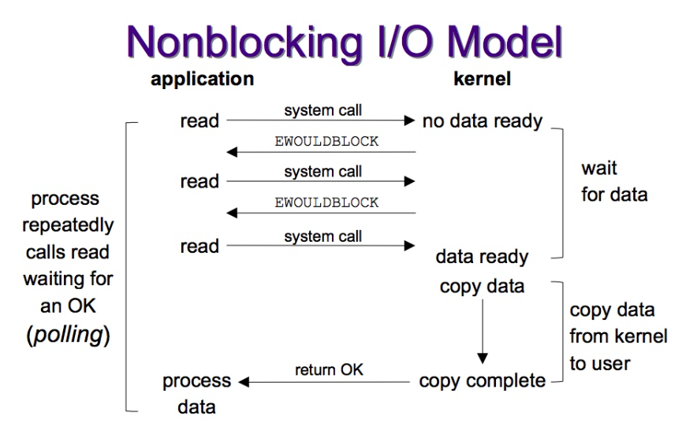
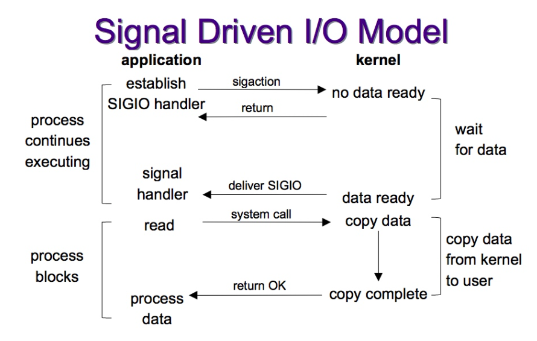
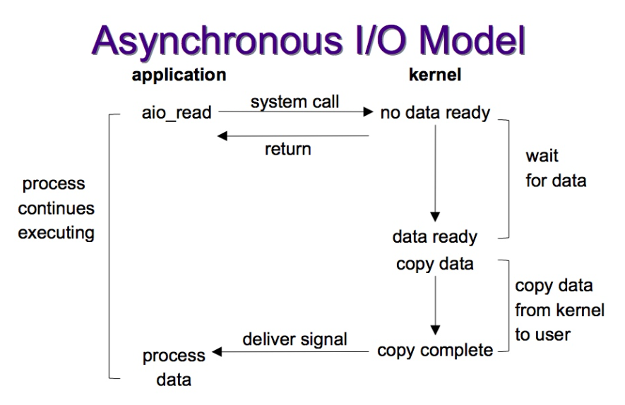
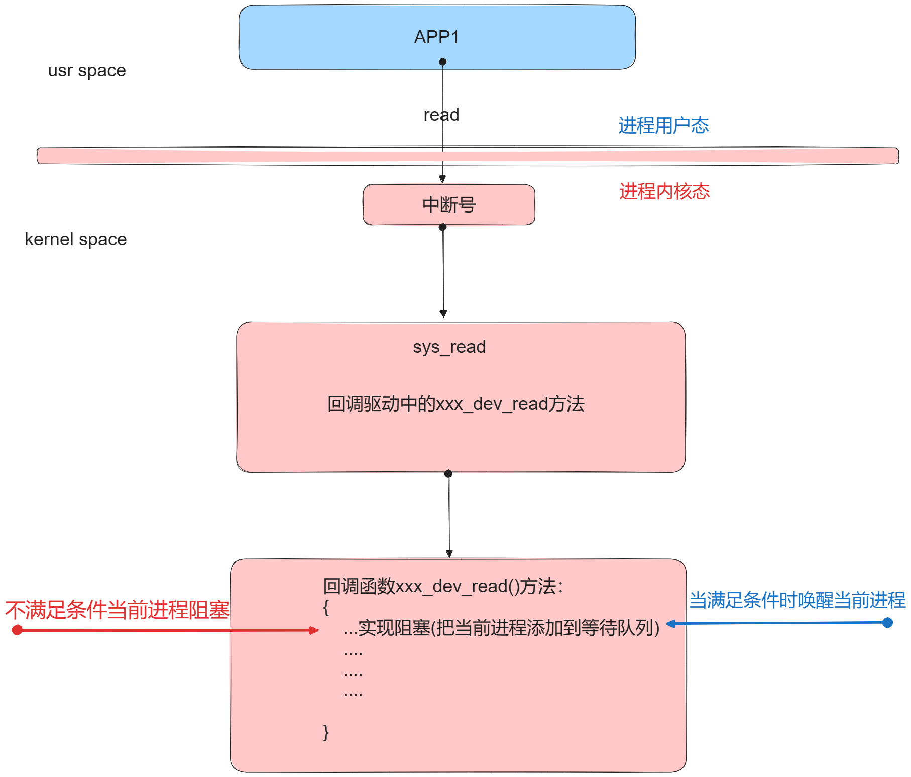
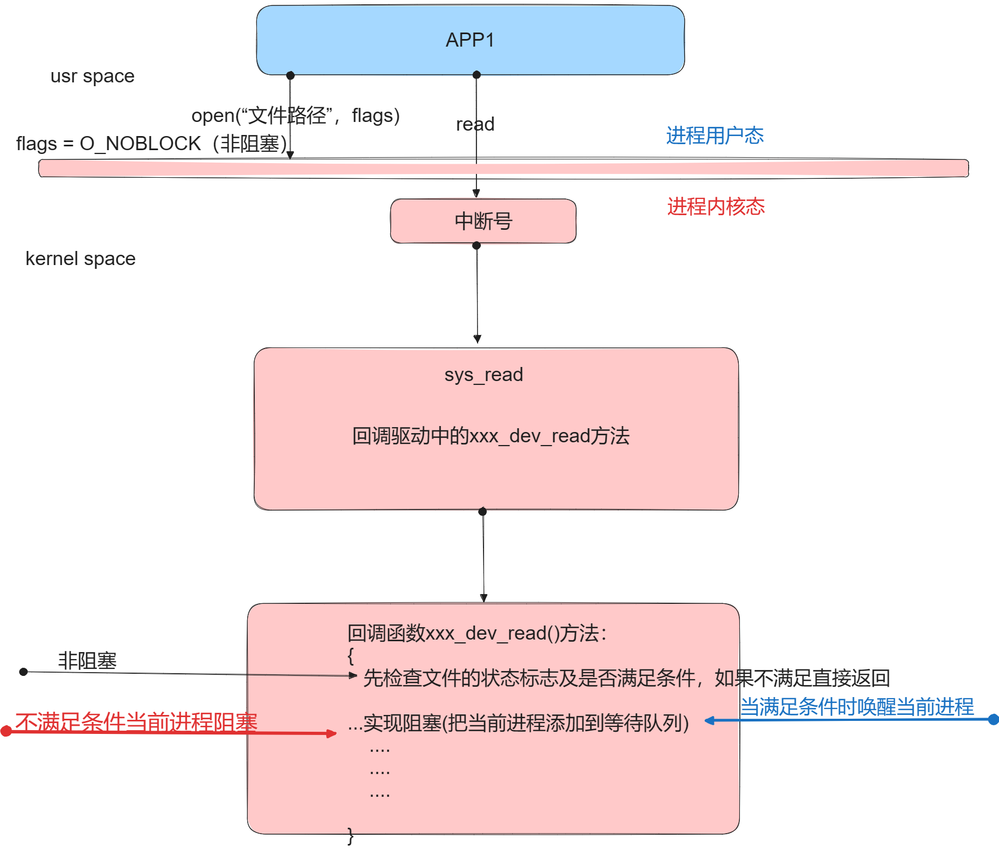
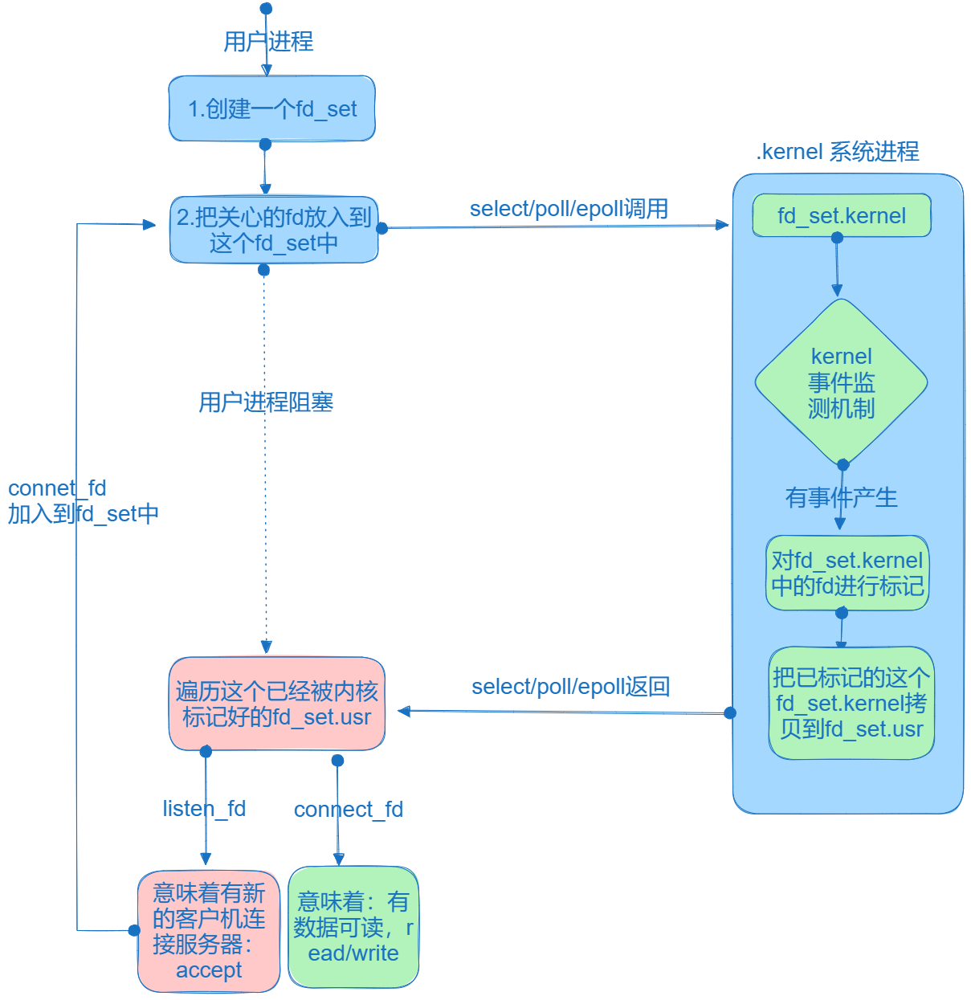
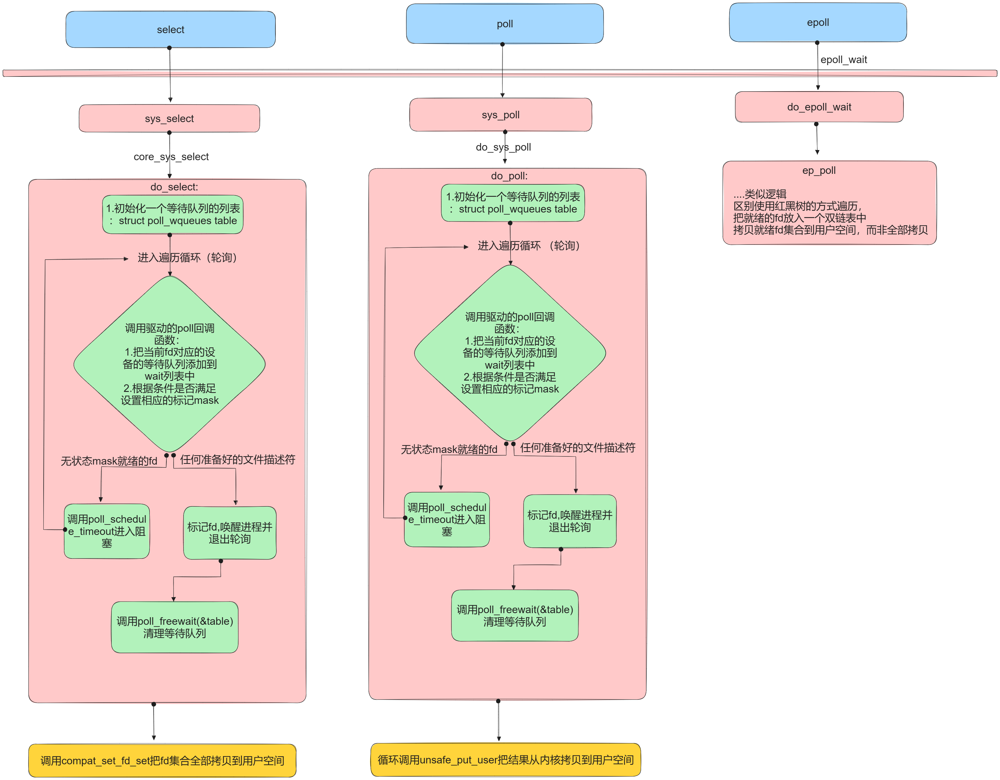
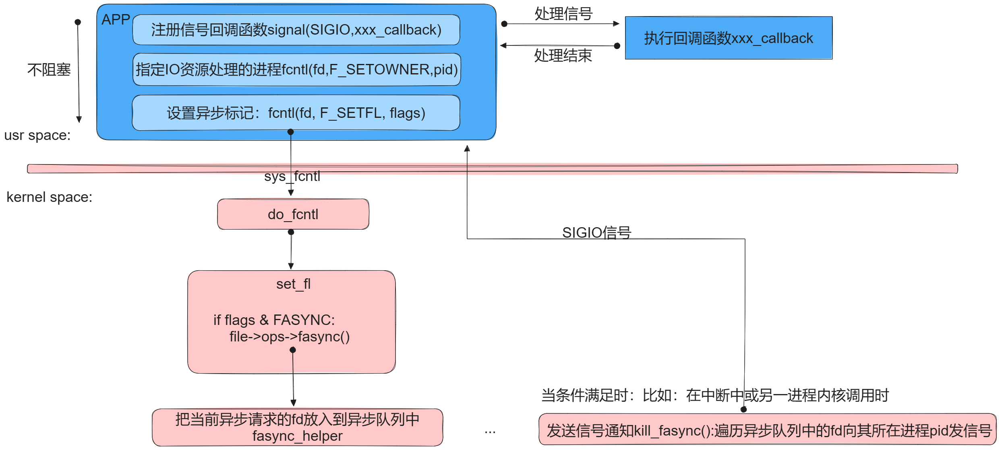
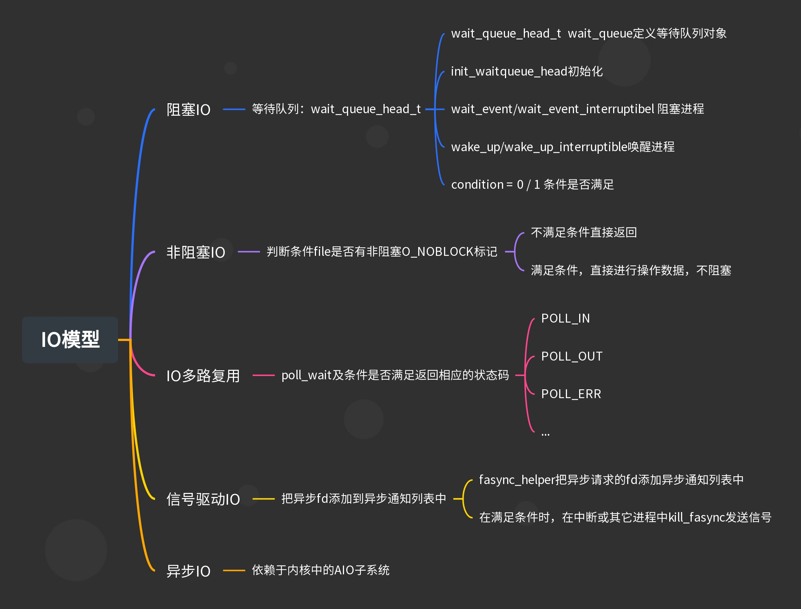

# 第一节、Linux中处理IO请求的模型概述：

## 1. 为什么 Linux 要抽象出不同的 I/O 模型？🤔

Linux 需要处理各种类型的应用需求，从高吞吐量的文件传输📦到低延迟的网络服务🌍。不同的 I/O 模型能够在特定场景下提供最优的性能和资源使用效率。

## 2. Linux 的五种 I/O 模型   

### 2.1. 阻塞 I/O（Blocking I/O）

- 特点：应用程序发起 I/O 操作后会被阻塞，直到数据准备就绪并被复制到应用程序的缓冲区中，此期间应用程序无法执行其他任务🚦。

- 底层原理：依赖内核来管理数据的准备和传输🔧。

- 优势：编程模型简单直接，不消耗CPU资📚。

- 劣势：应用程序的执行流程被阻塞，**无法实现并发，无法并发处理其他任务**🚫。

- 适用场景：简单的文件读写操作，不要求高并发的应用📖。


### 2.2. 非阻塞 I/O（Non-blocking I/O）

- 特点：应用程序在发起 I/O 操作后不会被阻塞，即使数据未准备就绪，也会立即返回，应用程序可以继续执行其他任务🏃‍♂️。

- 底层原理：应用程序每次发起调用，底层都要检查 I/O 操作的状态🔄。

- 优势：应用程序不会因 I/O 操作而阻塞，提高了应用的响应性✨。

- 劣势：**应用程序需要不断轮询 I/O 状态**，**虽可以实现并发但增加 CPU 负载**🔋。

- 适用场景：需要提高程序响应性的场景，适合处理多个 I/O 操作🚀。



### 2.3. I/O 多路复用（I/O Multiplexing）

- 特点：允许单个进程监视多个 I/O 流的状态变化（如 select、poll、epoll）🔭。

- 底层原理：通过一组 API 来监控多个 I/O 端点，当某个 I/O 端点准备就绪时，应用程序会得到通知📡。

- 优势：**单个进程可以高效处理多个并发 I/O 操作，实现了大规模并发性**🌐。

- 劣势：编程复杂度较高，需要处理 I/O 状态的变化🧩。

- 适用场景：高并发网络服务，如 Web 服务器🕸️。


### 2.4. 信号驱动 I/O（Signal-driven I/O）🚦

- 特点：应用程序请求启动一个 I/O 操作，并立即返回，当 I/O 操作可以进行时，应用程序会收到一个信号📬。

- 底层原理：依赖内核信号机制来通知应用程序 I/O 事件🔔。

- 优势：应用程序可以在等待 I/O 准备就绪时执行其他任务🏃‍♂️。

- 劣势：**需要在应用程序中处理信号，只能实现简单并发**🛠️。                          

- 适用场景：对实时性要求较高的应用⏱️。



### 2.5. 异步 I/O（Asynchronous I/O）⚡

- 特点：应用程序发起 I/O 操作后立即返回，无需等待 I/O 操作完成，当操作完成后，应用程序会得到通知🔔。

- 底层原理：依赖于内核的异步通知机制，应用程序提交 I/O 操作后可以立即执行其他任务，而无需等待 I/O 完成🚀。

- 优势：完全非阻塞，应用程序可以在 I/O 执行期间继续进行其他计算，实现了IO操作的并发性，提高了程序的整体效率💡。

- 劣势：**编程模型较为复杂，错误处理也更加困难**🧩。

- 适用场景：大规模数据处理应用，如数据库和文件系统，以及需要高性能 I/O 处理的服务器应用🌐。



## 3. 总结：

Linux 提供了多种 I/O 模型以适应不同应用的需求，从简单的阻塞 I/O 到高效的异步 I/O。选择合适的 I/O 模型对于优化应用性能，降低延迟和提升系统的可扩展性至关重要🎯。通过深入理解和合理应用这些 I/O 模型，开发者可以为他们的应用或服务挑选最适合的模型，以实现最优的性能和用户体验🌟。

每种 I/O 模型都有其适用的场景，没有绝对的好坏之分。阻塞 I/O 因其简单的编程模型适合单任务应用场景，而非阻塞 I/O 和 I/O 复用则更适合需要处理大量并发连接的网络应用🕸️。信号驱动 I/O 提供了一种中间方案，允许应用程序在等待 I/O 时执行其他任务⏳。而异步 I/O 则是对性能要求极高的场景下的最佳选择，尽管其编程复杂度较高🚀。

# 第二节、驱动中进程阻塞的实现方式：等待队列wait_queue

内核中实现阻塞机制如图所示：



## 1.等待队列数据结构：wait_queue_head_t

```c
struct wait_queue_head {
    spinlock_t      lock;
    struct list_head    head;
};
typedef struct wait_queue_head wait_queue_head_t;
//定义一个等待队列的对象：
可以直接定义一个对象作为设备的一个属性：
wait_queue_head_t wait_queue;
2.初始化等待队列头函数宏：
init_waitqueue_head(wait_queue_head_t* wait_queue)初始化等待队列头。
```

## 2.等待队列实现阻塞的接口宏:

```c
conditon = 0 代表资源没有准备好。 conditon = 1 代表资源准备好了（唤醒时用。）
以下两个宏函数第一个参数不需要取地址，内部会自动取地址：要传一个等待队列头对象。
wait_event_interruptible 会将当前进程放入等待队列（链表）中，并一直等待，直到指定的条件为真或被信号中断。
//不可中断的阻塞接口，信号不可以唤醒。
wait_event(wait_queue, condition)
//可中断的阻塞接口：
wait_event_interruptible(wait_queue,conditon);
//当调用以上接口时，那么进程阻塞。
```

## 3.唤醒等待队列中的进程接口：

```c
condition = 1;（表示资源准备好）
wake_up(wait_queue_head_t* queue)  //唤醒不可以中断的阻塞的进程。
wake_up_interruptible(wait_queue_head_t* queue)//唤醒可以中断的阻塞的进程。
```

## 4.代码实验：阻塞IO模型实现

### 1.读应用进程代码：

```c
#include <stdio.h>
#include <sys/types.h>
#include <sys/stat.h>
#include <fcntl.h>
#include <unistd.h>
#include <string.h>
#include <stdbool.h>
#include <sys/ioctl.h>
#include "requestcmd.h"

int main(int argc, char const *argv[])
{
    int fd = open("/dev/xxx_sample_chardev", O_RDWR);
    if (fd == -1)
    {
        perror("open err");
        return -1;
    }
    char buf[128] = {0};
    int ret = 0;
    int nbytes = 0;
    enum LED_STATUS status;
    while (true)
    {
        memset(buf,0,sizeof(buf));
        printf("开始读取\n");
        nbytes = read(fd,buf,sizeof(buf)-1);
        if(nbytes == -1)
        {
            perror("read err:");
            return -1;
        }
        printf("读取的数据=%s\n",buf);
        printf("用户空间的当前进程号=%d\n",getpid());
    }

    close(fd);

    return 0;
}

```

### 2.写应用进程代码逻辑：

```cpp
#include <stdio.h>
#include <sys/types.h>
#include <sys/stat.h>
#include <fcntl.h>
#include <unistd.h>
#include <string.h>
#include <stdbool.h>
#include <sys/ioctl.h>
#include "requestcmd.h"

int main(int argc, char const *argv[])
{
    int fd = open("/dev/xxx_sample_chardev", O_RDWR);
    if (fd == -1)
    {
        perror("open err");
        return -1;
    }
    char buf[128] = {0};
    int ret = 0;
    int nbytes = 0;
    enum LED_STATUS status;
    
    while (true)
    {
        printf("请输入：\n");
        fgets(buf,sizeof(buf),stdin);
        nbytes = write(fd,buf,strlen(buf));
        if(nbytes == -1)
        {
            perror("write err:");
            return -1;
        }
    }

    close(fd);

    return 0;
}

```

### 3.驱动代码逻辑：

```c
#include <linux/module.h>
#include <linux/init.h>
#include <linux/fs.h>
#include <linux/uaccess.h>
#include <linux/io.h>
#include <linux/device.h>
#include <linux/cdev.h>
#include <linux/slab.h>
#include <linux/wait.h>
#define MYDEV_NAME "xxx_sample_chardev"

//描述一个字符设备：应该有哪些属性：
//1.设备名称，2.设备号：主设备好，次设备号，3.对设备进行操作的结构体struct file_operations
struct xxx_sample_chardev
{
    struct cdev* c_dev;
    //添加设备类，设备属性：
    struct class* mydev_class;
    struct device* mydev;
    //等待队列的属性：
    wait_queue_head_t wait_queue;
    u8 condition;
};

char kernel_buf[128] = {0};
//1.在全局中定义的 xxx_sample_charde的对象
struct xxx_sample_chardev my_chrdev;

//在内核定义对应的函数接口：
//与文件read对应的函数指针
ssize_t xxx_sample_chardev_read(struct file * file, char __user *userbuf, size_t size, loff_t * offset)
{
    //此时当前进程不满足条件在此阻塞：
    wait_event_interruptible(my_chrdev.wait_queue, my_chrdev.condition);
    my_chrdev.condition = 0;
    if(size >= sizeof(kernel_buf))
    {
        size = sizeof(userbuf);
    }
    copy_to_user(userbuf, kernel_buf + *offset, size);
    printk("内核中的xxx_sample_chardev_read执行了\n");
    return size;
}
//与write对应的函数指针
ssize_t xxx_sample_chardev_write (struct file *file, const char __user *usrbuf, size_t size, loff_t *offset)
{
    //回调函数中参数：
    //参数1：就是用户进程中使用open内核中创建的struct file的实例的地址。
    //参数2：usrbuf:就是用户进程中数据的地址。
    //参数3: size,用户进程中要拷贝的字节数。
    //参数4：当前文件的偏移量。单元也是字节。

    //调用copy_from_user从用户进程中获取数据：
    int ret = 0;
    if(size >= sizeof(kernel_buf))
    {
        size = sizeof(usrbuf);
    }
    memset(kernel_buf,0,sizeof(kernel_buf));
    
    ret = copy_from_user(kernel_buf + *offset, usrbuf, size);
    if(ret)
    {
        printk("copy_from_usre failed");
        return -EIO;
    }
    printk("内核中的xxx_sample_chardev_write执行了kf[0] = %s\n",kernel_buf);
    //唤醒等待队列中的进程：
    my_chrdev.condition = 1;
    wake_up_interruptible(&my_chrdev.wait_queue);
    return size;
}

//与open对应的函数指针
int xxx_sample_chardev_open (struct inode *inode, struct file *file)
{
    printk("内核中的xxx_sample_chardev_open执行了\n");
    return 0;
}
//与close对应函数指针：
int xxx_sample_chardev_release (struct inode *inode, struct file *file)
{
    printk("内核中的xxx_sample_chardev_release执行了\n");
    return 0;
}

struct file_operations fops = {
    .open = xxx_sample_chardev_open,
    .read = xxx_sample_chardev_read,
    .write = xxx_sample_chardev_write,
    .release = xxx_sample_chardev_release,
};

//入口函数：
int __init my_test_module_init(void)
{
    int ret;
    printk("A模块的入口函数执行了");
    //2.3单独申请设备号的方式：
    my_chrdev.c_dev = cdev_alloc();
    if(my_chrdev.c_dev == NULL)
    {
        printk("cdev_alloc err:\n");
        return -ENOMEM;
    }
    //cdev初始化：
    cdev_init(my_chrdev.c_dev,&fops);
    //申请设备号
    ret = alloc_chrdev_region(&my_chrdev.c_dev->dev,0,1,MYDEV_NAME);
    if(ret)
    {
        printk("alloc_chrdev_region err\n");
        return ret;
    }
    printk("申请到的主设备号 = %d\n",MAJOR(my_chrdev.c_dev->dev));
    
    //把cde对象添加到内核设备链表中：
    ret = cdev_add(my_chrdev.c_dev,my_chrdev.c_dev->dev,1);
    if(ret)
    {
        printk("cdev_add err:");
        return ret;
    }
    //申请设备类：
    my_chrdev.mydev_class = class_create(THIS_MODULE,"MYLED");
    if(IS_ERR(my_chrdev.mydev_class))
    {
        printk("class_create失败\n");
        return PTR_ERR(my_chrdev.mydev_class);
    }
    //申请设备对象：向上提交uevent事件：建立了设备节点与设备号之间的关系。
    my_chrdev.mydev = device_create(my_chrdev.mydev_class,NULL,my_chrdev.c_dev->dev,NULL,MYDEV_NAME);
    if(IS_ERR(my_chrdev.mydev) )
    {
        printk("device_create失败\n");
        return PTR_ERR(my_chrdev.mydev);
    }
    //初始化等待队列头：
    init_waitqueue_head(&my_chrdev.wait_queue);
    my_chrdev.condition = 0;

    return 0;
}

//出口函数：
void __exit my_test_module_exit(void)
{
    printk("出口函数执行了\n");//把调试信息放在了系统日志缓冲区，使用dmesg来显示。
    //清理资源。
    //先销毁设备，再销毁设备类：
    device_destroy(my_chrdev.mydev_class,my_chrdev.c_dev->dev);
    class_destroy(my_chrdev.mydev_class);
    cdev_del(my_chrdev.c_dev);
    unregister_chrdev_region(my_chrdev.c_dev->dev,1);
    kfree(my_chrdev.c_dev);  
}

//指定许可：
MODULE_LICENSE("GPL");
MODULE_AUTHOR("gaowanxi, email:gaonetcom@163.com");
//指定入口及出口函数：
module_init(my_test_module_init);
module_exit(my_test_module_exit);
```

# 第三节、驱动中非阻塞IO的实现：

## 1.实现非阻塞的逻辑框图： 



## 2.非阻塞IO实例：

非阻塞驱动.c:

```cpp
#include <linux/module.h>
#include <linux/init.h>
#include <linux/fs.h>
#include <linux/uaccess.h>
#include <linux/io.h>
#include <linux/device.h>
#include <linux/cdev.h>
#include <linux/slab.h>
#include <linux/wait.h>
#define MYDEV_NAME "xxx_sample_chardev"

// 描述一个字符设备：应该有哪些属性：
// 1.设备名称，2.设备号：主设备好，次设备号，3.对设备进行操作的结构体struct file_operations
struct xxx_sample_chardev
{
    struct cdev *c_dev;
    // 添加设备类，设备属性：
    struct class *mydev_class;
    struct device *mydev;
    // 等待队列的属性：
    wait_queue_head_t wait_queue;
    u8 condition;
};

char kernel_buf[128] = {0};
// 1.在全局中定义的 xxx_sample_charde的对象
struct xxx_sample_chardev my_chrdev;

// 在内核定义对应的函数接口：
// 与文件read对应的函数指针
ssize_t xxx_sample_chardev_read(struct file *file, char __user *userbuf, size_t size, loff_t *offset)
{
    // 先检查一文件的标记：
    if (file->f_flags & O_NONBLOCK)
    {
        if (my_chrdev.condition == 0)
        {
            // 条件不满足，则直接返回。
            return -EAGAIN;
        }
        else
        {
            if (size >= sizeof(kernel_buf))
            {
                size = sizeof(userbuf);
            }
            copy_to_user(userbuf, kernel_buf + *offset, size);
            my_chrdev.condition = 0;
            return size;
        }
    }

    // 此时当前进程不满足条件在此阻塞：
    wait_event_interruptible(my_chrdev.wait_queue, my_chrdev.condition);
    my_chrdev.condition = 0;
    if (size >= sizeof(kernel_buf))
    {
        size = sizeof(userbuf);
    }
    copy_to_user(userbuf, kernel_buf + *offset, size);
    printk("内核中的xxx_sample_chardev_read执行了\n");
    return size;
}
// 与write对应的函数指针
ssize_t xxx_sample_chardev_write(struct file *file, const char __user *usrbuf, size_t size, loff_t *offset)
{
    // 回调函数中参数：
    // 参数1：就是用户进程中使用open内核中创建的struct file的实例的地址。
    // 参数2：usrbuf:就是用户进程中数据的地址。
    // 参数3: size,用户进程中要拷贝的字节数。
    // 参数4：当前文件的偏移量。单元也是字节。

    // 调用copy_from_user从用户进程中获取数据：
    int ret = 0;
    if (size >= sizeof(kernel_buf))
    {
        size = sizeof(usrbuf);
    }
    memset(kernel_buf, 0, sizeof(kernel_buf));

    ret = copy_from_user(kernel_buf + *offset, usrbuf, size);
    if (ret)
    {
        printk("copy_from_usre failed");
        return -EIO;
    }
    printk("内核中的xxx_sample_chardev_write执行了kf[0] = %s\n", kernel_buf);
    // 唤醒等待队列中的进程：
    my_chrdev.condition = 1;
    wake_up_interruptible(&my_chrdev.wait_queue);
    return size;
}

// 与open对应的函数指针
int xxx_sample_chardev_open(struct inode *inode, struct file *file)
{
    printk("内核中的xxx_sample_chardev_open执行了\n");
    // 初始化设备的等待队列：
    return 0;
}
// 与close对应函数指针：
int xxx_sample_chardev_release(struct inode *inode, struct file *file)
{
    printk("内核中的xxx_sample_chardev_release执行了\n");
    return 0;
}

struct file_operations fops = {
    .open = xxx_sample_chardev_open,
    .read = xxx_sample_chardev_read,
    .write = xxx_sample_chardev_write,
    .release = xxx_sample_chardev_release,
};

// 入口函数：
int __init my_test_module_init(void)
{
    int ret;
    printk("A模块的入口函数执行了");
    // 2.3单独申请设备号的方式：
    my_chrdev.c_dev = cdev_alloc();
    if (my_chrdev.c_dev == NULL)
    {
        printk("cdev_alloc err:\n");
        return -ENOMEM;
    }
    // cdev初始化：
    cdev_init(my_chrdev.c_dev, &fops);
    // 申请设备号
    ret = alloc_chrdev_region(&my_chrdev.c_dev->dev, 0, 1, MYDEV_NAME);
    if (ret)
    {
        printk("alloc_chrdev_region err\n");
        return ret;
    }
    printk("申请到的主设备号 = %d\n", MAJOR(my_chrdev.c_dev->dev));

    // 把cde对象添加到内核设备链表中：
    ret = cdev_add(my_chrdev.c_dev, my_chrdev.c_dev->dev, 1);
    if (ret)
    {
        printk("cdev_add err:");
        return ret;
    }
    // 申请设备类：
    my_chrdev.mydev_class = class_create(THIS_MODULE, "MYLED");
    if (IS_ERR(my_chrdev.mydev_class))
    {
        printk("class_create失败\n");
        return PTR_ERR(my_chrdev.mydev_class);
    }
    // 申请设备对象：向上提交uevent事件：建立了设备节点与设备号之间的关系。
    my_chrdev.mydev = device_create(my_chrdev.mydev_class, NULL, my_chrdev.c_dev->dev, NULL, MYDEV_NAME);
    if (IS_ERR(my_chrdev.mydev))
    {
        printk("device_create失败\n");
        return PTR_ERR(my_chrdev.mydev);
    }
    // 初始化等待队列头：
    init_waitqueue_head(&my_chrdev.wait_queue);
    my_chrdev.condition = 0;

    return 0;
}

// 出口函数：
void __exit my_test_module_exit(void)
{
    printk("出口函数执行了\n"); // 把调试信息放在了系统日志缓冲区，使用dmesg来显示。
    // 清理资源。
    // 先销毁设备，再销毁设备类：
    device_destroy(my_chrdev.mydev_class, my_chrdev.c_dev->dev);
    class_destroy(my_chrdev.mydev_class);
    cdev_del(my_chrdev.c_dev);
    unregister_chrdev_region(my_chrdev.c_dev->dev, 1);
    kfree(my_chrdev.c_dev);
}

// 指定许可：
MODULE_LICENSE("GPL");
MODULE_AUTHOR("gaowanxi, email:gaonetcom@163.com");
// 指定入口及出口函数：
module_init(my_test_module_init);
module_exit(my_test_module_exit);
```

应用测试read.c:

```cpp
#include <stdio.h>
#include <sys/types.h>
#include <sys/stat.h>
#include <fcntl.h>
#include <unistd.h>
#include <string.h>
#include <stdbool.h>
#include <sys/ioctl.h>

int main(int argc, char const *argv[])
{
    int fd = open("/dev/xxx_sample_chardev", O_RDWR | O_NONBLOCK);
    if (fd == -1)
    {
        perror("open err");
        return -1;
    }
    char buf[128] = {0};
    int nbytes = 0;
    while (true)
    {
        memset(buf,0,sizeof(buf));
        printf("开始读取\n");
        sleep(1);
        nbytes = read(fd,buf,sizeof(buf)-1);
        if(nbytes == -1)
        {
            perror("read err:");
            continue;
        }
        printf("读取的数据=%s\n",buf);
        
    }
    close(fd);
    return 0;
}

```

应用测试write.c:

```cpp
#include <stdio.h>
#include <sys/types.h>
#include <sys/stat.h>
#include <fcntl.h>
#include <unistd.h>
#include <string.h>
#include <stdbool.h>
#include <sys/ioctl.h>

int main(int argc, char const *argv[])
{
    int fd = open("/dev/xxx_sample_chardev", O_RDWR);
    if (fd == -1)
    {
        perror("open err");
        return -1;
    }
    char buf[128] = {0};
    int nbytes = 0;
    while (true)
    {
        printf("请输入：\n");
        fgets(buf,sizeof(buf),stdin);
        nbytes = write(fd,buf,strlen(buf));
        if(nbytes == -1)
        {
            perror("write err:");
            return -1;
        }
    }

    close(fd);

    return 0;
}

```

# 第四节、驱动中IO多路复用实现：

## 1. 应用层使用IO多路复用实现并发的逻辑框架：



使用select构建应用层并发的逻辑实例演示：

```c
#include <stdio.h>
#include <sys/types.h>
#include <sys/stat.h>
#include <fcntl.h>
#include <unistd.h>
#include <string.h>
#include <stdbool.h>
#include <sys/ioctl.h>
#include <sys/select.h>
#include <linux/input.h>

int main(int argc, char const *argv[])
{
    int fd1 = open("/dev/tty", O_RDWR);
    if (fd1 == -1)
    {
        perror("open err");
        return -1;
    }
    int fd2 = open("/dev/input/mouse0",O_RDONLY);
    if(fd2 == -1)
    {
        perror("open err:");
        return -1;
    }
    int nbyts = 0;
    char buf[128] = {0};
    struct input_absinfo mouseInfo = {0};
    //1.创建fd的集合（select中使用一个bitmap位域图）
    fd_set save_fd_set, modify_fd_set;
    //对集合进行清0：
    FD_ZERO(&save_fd_set);
    //2.把我们关心fd放入到集合中：
    FD_SET(fd1,&save_fd_set);
    FD_SET(fd2,&save_fd_set);

    //3.确定监控fd集合的边界：
    int maxfd = fd1 > fd2 ? fd1 : fd2;
    while (true)
    {
        modify_fd_set = save_fd_set;
        int fds = select(maxfd + 1,&modify_fd_set,NULL,NULL,NULL); 
        if(fds == -1)
        {
            perror("select err:");
            return -1;
        }
        //3.遍历select返回以后，在内核被标记的那个fd_set:modf
        for(int eventfd = 0; eventfd < maxfd + 1; eventfd++)
        {
            if(FD_ISSET(eventfd,&modify_fd_set))
            {
                if(eventfd == fd1)
                {
                    memset(buf,0,sizeof(buf));
                    nbyts = read(eventfd,buf,sizeof(buf)-1);
                    if(nbyts == -1)
                    {
                        perror("read err:");
                        return -1;
                    }
                    printf("读取keyboard设备,数据为=%s\n",buf);
                }

                if(eventfd == fd2)
                {
                    nbyts = read(eventfd,&mouseInfo,sizeof(mouseInfo));
                    if(nbyts == -1)
                    {
                        perror("read err:");
                        return -1;
                    }
                    printf("读取mouse设备,数据为=%d\n",mouseInfo.value);
                }
            }
        }
    }
    close(fd1);
    close(fd2);
    return 0;
}

```

## 2.IO多路复用内核调用逻辑框图：



## 3.**poll_wait**把当前进程所在的等待队列放入等待列表中的内核函数：

此函数的目的就是：目的：当I/O 事件发生时，内核可以通过这些信息再唤醒相应的进程。

```cpp
void poll_wait(struct file * filp, wait_queue_head_t * wait_address, poll_table *p);
功能：把当前进程所在的等待队列放入等待队列的列表中。目的：当I/O 事件发生时，内核可以通过这些信息唤醒相应的进程。
参数1：进行IO资源请求的fd
参数2: fd对应设备驱动中的等待队列。
参数3: 等待队列的列表。（相当于各个设备中等待队列的集合列表）
没有返回值，它总是成功的。
```

## 4.驱动中的逻辑实现：

```c
#include <linux/module.h>
#include <linux/init.h>
#include <linux/fs.h>
#include <linux/uaccess.h>
#include <linux/io.h>
#include <linux/device.h>
#include <linux/cdev.h>
#include <linux/slab.h>
#include <linux/wait.h>
#include <linux/poll.h>
#define MYDEV_NAME "xxx_sample_chardev"

// 描述一个字符设备：应该有哪些属性：
// 1.设备名称，2.设备号：主设备好，次设备号，3.对设备进行操作的结构体struct file_operations
struct xxx_sample_chardev
{
    struct cdev *c_dev;
    // 添加设备类，设备属性：
    struct class *mydev_class;
    struct device *mydev;
    // 等待队列的属性：
    wait_queue_head_t wait_queue;
    u8 condition;
};

char kernel_buf[128] = {0};
// 1.在全局中定义的 xxx_sample_charde的对象
struct xxx_sample_chardev my_chrdev;

// 在内核定义对应的函数接口：
// 与文件read对应的函数指针
ssize_t xxx_sample_chardev_read(struct file *file, char __user *userbuf, size_t size, loff_t *offset)
{
    // 先检查一文件的标记：
    if (file->f_flags & O_NONBLOCK)
    {
        if (my_chrdev.condition == 0)
        {
            // 条件不满足，则直接返回。
            return -EAGAIN;
        }
        else
        {
            if (size >= sizeof(kernel_buf))
            {
                size = sizeof(userbuf);
            }
            copy_to_user(userbuf, kernel_buf + *offset, size);
            my_chrdev.condition = 0;
            return size;
        }
    }

    // 此时当前进程不满足条件在此阻塞：
    wait_event_interruptible(my_chrdev.wait_queue, my_chrdev.condition);
    my_chrdev.condition = 0;
    if (size >= sizeof(kernel_buf))
    {
        size = sizeof(userbuf);
    }
    copy_to_user(userbuf, kernel_buf + *offset, size);
    printk("内核中的xxx_sample_chardev_read执行了\n");
    return size;
}
// 与write对应的函数指针
ssize_t xxx_sample_chardev_write(struct file *file, const char __user *usrbuf, size_t size, loff_t *offset)
{
    // 回调函数中参数：
    // 参数1：就是用户进程中使用open内核中创建的struct file的实例的地址。
    // 参数2：usrbuf:就是用户进程中数据的地址。
    // 参数3: size,用户进程中要拷贝的字节数。
    // 参数4：当前文件的偏移量。单元也是字节。

    // 调用copy_from_user从用户进程中获取数据：
    int ret = 0;
    if (size >= sizeof(kernel_buf))
    {
        size = sizeof(usrbuf);
    }
    memset(kernel_buf, 0, sizeof(kernel_buf));

    ret = copy_from_user(kernel_buf + *offset, usrbuf, size);
    if (ret)
    {
        printk("copy_from_usre failed");
        return -EIO;
    }
    printk("内核中的xxx_sample_chardev_write执行了kf[0] = %s\n", kernel_buf);
    // 唤醒等待队列中的进程：
    my_chrdev.condition = 1;
    wake_up_interruptible(&my_chrdev.wait_queue);
    return size;
}

// 与open对应的函数指针
int xxx_sample_chardev_open(struct inode *inode, struct file *file)
{
    printk("内核中的xxx_sample_chardev_open执行了\n");
    // 初始化设备的等待队列：
    return 0;
}
// 与close对应函数指针：
int xxx_sample_chardev_release(struct inode *inode, struct file *file)
{
    printk("内核中的xxx_sample_chardev_release执行了\n");
    return 0;
}
//这就回调函数就是IO多路复用机制中进行回调的调函数。
unsigned int xxx_sample_chardev_poll(struct file * file, struct poll_table_struct * table)
{
    int mask = 0;
    //1.把fd指定的设备中的等待队列挂载到wait列表。
    poll_wait(file, &my_chrdev.wait_queue, table);
    //2.如果条件满足，置位相位相应标记掩码mask:
    //POLL_IN 只读事件产生的code, POLL_OUT只写事件， POLL_ERR错误事件，...
    if(my_chrdev.condition == 1)
    {
        return mask | POLL_IN;
    }

    return mask;

}

struct file_operations fops = {
    .open = xxx_sample_chardev_open,
    .read = xxx_sample_chardev_read,
    .write = xxx_sample_chardev_write,
    .release = xxx_sample_chardev_release,
    .poll = xxx_sample_chardev_poll,
};

// 入口函数：
int __init my_test_module_init(void)
{
    int ret;
    printk("A模块的入口函数执行了");
    // 2.3单独申请设备号的方式：
    my_chrdev.c_dev = cdev_alloc();
    if (my_chrdev.c_dev == NULL)
    {
        printk("cdev_alloc err:\n");
        return -ENOMEM;
    }
    // cdev初始化：
    cdev_init(my_chrdev.c_dev, &fops);
    // 申请设备号
    ret = alloc_chrdev_region(&my_chrdev.c_dev->dev, 0, 1, MYDEV_NAME);
    if (ret)
    {
        printk("alloc_chrdev_region err\n");
        return ret;
    }
    printk("申请到的主设备号 = %d\n", MAJOR(my_chrdev.c_dev->dev));

    // 把cde对象添加到内核设备链表中：
    ret = cdev_add(my_chrdev.c_dev, my_chrdev.c_dev->dev, 1);
    if (ret)
    {
        printk("cdev_add err:");
        return ret;
    }
    // 申请设备类：
    my_chrdev.mydev_class = class_create(THIS_MODULE, "MYLED");
    if (IS_ERR(my_chrdev.mydev_class))
    {
        printk("class_create失败\n");
        return PTR_ERR(my_chrdev.mydev_class);
    }
    // 申请设备对象：向上提交uevent事件：建立了设备节点与设备号之间的关系。
    my_chrdev.mydev = device_create(my_chrdev.mydev_class, NULL, my_chrdev.c_dev->dev, NULL, MYDEV_NAME);
    if (IS_ERR(my_chrdev.mydev))
    {
        printk("device_create失败\n");
        return PTR_ERR(my_chrdev.mydev);
    }
    // 初始化等待队列头：
    init_waitqueue_head(&my_chrdev.wait_queue);
    my_chrdev.condition = 0;

    return 0;
}

// 出口函数：
void __exit my_test_module_exit(void)
{
    printk("出口函数执行了\n"); // 把调试信息放在了系统日志缓冲区，使用dmesg来显示。
    // 清理资源。
    // 先销毁设备，再销毁设备类：
    device_destroy(my_chrdev.mydev_class, my_chrdev.c_dev->dev);
    class_destroy(my_chrdev.mydev_class);
    cdev_del(my_chrdev.c_dev);
    unregister_chrdev_region(my_chrdev.c_dev->dev, 1);
    kfree(my_chrdev.c_dev);
}

// 指定许可：
MODULE_LICENSE("GPL");
MODULE_AUTHOR("gaowanxi, email:gaonetcom@163.com");
// 指定入口及出口函数：
module_init(my_test_module_init);
module_exit(my_test_module_exit);
```

# 第五节、信号驱动IO模型内核驱动中逻辑构建：

## 1. 内驱中信号驱动IO的调用逻辑框图：



## 2.信号驱动IO内核使用API:

### 1.把当前异步标记的fd及所在进程信息放入到异步队列中的辅助函数：fasync_helper:

```cpp
int fasync_helper(int fd, struct file *filp, int on, struct fasync_struct **fapp);
参数fd:即要进行异步请求的fd。
参数filp:即fd参数对应的内核结构体对象。
参数on: 添加或移除的标记，on = 1为添加，on = 0为移除。
参数fapp:即异步队列的二级指针。根据on参数是1还是0进行添加或移除异步队列。
返回值：成功返回0，失败返回错误码。
```

### 2.遍历异步队列并向相应的进程发出信号的函数：kill_fasync：

```cpp
void kill_fasync(struct fasync_struct **fa, int sig, int band);
参数fa：是指向异步队列的指针。
参数sig:发出的信号，常用SIGIO，也可用其它的如SIGUSR1，SIGUSR2等。
参数band:即数据就绪的内核标记。预定标记有POLL_IN, POLL_OUT, POLL_ERR...
没有返回值。
```

## 3.驱动代码实例及应用测试实例：

### 1.驱动代码：

```cpp
#include <linux/module.h>
#include <linux/init.h>
#include <linux/fs.h>
#include <linux/uaccess.h>
#include <linux/io.h>
#include <linux/device.h>
#include <linux/cdev.h>
#include <linux/slab.h>
#include <linux/wait.h>
#include <linux/poll.h>
#define MYDEV_NAME "xxx_sample_chardev"

// 描述一个字符设备：应该有哪些属性：
// 1.设备名称，2.设备号：主设备好，次设备号，3.对设备进行操作的结构体struct file_operations
struct xxx_sample_chardev
{
    struct cdev *c_dev;
    // 添加设备类，设备属性：
    struct class *mydev_class;
    struct device *mydev;
    // 等待队列的属性：
    wait_queue_head_t wait_queue;
    u8 condition;

    //添加属性：异步队列的属性：
    struct fasync_struct* fap;
    
};

char kernel_buf[128] = {0};
// 1.在全局中定义的 xxx_sample_charde的对象
struct xxx_sample_chardev my_chrdev;

// 在内核定义对应的函数接口：
// 与文件read对应的函数指针
ssize_t xxx_sample_chardev_read(struct file *file, char __user *userbuf, size_t size, loff_t *offset)
{
    // 先检查一文件的标记：
    if (file->f_flags & O_NONBLOCK)
    {
        if (my_chrdev.condition == 0)
        {
            // 条件不满足，则直接返回。
            return -EAGAIN;
        }
        else
        {
            if (size >= sizeof(kernel_buf))
            {
                size = sizeof(userbuf);
            }
            copy_to_user(userbuf, kernel_buf + *offset, size);
            my_chrdev.condition = 0;
            return size;
        }
    }

    // 此时当前进程不满足条件在此阻塞：
    wait_event_interruptible(my_chrdev.wait_queue, my_chrdev.condition);
    my_chrdev.condition = 0;
    if (size >= sizeof(kernel_buf))
    {
        size = sizeof(userbuf);
    }
    copy_to_user(userbuf, kernel_buf + *offset, size);
    printk("内核中的xxx_sample_chardev_read执行了\n");
    return size;
}
// 与write对应的函数指针
ssize_t xxx_sample_chardev_write(struct file *file, const char __user *usrbuf, size_t size, loff_t *offset)
{
    // 回调函数中参数：
    // 参数1：就是用户进程中使用open内核中创建的struct file的实例的地址。
    // 参数2：usrbuf:就是用户进程中数据的地址。
    // 参数3: size,用户进程中要拷贝的字节数。
    // 参数4：当前文件的偏移量。单元也是字节。

    // 调用copy_from_user从用户进程中获取数据：
    int ret = 0;
    if (size >= sizeof(kernel_buf))
    {
        size = sizeof(usrbuf);
    }
    memset(kernel_buf, 0, sizeof(kernel_buf));

    ret = copy_from_user(kernel_buf + *offset, usrbuf, size);
    if (ret)
    {
        printk("copy_from_usre failed");
        return -EIO;
    }
    printk("内核中的xxx_sample_chardev_write执行了kf[0] = %s\n", kernel_buf);
    // 唤醒等待队列中的进程：
    my_chrdev.condition = 1;
    wake_up_interruptible(&my_chrdev.wait_queue);
    //遍历异步队列中的fd并发出SIGIO信号：
    kill_fasync(&my_chrdev.fap, SIGIO, POLL_IN);
    return size;
}

// 与open对应的函数指针
int xxx_sample_chardev_open(struct inode *inode, struct file *file)
{
    printk("内核中的xxx_sample_chardev_open执行了\n");
    // 初始化设备的等待队列：
    return 0;
}
// 与close对应函数指针：
int xxx_sample_chardev_release(struct inode *inode, struct file *file)
{
    printk("内核中的xxx_sample_chardev_release执行了\n");
    return 0;
}
// 这就回调函数就是IO多路复用机制中进行回调的调函数。
unsigned int xxx_sample_chardev_poll(struct file *file, struct poll_table_struct *table)
{
    int mask = 0;
    // 1.把fd指定的设备中的等待队列挂载到wait列表。
    poll_wait(file, &my_chrdev.wait_queue, table);
    // 2.如果条件满足，置位相位相应标记掩码mask:
    // POLL_IN 只读事件产生的code, POLL_OUT只写事件， POLL_ERR错误事件，...
    if (my_chrdev.condition == 1)
    {
        return mask | POLL_IN;
    }

    return mask;
}

//定义一个异步操作的回调函数：
int xxx_sample_chardev_fasync(int fd, struct file *file, int on)
{
    return fasync_helper(fd, file, on, &my_chrdev.fap);
}

struct file_operations fops = {
    .open = xxx_sample_chardev_open,
    .read = xxx_sample_chardev_read,
    .write = xxx_sample_chardev_write,
    .release = xxx_sample_chardev_release,
    .poll = xxx_sample_chardev_poll,
    .fasync = xxx_sample_chardev_fasync,
};

// 入口函数：
int __init my_test_module_init(void)
{
    int ret;
    printk("A模块的入口函数执行了");
    // 2.3单独申请设备号的方式：
    my_chrdev.c_dev = cdev_alloc();
    if (my_chrdev.c_dev == NULL)
    {
        printk("cdev_alloc err:\n");
        return -ENOMEM;
    }
    // cdev初始化：
    cdev_init(my_chrdev.c_dev, &fops);
    // 申请设备号
    ret = alloc_chrdev_region(&my_chrdev.c_dev->dev, 0, 1, MYDEV_NAME);
    if (ret)
    {
        printk("alloc_chrdev_region err\n");
        return ret;
    }
    printk("申请到的主设备号 = %d\n", MAJOR(my_chrdev.c_dev->dev));

    // 把cde对象添加到内核设备链表中：
    ret = cdev_add(my_chrdev.c_dev, my_chrdev.c_dev->dev, 1);
    if (ret)
    {
        printk("cdev_add err:");
        return ret;
    }
    // 申请设备类：
    my_chrdev.mydev_class = class_create(THIS_MODULE, "MYLED");
    if (IS_ERR(my_chrdev.mydev_class))
    {
        printk("class_create失败\n");
        return PTR_ERR(my_chrdev.mydev_class);
    }
    // 申请设备对象：向上提交uevent事件：建立了设备节点与设备号之间的关系。
    my_chrdev.mydev = device_create(my_chrdev.mydev_class, NULL, my_chrdev.c_dev->dev, NULL, MYDEV_NAME);
    if (IS_ERR(my_chrdev.mydev))
    {
        printk("device_create失败\n");
        return PTR_ERR(my_chrdev.mydev);
    }
    // 初始化等待队列头：
    init_waitqueue_head(&my_chrdev.wait_queue);
    my_chrdev.condition = 0;

    return 0;
}

// 出口函数：
void __exit my_test_module_exit(void)
{
    printk("出口函数执行了\n"); // 把调试信息放在了系统日志缓冲区，使用dmesg来显示。
    // 清理资源。
    // 先销毁设备，再销毁设备类：
    device_destroy(my_chrdev.mydev_class, my_chrdev.c_dev->dev);
    class_destroy(my_chrdev.mydev_class);
    cdev_del(my_chrdev.c_dev);
    unregister_chrdev_region(my_chrdev.c_dev->dev, 1);
    kfree(my_chrdev.c_dev);
}

// 指定许可：
MODULE_LICENSE("GPL");
MODULE_AUTHOR("gaowanxi, email:gaonetcom@163.com");
// 指定入口及出口函数：
module_init(my_test_module_init);
module_exit(my_test_module_exit);
```

### 2.测试应用层代码：

```cpp
#include <stdio.h>
#include <sys/types.h>
#include <sys/stat.h>
#include <fcntl.h>
#include <unistd.h>
#include <string.h>
#include <stdbool.h>
#include <sys/ioctl.h>
#include <sys/select.h>
#include <linux/input.h>
#include <sys/signal.h>
int xxx_saple_dev_fd = 0;

// 信号的回调函数：
void sig_callback(int sig)
{
    if (sig == SIGIO)
    {
        char buf[128] = {0};
        int nbytes = read(xxx_saple_dev_fd, buf, sizeof(buf) - 1);
        if (nbytes == -1)
        {
            perror("read err:");
            return;
        }
        printf("接收到的数据为：%s\n", buf);
    }
}

int main(int argc, char const *argv[])
{
    xxx_saple_dev_fd = open("/dev/xxx_sample_chardev", O_RDWR);
    // fd1 = open("/dev/input/mouse0", O_RDWR);
    if (xxx_saple_dev_fd == -1)
    {
        perror("open err");
        return -1;
    }

    // 1.建立SIGIO与回调处理函数的关系。
    signal(SIGIO, sig_callback);

    // 2.指定处理fd进行IO操作的进程：
    fcntl(xxx_saple_dev_fd, F_SETOWN, getpid());

    // 3.指定处理IO的方式：异步处理：
    int flags = fcntl(xxx_saple_dev_fd, F_GETFL);
    flags |= FASYNC;
    fcntl(xxx_saple_dev_fd, F_SETFL, flags);

    // 进程处理其它任务
    while (true)
    {
        sleep(1);
    }

    close(xxx_saple_dev_fd);

    return 0;
}

```

# 第六节、IO请求模型之总结：

