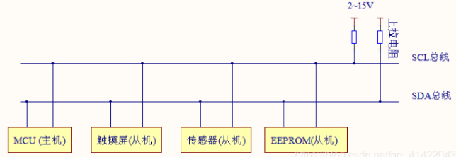
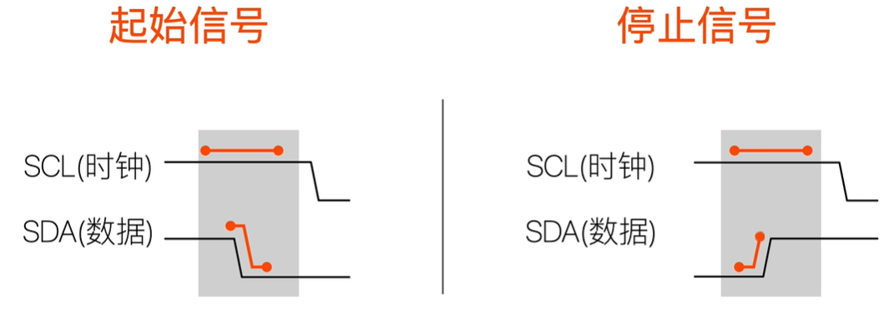
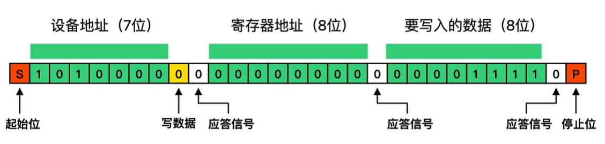
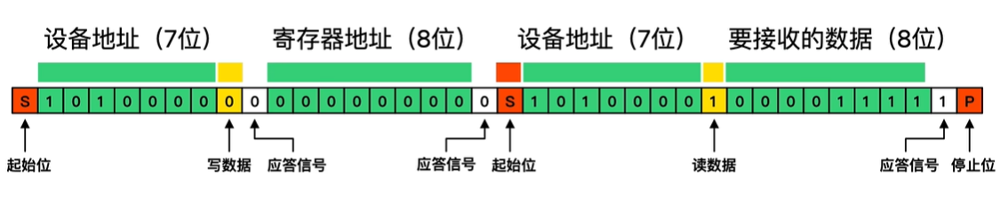
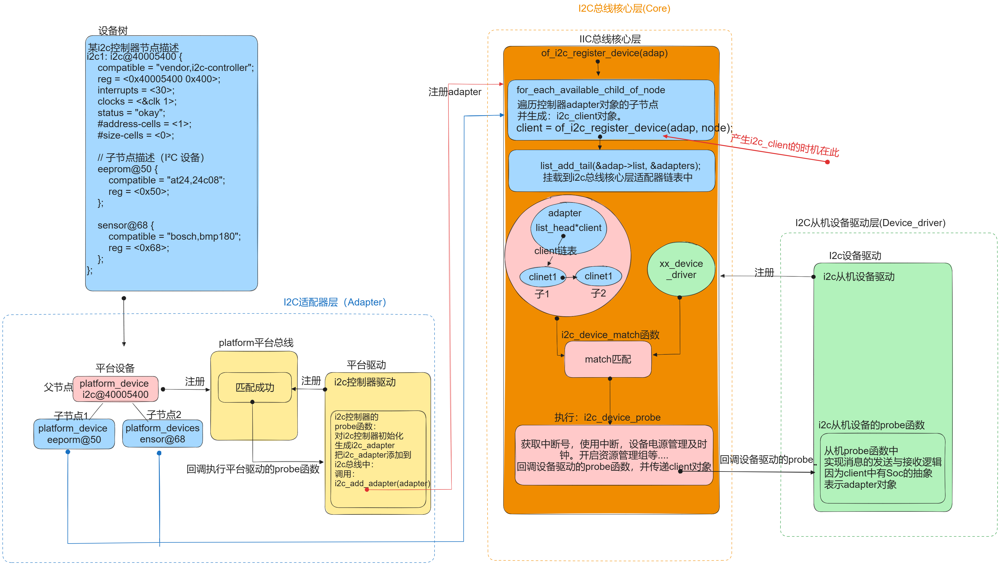
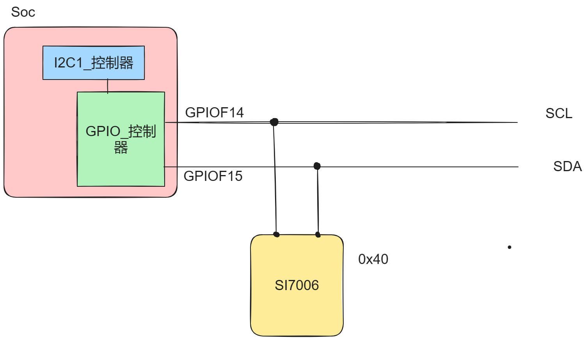

# 第一节、I2C通信原理及时序：

IIC通信协议用一句话来描述就是：

## **1、**IIC**总线简述：(**Inter-Integrated Circuit**)**

由于早期使用uart通信时，当进行多设备通信时，连接过于繁琐复杂，对于近距设备间通信，成本过高，所以在1982年由飞利浦公司开发出了一种



## 2、IIC总线通信协议：

下面介绍一下：使用从机E2PROM从机为例，通过时序简要介绍一下IIC通信协议：



### 1.写数据帧：



### 2.读数据帧：




## 3.总结：

通过协议我们得知，如果Soc想通过W/R从机，这个消息数据的组织必须要素有：

**1..从机地址：addr**

**2. 方向：读or写，**

**3.读写数据：data**

# 第二节、 I2C总线驱动框架及调用路径：  

I²C总线驱动框架是基于platform平台总线实现的，根据I2C子系统中源码的调用逻辑，绘制如图框架：以方便给大家学习时的整体感：（当我阅读了I2C源码后，发现网上广为传播的框图，有所谬误，所以根据调用逻辑重新绘制）



高清svg框图：

[i2c子系统调用框图1.svg](attachments/WEBRESOURCEbbf4abbac542b3ded713b15b3a637049i2c子系统调用框图1.svg)

# 第三节 、I2C设备的设备树节点对引脚的描述方式：

## 1. 查看手册，获取设备信息：

I2C设备si7006芯片使用i2c的7位从机地址：0x40

I2C设备si7006芯片使用引脚1链接是i2c总线：I2C1_SDA

I2C设备si7006芯片使用引脚6链接是i2c总线：I2C1_SCL

I2C1_SDA线连接的Soc上的引脚：PF15：gpiof_15 复用为AF5(I2C1_SDA)

I2C1_SCL线连接的Soc上的引脚：PF14:gpiof_14	复用为AF5(I2C1_SCL) 

Soc芯片中的I2C1控制器的地址：0x40012000 - 0x400123FF


## 2.绘制一个直观连接关系图：



## 3.设备树节点描述：

```javascript
/{
...
//不要在原厂BSP工程师的设备树节点中去修改，而是应该使用引用节点的方式
    &i2c1{
        status = "okay";
        pinctrl-names = "default","sleep","idle","active";
        pinctrl-0 = <&i2c1_pins_b>;
        pinctrl-1 = <&i2c1_sleep_pins_b>;

        si7006@40{
            compatible = "WX, SI7006";
            reg = <0x40>;
            status = "okay";
        };
    };
    ...
};
```

# 第四节、I2C子系统常用数据类型及操作接口：

## 1.认识I2C从机设备驱动的结构体：i2c_driver:

还是按照我们驱动构建的套路：分配对象，注册，注销。i2c驱动也是遵从device , bus, driver的模型。

先来了解I2C驱动框架中的I2c_driver这是驱动部分的结构体：i2c_driver结构体：

```c
struct i2c_driver {
	...
	/* Standard driver model interfaces */
	int (*probe)(struct i2c_client *client, const struct i2c_device_id *id);
	int (*remove)(struct i2c_client *client);
 ...    
	struct device_driver driver;//驱动的父类：父类中有匹配方式 of_match_table;

	...
};

//i2c驱动的父类
struct device_driver {
	const char		*name; //驱动的名字，用来生成节点
 ...




	const struct of_device_id	*of_match_table;//设备树匹配方式
 ...
	struct driver_private *p;//私有属性指针
};
```

## 2.i2c_driver对象的注册与注销：

```c
//i2c_driver对象的注册宏：
#define i2c_add_driver(driver) \
	    i2c_register_driver(THIS_MODULE, driver)
//对应的注销宏：
void i2c_del_driver(struct i2c_driver *driver);
//一键注册注销宏：
module_i2c_driver(i2c_driver对象);
```

## 3.从机设备：struct i2c_client结构体

```c
struct i2c_client {
    unsigned short flags;           /* 设备的标志位 */
    unsigned short addr;            /* 设备的 I2C 地址 */

    char name[I2C_NAME_SIZE];       /* 设备的名称 */
    struct i2c_adapter *adapter;    /* 指向 I2C 适配器的指针，表示该设备连接到哪个适配器上 */
    struct device dev;              /* 通用设备结构，用于描述设备的基本信息 */
...
};
```

### 3.1、发数据接口：i2c_master_send

```c
int i2c_master_send(struct i2c_client *client, const char *buf, int count);
client: 指向 struct i2c_client 结构的指针，表示要发送数据的目标设备。
buf: 指向包含要发送数据的缓冲区的指针。
count: 要发送的字节数。
功能和用法：i2c_master_send() 函数用于向连接到 I2C 总线的设备发送数据。
它通过 client 参数确定要发送数据的目标设备，通过 buf 和 count 参数指定要发送的数据内容和长度。
函数返回发送的字节数，如果发生错误，则返回负数
```

### 3.2、收数据接口：i2c_master_recv()

```c
int i2c_master_recv(struct i2c_client *client, char *buf, int count);
client: 指向 struct i2c_client 结构的指针，表示要接收数据的目标设备。
buf: 指向存放接收数据的缓冲区的指针。
count: 要接收的字节数。
功能和用法：i2c_master_recv() 函数用于从连接到 I2C 总线的设备接收数据。
它通过 client 参数确定要接收数据的目标设备，通过 buf 和 count 参数指定接收数据的缓冲区和长度。
函数返回接收到的字节数，如果发生错误，则返回负数。
```

## 4.拓展内容：

### 4.1、I2C控制器结构体：i2c_adapter:

```c
struct i2c_adapter 
{
    struct module *owner;// 驱动程序模块的所有者
    unsignedintclass;// 适配器类别
    conststruct i2c_algorithm *algo;// 用于与硬件通信的算法
    void *algo_data;                     // 算法相关数据
    ...
    struct device dev;// 设备结构
    int nr;                              // 适配器号
    char name[48];                       // 适配器名称
    ...
    };
```

### 4.2、i2c数据消息结构体：struct i2c_msg:

```c
struct i2c_msg {
    __u16 addr; /* slave address    从机地址        */
    __u16 flags;//数据中的读写标记为0为写，1为读
#define I2C_M_RD        0x0001  /* read data, from slave to master */
                    /* I2C_M_RD is guaranteed to be 0x0001! */
#define I2C_M_TEN       0x0010  /* this is a ten bit chip address */
#define I2C_M_DMA_SAFE      0x0200  /* the buffer of this message is DMA safe */
                    /* makes only sense in kernelspace */
                    /* userspace buffers are copied anyway */
#define I2C_M_RECV_LEN      0x0400  /* length will be first received byte */
#define I2C_M_NO_RD_ACK     0x0800  /* if I2C_FUNC_PROTOCOL_MANGLING */
#define I2C_M_IGNORE_NAK    0x1000  /* if I2C_FUNC_PROTOCOL_MANGLING */
#define I2C_M_REV_DIR_ADDR  0x2000  /* if I2C_FUNC_PROTOCOL_MANGLING */
#define I2C_M_NOSTART       0x4000  /* if I2C_FUNC_NOSTART */
#define I2C_M_STOP      0x8000  /* if I2C_FUNC_PROTOCOL_MANGLING */
    __u16 len;      /* msg length          消息长度     */
    __u8 *buf;      /* pointer to msg data  消息的首地址        */
};
因为默认的都是写，即为0，所以并没有给出标志位，当需要读时，再给出这个标记位即可。所以就没有明确的写标志位，因为写是默认的。
```

### 4.3. 传输数据函数：int i2c_transfer():

```c
int i2c_transfer(struct i2c_adapter *adap, struct i2c_msg *msgs, int num);
//通过adap调用alogrithom对象的操作方法进行收发数据：
参数1：adap即为i2c控制器的抽象层的封装的对象
参数2：msgs即封装的收发的数据信息
参数3：num即收发数据结构体对象的个数
成功返回 num个数，失败返回非num数或错误码.
```

# 第五节、综合应用：

## 1.甲方需求：

**按下开发板中的按键1，在应用中获取温度。**

**按下开发板中的按键2，在应用中获取湿度。**

```cpp
#include <linux/module.h>
#include <linux/init.h>
#include <linux/platform_device.h>
#include <linux/mod_devicetable.h>
#include <linux/fs.h>
#include <linux/cdev.h>
#include <linux/slab.h>
#include <linux/io.h>

#include <linux/of.h>
#include <linux/of_gpio.h>
#include <linux/gpio.h>
#include <asm-generic/gpio.h>
#include <linux/of_platform.h>
#include <linux/interrupt.h>
#include <linux/of_irq.h>
#include <linux/timer.h>
#include <linux/jiffies.h>
#include <linux/delay.h>
#include <linux/workqueue.h>
#include <linux/input.h>
#include <linux/i2c.h>


struct MyKey
{
    u32 key1_interrupts;
    u8 key1_gpios;
    u32 key2_interrupts;
    u8 key2_gpios;
    u32 key3_interrupts;
    u8 key3_gpios;
    //添加一下irq属性：
    volatile u32 irq;
    //添加input_dev属性：
    struct input_dev* i_dev;
};
struct MyKey mykey = {0};

//封装一个si7006设备类型
struct si7006 
{
    struct i2c_client* client;
    u8 Humidity;//湿度
    u8 Temperature;//温度
    u8 Reset;//重启
    int16_t data;
};

//定义一个si7006设备对象：
struct si7006 si7006 = {
    .client = NULL,
    .Temperature = 0xe3,
    .Humidity = 0xe5,
    .Reset = 0xfe,
    .data = 0,
};

struct of_device_id of_i2c_table[] = {
    [0] = {.compatible ="WX, SI7006", },
    [1] = {/*代表结束*/},
};

int si7006_driver_probe(struct i2c_client *client, const struct i2c_device_id *id)
{
    si7006.client = client;
    return 0;
}
int si7006_driver_remove(struct i2c_client *client)
{
    return 0;
}

//定义一个从机设备驱动对象：
struct i2c_driver si7006_driver = {
    .probe = si7006_driver_probe,
    .remove = si7006_driver_remove,
    .driver = {
        .name = "si7006_driver",
        .of_match_table = of_i2c_table
    },
};


irqreturn_t threaded_irq_functions(int irq, void *dev)
{
    //mdelay(100);
    //阻塞式延时函数：
    msleep(50);
    if(mykey.irq == mykey.key1_interrupts)
    {
        if(gpio_get_value(mykey.key1_gpios) == 0)
        {
            //key1按下了：获取温度并上报：
            i2c_master_send(si7006.client,&si7006.Temperature, 1);
            i2c_master_recv(si7006.client,(char*)&si7006.data,2);
            input_event(mykey.i_dev,EV_MSC,MSC_RAW,si7006.data);
            input_sync(mykey.i_dev);
        }
        else{
            //key1抬起了：重置传感器，传感器停止工作
            i2c_master_send(si7006.client,&si7006.Reset,1);
        }
    }
    if(mykey.irq == mykey.key2_interrupts)
    {
        if(gpio_get_value(mykey.key2_gpios) == 0)
        {
            //key2按下了：获取相对湿度并上报
            i2c_master_send(si7006.client,&si7006.Humidity, 1);
            i2c_master_recv(si7006.client,(char*)&si7006.data,2);
            input_event(mykey.i_dev,EV_MSC,MSC_SCAN,si7006.data);
            input_sync(mykey.i_dev);
        }
        else{
            //key2抬起了：停止传感器工作。
            i2c_master_send(si7006.client,&si7006.Reset,1);
        }
    }
    return IRQ_HANDLED;
}

irqreturn_t key_ISR(int irq, void * dev)
{
    mykey.irq = irq; 
    return IRQ_WAKE_THREAD;
}


int my_dev_driver_probe(struct platform_device *pdev)
{
    struct device_node* key_node;
    printk("my_dev_driver_probe probe函数执行\n");
        //获取key设备树象节点的对象指针：
    key_node = pdev->dev.of_node;
    //4.获取Key对象的linux中断号：
    mykey.key1_interrupts = of_irq_get(key_node,0);
    mykey.key1_gpios = of_get_named_gpio(key_node,"mykey_gpios",0);
    gpio_direction_input(mykey.key1_gpios);
    printk("irq = %d\n",mykey.key1_interrupts);
    printk("gpio = %d\n",mykey.key1_gpios);
    mykey.key2_interrupts = of_irq_get(key_node,1);
    mykey.key2_gpios = of_get_named_gpio(key_node,"mykey_gpios",1);
    gpio_direction_input(mykey.key2_gpios);
    mykey.key3_interrupts = of_irq_get(key_node,2);
    mykey.key3_gpios = of_get_named_gpio(key_node,"mykey_gpios",2);
    gpio_direction_input(mykey.key3_gpios);

    //5.请求中断并注册中断处理程序的函数;
    request_threaded_irq(mykey.key1_interrupts,key_ISR,threaded_irq_functions,IRQF_TRIGGER_RISING | IRQF_TRIGGER_RISING,"key1-interrupts",NULL);
    request_threaded_irq(mykey.key2_interrupts,key_ISR,threaded_irq_functions,IRQF_TRIGGER_RISING | IRQF_TRIGGER_RISING,"key2-interrupts",NULL);
    request_threaded_irq(mykey.key3_interrupts,key_ISR,threaded_irq_functions,IRQF_TRIGGER_RISING | IRQF_TRIGGER_RISING,"key3-interrupts",NULL);
    //....
    
    //6.初始化mykey中的input_dev对象：
    mykey.i_dev = input_allocate_device();

    //对输入设备匹配方式及事件相关进行设置：
    mykey.i_dev->id.bustype =  ID_BUS;

    set_bit(EV_MSC,mykey.i_dev->evbit);
    set_bit(MSC_RAW, mykey.i_dev->mscbit);
    set_bit(MSC_SCAN, mykey.i_dev->mscbit);
    
    mykey.i_dev->name = "KEY";
    mykey.i_dev->phys = "soc/pf9/key";
    mykey.i_dev->uniq = "KEY";

    //把这个设备注册到输入子系统中：
    input_register_device(mykey.i_dev);

    //定义一个从机驱动对象，并注册到i2c总线上：
    i2c_add_driver(&si7006_driver);

    return 0;
}

int my_dev_driver_remove(struct platform_device *pdev)
{
    printk("my_dev_driver_remover函数执行了\n");
    i2c_del_driver(&si7006_driver);
    input_unregister_device(mykey.i_dev);
    free_irq(mykey.key1_interrupts,NULL);
    free_irq(mykey.key2_interrupts,NULL);
    free_irq(mykey.key3_interrupts,NULL);
    return 0;
}

//设备树匹配方式：
struct of_device_id of_node_match_table[] = { 
    [0] = {.compatible = "WX,my_device_key"},
    [2] = {/*最后一个一定要给一个空元素，代表结束*/}
};

// 1.定义一个平台驱动对象：
struct platform_driver my_platform_driver = {
    .probe = my_dev_driver_probe,
    .remove = my_dev_driver_remove,
    .driver = {
        .name = "WX,my_device_driver",
        //设备树的匹配方式：
        .of_match_table = of_node_match_table,
    },

};

// 入口函数：
int __init my_test_module_init(void)
{
    int ret = 0;
    ret = platform_driver_register(&my_platform_driver);
    if (ret < 0)
    {
        return -1;
    }
    return 0;
}

// 出口函数：
void __exit my_test_module_exit(void)
{
    platform_driver_unregister(&my_platform_driver);
}

// 指定许可：
MODULE_LICENSE("GPL");
MODULE_AUTHOR("gaowanxi, email:gaonetcom@163.com");
// 指定入口及出口函数：
module_init(my_test_module_init);
module_exit(my_test_module_exit);
```

## **2.应用测试代码**

```cpp
#include <stdio.h>
#include <sys/types.h>
#include <sys/stat.h>
#include <fcntl.h>
#include <unistd.h>
#include <string.h>
#include <stdbool.h>
#include <sys/ioctl.h>
#include <sys/select.h>
#include <linux/input.h>
#include <sys/signal.h>
#include <arpa/inet.h>

int main(int argc, char const *argv[])
{
    int fd1 = open("/dev/input/event0", O_RDWR);
    if (fd1 == -1)
    {
        perror("open err");
        return -1;
    }
    struct input_event event_data = {0};
    int nbytes = 0;

    while (true)
    {
        memset(&event_data,0 ,sizeof(event_data));
        nbytes = read(fd1,&event_data,sizeof(event_data));
        if(nbytes == -1)
        {
            perror("read err:");
            return -1;
        }
        if(event_data.code == MSC_RAW) //获取温度：
        {
            float temp = 175.72 * ntohs(event_data.value) / 65536 - 46.85;
            printf("获取温度 = %.2f\n",temp);
        }

        if(event_data.code == MSC_SCAN)//获取湿度：
        {
            float humt = 125 * ntohs(event_data.value) / 65536 - 6;
            printf("获取当前相对湿度 = %.2f\n",humt);
        }
    }
    close(fd1);
    return 0;
}

```