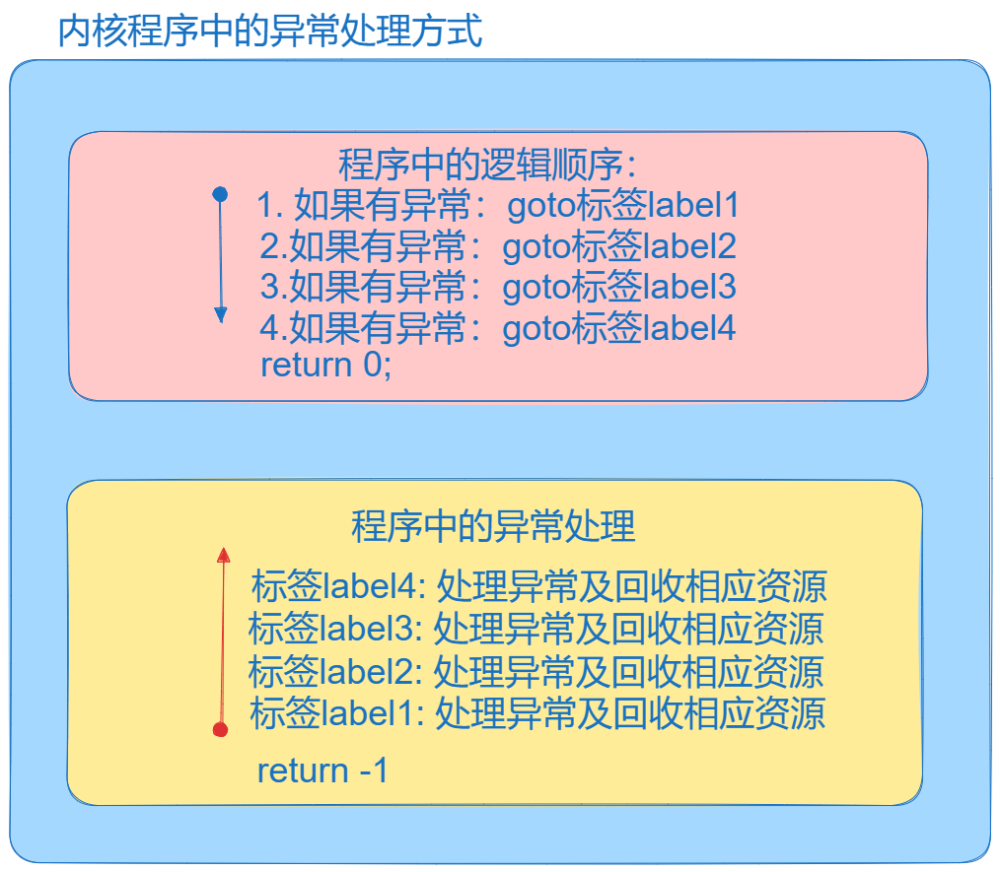

# 第一节、认识Linux中设备与文件的关系

## 1.在Linux中一切皆文件

比如：在磁盘上持久保存数据的普通文件，管理普通磁盘文件的目录文件 ext2,ext4,fat,ntfs,ext3...，设备文件/dev/xxx devfs  套接字，临时文件 /proc目录下的文件 procfs，内核及进程中一些数据，/sys目录 tmp sysfs

## 2.为了统一对文件进行管理或操作，为了避免不同文件系统上的操作差异，又抽象一层：vfs:虚拟文件系统。

虚拟文件系统提供了对文件访问的统一接口：sys_open, sys_read, sys_write, sys_...;

上层的应用直接去调用glibc库函数中的系统调用方法：open , read, write,close,ioctl, select/poll/epoll/  ....

## 3.文件与设备之间的关系：如图所示：


# 第二节、字符设备驱动开发框架：

## 1. 在内核如何标别设备的唯一性。设备号，在内核中如何申请设备号，及对些设备操作进行关联。

内核提供的申请设备号，及对此设备进行操作的API接口函数：

```c
int register_chrdev(unsigned int major, const char *name,
const struct file_operations *fops)
//功能：在内核中为某个设备号，申请主设备号，关联与此设备进行操作的方法。
参数1：major = 0  代表由系统自动分配一个设备号。
        major > 0值，代表静态指定使用某个主设备号（0-4096）
参数2：name: 要指定的设备的名称："my_char_dev";
参数3：与设备号关联的操作设备的操作方法结构体：这个结构体有大量的与文件操作对应的回调函数的函数指针。
struct file_operations{
        //与文件read对应的函数指针
        ssize_t (*read) (struct file *, char __user *, size_t, loff_t *);
        //与write对应的函数指针
	    ssize_t (*write) (struct file *, const char __user *, size_t, loff_t *);
        ...
        //与open对应的函数指针
        int (*open) (struct inode *, struct file *);
        //与close对应函数指针：
        int (*release) (struct inode *, struct file *);
        ...
};
//所以驱动层向上层提供的统计一的接口就是定义相应的函数，并填充struct file_opeations 结构体对象中的这些函数指针变量。

//返回值：
如果major = 0时，那返回值就是成功：返回主设备号，失败返回错误码。
如果major > 0，成功返回0，返回0，失败返回错误码。

//如果设备不再使用时，或者设备的驱动模块卸载时，就应当注册设号号：
void unregister_chrdev(unsigned int major, const char* name);
参数1 major就是要注销的设备号
参数2 要注销的设备的名称。
```

## 2.如何把这个设备号与文件节点进行关联呢？

使用命令: 

```cpp
在应用层：使用mknod命令在/dev目录下创建设备节点文件
mknod 文件名 设备的类型 主设备major 次设备号
```

## 3.字符设备框架构建的步骤：

```c
//1.描述一个设备类型:(以后在Linux中大多都提供了相应的类型，Linux驱动开发就像填空题一样)
struct xxx_chrdev{
    //1.设备名称
    char*  dev_name;
    //2.主设备号，次设备号
    int major
    int minor;
    //3.对设备的操作方法：
    struct file_operations fops;
};
//2.定义一个设备对象
struct xxx_chardev my_chrdev;
//3.注册设备
register_chrdev(0, my_chrdev.dev_name,
&my_chardev.fops);
//4.注销设备
unregister_chrdev(my_chardev.major, my_chardev.dev.name);
```

## 4.一个简单的字符设备驱动开发的演示实例：

my_sample_cdev.c:

```c
#include <linux/module.h>
#include <linux/init.h>
#include <linux/fs.h>
#define MYDEV_NAME "xxx_sample_chardev"
//描述一个字符设备：应该有哪些属性：
//1.设备名称，2.设备号：主设备好，次设备号，3.对设备进行操作的结构体struct file_operations

struct xxx_sample_chardev
{
    const char* dev_name;
    int major;
    int minor;
    struct file_operations fops;
};

//1.在全局中定义的 xxx_sample_charde的对象
struct xxx_sample_chardev my_chrdev;

//在内核定义对应的函数接口：
//与文件read对应的函数指针
ssize_t xxx_sample_chardev_read (struct file * file, char __user *userbuf, size_t size, loff_t * offset)
{
    printk("内核中的xxx_sample_chardev_read执行了\n");
    return size;
}
//与write对应的函数指针
ssize_t xxx_sample_chardev_write (struct file *file, const char __user *usrbuf, size_t size, loff_t *offset)
{
    printk("内核中的xxx_sample_chardev_write执行了\n");
    return size;
}

//与open对应的函数指针
int xxx_sample_chardev_open (struct inode *inode, struct file *file)
{
    printk("内核中的xxx_sample_chardev_open执行了\n");
    return 0;
}
//与close对应函数指针：
int xxx_sample_chardev_release (struct inode *inode, struct file *file)
{
    printk("内核中的xxx_sample_chardev_release执行了\n");
    return 0;
}

//入口函数：
int __init my_test_module_init(void)
{
    printk("A模块的入口函数执行了");
    //申请资源，初始化并配置资源。
    //2.初始化对象（对这个设备对象中的属性进行初始化）
    //2.1设备的名字：
    my_chrdev.dev_name = MYDEV_NAME;
    //2.2设备操作时的回调方法：
    my_chrdev.fops.open = xxx_sample_chardev_open;
    my_chrdev.fops.read = xxx_sample_chardev_read;
    my_chrdev.fops.write = xxx_sample_chardev_write;
    my_chrdev.fops.release = xxx_sample_chardev_release;
    //2.3 申请内核中的设备号：申请主设备号，并且关联对此设备的操作方法：
    my_chrdev.major = register_chrdev(0,MYDEV_NAME,&my_chrdev.fops);
    if(my_chrdev.major < 0)
    {
        printk("申请设备号失败，及关联操作方法失败\n");
        return my_chrdev.major;
    }
    printk("申请到的设备号=%d\n",my_chrdev.major);
    return 0;
}

//出口函数：
void __exit my_test_module_exit(void)
{
    printk("出口函数执行了\n");//把调试信息放在了系统日志缓冲区，使用dmesg来显示。
    //清理资源。
    unregister_chrdev(my_chrdev.major,MYDEV_NAME);
}

//指定许可：
MODULE_LICENSE("GPL");
MODULE_AUTHOR("gaowanxi, email:gaonetcom@163.com");
//指定入口及出口函数：
module_init(my_test_module_init);
module_exit(my_test_module_exit);
```

Makefile:

```cpp
arch ?= arm
ifeq ($(arch),arm)
    kernel_dir := /home/linux/linux5.10.61
else
    kernel_dir = /lib/modules/5.4.0-150-generic/build
endif
pwd = $(shell pwd)
# KBUILD_EXTRA_SYMBOLS += /home/linux/TestModules/my_test_module/my_test_moduleB/Module.symvers
all:
    make -C $(kernel_dir) modules M=$(pwd) 
clean:
    make -C $(kernel_dir) clean M=$(pwd)
install:
    make -C $(kernel_dir) modules_install M=$(pwd) INSTALL_MOD_PATH=/home/linux/rootfs
obj-m += my_sample_cdev.o
```

驱动的角色就是上通，下达：

上通：向上提供统一的接口，上通的功能就是可以与应用层进程进行数据的传输。

下达：向下可以操作硬件。

# 第三节、解决驱动这个角色的上通与下达的功能。

## 3.1上通

### 1.上通中关于应用层中的数据与内核进程中的数据如何进行传输呢？

画图：


### 2.如果用户进程中对打开的文件进行write,那么在对应的内核中所提供的xxx_write回调函数中，应该使用copy_from_user来获取用户进程中的数据。

copy_from_usr的内核的API接口：

```c
unsigned long  copy_from_user(void *to, const void __user *from, unsigned long n);
功能：从用户空间的进程拷贝数据到内核进程空间之中。
参数1：to：内核中的目标空间的地址。
参数2：from:就是用户空间数据的地址。
参数3：n就是拷贝的字节数。
成功：返回0，失败返回没有拷贝的字节数。
```

### **3.如果用户进程中对打开的文件进行read,那么在对应的内核中所提供的xxx_read回调函数中，应该使用copy_to_user向用户进程拷贝数据。**

```c
unsigned long  copy_to_user(void __user *to, const void *from, unsigned long n);
功能：向用户进程中拷贝数据
参数1:to 目标用户进程空间中的地址。
参数2：from 内核进程空间的地址。
参数3：n 拷贝的字节数。
成功：返回0，失败返回没有拷贝的字节数。
```

### 4.代码测试：

驱动代码：

```c
#include <linux/module.h>
#include <linux/init.h>
#include <linux/fs.h>
#include <linux/uaccess.h>
#define MYDEV_NAME "xxx_sample_chardev"
//描述一个字符设备：应该有哪些属性：
//1.设备名称，2.设备号：主设备好，次设备号，3.对设备进行操作的结构体struct file_operations

struct xxx_sample_chardev
{
    const char* dev_name;
    int major;
    int minor;
    struct file_operations fops;
};
char kernel_buf[128] = {0};
//1.在全局中定义的 xxx_sample_charde的对象
struct xxx_sample_chardev my_chrdev;

//在内核定义对应的函数接口：
//与文件read对应的函数指针
ssize_t xxx_sample_chardev_read (struct file * file, char __user *userbuf, size_t size, loff_t * offset)
{
    //回调函数中参数：
    //参数1：就是用户进程中使用open内核中创建的struct file的实例的地址。
    //参数2：usrbuf:就是用户进程中数据的地址。
    //参数3: size,用户进程中要拷贝的字节数。
    //参数4：从内核空间拷贝时的偏移量。单元也是字节。

    //调用copy_to_user从用户进程中获取数据：
    int ret = 0;
    //最后在内核对用户传过来的长度进行过滤。避免操作非法内存。
    //对内核中的内存使用要十分慎重，很容易造成内核的崩溃。
    if(size >= sizeof(kernel_buf))
    {
        size = sizeof(userbuf);
    }
    ret = copy_to_user(userbuf, kernel_buf + *offset, size);
    if(ret)
    {
        printk("copy_to_user failed");
        return -EIO;
    }
    printk("内核中的xxx_sample_chardev_read执行了\n");
    return size;
}
//与write对应的函数指针
ssize_t xxx_sample_chardev_write (struct file *file, const char __user *usrbuf, size_t size, loff_t *offset)
{
    //回调函数中参数：
    //参数1：就是用户进程中使用open内核中创建的struct file的实例的地址。
    //参数2：usrbuf:就是用户进程中数据的地址。
    //参数3: size,用户进程中要拷贝的字节数。
    //参数4：文件读写偏移量。单元也是字节。

    //调用copy_from_user从用户进程中获取数据：
    int ret = 0;
    if(size >= sizeof(kernel_buf))
    {
        size = sizeof(usrbuf);
    }
    memset(kernel_buf,0,sizeof(kernel_buf));
    copy_from_user(kernel_buf + *offset,usrbuf,size);
    if(ret)
    {
        printk("copy_from_usre failed");
        return -EIO;
    }
    printk("内核中的xxx_sample_chardev_write执行了\n");
    return size;
}

//与open对应的函数指针
int xxx_sample_chardev_open (struct inode *inode, struct file *file)
{
    printk("内核中的xxx_sample_chardev_open执行了\n");
    return 0;
}
//与close对应函数指针：
int xxx_sample_chardev_release (struct inode *inode, struct file *file)
{
    printk("内核中的xxx_sample_chardev_release执行了\n");
    return 0;
}

//入口函数：
int __init my_test_module_init(void)
{
    printk("A模块的入口函数执行了");
    //申请资源，初始化并配置资源。
    //2.初始化对象（对这个设备对象中的属性进行初始化）
    //2.1设备的名字：
    my_chrdev.dev_name = MYDEV_NAME;
    //2.2设备操作时的回调方法：
    my_chrdev.fops.open = xxx_sample_chardev_open;
    my_chrdev.fops.read = xxx_sample_chardev_read;
    my_chrdev.fops.write = xxx_sample_chardev_write;
    my_chrdev.fops.release = xxx_sample_chardev_release;
    //2.3 申请内核中的设备号：申请主设备号，并且关联对此设备的操作方法：
    my_chrdev.major = register_chrdev(0,MYDEV_NAME,&my_chrdev.fops);
    if(my_chrdev.major < 0)
    {
        printk("申请设备号失败，及关联操作方法失败\n");
        return my_chrdev.major;
    }
    printk("申请到的设备号=%d\n",my_chrdev.major);
    return 0;
}

//出口函数：
void __exit my_test_module_exit(void)
{
    printk("出口函数执行了\n");//把调试信息放在了系统日志缓冲区，使用dmesg来显示。
    //清理资源。
    unregister_chrdev(my_chrdev.major,MYDEV_NAME);
}


//指定许可：
MODULE_LICENSE("GPL");
MODULE_AUTHOR("gaowanxi, email:gaonetcom@163.com");
//指定入口及出口函数：
module_init(my_test_module_init);
module_exit(my_test_module_exit);
```

应用层测试代码：

```c
#include <stdio.h>
#include <sys/types.h>
#include <sys/stat.h>
#include <fcntl.h>
#include <unistd.h>
#include <string.h>
int main(int argc, char const *argv[])
{
    int fd = open("/dev/xxx_sample_chardev",O_RDWR); 
    if(fd == -1)
    {
        perror("open err");
        return -1;
    }
    char buf[128] = {0};
    fgets(buf,sizeof(buf),stdin);
    int nbytes = write(fd,buf,strlen(buf));
    if(nbytes == -1)
    {
        perror("write err：\n");
        return -1;
    }
    memset(buf,0, sizeof(buf));
    nbytes = read(fd,buf,sizeof(buf)-1);
    if(nbytes == -1)
    {
        perror("read err:\n");
        return -1;
    }
    printf("接收的数据为：%s\n",buf);

    close(fd);

    return 0;
}

```

## 3.2下达

下达逻辑框图如下：


### 1. 如何在内核层映射某硬件的寄存器的地址？因为操作硬件就是操作硬件的寄存器的地址。所以在内核中如果要操作硬件，就必须建立与硬件寄存器地址的映射关系。

Linux中提供了这样的方法：ioremap

```c
void* ioremap(phys_addr_t paddr, unsigned long size);
//功能就是把某硬件的寄存器地址，映射为一个可以由内核操作的内核地址。size是寄存器长度。
参数1 paddr 就是硬件的寄存器地址。
参数2 size:寄存器的长度。
返回值 成功返回内核映射地址，失败返回NULL;
如果成功，就可以通过操作映射后的地址的这个内存，就相当操作硬件的寄存。

//当驱动如果要卸载，就应该解除映射关系。
void iounmap(const volatile void __iomem *addr);
//功能：解除映射关系。
参数：映射的内核地址。
```

### 2.有了下达的方式之后，我们就应该在给上层提供的接口函数中使用这种方式来操作硬件设备。对硬件寄存器中的状态进行修改，就相当操作的硬件。以点灯为例，我们来测试下达的功能的实现。

#### 1. 实现内核地址映射第一件事就是参考Soc芯片手册与开发板原理图。

Soc内部框图：


点亮LED1灯，从厂家所给的手册去去查找LED灯（原理图）：


能过原理图发现LD1灯连接到的引脚为LED1


LED1连接是Soc芯片上的PE10引脚：

PE10  == GPIOE组 10索引的相应寄存器管理的引脚。

GPIOE组寄存器的物理地址是什么？去参考手册去查找：


所以我看到GPIOE组寄存器的基地址：0x50006000


**GPIOE_MODR 0x50006000+0x00 = 0x50006000**


GPIOE寄存器通电源及通一时钟频率：RCC运行时钟控制器：

**GPIOE_ODR = 0x50006000 + 0x14 = 0x50006014;**


**RCC_AHB4寄存器的地址：0x5000 000 + 0xa28 = 0x5000  0a28**

**2. 把这些已经找到的寄存器的物量地址保存起来，在代码使用。**

**3.代码实现：**

```cpp
#include <linux/module.h>
#include <linux/init.h>
#include <linux/fs.h>
#include <linux/uaccess.h>
#include <linux/io.h>
#define MYDEV_NAME "xxx_sample_chardev"
#define GPIOE_MODR 0x50006000
#define GPIOE_ODR 0x50006014
#define RCC_MP_AHB4_EN 0x50000a28 

struct LED1_K_ADDR
{
    int* led1_modr;
    int* led1_odr;
    int* led1_rcc;
};

//描述一个字符设备：应该有哪些属性：
//1.设备名称，2.设备号：主设备好，次设备号，3.对设备进行操作的结构体struct file_operations
struct xxx_sample_chardev
{
    const char* dev_name;
    int major;
    int minor;
    struct file_operations fops;
    //在设备类型描述内核的映射地址：
    struct LED1_K_ADDR maping_addr;

};
char kernel_buf[128] = {0};
//1.在全局中定义的 xxx_sample_charde的对象
struct xxx_sample_chardev my_chrdev;

//在内核定义对应的函数接口：
//与文件read对应的函数指针
ssize_t xxx_sample_chardev_read (struct file * file, char __user *userbuf, size_t size, loff_t * offset)
{
    //回调函数中参数：
    //参数1：就是用户进程中使用open内核中创建的struct file的实例的地址。
    //参数2：usrbuf:就是用户进程中数据的地址。
    //参数3: size,用户进程中要拷贝的字节数。
    //参数4：当前的文件的偏移量。单元也是字节。

    //调用copy_to_user从用户进程中获取数据：
    int ret = 0;
    //最后在内核对用户传过来的长度进行过滤。避免操作非法内存。
    //对内核中的内存使用要十分慎重，很容易造成内核的崩溃。
    if(size >= sizeof(kernel_buf))
    {
        size = sizeof(userbuf);
    }
    ret = copy_to_user(userbuf, kernel_buf + *offset, size);
    if(ret)
    {
        printk("copy_to_user failed");
        return -EIO;
    }
    printk("内核中的xxx_sample_chardev_read执行了\n");
    return size;
}
//与write对应的函数指针
ssize_t xxx_sample_chardev_write (struct file *file, const char __user *usrbuf, size_t size, loff_t *offset)
{
    //回调函数中参数：
    //参数1：就是用户进程中使用open内核中创建的struct file的实例的地址。
    //参数2：usrbuf:就是用户进程中数据的地址。
    //参数3: size,用户进程中要拷贝的字节数。
    //参数4：当前文件的偏移量。单元也是字节。

    //调用copy_from_user从用户进程中获取数据：
    int ret = 0;
    if(size >= sizeof(kernel_buf))
    {
        size = sizeof(usrbuf);
    }
    memset(kernel_buf,0,sizeof(kernel_buf));
    
    ret = copy_from_user(kernel_buf + *offset, usrbuf, size);
    if(ret)
    {
        printk("copy_from_usre failed");
        return -EIO;
    }

    if(kernel_buf[0] == '1')
    {
        //输出高电平：
        *my_chrdev.maping_addr.led1_odr |= 0x1 << 10;
    }
    else{
        //输出低电平
        *my_chrdev.maping_addr.led1_odr &= ~(0x1 << 10);
    }

    printk("内核中的xxx_sample_chardev_write执行了\n");
    return size;
}

//与open对应的函数指针
int xxx_sample_chardev_open (struct inode *inode, struct file *file)
{

    printk("内核中的xxx_sample_chardev_open执行了\n");
    //映射 + 初始化：
    my_chrdev.maping_addr.led1_modr = ioremap(GPIOE_MODR,4);
    //初始化输出模式：
    *my_chrdev.maping_addr.led1_modr &= ~(0x1 << 21);
    *my_chrdev.maping_addr.led1_modr |= 0x1 << 20;

    my_chrdev.maping_addr.led1_odr = ioremap(GPIOE_ODR,4);
    //输出低电平：初始状态为灭
    *my_chrdev.maping_addr.led1_odr &= ~(0x1 << 10);
    //使能（开启）AHB4总线上GPIOE端口的电源及时钟频率：
    my_chrdev.maping_addr.led1_rcc = ioremap(RCC_MP_AHB4_EN,4);
    *my_chrdev.maping_addr.led1_rcc |= 0x1 << 4;
    
    return 0;
}
//与close对应函数指针：
int xxx_sample_chardev_release (struct inode *inode, struct file *file)
{
    printk("内核中的xxx_sample_chardev_release执行了\n");
    *my_chrdev.maping_addr.led1_odr &= ~(0x1 << 10);
    return 0;
}

//入口函数：
int __init my_test_module_init(void)
{
    printk("A模块的入口函数执行了");
    //申请资源，初始化并配置资源。
    //2.初始化对象（对这个设备对象中的属性进行初始化）
    //2.1设备的名字：
    my_chrdev.dev_name = MYDEV_NAME;
    //2.2设备操作时的回调方法：
    my_chrdev.fops.open = xxx_sample_chardev_open;
    my_chrdev.fops.read = xxx_sample_chardev_read;
    my_chrdev.fops.write = xxx_sample_chardev_write;
    my_chrdev.fops.release = xxx_sample_chardev_release;
    //2.3 申请内核中的设备号：申请主设备号，并且关联对此设备的操作方法：
    my_chrdev.major = register_chrdev(0,MYDEV_NAME,&my_chrdev.fops);
    if(my_chrdev.major < 0)
    {
        printk("申请设备号失败，及关联操作方法失败\n");
        return my_chrdev.major;
    }
    printk("申请到的设备号=%d\n",my_chrdev.major);
    
    return 0;
}

//出口函数：
void __exit my_test_module_exit(void)
{
    printk("出口函数执行了\n");//把调试信息放在了系统日志缓冲区，使用dmesg来显示。
    //清理资源。
    unregister_chrdev(my_chrdev.major,MYDEV_NAME);
    iounmap(my_chrdev.maping_addr.led1_modr);
    iounmap(my_chrdev.maping_addr.led1_odr);
    iounmap(my_chrdev.maping_addr.led1_rcc);
}


//指定许可：
MODULE_LICENSE("GPL");
MODULE_AUTHOR("gaowanxi, email:gaonetcom@163.com");
//指定入口及出口函数：
module_init(my_test_module_init);
module_exit(my_test_module_exit);
```

# **第四节、通过udev/mdev机制自动创建设备节点：**

## 1. 自动创建设备节点的框图：

如图所示：


## **2.自动创建设备节点的内核提供的API接口函数：**

注意：ude/mdev 都需要内核启动时，有这其中一个进程。

### 1. 创建设备类的接口函数：class_creat():

```cpp
struct class* class_create(owner, name);
功能：在内核中创建一个设备类，这个类会在/sys/class下显示，创建一个设备类可以更好地对设备进行管理。
参数ower:本模块。
参数name:设备类的名称。

返回值：成功返回新的设备类的起始地址，失败返回一个错误码指针。

void class_destroy(struct class* xx_class) 
功能就是销毁设备类
参数：xx_class就是要销毁的设备类
没有返回值。
```

### 2.建立设备号与设备节点名称之间的关系。提交uevent事件：向应用层udev进程或mdev进程传递uevent参数。

```cpp
struct device *device_create(struct class *cls, struct device *parent,dev_t devt, void *drvdata, const char *fmt, ...)
功能：建立设备号与设备节点名称之间的关系。提交uevent事件
参数cls : 设备类
参数parent :父节点设备
参数devt : 设号
参数fmt:设备节点的名称。
返回值：成功：返回strct device* 指针，失败返回错误码指针。

void device_destroy(struct class* xx_class,dev_t dev);
功能：销毁设备。
参数：xx_dev就是要销毁的设备所使用类。
参数dev就是要销毁的设备号。
没有返回值。
```

### 3.代码实例：验证自动创建设备节点：      

```cpp

#include <linux/module.h>
#include <linux/init.h>
#include <linux/fs.h>
#include <linux/uaccess.h>
#include <linux/io.h>
#include <linux/device/class.h>
#include <linux/device.h>
#define MYDEV_NAME "xxx_sample_chardev"
#define GPIOE_MODR 0x50006000
#define GPIOE_ODR 0x50006014
#define RCC_MP_AHB4_EN 0x50000a28 

struct LED1_K_ADDR
{
    int* led1_modr;
    int* led1_odr;
    int* led1_rcc;
};

//描述一个字符设备：应该有哪些属性：
//1.设备名称，2.设备号：主设备好，次设备号，3.对设备进行操作的结构体struct file_operations
struct xxx_sample_chardev
{
    const char* dev_name;
    int major;
    int minor;
    struct file_operations fops;
    //在设备类型描述内核的映射地址：
    struct LED1_K_ADDR maping_addr;
    //添加设备类，设备属性：
    struct class* mydev_class;
    struct device* mydev;
};

char kernel_buf[128] = {0};
//1.在全局中定义的 xxx_sample_charde的对象
struct xxx_sample_chardev my_chrdev;

//在内核定义对应的函数接口：
//与文件read对应的函数指针
ssize_t xxx_sample_chardev_read (struct file * file, char __user *userbuf, size_t size, loff_t * offset)
{
    //回调函数中参数：
    //参数1：就是用户进程中使用open内核中创建的struct file的实例的地址。
    //参数2：usrbuf:就是用户进程中数据的地址。
    //参数3: size,用户进程中要拷贝的字节数。
    //参数4：当前的文件的偏移量。单元也是字节。

    //调用copy_to_user从用户进程中获取数据：
    int ret = 0;
    //最后在内核对用户传过来的长度进行过滤。避免操作非法内存。
    //对内核中的内存使用要十分慎重，很容易造成内核的崩溃。
    if(size >= sizeof(kernel_buf))
    {
        size = sizeof(userbuf);
    }
    ret = copy_to_user(userbuf, kernel_buf + *offset, size);
    if(ret)
    {
        printk("copy_to_user failed");
        return -EIO;
    }
    printk("内核中的xxx_sample_chardev_read执行了\n");
    return size;
}
//与write对应的函数指针
ssize_t xxx_sample_chardev_write (struct file *file, const char __user *usrbuf, size_t size, loff_t *offset)
{
    //回调函数中参数：
    //参数1：就是用户进程中使用open内核中创建的struct file的实例的地址。
    //参数2：usrbuf:就是用户进程中数据的地址。
    //参数3: size,用户进程中要拷贝的字节数。
    //参数4：当前文件的偏移量。单元也是字节。

    //调用copy_from_user从用户进程中获取数据：
    int ret = 0;
    if(size >= sizeof(kernel_buf))
    {
        size = sizeof(usrbuf);
    }
    memset(kernel_buf,0,sizeof(kernel_buf));
    
    ret = copy_from_user(kernel_buf + *offset, usrbuf, size);
    if(ret)
    {
        printk("copy_from_usre failed");
        return -EIO;
    }
    
    if(kernel_buf[0] == '1')
    {
        //输出高电平：
        printk("111111111111\n");
        *my_chrdev.maping_addr.led1_odr |= 0x1 << 10;
    }
    else{
        //输出低电平
        *my_chrdev.maping_addr.led1_odr &= ~(0x1 << 10);
    }

    printk("内核中的xxx_sample_chardev_write执行了kf[0] = %s\n",kernel_buf);
    return size;
}

//与open对应的函数指针
int xxx_sample_chardev_open (struct inode *inode, struct file *file)
{

    printk("内核中的xxx_sample_chardev_open执行了\n");
    //先使能（开启）AHB4总线上GPIOE端口的电源及时钟频率：
    my_chrdev.maping_addr.led1_rcc = ioremap(RCC_MP_AHB4_EN,4);
    if(my_chrdev.maping_addr.led1_rcc == NULL)
    {
        printk("RCC失败\n");
        return -EIO;
    }
    *my_chrdev.maping_addr.led1_rcc |= 0x1 << 4;
    //映射 + 初始化：
    my_chrdev.maping_addr.led1_modr = ioremap(GPIOE_MODR,4);
    if(my_chrdev.maping_addr.led1_modr == NULL)
    {
        printk("MODR失败\n");
        return -EIO;
    }
    //初始化输出模式：
    *my_chrdev.maping_addr.led1_modr &= ~(0x1 << 21);
    *my_chrdev.maping_addr.led1_modr |= 0x1 << 20;

    my_chrdev.maping_addr.led1_odr = ioremap(GPIOE_ODR,4);
    if(my_chrdev.maping_addr.led1_odr == NULL)
    {
        printk("ODR失败\n");
        return -EIO;
    }
    //输出低电平：初始状态为灭
    *my_chrdev.maping_addr.led1_odr &= 0x0;

    return 0;
}
//与close对应函数指针：
int xxx_sample_chardev_release (struct inode *inode, struct file *file)
{
    printk("内核中的xxx_sample_chardev_release执行了\n");
    *my_chrdev.maping_addr.led1_odr &= 0x0;
    return 0;
}

//入口函数：
int __init my_test_module_init(void)
{
    printk("A模块的入口函数执行了");
    //申请资源，初始化并配置资源。
    //2.初始化对象（对这个设备对象中的属性进行初始化）
    //2.1设备的名字：
    my_chrdev.dev_name = MYDEV_NAME;
    //2.2设备操作时的回调方法：
    my_chrdev.fops.open = xxx_sample_chardev_open;
    my_chrdev.fops.read = xxx_sample_chardev_read;
    my_chrdev.fops.write = xxx_sample_chardev_write;
    my_chrdev.fops.release = xxx_sample_chardev_release;
    //2.3 申请内核中的设备号：申请主设备号，并且关联对此设备的操作方法：
    my_chrdev.major = register_chrdev(0,MYDEV_NAME,&my_chrdev.fops);
    if(my_chrdev.major < 0)
    {
        printk("申请设备号失败，及关联操作方法失败\n");
        return my_chrdev.major;
    }
    printk("申请到的设备号=%d\n",my_chrdev.major);

    //申请设备类：
    my_chrdev.mydev_class = class_create(THIS_MODULE,"MYLED");
    if(IS_ERR(my_chrdev.mydev_class))
    {
        printk("class_create失败\n");
        return PTR_ERR(my_chrdev.mydev_class);
    }

    //申请设备对象：向上提交uevent事件：建立了设备节点与设备号之间的关系。
    my_chrdev.mydev = device_create(my_chrdev.mydev_class,NULL,MKDEV(my_chrdev.major,0),NULL,MYDEV_NAME);
    if(IS_ERR(my_chrdev.mydev) )
    {
        printk("device_create失败\n");
        return PTR_ERR(my_chrdev.mydev);
    }


    return 0;
}

//出口函数：
void __exit my_test_module_exit(void)
{
    printk("出口函数执行了\n");//把调试信息放在了系统日志缓冲区，使用dmesg来显示。
    //清理资源。
    //unregister_chrdev(my_chrdev.major,MYDEV_NAME);
    iounmap(my_chrdev.maping_addr.led1_modr);
    iounmap(my_chrdev.maping_addr.led1_odr);
    iounmap(my_chrdev.maping_addr.led1_rcc);
    //先销毁设备，再销毁设备类：
    device_destroy(my_chrdev.mydev_class,MKDEV(my_chrdev.major,0));
    class_destroy(my_chrdev.mydev_class);
}

//指定许可：
MODULE_LICENSE("GPL");
MODULE_AUTHOR("gaowanxi, email:gaonetcom@163.com");
//指定入口及出口函数：
module_init(my_test_module_init);
module_exit(my_test_module_exit);
```

# 第五节、精进，了解struct cdev结构体及 struct device结构体：

## 1.struct cdev字符设备

```c
struct cdev {
    struct kobject kobj; //用来支持设备模型，每个内核对象（设备对象，驱动对象）都是kobj
    struct module *owner;//指向模块的指针，一般使用THIS_MODULE指针即可。
    const struct file_operations *ops; //字符设备向上提供的回调函数的接口。
    struct list_head list;//内核的对象的管理链理。
    dev_t dev; //字符设备的设备号。
    unsigned int count; //设备的个数。
} __randomize_layout;
```

### 1.1:关于cdev的空间的分配：cdev_alloc();动态在内核中申请空间的方式

```cpp
struct cdev* cdev_alloc();
功能：在内核中动态申请一块内存。（kmalloc）
返回值：返回开辟好的struct cdev* 指针，失败返回NULL;
//回收动态申请的内核空间：
viod kfree(void* xxx_cdev)
```

### 1.2初始化cdev空间的方式：cdev_init:

```c
void cdev_init(struct cdev *cdev, const struct file_operations *fops);
参数cdev:即实例地址
参数fops:即操作方式，转入时，要对fops的各样操作属性进行相应的初始化。
//它总是成功的，没有返回值。
```

### 1.3把cdev对象添加到内核对象管理链表中呢？

```cpp
int cdev_add(struct cdev *p, dev_t dev, unsigned count);
参数p:即字符设备对象的地址
参数dev:即申请到的设备号
参数count：即个数
成功：返回0，失败返回错误码
对应：从内核中移除字符设备：cdev_del:
void cdev_del(struct cdev* p);    
```

### 1.4单独申请设备号的方式：alloc_chrdev_region接口函数：

```cpp
int alloc_chrdev_region(dev_t *dev, unsigned baseminor, unsigned count,const char *name) ;
功能：动态申请设备号，由第一个参数返回。
参数dev:被返回的设备号
参数baseminor:起始的次设备号
参数count：设备个数
参数name:设备的名称   可以通过cat 在 /proc/devices中查看
成功：返回0，失败返回错误码。
2.1 注销：与上相同 void unregister_chrdev_region(dev_t from, unsigned count);
```

## 2. 认识struct device:

```cpp
At the lowest level, every device in a Linux system is represented by an
 * instance of struct device. The device structure contains the information
 * that the device model core needs to model the system. Most subsystems,
 * however, track additional information about the devices they host. As a
 * result, it is rare for devices to be represented by bare device structures;
 * instead, that structure, like kobject structures, is usually embedded within
 * a higher-level representation of the device.
```

struct device:

```c
struct device {
    struct kobject kobj; //内核设备模型的顶层抽象类。
    struct device       *parent; //设备的父节点设备是哪个？

    struct device_private   *p; //私有数据指针。

    const char      *init_name; /* initial name of the device */  设备的名称。
    const struct device_type *type; //设备的类型

    struct bus_type *bus;       /* type of bus device is on */ 设备所在的总线的类型。
    struct device_driver *driver;   /* which driver has allocated this //与驱动模块匹配的对象。
                       device */
    void        *platform_data; /* Platform specific data, device //平台核心数据，不要碰。
                       core doesn't touch it */
...
    struct list_head    msi_list; //设备模型管理使用链表。
    struct class       *class;//设备所从属的设备类。
...
    dev_t           devt;   /* dev_t, creates the sysfs "dev" */设备号

};
```

## 3.代码实例：使用struct cdev与struct device来优化之前的代码:

驱动：

```c

#include <linux/module.h>
#include <linux/init.h>
#include <linux/fs.h>
#include <linux/uaccess.h>
#include <linux/io.h>
#include <linux/device/class.h>
#include <linux/device.h>
#include <linux/cdev.h>
#include <linux/slab.h>
#define MYDEV_NAME "xxx_sample_chardev"
#define GPIOE_MODR 0x50006000
#define GPIOE_ODR 0x50006014
#define RCC_MP_AHB4_EN 0x50000a28 

struct LED1_K_ADDR
{
    int* led1_modr;
    int* led1_odr;
    int* led1_rcc;
};

//描述一个字符设备：应该有哪些属性：
//1.设备名称，2.设备号：主设备好，次设备号，3.对设备进行操作的结构体struct file_operations
struct xxx_sample_chardev
{
    struct cdev* c_dev;
    //在设备类型描述内核的映射地址：
    struct LED1_K_ADDR maping_addr;
    //添加设备类，设备属性：
    struct class* mydev_class;
    struct device* mydev;
};

char kernel_buf[128] = {0};
//1.在全局中定义的 xxx_sample_charde的对象
struct xxx_sample_chardev my_chrdev;

//在内核定义对应的函数接口：
//与文件read对应的函数指针
ssize_t xxx_sample_chardev_read (struct file * file, char __user *userbuf, size_t size, loff_t * offset)
{
    //回调函数中参数：
    //参数1：就是用户进程中使用open内核中创建的struct file的实例的地址。
    //参数2：usrbuf:就是用户进程中数据的地址。
    //参数3: size,用户进程中要拷贝的字节数。
    //参数4：当前的文件的偏移量。单元也是字节。

    //调用copy_to_user从用户进程中获取数据：
    int ret = 0;
    //最后在内核对用户传过来的长度进行过滤。避免操作非法内存。
    //对内核中的内存使用要十分慎重，很容易造成内核的崩溃。
    if(size >= sizeof(kernel_buf))
    {
        size = sizeof(userbuf);
    }
    ret = copy_to_user(userbuf, kernel_buf + *offset, size);
    if(ret)
    {
        printk("copy_to_user failed");
        return -EIO;
    }
    printk("内核中的xxx_sample_chardev_read执行了\n");
    return size;
}
//与write对应的函数指针
ssize_t xxx_sample_chardev_write (struct file *file, const char __user *usrbuf, size_t size, loff_t *offset)
{
    //回调函数中参数：
    //参数1：就是用户进程中使用open内核中创建的struct file的实例的地址。
    //参数2：usrbuf:就是用户进程中数据的地址。
    //参数3: size,用户进程中要拷贝的字节数。
    //参数4：当前文件的偏移量。单元也是字节。

    //调用copy_from_user从用户进程中获取数据：
    int ret = 0;
    if(size >= sizeof(kernel_buf))
    {
        size = sizeof(usrbuf);
    }
    memset(kernel_buf,0,sizeof(kernel_buf));
    
    ret = copy_from_user(kernel_buf + *offset, usrbuf, size);
    if(ret)
    {
        printk("copy_from_usre failed");
        return -EIO;
    }
    
    if(kernel_buf[0] == '1')
    {
        //输出高电平：
        printk("111111111111\n");
        *my_chrdev.maping_addr.led1_odr |= 0x1 << 10;
    }
    else{
        //输出低电平
        *my_chrdev.maping_addr.led1_odr &= ~(0x1 << 10);
    }

    printk("内核中的xxx_sample_chardev_write执行了kf[0] = %s\n",kernel_buf);
    return size;
}

//与open对应的函数指针
int xxx_sample_chardev_open (struct inode *inode, struct file *file)
{

    printk("内核中的xxx_sample_chardev_open执行了\n");
    //先使能（开启）AHB4总线上GPIOE端口的电源及时钟频率：
    my_chrdev.maping_addr.led1_rcc = ioremap(RCC_MP_AHB4_EN,4);
    if(my_chrdev.maping_addr.led1_rcc == NULL)
    {
        printk("RCC失败\n");
        return -EIO;
    }
    *my_chrdev.maping_addr.led1_rcc |= 0x1 << 4;
    //映射 + 初始化：
    my_chrdev.maping_addr.led1_modr = ioremap(GPIOE_MODR,4);
    if(my_chrdev.maping_addr.led1_modr == NULL)
    {
        printk("MODR失败\n");
        return -EIO;
    }
    //初始化输出模式：
    *my_chrdev.maping_addr.led1_modr &= ~(0x1 << 21);
    *my_chrdev.maping_addr.led1_modr |= 0x1 << 20;

    my_chrdev.maping_addr.led1_odr = ioremap(GPIOE_ODR,4);
    if(my_chrdev.maping_addr.led1_odr == NULL)
    {
        printk("ODR失败\n");
        return -EIO;
    }
    //输出低电平：初始状态为灭
    *my_chrdev.maping_addr.led1_odr &= 0x0;

    return 0;
}
//与close对应函数指针：
int xxx_sample_chardev_release (struct inode *inode, struct file *file)
{
    printk("内核中的xxx_sample_chardev_release执行了\n");
    *my_chrdev.maping_addr.led1_odr &= 0x0;
    return 0;
}

struct file_operations fops = {
    .open = xxx_sample_chardev_open,
    .read = xxx_sample_chardev_read,
    .write = xxx_sample_chardev_write,
    .release = xxx_sample_chardev_release
};

//入口函数：
int __init my_test_module_init(void)
{
    int ret;
    printk("A模块的入口函数执行了");
    //2.3单独申请设备号的方式：
    my_chrdev.c_dev = cdev_alloc();
    if(my_chrdev.c_dev == NULL)
    {
        printk("cdev_alloc err:\n");
        return -ENOMEM;
    }
    printk("111111111111\n");
    //cdev初始化：
    cdev_init(my_chrdev.c_dev,&fops);
    //申请设备号
    ret = alloc_chrdev_region(&my_chrdev.c_dev->dev,0,1,MYDEV_NAME);
    if(ret)
    {
        printk("alloc_chrdev_region err\n");
        return ret;
    }
    printk("申请到的主设备号 = %d\n",MAJOR(my_chrdev.c_dev->dev));
    
    printk("22222222\n");
    //把cde对象添加到内核设备链表中：
    ret = cdev_add(my_chrdev.c_dev,my_chrdev.c_dev->dev,1);
    if(ret)
    {
        printk("cdev_add err:");
        return ret;
    }
    printk("33333333\n");
    //申请设备类：
    my_chrdev.mydev_class = class_create(THIS_MODULE,"MYLED");
    if(IS_ERR(my_chrdev.mydev_class))
    {
        printk("class_create失败\n");
        return PTR_ERR(my_chrdev.mydev_class);
    }
    printk("44444444\n");
    //申请设备对象：向上提交uevent事件：建立了设备节点与设备号之间的关系。
    my_chrdev.mydev = device_create(my_chrdev.mydev_class,NULL,my_chrdev.c_dev->dev,NULL,MYDEV_NAME);
    if(IS_ERR(my_chrdev.mydev) )
    {
        printk("device_create失败\n");
        return PTR_ERR(my_chrdev.mydev);
    }
    printk("555555\n");
    return 0;
}

//出口函数：
void __exit my_test_module_exit(void)
{
    printk("出口函数执行了\n");//把调试信息放在了系统日志缓冲区，使用dmesg来显示。
    //清理资源。
    //先销毁设备，再销毁设备类：
    device_destroy(my_chrdev.mydev_class,my_chrdev.c_dev->dev);
    class_destroy(my_chrdev.mydev_class);
    cdev_del(my_chrdev.c_dev);
    unregister_chrdev_region(my_chrdev.c_dev->dev,1);
    kfree(my_chrdev.c_dev);
    //unregister_chrdev(my_chrdev.major,MYDEV_NAME);
    iounmap(my_chrdev.maping_addr.led1_modr);
    iounmap(my_chrdev.maping_addr.led1_odr);
    iounmap(my_chrdev.maping_addr.led1_rcc);
    
}

//指定许可：
MODULE_LICENSE("GPL");
MODULE_AUTHOR("gaowanxi, email:gaonetcom@163.com");
//指定入口及出口函数：
module_init(my_test_module_init);
module_exit(my_test_module_exit);
```

应用测试：

```c
#include <stdio.h>
#include <sys/types.h>
#include <sys/stat.h>
#include <fcntl.h>
#include <unistd.h>
#include <string.h>
#include <stdbool.h>
#include <sys/ioctl.h>

int main(int argc, char const *argv[])
{
    int fd = open("/dev/xxx_sample_chardev", O_RDWR);
    if (fd == -1)
    {
        perror("open err");
        return -1;
    }
    char buf[128] = {0};
    while (true)
    {
        fgets(buf, sizeof(buf), stdin);
        buf[strlen(buf)-1] = '\0';
        int nbytes = write(fd, buf, strlen(buf));
        if (nbytes == -1)
        {
            perror("write err:\n");
            return -1;
        }
        memset(buf, 0, sizeof(buf));
        nbytes = read(fd, buf, sizeof(buf) - 1);
        if (nbytes == -1)
        {
            perror("read err:\n");
            return -1;
        }
        printf("接收的数据为：%s\n", buf);
    }

    close(fd);

    return 0;
}

```

# 第六节、对设备的复杂的控制ioctl与驱动接口：《从read、write中分离》

## 1. 设备控制应用层接口与内核驱动接口的对应关系及接口介绍：

所以接下来，我们来开始一个正常的设备的控制的逻辑的构建，以及底层提供相应的驱动接口。


首先，我们来了解一个应用层的系统调用函数ioctl的原型，功能，参数，返回值。

```cpp
#include <sys/ioctl.h>
int ioctl(int fd, unsigned long request, ...);
//功能：就是对指定fd的设备进行更复杂的控制。
//参数fd:指定的fd的设备
//参数request:请求命令码。封装命令码如下：
//参数...：可变参数，这个参数是否使用取决于request.(一般都会传某个数据的地址)
返回值：成功返回0,失败返回-1并置位错误码.
```

当应用层的ioctl调用时，底层回调的函数指针是：

```cpp
long (*unlocked_ioctl) (struct file * file, unsigned int cmd, unsigned long args);
//参数file:就是open打开那个文件结构体指针。
//cmd：就是对应的应用层的请求码request
//args:就是应用层发来的数据（一般会使用地址）
返回值：成功返回0,失败返回错误码。
```

## 2.命令码的封装：


ioctl 方法第二个参数 cmd 为用户与驱动的 “协议”，理论上可以为任意 int 型数据，可以为 0、1、2、3……，但是为了确保该 “协议” 的唯一性，ioctl 命令应该使用更科学严谨的方法赋值，在linux中，提供了一种 ioctl 命令的统一格式，将 32 位 int 型数据划分为四个位段，如下图所示：

```cpp
#define _IOC(dir,type,nr,size) \
    (((dir)  << _IOC_DIRSHIFT) | \ 左移30位
     ((type) << _IOC_TYPESHIFT) | \左移8位
     ((nr)   << _IOC_NRSHIFT) | \  左移16位
     ((size) << _IOC_SIZESHIFT))    左移0位
     这本就是在拼合一个数字
```

## 3.代码实例：

应用层代码实例：ioctl及命令码的封装 app.c:

```c
#include <stdio.h>
#include <sys/types.h>
#include <sys/stat.h>
#include <fcntl.h>
#include <unistd.h>
#include <string.h>
#include <stdbool.h>
#include <sys/ioctl.h>

enum LED_STATUS
{
    LED1_ON = 0,
    LED1_OFF = 1,
    LED2_ON = 2,
    LED2_OFF = 3,
    //...
};
////封装命令码:
#define LED_CTL_CMD _IOW('L',0,enum LED_STATUS)
#define LED_GTE_CMD _IOR('L',1,enum LED_STATUS)

int main(int argc, char const *argv[])
{
    int fd = open("/dev/xxx_sample_chardev", O_RDWR);
    if (fd == -1)
    {
        perror("open err");
        return -1;
    }
    char buf[128] = {0};
    int ret = 0;
    enum LED_STATUS status;
    while (true)
    {
        fgets(buf, sizeof(buf), stdin);
        switch (buf[0])
        {
        case '1'://LED1开灯
            status = LED1_ON;
            ret = ioctl(fd,LED_CTL_CMD,&status);
            if(ret == -1)
            {
                perror("ioctol err:");
                return -1;
            }
            break;
        case '2'://LED1开灯
            status = LED1_OFF;
            ret = ioctl(fd,LED_CTL_CMD,&status);
            if(ret == -1)
            {
                perror("ioctol err:");
                return -1;
            }
            break;
        //...更复杂的操作
        default:
            break;
        }

        
    }

    close(fd);

    return 0;
}

```

底层驱动代码*.c:

```c
#include <linux/module.h>
#include <linux/init.h>
#include <linux/fs.h>
#include <linux/uaccess.h>
#include <linux/io.h>
#include <linux/device/class.h>
#include <linux/device.h>
#include <linux/cdev.h>
#include <linux/slab.h>
#include "../app/requestcmd.h"
#define MYDEV_NAME "xxx_sample_chardev"
#define GPIOE_MODR 0x50006000
#define GPIOE_ODR 0x50006014
#define RCC_MP_AHB4_EN 0x50000a28 


struct LED1_K_ADDR
{
    int* led1_modr;
    int* led1_odr;
    int* led1_rcc;
};

//描述一个字符设备：应该有哪些属性：
//1.设备名称，2.设备号：主设备好，次设备号，3.对设备进行操作的结构体struct file_operations
struct xxx_sample_chardev
{
    struct cdev* c_dev;
    //在设备类型描述内核的映射地址：
    struct LED1_K_ADDR maping_addr;
    //添加设备类，设备属性：
    struct class* mydev_class;
    struct device* mydev;
};

char kernel_buf[128] = {0};
//1.在全局中定义的 xxx_sample_charde的对象
struct xxx_sample_chardev my_chrdev;

//在内核定义对应的函数接口：
//与文件read对应的函数指针
ssize_t xxx_sample_chardev_read (struct file * file, char __user *userbuf, size_t size, loff_t * offset)
{
    //回调函数中参数：
    //参数1：就是用户进程中使用open内核中创建的struct file的实例的地址。
    //参数2：usrbuf:就是用户进程中数据的地址。
    //参数3: size,用户进程中要拷贝的字节数。
    //参数4：当前的文件的偏移量。单元也是字节。

    //调用copy_to_user从用户进程中获取数据：
    int ret = 0;
    //最后在内核对用户传过来的长度进行过滤。避免操作非法内存。
    //对内核中的内存使用要十分慎重，很容易造成内核的崩溃。
    if(size >= sizeof(kernel_buf))
    {
        size = sizeof(userbuf);
    }
    ret = copy_to_user(userbuf, kernel_buf + *offset, size);
    if(ret)
    {
        printk("copy_to_user failed");
        return -EIO;
    }
    printk("内核中的xxx_sample_chardev_read执行了\n");
    return size;
}
//与write对应的函数指针
ssize_t xxx_sample_chardev_write (struct file *file, const char __user *usrbuf, size_t size, loff_t *offset)
{
    //回调函数中参数：
    //参数1：就是用户进程中使用open内核中创建的struct file的实例的地址。
    //参数2：usrbuf:就是用户进程中数据的地址。
    //参数3: size,用户进程中要拷贝的字节数。
    //参数4：当前文件的偏移量。单元也是字节。

    //调用copy_from_user从用户进程中获取数据：
    int ret = 0;
    if(size >= sizeof(kernel_buf))
    {
        size = sizeof(usrbuf);
    }
    memset(kernel_buf,0,sizeof(kernel_buf));
    
    ret = copy_from_user(kernel_buf + *offset, usrbuf, size);
    if(ret)
    {
        printk("copy_from_usre failed");
        return -EIO;
    }
    
    if(kernel_buf[0] == '1')
    {
        //输出高电平：
        *my_chrdev.maping_addr.led1_odr |= 0x1 << 10;
    }
    else{
        //输出低电平
        *my_chrdev.maping_addr.led1_odr &= ~(0x1 << 10);
    }

    printk("内核中的xxx_sample_chardev_write执行了kf[0] = %s\n",kernel_buf);
    return size;
}

//与open对应的函数指针
int xxx_sample_chardev_open (struct inode *inode, struct file *file)
{

    printk("内核中的xxx_sample_chardev_open执行了\n");
    //先使能（开启）AHB4总线上GPIOE端口的电源及时钟频率：
    my_chrdev.maping_addr.led1_rcc = ioremap(RCC_MP_AHB4_EN,4);
    if(my_chrdev.maping_addr.led1_rcc == NULL)
    {
        printk("RCC失败\n");
        return -EIO;
    }
    *my_chrdev.maping_addr.led1_rcc |= 0x1 << 4;
    //映射 + 初始化：
    my_chrdev.maping_addr.led1_modr = ioremap(GPIOE_MODR,4);
    if(my_chrdev.maping_addr.led1_modr == NULL)
    {
        printk("MODR失败\n");
        return -EIO;
    }
    //初始化输出模式：
    *my_chrdev.maping_addr.led1_modr &= ~(0x1 << 21);
    *my_chrdev.maping_addr.led1_modr |= 0x1 << 20;

    my_chrdev.maping_addr.led1_odr = ioremap(GPIOE_ODR,4);
    if(my_chrdev.maping_addr.led1_odr == NULL)
    {
        printk("ODR失败\n");
        return -EIO;
    }
    //输出低电平：初始状态为灭
    *my_chrdev.maping_addr.led1_odr &= 0x0;

    return 0;
}
//与close对应函数指针：
int xxx_sample_chardev_release (struct inode *inode, struct file *file)
{
    printk("内核中的xxx_sample_chardev_release执行了\n");
    *my_chrdev.maping_addr.led1_odr &= 0x0;
    return 0;
}
//上层ioctl最终回调的驱动中的函数：
long xxx_sample_chardev_ioctl(struct file *file, unsigned int request_cmd, unsigned long arg)
{
    enum LED_STATUS stauts;
    copy_from_user(&stauts,(void*)arg,sizeof(stauts));
    switch (request_cmd)
    {
    case LED_CTL_CMD:
        switch (stauts)
        {
        case LED1_ON://开灯
            *my_chrdev.maping_addr.led1_odr |= 0x1 << 10;
            break;
        case LED1_OFF://关灯
            *my_chrdev.maping_addr.led1_odr &= ~(0x1 << 10);
            break;
        default:
            break;
        }
        break;
    case LED_GTE_CMD:
        /* code */
        break;
    default:
        break;
    }

    return 0;
}


struct file_operations fops = {
    .open = xxx_sample_chardev_open,
    .read = xxx_sample_chardev_read,
    .write = xxx_sample_chardev_write,
    .release = xxx_sample_chardev_release,
    .unlocked_ioctl = xxx_sample_chardev_ioctl
};

//入口函数：
int __init my_test_module_init(void)
{
    int ret;
    printk("A模块的入口函数执行了");
    //2.3单独申请设备号的方式：
    my_chrdev.c_dev = cdev_alloc();
    if(my_chrdev.c_dev == NULL)
    {
        printk("cdev_alloc err:\n");
        return -ENOMEM;
    }
    //cdev初始化：
    cdev_init(my_chrdev.c_dev,&fops);
    //申请设备号
    ret = alloc_chrdev_region(&my_chrdev.c_dev->dev,0,1,MYDEV_NAME);
    if(ret)
    {
        printk("alloc_chrdev_region err\n");
        return ret;
    }
    printk("申请到的主设备号 = %d\n",MAJOR(my_chrdev.c_dev->dev));
    
    //把cde对象添加到内核设备链表中：
    ret = cdev_add(my_chrdev.c_dev,my_chrdev.c_dev->dev,1);
    if(ret)
    {
        printk("cdev_add err:");
        return ret;
    }
    //申请设备类：
    my_chrdev.mydev_class = class_create(THIS_MODULE,"MYLED");
    if(IS_ERR(my_chrdev.mydev_class))
    {
        printk("class_create失败\n");
        return PTR_ERR(my_chrdev.mydev_class);
    }
    //申请设备对象：向上提交uevent事件：建立了设备节点与设备号之间的关系。
    my_chrdev.mydev = device_create(my_chrdev.mydev_class,NULL,my_chrdev.c_dev->dev,NULL,MYDEV_NAME);
    if(IS_ERR(my_chrdev.mydev) )
    {
        printk("device_create失败\n");
        return PTR_ERR(my_chrdev.mydev);
    }
    return 0;
}

//出口函数：
void __exit my_test_module_exit(void)
{
    printk("出口函数执行了\n");//把调试信息放在了系统日志缓冲区，使用dmesg来显示。
    //清理资源。
    //先销毁设备，再销毁设备类：
    device_destroy(my_chrdev.mydev_class,my_chrdev.c_dev->dev);
    class_destroy(my_chrdev.mydev_class);
    cdev_del(my_chrdev.c_dev);
    unregister_chrdev_region(my_chrdev.c_dev->dev,1);
    kfree(my_chrdev.c_dev);
    //unregister_chrdev(my_chrdev.major,MYDEV_NAME);
    iounmap(my_chrdev.maping_addr.led1_modr);
    iounmap(my_chrdev.maping_addr.led1_odr);
    iounmap(my_chrdev.maping_addr.led1_rcc);
    
}

//指定许可：
MODULE_LICENSE("GPL");
MODULE_AUTHOR("gaowanxi, email:gaonetcom@163.com");
//指定入口及出口函数：
module_init(my_test_module_init);
module_exit(my_test_module_exit);
```

# 第七节、掌握Linux内核中动态申请内存的常用的三种方式：（kmalloc-kfree, kzalloc-kfree, vmalloc-vfree）

## 1. kmalloc与kfree:

```c
void *kmalloc(size_t size, gfp_t flags)；
kmalloc() 申请的内存位于物理内存映射区域，实际大小总是2的幂数，而且在物理上也是连续的，它们与真实的物理地址只有一个固定的偏移，
因为存在较简单的转换关系，所以对申请的内存大小有限制，不能超过128KB。
较常用的 flags（分配内存的方法）：
GFP_ATOMIC —— 分配内存的过程是一个原子过程，分配内存的过程不会被（高优先级进程或中断）打断；
GFP_KERNEL —— 正常分配内存；
GFP_DMA —— 给 DMA 控制器分配内存，需要使用该标志（DMA要求分配虚拟地址和物理地址连续）。
flags 的参考用法：
　|– 进程上下文，可以睡眠　　　　　 GFP_KERNEL
　|– 进程上下文，不可以睡眠　　　　 GFP_ATOMIC
　|　　|– 中断处理程序　　　　　　　GFP_ATOMIC
　|　　|– 软中断　　　　　　　　　　GFP_ATOMIC
　|　　|– Tasklet　　　　　　　　　GFP_ATOMIC
　|– 用于DMA的内存，可以睡眠　　　 GFP_DMA | GFP_KERNEL
　|– 用于DMA的内存，不可以睡眠　　 GFP_DMA | GFP_ATOM
对应的是内存释放函数：
void kfree(const void *objp);
```

## 2、kzalloc()的介绍

kzalloc() 函数与 kmalloc() 非常相似，参数及返回值是一样的，可以说是前者是后者的一个变种，因为 kzalloc() 实际上只是额外附加了 __GFP_ZERO 标志。所以它除了申请内核内存外，还会对申请到的内存内容清零。

```cpp
函数原型如下：
void *kzalloc(size_t size, gfp_t flags){    return kmalloc(size, flags | __GFP_ZERO);}
kzalloc() 对应的内存释放函数也是 kfree()。
kzalloc()函数一般用在Linux驱动代码中的probe函数中芯片驱动的内存开辟操作。
```

## 3、vmalloc()的介绍

vmalloc() 函数则会在虚拟内存空间给出一块连续的内存区，但这片连续的虚拟内存在物理内存中并不一定连续。由于 vmalloc() 没有保证申请到的是连续的物理内存，因此对申请的内存大小没有限制，

```cpp
函数原型如下：
void *vmalloc(unsigned long size);
对应的内存释放函数如下：
void vfree(const void *addr);
注意：vmalloc() 和 vfree() 可以睡眠，因此不能从中断上下文调用。
```

## 4. 总结差异：

kmalloc()、kzalloc()、vmalloc() 的共同特点是：

```cpp
用于申请内核空间的内存；
内存以字节为单位进行分配；
所分配的内存虚拟地址上连续；
kmalloc()、kzalloc()、vmalloc() 的区别是：
kzalloc 是强制清零的 kmalloc 操作；（以下描述不区分 kmalloc 和 kzalloc）
kmalloc 分配的内存大小有限制（128KB），而 vmalloc 没有限制；
kmalloc 可以保证分配的内存物理地址是连续的，但是 vmalloc 不能保证；
kmalloc 分配内存的过程可以是原子过程（使用 GFP_ATOMIC），而 vmalloc 分配内存时则可能产生阻塞；
kmalloc 分配内存的开销小，因此 kmalloc 比 vmalloc 要快；
一般情况下，内存只有在要被 DMA 访问的时候才需要物理上连续，但为了性能上的考虑，内核中一般使用 kmalloc()，而只有在需要获得大块内存时才使用 vmalloc()。例如，当模块被动态加载到内核当中时，就把模块装载到由 vmalloc() 分配的内存上。
```

# 第八节、Linux驱动中错误处理的方式：goto语句的使用。

## 1. 内核中处理异常的方式：



## 2.异常代码处理实例演示：

```c

#include <linux/module.h>
#include <linux/init.h>
#include <linux/slab.h>
#include <linux/string.h>
#include <linux/vmalloc.h>
struct test_memory
{
    char* kernel_ptr_a;
    char* kernel_ptr_b;
    char* kernel_ptr_c;
};

struct test_memory my_memroy;
//入口函数：
int __init my_test_module_init(void)
{

    printk("模块入口\n");
    //kmalloc测试：
    my_memroy.kernel_ptr_a = kmalloc(64,GFP_KERNEL);
    if(my_memroy.kernel_ptr_a == NULL)
    {
        printk("kmalloc 申请内存失败\n");
        goto kmalloc_fail;
    }
    memset(my_memroy.kernel_ptr_a,0,64);
    memcpy(my_memroy.kernel_ptr_a, "Hello World kernel", strlen("Hello World kernel"));
    printk("手动申请的内存中保存了数据: %s\n",my_memroy.kernel_ptr_a);
    
    //测试：kzalloc 带初始化的：
    my_memroy.kernel_ptr_b = kzalloc(64,GFP_KERNEL);
    if(my_memroy.kernel_ptr_b == NULL)
    {
        goto kzalloc_fail;
    }

    memcpy(my_memroy.kernel_ptr_b, "Hello World kernel", strlen("Hello World kernel"));
    printk("kzalloc手动申请的内存中保存了数据: %s\n",my_memroy.kernel_ptr_b);
    
    //vmalloc测试：
    my_memroy.kernel_ptr_c = vmalloc(64);
    if(my_memroy.kernel_ptr_c == NULL)
    {
        goto vmalloc_fail;
    }
    memcpy(my_memroy.kernel_ptr_c, "Hello World kernel", strlen("Hello World kernel"));
    printk("vmalloc手动申请的内存中保存了数据: %s\n",my_memroy.kernel_ptr_c);
    return 0;
//以下就是Linux内核中处理异常的方式：
vmalloc_fail:
    printk("vmalloc 申请内存失败\n");
    kfree(my_memroy.kernel_ptr_b);
kzalloc_fail:
    printk("kzalloc 申请内存失败\n");
    kfree(my_memroy.kernel_ptr_a);
kmalloc_fail:
    printk("kmalloc 申请内存失败\n");
    return -ENOMEM;
}

//出口函数：
void __exit my_test_module_exit(void)
{
    printk("模块出口\n");
    vfree(my_memroy.kernel_ptr_c);
    kfree(my_memroy.kernel_ptr_b);
    kfree(my_memroy.kernel_ptr_a);
}
//指定许可：
MODULE_LICENSE("GPL");
MODULE_AUTHOR("gaowanxi, email:gaonetcom@163.com");
//指定入口及出口函数：
module_init(my_test_module_init);
module_exit(my_test_module_exit);
```