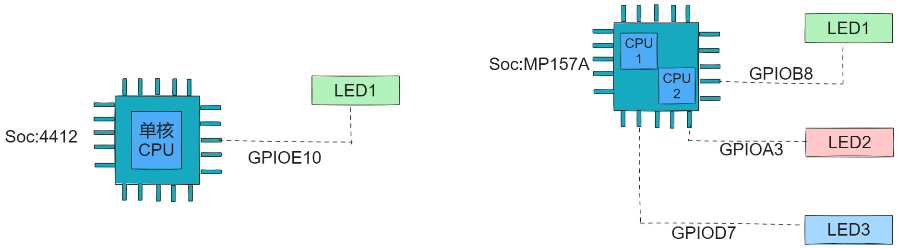
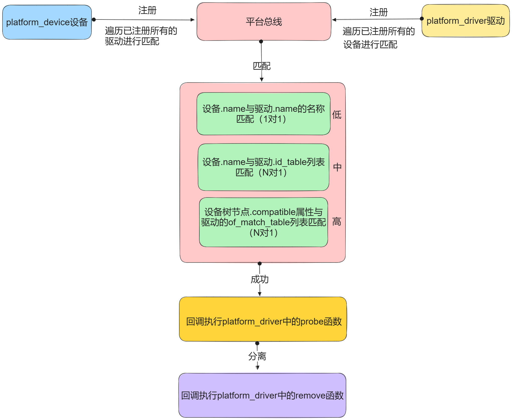

# 第一节、什么是平台总线platform?它有什么用？

## 1. 认识平台总线模型的作用与意义？

比如：如图所示：



**平台总线模型也叫platform总线模型，平台总线是Linux系统虚拟出现的总线，它是连接设备与驱动逻辑的抽象模型。**

**目的是把原来的代码分离成为两部分，**

**平台总线提供了一个统一设备与驱动进行管理的框架，**

## 2.平台总线是如何工作的呢？

**平台总线的原则：先分离，后搭档。**



平台总线模型将原来驱动中的设备信息与驱动逻辑分离，使用两个源文件中进行构建，分别是xxx_device.c （设备硬件的描述）和 xxx_driver.c(驱动逻辑)

即使用：

xxx_device.c  描述设备硬件。比如：在这个文件中我们有描述GPIO相应外设接口的寄存器地址信息，中断号等。

xxx_driver.c  	用来控制硬件。比如：在这个文件中我们书写如何操作GPIO，如何申请中断等逻辑。

# **第二节、platform_device设备资源信息模块：**

## **1.描述设备资源信息的platform_device结构体：**

```cpp
struct platform_device {
    const char  *name; //设备名称（重点关注，可以用于匹配）
    int     id; //设备的后缀id号，用于区分同一类型的多个设备的。一般id为-1，无后缀，或使用PLATFORM_DEVID_AUTO自动分配
    bool        id_auto;//自动分配设备后缀id号
    struct device   dev; //通用的设备结构体，类似于C++中的父类，包含了一些设备的基本共同属性。是设备模型中描述设备的类型。
    ...
    u32     num_resources;///*存储的硬件资源的个数，有几个资源就写几个*/
    struct resource *resource;//描述的设备硬件资源信息（重点关注）

    const struct platform_device_id *id_entry;//与驱动匹配成功后，被填充的匹配信息。
    
    char *driver_override; /* Driver name to force a match */
    /*驱动程序覆盖名。用于强制将设备绑定到指定名字的驱动。这个字段在某些情况下可以用于测试或特殊需求。*/
    ...
};

//资源结构体：
struct resource {
	    resource_size_t start;/*硬件起始地址*/
	    resource_size_t end;/*硬件终止地址*/
	    const char *name;/*硬件资源名*/
	    unsigned long flags;/*硬件的标记比如中断，还是IO等，相应的标记在下面有定义*/常用：IORESOURCE_MEM/IRQ/IO
	    unsigned long desc;//描述
	    struct resource *parent, *sibling, *child; //节点描述相关
};
```

## **2.定义平台设备对象，注册，注销：**

```c
int platform_device_register(struct platform_device *pdev);
函数功能：加载platform_device对象到平台总线上。
返回值：0代表成功，失败返回错误码。
对应：
void platform_device_unregister(struct platform_device *pdev)
;
函数功能：把platform_device从总线上卸载。
```

## **3.代码演示：**

```c
#include <linux/module.h>
#include <linux/init.h>
#include <linux/platform_device.h>
#define MYDEV_NAME "xxx_sample_chardev"
#define GPIOE_MODR 0x50006000
#define GPIOE_ODR 0x50006014
#define RCC_MP_AHB4_EN 0x50000a28 

struct resource my_device_001_res[] = {
    [0] = {
        .start = 0x50000a28,
        .end = 0x50000a28 + 0x4,
        .name = "rcc-reg",
        .flags = IORESOURCE_MEM,
        .desc = RCC_MP_AHB4_EN,
    },
    [1] = {
        .start = 0x50006000,
        .end = 0x50006000 + 0x4,
        .name = "gpioemode-reg",
        .flags = IORESOURCE_MEM,
        .desc = GPIOE_MODR,
    },
    [2] = {
        .start = 0x50006014,
        .end = 0x50006014 + 0x4,
        .name = "gpioeodr-reg",
        .flags = IORESOURCE_MEM,
        .desc = GPIOE_ODR,
    },
    [3] = {
        .start = 74,
        .end = 74,
        .flags = IORESOURCE_IRQ,
        .desc = 88
    }
};
//dev中的release方法：
void my_device_001_release(struct device *dev)
{

}
//定义一个平台设备:
struct platform_device my_platform_device = {
    .name = "gaowanxi,my_device_001",
    .id = -1,//自动分配，或者给-1;
    .resource = my_device_001_res,
    .num_resources = 4,
    .dev = {
        .release = my_device_001_release,
    }
};

//入口函数：
int __init my_test_module_init(void)
{
    int ret = 0;
    //注册：
    ret = platform_device_register(&my_platform_device);
    if(ret < 0)
    {
        return -1;
    }
    return 0;
}

//出口函数：
void __exit my_test_module_exit(void)
{
    //注销：
    platform_device_unregister(&my_platform_device);
}

//指定许可：
MODULE_LICENSE("GPL");
MODULE_AUTHOR("gaowanxi, email:gaonetcom@163.com");
//指定入口及出口函数：
module_init(my_test_module_init);
module_exit(my_test_module_exit);
```

# **第三节、platform_driver驱动模块：**

## **1.描述驱动逻辑的platform_driver结构体：**

```cpp
struct platform_driver {
    int (*probe)(struct platform_device *);//设备与驱动匹配成功时执行的探测函数的指针
    int (*remove)(struct platform_device *);//设备与驱动分离时执行时的回调函数的指针
    void (*shutdown)(struct platform_device *);//设备关闭及重启时的回调
    int (*suspend)(struct platform_device *, pm_message_t state);//设备挂起待机时的回调
    int (*resume)(struct platform_device *);//设备从低功耗状态恢复时的回调
    struct device_driver driver; //通用的设备驱动结构体。
    const struct platform_device_id *id_table;//id_table匹配表
    bool prevent_deferred_probe; //是否延时探测
};

struct device_driver {
    const char      *name;//驱动名称
    ...
    const struct of_device_id   *of_match_table;//设备树of样式匹配表，与设备节点.compatibl属性匹配
    const struct acpi_device_id *acpi_match_table;//acpi电源管理接口样式匹配
    ...
    struct driver_private *p;//私有数据，主要用于传参。
};
```

## 2. 注册与注销加载驱动到总线的函数与从总上卸载驱动的API：

```cpp
int platform_driver_register(struct platform_driver *) //注册驱动到platform总线上，并自动匹配platform_device或设备树
void platform_driver_unregister(struct platform_driver *)//从platform上卸载驱动
```

## **3.代码测试：**设备与驱动按照名称匹配，实现一对一的匹配：

```c
#include <linux/module.h>
#include <linux/init.h>
#include <linux/platform_device.h>

int my_dev_driver_probe(struct platform_device * my_platform_dev)
{
    printk("my_dev_driver_probe函数执行了\n");
    return 0;
}

int my_dev_driver_remove(struct platform_device *my_platform_dev)
{
    printk("my_dev_driver_remover函数执行了\n");
    return 0;
}

//1.定义一个平台驱动对象：
struct platform_driver my_platform_driver = {
    .probe = my_dev_driver_probe,
    .remove = my_dev_driver_remove,
    .driver = {
        .name = "gaowanxi,my_device_001",
    },
};

//入口函数：
int __init my_test_module_init(void)
{
    int ret = 0;
    ret = platform_driver_register(&my_platform_driver);
    if(ret < 0)
    {
        return -1;
    }
    return 0;
}

//出口函数：
void __exit my_test_module_exit(void)
{
    platform_driver_unregister(&my_platform_driver);
}

//指定许可：
MODULE_LICENSE("GPL");
MODULE_AUTHOR("gaowanxi, email:gaonetcom@163.com");
//指定入口及出口函数：
module_init(my_test_module_init);
module_exit(my_test_module_exit);
```

# **第四节、设备与驱动的匹配方式：**

## **1.匹配方式的方式有三种：**

```cpp
匹配规则的源代码如下所示：
static int platform_match(struct device *dev, struct device_driver *drv)
{
    struct platform_device *pdev = to_platform_device(dev);
    struct platform_driver *pdrv = to_platform_driver(drv);

    /* When driver_override is set, only bind to the matching driver */
    if (pdev->driver_override)
        return !strcmp(pdev->driver_override, drv->name);

    /* Attempt an OF style match first */of样式匹配，即设备树节点样式匹配
    if (of_driver_match_device(dev, drv))
        return 1;

    /* Then try ACPI style match */ACPI样式匹配，即高级配置电源接口样式匹配
    if (acpi_driver_match_device(dev, drv))
        return 1;

    /* Then try to match against the id table */ id_table匹配
    if (pdrv->id_table)
        return platform_match_id(pdrv->id_table, pdev) != NULL;

    /* fall-back to driver name match */ 名称匹配
    return (strcmp(pdev->name, drv->name) == 0);
}
```

## 2.设备名称与驱动的id_table匹配实现多对一的匹配：

代码演示：

### 1.平台驱动代码实例：

```cpp
#include <linux/module.h>
#include <linux/init.h>
#include <linux/platform_device.h>
#include <linux/mod_devicetable.h>

int my_dev_driver_probe(struct platform_device * my_platform_dev)
{
    printk("my_dev_driver_probe函数执行了\n");
    return 0;
}

int my_dev_driver_remove(struct platform_device *my_platform_dev)
{
    printk("my_dev_driver_remover函数执行了\n");
    return 0;
}

struct platform_device_id id_table_match[] = {
    [0] = {"WX,my_device_01",1},
    [1] = {"WX,my_device_02",2},
    [2] = {/*最后一个一定要给一个空元素，代表结束*/}
};

//1.定义一个平台驱动对象：
struct platform_driver my_platform_driver = {
    .probe = my_dev_driver_probe,
    .remove = my_dev_driver_remove,
    .driver = {
        .name = "WX,my_device_driver",
    },
    .id_table = id_table_match,
};

//入口函数：
int __init my_test_module_init(void)
{
    int ret = 0;
    ret = platform_driver_register(&my_platform_driver);
    if(ret < 0)
    {
        return -1;
    }
    return 0;
}

//出口函数：
void __exit my_test_module_exit(void)
{
    platform_driver_unregister(&my_platform_driver);
}

//指定许可：
MODULE_LICENSE("GPL");
MODULE_AUTHOR("gaowanxi, email:gaonetcom@163.com");
//指定入口及出口函数：
module_init(my_test_module_init);
module_exit(my_test_module_exit);
```

### 2.平台设备代码实例：

```cpp
#include <linux/module.h>
#include <linux/init.h>
#include <linux/platform_device.h>
#define MYDEV_NAME "xxx_sample_chardev"
#define GPIOE_MODR 0x50006000
#define GPIOE_ODR 0x50006014
#define RCC_MP_AHB4_EN 0x50000a28 

struct resource my_device_001_res[] = {
    [0] = {
        .start = 0x50000a28,
        .end = 0x50000a28 + 0x4,
        .name = "rcc-reg",
        .flags = IORESOURCE_MEM,
        .desc = RCC_MP_AHB4_EN,
    },
    [1] = {
        .start = 0x50006000,
        .end = 0x50006000 + 0x4,
        .name = "gpioemode-reg",
        .flags = IORESOURCE_MEM,
        .desc = GPIOE_MODR,
    },
    [2] = {
        .start = 0x50006014,
        .end = 0x50006014 + 0x4,
        .name = "gpioeodr-reg",
        .flags = IORESOURCE_MEM,
        .desc = GPIOE_ODR,
    },
    [3] = {
        .start = 74,
        .end = 74,
        .flags = IORESOURCE_IRQ,
        .desc = 88
    }
};
//dev中的release方法：
void my_device_001_release(struct device *dev)
{

}
//定义一个平台设备:
struct platform_device my_platform_device = {
    .name = "WX,my_device_01",
    .id = -1,//自动分配，或者给-1;
    .resource = my_device_001_res,
    .num_resources = 4,
    .dev = {
        .release = my_device_001_release,
    }
};

//入口函数：
int __init my_test_module_init(void)
{
    int ret = 0;
    //注册：
    ret = platform_device_register(&my_platform_device);
    if(ret < 0)
    {
        return -1;
    }
    return 0;
}

//出口函数：
void __exit my_test_module_exit(void)
{
    //注销：
    platform_device_unregister(&my_platform_device);
}

//指定许可：
MODULE_LICENSE("GPL");
MODULE_AUTHOR("gaowanxi, email:gaonetcom@163.com");
//指定入口及出口函数：
module_init(my_test_module_init);
module_exit(my_test_module_exit);
```

## 3.设备树节点中的.compatible属性与of_match_table匹配实现多对一的匹配。

《在设备树章节进行介绍》

# 第五节、驱动中获取设备资源的方式：

## 1.通过回调的probe函数的行参就可以获取：

```cpp
int myleds_driver_probe(struct platform_device *pdev)
{
    printk("匹配成功执行myleds_driver_probe\n");
    //通过匹配成功的探测函数中的pdev参数获取。
    printk("获取的mychar_dev的硬件中的rcc信息为：%#x\n",pdev->xxx_属性)
    return 0;
}
```

## 2. 通过Linux关于总线platform中内核的API接口函数：

```cpp
struct resource* platform_get_resource(struct platform_device* pdev，unsigned int type，unsigned int index);
//参数1：即设备对象指针
//参数2：即设备资源的类型：即那个flags标记类型是内存资源，还是中断资源，还是什么别的资源等。
//参数3：即同类资源所处位置的索引值（注意是同类资源的索引）
//功能：返回获取到的资源，失败返回NULL
```

# 第六节、综合应用，平台总线的方式点灯：

## 1.平台驱动模块代码实例：

```cpp
#include <linux/module.h>
#include <linux/init.h>
#include <linux/platform_device.h>
#include <linux/mod_devicetable.h>
#include <linux/fs.h>
#include <linux/cdev.h>
#include <linux/slab.h>
#include <linux/io.h>
// 封装自定义的设备结构体：
struct myled_device
{
    // 提供设备号与操作方法的：
    struct cdev* c_dev;
    // 创建设备节点的
    struct class* dev_class;
    struct device* dev;
    // 添加映射属性：
    int* rcc_enable;
    int* gpioe_modr;
    int* gpioe_odr;
};

struct myled_device myled = {0};
int myled_open(struct inode *inode, struct file *file)
{
    printk("myled_open 执行了\n");
    return 0;
}
ssize_t myled_write(struct file *file, const char *usrbuf, size_t size, loff_t *offset)
{
    char k_buf[128] = {0};
    printk("myled_write 执行了\n");
    copy_from_user(k_buf + *offset,usrbuf,size);
    if(k_buf[0] == '1')
    {
        *myled.gpioe_odr |= 0x1 << 10;
    }
    else{
        *myled.gpioe_odr &= ~(0x1 << 10);
    }
    return size;
}
ssize_t myled_read(struct file *file, char *usrbuf, size_t size, loff_t *offset)
{
    printk("myled_read 执行了\n");
    return size;
}

int myled_close(struct inode *inode, struct file *file)
{
    printk("myled_close 执行了\n");
    return 0;
}
struct file_operations fops = {
    .open = myled_open,
    .read = myled_read,
    .write = myled_write,
    .release = myled_close,
};

int my_dev_driver_probe(struct platform_device *pdev)
{
    // 1.在驱动中实现上通：建立向上提供的接口（操作方法fops）,设备号，设备节点
    // 提供操作方法fops:
    myled.c_dev = cdev_alloc();
    cdev_init(myled.c_dev,&fops);
    //申请设备号：
    alloc_chrdev_region(&myled.c_dev->dev,0, 1, pdev->name);
    //把cdev注册到内核设备管理链表中：
    cdev_add(myled.c_dev,myled.c_dev->dev,1);

    myled.dev_class = class_create(THIS_MODULE, "MYLED");

    myled.dev = device_create(myled.dev_class,NULL,myled.c_dev->dev,NULL, pdev->name);

    // 2.下达：获取硬件资源信息，并建立映射：
    myled.rcc_enable = ioremap(pdev->resource[0].start, 4);
    printk("rcc = %#x\n",pdev->resource[0].start);
    *myled.rcc_enable |= 0x1 << 4;

    myled.gpioe_modr = ioremap(pdev->resource[1].start, 4);
    printk("modr = %#x\n",pdev->resource[1].start);
    *myled.gpioe_modr &= ~(0x1 << 21);
    *myled.gpioe_modr |= 0x1 << 20;

    myled.gpioe_odr = ioremap(pdev->resource[2].start, 4);
    *myled.gpioe_odr &= ~(0x1 << 10);
    printk("odr = %#x\n",pdev->resource[2].start);

    return 0;
}

int my_dev_driver_remove(struct platform_device *pdev)
{
    printk("my_dev_driver_remover函数执行了\n");
    device_destroy(myled.dev_class, myled.c_dev->dev);
    class_destroy(myled.dev_class);
    kfree(myled.c_dev);
    return 0;
}
//匹配列表：
struct platform_device_id id_table_match[] = {
    [0] = {"WX,my_device_01", 1},
    [1] = {"WX,my_device_02", 2},
    [2] = {/*最后一个一定要给一个空元素，代表结束*/}};

// 1.定义一个平台驱动对象：
struct platform_driver my_platform_driver = {
    .probe = my_dev_driver_probe,
    .remove = my_dev_driver_remove,
    .driver = {
        .name = "WX,my_device_driver",
    },
    .id_table = id_table_match,
};

// 入口函数：
int __init my_test_module_init(void)
{
    int ret = 0;
    ret = platform_driver_register(&my_platform_driver);
    if (ret < 0)
    {
        return -1;
    }
    return 0;
}

// 出口函数：
void __exit my_test_module_exit(void)
{
    platform_driver_unregister(&my_platform_driver);
}

// 指定许可：
MODULE_LICENSE("GPL");
MODULE_AUTHOR("gaowanxi, email:gaonetcom@163.com");
// 指定入口及出口函数：
module_init(my_test_module_init);
module_exit(my_test_module_exit);
```

## 2.平台设备模块代码：

```cpp
#include <linux/module.h>
#include <linux/init.h>
#include <linux/platform_device.h>
#define MYDEV_NAME "xxx_sample_chardev"
#define GPIOE_MODR 0x50006000
#define GPIOE_ODR 0x50006014
#define RCC_MP_AHB4_EN 0x50000a28 

struct resource my_device_001_res[] = {
    [0] = {
        .start = 0x50000a28,
        .end = 0x50000a28 + 0x4,
        .name = "rcc-reg",
        .flags = IORESOURCE_MEM,
        .desc = RCC_MP_AHB4_EN,
    },
    [1] = {
        .start = 0x50006000,
        .end = 0x50006000 + 0x4,
        .name = "gpioemode-reg",
        .flags = IORESOURCE_MEM,
        .desc = GPIOE_MODR,
    },
    [2] = {
        .start = 0x50006014,
        .end = 0x50006014 + 0x4,
        .name = "gpioeodr-reg",
        .flags = IORESOURCE_MEM,
        .desc = GPIOE_ODR,
    },
    [3] = {
        .start = 74,
        .end = 74,
        .flags = IORESOURCE_IRQ,
        .desc = 88
    }
};
//dev中的release方法：
void my_device_001_release(struct device *dev)
{
    printk("移除了设备\n");
}
//定义一个平台设备:
struct platform_device my_platform_device = {
    .name = "WX,my_device_01",
    .id = -1,//自动分配，或者给-1;
    .resource = my_device_001_res,
    //有几个资源就写几个。
    .num_resources = 4,
    .dev = {
        .release = my_device_001_release,
    }
};

//入口函数：
int __init my_test_module_init(void)
{
    int ret = 0;
    //注册：
    ret = platform_device_register(&my_platform_device);
    if(ret < 0)
    {
        return -1;
    }
    return 0;
}

//出口函数：
void __exit my_test_module_exit(void)
{
    //注销：
    platform_device_unregister(&my_platform_device);
}

//指定许可：
MODULE_LICENSE("GPL");
MODULE_AUTHOR("gaowanxi, email:gaonetcom@163.com");
//指定入口及出口函数：
module_init(my_test_module_init);
module_exit(my_test_module_exit);
```

## 3.应用层代码:

```cpp
#include <stdio.h>
#include <sys/types.h>
#include <sys/stat.h>
#include <fcntl.h>
#include <unistd.h>
#include <string.h>
#include <stdbool.h>
#include <sys/ioctl.h> 

int main(int argc, char const *argv[])
{
    int fd = open("/dev/WX,my_device_01", O_RDWR);
    if (fd == -1)
    {
        perror("open err");
        return -1;
    }
    char buf[128] = {0};
    int nbytes = 0;
    while (true)
    {
        printf("请输入：\n");
        fgets(buf,sizeof(buf),stdin);
        nbytes = write(fd,buf,strlen(buf));
        if(nbytes == -1)
        {
            perror("write err:");
            return -1;
        }
    }

    close(fd);

    return 0;
}

```

## 4.总结：     

**平台总线的原则：先分离，后搭档。**