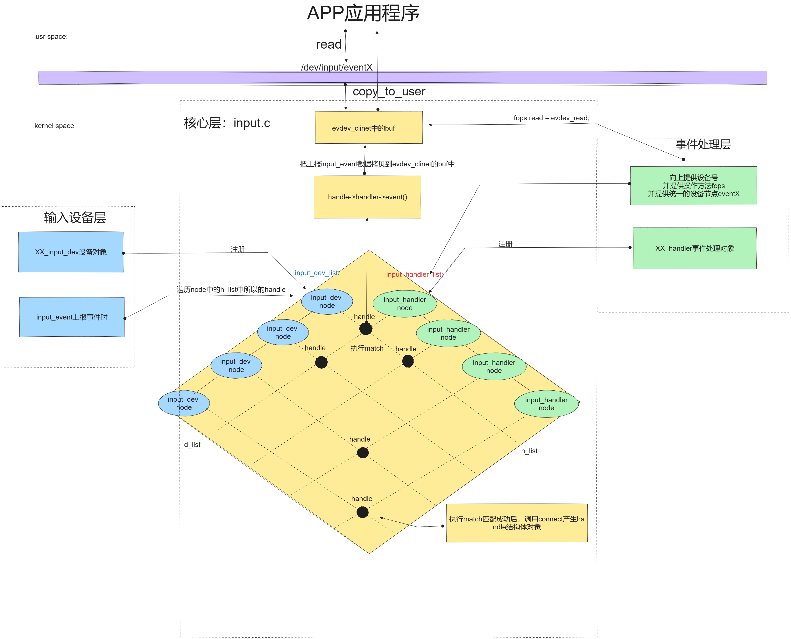

# 第一节、为什么要有input子系统？作用与意义是什么？

**抛出一个问题：**

**在没有输入子系统前，我们是如何驱动一个设备的？以键盘按下一个a键为例：**

**我们大概要三步：**

**1  为键盘所在的usb总线，写一个总线驱动逻辑，获取usb设备数据。**

**2. 为键盘写一套中断驱动逻辑：按下a键，触发中断，在中断处理函数中把a的扫描码通过总线发给SOC的gpio口。**

**3.为键盘写一套字符设备驱动逻辑：创建设备节点，并在xxx_read中把获取的a键的扫描转换为字符‘a’，再copy_to_user到用户程序APP中。**

**4.通过APPread读走这个字符。**

**我们何不把这些设备驱动构建的共同点抽象出来形成一个系统，把差异留给工程师们呢，这样即可兼容所有输入设备，而且快速开发！何乐而不为！所以我们来学习一下input输入子系统是如何抽象的，我们又该如何使用这个子系统！**

所以说input系统就是Linux专门为输入类设备编写的一个子系统框架，从而规范驱动开发，降低了开发难度，并且开发的驱动的通用性及兼容性更强。

常见的输入设备有：键盘，鼠标、游戏杆、触摸屏等，由用户直接操作设备而产生输入电信号的设备都是输入设备。  

# **第二节、input输入子系统框架结构：**

## 1.分层框图：


详情请查阅此图的原文链接：[https://blog.csdn.net/weixin_42031299/article/details/125111946](https://blog.csdn.net/weixin_42031299/article/details/125111946)，我根据相关资料画了一下调用框图，方便大家理解：

## 2.内部调用关系框图：



**通过以上方式建立了弱耦合的input输入子系统，它的意义与作用：**

**1)统一了物理形态各异的输入设备的处理方法。对不同的输入设备，大致分为按键类、相对坐标类、绝对坐标类等，每个类在核心层和事件处理层如何处理都是代码已经写好的，我们只需要学习接口的使用；**

**(2)供用于分发输入报告给用户应用程序的简单事件接口。对于应用程序来说，输入类设备都同一用struct input_event结构体来表示，屏蔽了输入设备的差异；**

**(3)提炼出输入驱动程序的通用部分，简化驱动程序的开发和移植工作。核心层提供了输入设备的注册、卸载、事件上报接口，我们只需要根据核心层提供的接口和硬件的特性去编写驱动代码；**

# **第三节、输入子系统常用类型与相应API：    **

## 1. 描述输入设备的结构体：input_dev：

```cpp
struct input_dev {
	const char *name;	//设备名称
	const char *phys;	//设备在系统中的物理路径
	const char *uniq;	//设备唯一识别符
	struct input_id id;	//设备ID，包含总线类型(PCI 、 USB)、厂商ID,设备ID与 input handler 匹配的时会用到
 //    
	unsigned long evbit[BITS_TO_LONGS(EV_CNT)];	//设备支持的事件类型
	
	unsigned long keybit[BITS_TO_LONGS(KEY_CNT)];	//设备支持的具体的按键、按钮事件
	unsigned long relbit[BITS_TO_LONGS(REL_CNT)]; 	//设备支持的具体的相对坐标事件
	unsigned long absbit[BITS_TO_LONGS(ABS_CNT)];	//设备支持的具体的绝对坐标事件
	unsigned long mscbit[BITS_TO_LONGS(MSC_CNT)];	//设备支持的具体的混杂事件
	unsigned long ledbit[BITS_TO_LONGS(LED_CNT)];	//设备支持的具体的LED指示灯事件
	unsigned long sndbit[BITS_TO_LONGS(SND_CNT)];	//设备支持的具体的音效事件
	unsigned long ffbit[BITS_TO_LONGS(FF_CNT)];	//设备支持的具体的力反馈事件
	unsigned long swbit[BITS_TO_LONGS(SW_CNT)];	//设备支持的具体的开关事件

	unsigned int keycodemax;	//键盘码表的大小
	unsigned int keycodesize;	//键盘码表中的元素个数
	void *keycode;	//设备的键盘码表
	
	//下面两个是可选方法，用于配置和获取键盘码表
	int (*setkeycode)(struct input_dev *dev,
			  unsigned int scancode, unsigned int keycode);
	int (*getkeycode)(struct input_dev *dev,
			  unsigned int scancode, unsigned int *keycode);

	struct ff_device *ff;	//如果设备支持力反馈，则该成员将指向力反馈设备描述结构
	unsigned int repeat_key;	//保存上一个键值，用于实现软件自动重复按键（用户按住某个键不放）
	struct timer_list timer;	//用于软件自动重复按键的定时器

	int sync;		//在上次同步事件(EV_SYNC)发生后没有新事件产生，则被设置为 1 

	int abs[ABS_CNT];	//用于上报的绝对坐标当前值
	int rep[REP_MAX + 1];	//记录自动重复按键参数的当前值

	unsigned long key[BITS_TO_LONGS(KEY_CNT)];	//反映设备按键、 按钮的当前状态
	unsigned long led[BITS_TO_LONGS(LED_CNT)];	//反映设备LED指示灯的当前状态
	unsigned long snd[BITS_TO_LONGS(SND_CNT)];	//反映设备音效的当前状态
	unsigned long sw[BITS_TO_LONGS(SW_CNT)];	//反映设备开关的当前状态

	int absmax[ABS_CNT];	//绝对坐标的最大值
	int absmin[ABS_CNT];	//绝对坐标的最小值
	int absfuzz[ABS_CNT];	//绝对坐标的噪音值，变化小于该值的一半可忽略该事件
	int absflat[ABS_CNT];	//摇杆中心位置大小
	int absres[ABS_CNT];

	//提供以下4个设备驱动层的操作接口，根据具体的设备需求实现它们
	int (*open)(struct input_dev *dev);
	void (*close)(struct input_dev *dev);
	int (*flush)(struct input_dev *dev, struct file *file);
	//用于处理送到设备驱动层来的事件，很多事件在事件处理层被处理，但有的事件仍需送到设备驱动中．
	//如LED指示灯事件和音效事件，因为这些操作通常需要设备驱动执行（如点亮某个键盘指示灯） 
	int (*event)(struct input_dev *dev, unsigned int type, unsigned int code, int value);
	
	//指向独占该设备的输入句柄（ input handle ），通常设备驱动上报的事件会被分发到与设备
	//关联的所有事件处理程序（ input handler ）中处理，但如果通过ioctl 的EVIOCGRAB命令
	//设置了独占句柄，则上报事件只能被所设置的输入句柄对应的事件处理程序处理
	struct input_handle *grab;

	
 spinlock_t event_lock;	//调用 event （） 时需要使用该自旋锁来实现互斥
	struct mutex mutex;	//用于串行化的访问 open()、 close()和flush()等设备方法

	//记录输入事件处理程序(input handlers)调用设备open()方法的次数．保证设备open()方法是在
	//第一次调用 input_open_device()中被调用，设备close()方法在最后一次调用 input_close_device()中被调用
	unsigned int users;
	bool going_away;

	struct device dev;  //内嵌device结构

	struct list_head	h_list;	//与该设备相关的输入句柄列表(struct input handle)
	struct list_head	node;	//挂接到input_dev_list链表上
};

```

## 2.注册input_dev的函数接口：input_register_device()

```cpp
(1)input_register_devic()函数是核心层提供给设备驱动层用于注册输入设备的接口，传参就是设备驱动层构建好的struct input_dev结构体；
(2)注册函数需要将传入的struct input_dev结构体挂接到input_dev_list链表上；
(3)将传递进来的input_dev结构体和所有注册的事件驱动进行匹配，匹配上就会产生handle，并产生设备节点/dev/input/event0....eventX；
void input_register_device(struct input_dev *dev);
//作用：在输入子系统的核心层注册input输入设备：
//成功返回0，失败返回错误码。

 对应的就是：void input_unregister_device(struct input* dev);//卸载输入设备对象。
```

## 3.上报事件数据给输入子系统：input_event():

```c
void input_event(struct input_dev *dev, unsigned int type, unsigned int code, int value);
//作用：上报事件数据给输入子系统：
//参数：
dev: 指向 input_dev 结构体的指针，表示哪个输入设备生成了这个事件。
type: 事件类型，表示事件的类别。常见的事件类型有：
EV_KEY：按键事件（如键盘按键、鼠标按钮等）。
EV_REL：相对轴事件（如鼠标移动）。
EV_ABS：绝对轴事件（如触摸屏位置）。
EV_SYN：同步事件，用于标志一组事件的结束。
code: 事件代码，具体描述事件的子类别。对于按键事件（EV_KEY），code 表示具体的按键；对于轴事件（EV_REL 和 EV_ABS），code 表示具体的轴（如 REL_X 表示 X 轴移动）。
value: 事件值，表示事件的具体值。对于按键事件，这里通常是 1（按下）或 0（释放）；对于轴事件，这里表示移动的距离或位置的具体值。
//上报数据的结构体：
struct input_event{
    struct timeval time//事件发生的时间戳;
	__u16 type;//事件类型
	__u16 code;//事件编码 
	__s32 value;//事件值
};
//在应用层获取事件数据的格式，也应该按照这个类型来获取。
```

## 4.同步数据：void input_sync():

```c
void input_sync();
通知输入子系统已经完成一组事件数据的上报。事件数据传递结束。
```

## 5.其它相关的辅助函数：   

### 1.1创建并定义输入设备对象：input_allocate_device() 

```cpp
struct input_dev* input_allocate_device()
//功能：动态定义一个输入设备对象。
//返回值：成功返回输入设备对象的地址，失败返回NULL;
与之对应的就是回收输入设备对象：
input_free_device(struct input_dev *dev);
```

相应的事件类型及相关的宏定义在：

```c
#include <uapi/linux/input.h>头文件中包含的头文件：#include "input-event-codes.h"中
```

### 1.2使用set_bit设置输入设备的事件类型  比如键盘事件：

```c
set_bit(EV_KEY, xxx_input_dev->evbit);//设置什么事件类型
同理，也可以设备是那个按键产生输入事件：
set_bit(KEY_L,xxx_input_dev->keybit);//设置那个按键的事件？
```

# 第四节：输入子系统应用示例：

## 1.驱动代码：

```cpp
#include <linux/module.h>
#include <linux/init.h>
#include <linux/platform_device.h>
#include <linux/mod_devicetable.h>
#include <linux/fs.h>
#include <linux/cdev.h>
#include <linux/slab.h>
#include <linux/io.h>

#include <linux/of.h>
#include <linux/of_gpio.h>
#include <linux/gpio.h>
#include <asm-generic/gpio.h>
#include <linux/of_platform.h>
#include <linux/interrupt.h>
#include <linux/of_irq.h>
#include <linux/timer.h>
#include <linux/jiffies.h>
#include <linux/delay.h>
#include <linux/workqueue.h>
#include <linux/input.h>

struct MyKey
{
    u32 key1_interrupts;
    u8 key1_gpios;
    u32 key2_interrupts;
    u8 key2_gpios;
    u32 key3_interrupts;
    u8 key3_gpios;
    //添加一下irq属性：
    volatile u32 irq;
    //添加input_dev属性：
    struct input_dev* i_dev;
};
struct MyKey mykey = {0};

irqreturn_t threaded_irq_functions(int irq, void *dev)
{
    //mdelay(100);
    //阻塞式延时函数：
    msleep(50);
    if(mykey.irq == mykey.key1_interrupts)
    {
        if(gpio_get_value(mykey.key1_gpios) == 0)
        {
            printk("-------------------\n");
            //key1按下了：
            input_event(mykey.i_dev,EV_KEY,KEY_A,1);
            input_sync(mykey.i_dev);
        }
        else{
            //key1抬起了：
            input_event(mykey.i_dev,EV_KEY,KEY_A,0);
            input_sync(mykey.i_dev);
        }
    }
    if(mykey.irq == mykey.key2_interrupts)
    {
        if(gpio_get_value(mykey.key2_gpios) == 0)
        {
            //key2按下了：
            input_event(mykey.i_dev,EV_KEY,KEY_B,1);
            input_sync(mykey.i_dev);
        }
        else{
            //key2抬起了
            input_event(mykey.i_dev,EV_KEY,KEY_B,0);
            input_sync(mykey.i_dev);
        }
    }

    if(mykey.irq == mykey.key3_interrupts)
    {
        if(gpio_get_value(mykey.key3_gpios) == 0)
        {
            //key3按下了：
            input_event(mykey.i_dev,EV_KEY,KEY_C,1);
            input_sync(mykey.i_dev);
        }
        else{
            //key2抬起了
            input_event(mykey.i_dev,EV_KEY,KEY_C,0);
            input_sync(mykey.i_dev);
            
        }
    }
    return IRQ_HANDLED;
}

irqreturn_t key_ISR(int irq, void * dev)
{
    mykey.irq = irq;
    return IRQ_WAKE_THREAD;
}


int my_dev_driver_probe(struct platform_device *pdev)
{
    struct device_node* key_node;
    printk("my_dev_driver_probe probe函数执行\n");
        //获取key设备树象节点的对象指针：
    key_node = pdev->dev.of_node;
    //4.获取Key对象的linux中断号：
    mykey.key1_interrupts = of_irq_get(key_node,0);
    mykey.key1_gpios = of_get_named_gpio(key_node,"mykey_gpios",0);
    gpio_direction_input(mykey.key1_gpios);
    printk("irq = %d\n",mykey.key1_interrupts);
    printk("gpio = %d\n",mykey.key1_gpios);
    mykey.key2_interrupts = of_irq_get(key_node,1);
    mykey.key2_gpios = of_get_named_gpio(key_node,"mykey_gpios",1);
    gpio_direction_input(mykey.key2_gpios);
    mykey.key3_interrupts = of_irq_get(key_node,2);
    mykey.key3_gpios = of_get_named_gpio(key_node,"mykey_gpios",2);
    gpio_direction_input(mykey.key3_gpios);

    //5.请求中断并注册中断处理程序的函数;
    request_threaded_irq(mykey.key1_interrupts,key_ISR,threaded_irq_functions,IRQF_TRIGGER_RISING | IRQF_TRIGGER_RISING,"key1-interrupts",NULL);
    request_threaded_irq(mykey.key2_interrupts,key_ISR,threaded_irq_functions,IRQF_TRIGGER_RISING | IRQF_TRIGGER_RISING,"key2-interrupts",NULL);
    request_threaded_irq(mykey.key3_interrupts,key_ISR,threaded_irq_functions,IRQF_TRIGGER_RISING | IRQF_TRIGGER_RISING,"key3-interrupts",NULL);
    //....
    
    //6.初始化mykey中的input_dev对象：
    mykey.i_dev = input_allocate_device();

    //对输入设备匹配方式及事件相关进行设置：
    mykey.i_dev->id.bustype =  ID_BUS;

    set_bit(EV_KEY,mykey.i_dev->evbit);
    set_bit(KEY_A, mykey.i_dev->keybit);
    set_bit(KEY_B, mykey.i_dev->keybit);
    set_bit(KEY_C, mykey.i_dev->keybit);
    mykey.i_dev->name = "KEY";
    mykey.i_dev->phys = "soc/pf9/key";
    mykey.i_dev->uniq = "KEY";


    return 0;
}

int my_dev_driver_remove(struct platform_device *pdev)
{
    printk("my_dev_driver_remover函数执行了\n");

    input_unregister_device(mykey.i_dev);
    free_irq(mykey.key1_interrupts,NULL);
    free_irq(mykey.key2_interrupts,NULL);
    free_irq(mykey.key3_interrupts,NULL);
    return 0;
}

//设备树匹配方式：
struct of_device_id of_node_match_table[] = {
    [0] = {.compatible = "WX,my_device_key"},
    [2] = {/*最后一个一定要给一个空元素，代表结束*/}
};

// 1.定义一个平台驱动对象：
struct platform_driver my_platform_driver = {
    .probe = my_dev_driver_probe,
    .remove = my_dev_driver_remove,
    .driver = {
        .name = "WX,my_device_driver",
        //设备树的匹配方式：
        .of_match_table = of_node_match_table,
    },

};

// 入口函数：
int __init my_test_module_init(void)
{
    int ret = 0;
    ret = platform_driver_register(&my_platform_driver);
    if (ret < 0)
    {
        return -1;
    }
    return 0;
}

// 出口函数：
void __exit my_test_module_exit(void)
{
    platform_driver_unregister(&my_platform_driver);
}

// 指定许可：
MODULE_LICENSE("GPL");
MODULE_AUTHOR("gaowanxi, email:gaonetcom@163.com");
// 指定入口及出口函数：
module_init(my_test_module_init);
module_exit(my_test_module_exit);
```

## 2.应用层测试代码：

```cpp
#include <stdio.h>
#include <sys/types.h>
#include <sys/stat.h>
#include <fcntl.h>
#include <unistd.h>
#include <string.h>
#include <stdbool.h>
#include <sys/ioctl.h>
#include <sys/select.h>
#include <linux/input.h>
#include <sys/signal.h>
#include <arpa/inet.h>
int main(int argc, char const *argv[])
{
    int fd1 = open("/dev/input/event0", O_RDWR);
    if (fd1 == -1)
    {
        perror("open err");
        return -1;
    }
    struct input_event event_data = {0};
    int nbytes = 0;

    while (true)
    {
        memset(&event_data,0 ,sizeof(event_data));
        nbytes = read(fd1,&event_data,sizeof(event_data));
        if(nbytes == -1)
        {
            perror("read err:");
            return -1;
        }
        if(event_data.code == KEY_A) //获取温度
        {
            
            printf("A\n");
        }

        if(event_data.code == KEY_B)
        {
            printf("B\n");
        }
        if(event_data.code == KEY_C)
        {
            printf("C\n");
        }


    }
    

   
    close(fd1);

    return 0;
}

```