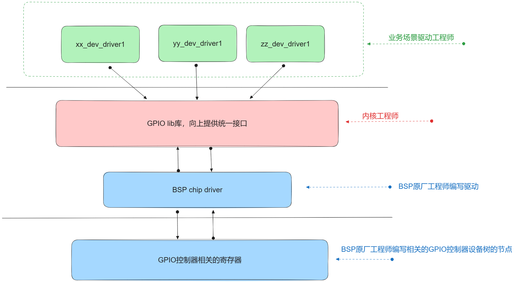

# 第一节、设备树简述：

## 1.什么是设备树？

设备树是一种数据结构，用于描述硬件设备及其配置。它采用类似于JSON或XML的树状结构，通过

### 1.1设备树的结构

设备树的基本结构包括根节点、子节点和属性。每个节点都可以包含多个子节点和属性，属性是以键值对的形式存在的。

示例：

```javascript
/dts-v1/;
/ {
    model = "Example Board";
    compatible = "example,board";
    cpus {
        #address-cells = <1>;
        #size-cells = <0>;
        cpu@0 {
            device_type = "cpu";
            compatible = "arm,cortex-a9";
            reg = <0>;
        };
        cpu@1 {
            device_type = "cpu";
            compatible = "arm,cortex-a9";
            reg = <1>;
        };
    };
    memory {
        device_type = "memory";
        reg = <0x80000000 0x40000000>;
    };
};
```

### 1.2 设备树文件：什么是dts文件，什么是dtc,什么是dtb文件？

1.  他们之间的关系：


dtsi: 即描述共享设备信息的部分：

dts: 即描述独有设备信息的部分：

dtc：设备树编译器

dtb: 设备树的二进制文件。

2.Linux中的设备树所在路径：dts,dtsi文件所在目录在哪？


在这个路径下去找自己开发板对应的设备树源码dts,dtsi即可。

### 1.3.如何编译设备树：

1. **在linux根目录下使用make dtbs会编译所有设备树文件。也可用以下方式单独进行编译**

1. 编译设备树就要使用编译器，linux中编译设备树的编译器是dtc。

编译设备树命令：

```javascript
dtc -I dts -O dtb -o mytest.dtb test_device_tree.dts
```

反编译设备树：

```javascript
dtc -I dtb -O dts -o hello.dts mytest.dtb
```

## 2.设备树是用来做什么的？

**现代驱动模型：**

为什么要用设备树替换原来总线中的设备模块呢？原因：

平台总线把设备资源信息与驱动分离，对于内核来讲，


这样当设备资源信息发生改变时，内核无需再次进行编译进行匹配，而是兼容。可以更好的对内核进行升级，无需编译设备。

## 3.分离后内核驱动要使用设备资源信息怎么办？

uboot固件程序会把内核镜像uImage及设备树的二进制文件，加载到不同的内存地址处。

内核会到某内存地址处自动解析设备树的二进制文件，解析为struct of_node结构体，最终会解析为struct platform_device与驱动进行匹配。


详细追踪内核启动函数start_kernel的分析：

[linux设备驱动程序-设备树(1)-dtb转换成device_node - 牧野星辰 - 博客园 (cnblogs.com)](https://www.cnblogs.com/downey-blog/p/10485596.html)

[linux设备驱动程序-设备树(2)-device_node转换成platform_device - 牧野星辰 - 博客园 (cnblogs.com)](https://www.cnblogs.com/downey-blog/p/10486568.html)

# 第二节、设备树语法：

设备树语法及如何使用：[设备树参考 - eLinux.org](https://elinux.org/Device_Tree_Reference#What_Is_Device_Tree)

## 1. 基本数据格式：设备树是一个简单的由节点和属性组成的树形结构。属性是键值对，而节点可以包含属性和子节点

### 1.使用“/{};”的方式代表系统总线节点，在总线上也就是大括号以再去描述相应的设备，以节点及子点的方法来表示连接关系。

如代码所示： 

```c
/dts-v1/;
/{//表示系统总线
    node1{//子节点1
         //   
    };
    node2{//子节点2
            
    };
};
同胞节点不可以重名，通过子节点的方式表示连接关系。
```

### 2.节点由一堆属性组成，使用简单的键值对的方法表示，表示方式如下：

表示方法有如下几种：

```javascript
string-property = "字符串";//值为单字符串。
stringlist-property = "字符串1"， “字符串2”，..., "字符串n";//用逗号隔开的字符串列表。
int32-property = <0x12 0x34 0x56> ;//用<>表示uint32的整数。
binarydata-property = [12 34 56];//使用[]时使用16进制数，可以不带0x前缀;
misc-list-property = "字符串"，<0x12 0x34 0x56>,[0x12 0x56 0x78];//也可以使用逗号的方式把不同的数据连接在一起。
```

代码示例：

```javascript
//设备树根节点：可以理解为系统总线：
/{
    myled1{
        model = "this is a led1 desc";
        //设备节点中信息的描述，使用键值对的方式：
        dev_type = "LED";
        rcc_e = <0x50000a28 0x4>;
        gpioe_modr = <0x50006000 0x4>;
        gpioe_odr = <0x50006014 0x4>;
        binary-data = [12 34 56];
    };

    myled2{
        ...
    };
};
```

### 3.总结：设备树原则上可以更加自由的通过键值对的方式来描述设备信息，也更加灵活。只要附合以上的基础结构就不会有错，但是要更标准的话，还要学习接下来的规则与基本写法。

Linux官方设备树手册的示例模型机的连接关系图：


## 2.基本规则写法（标准写法）：

### 1. 设备节点中compatible属性与status基本属性的写法及重要作用:

**compatible**

**status属性有两种："okay"启用设备，"disable"禁用设备，是一种状态的描述。status属性若在节点没有存在默认为okay状态。**

**当一个节点中有compatible属性及status = "okay"时的设备树节点，后由内核启动阶段转换为struct device_node后，最终转换为platform_device设备，与驱动进行匹配。**

```javascript
//版本号：
/dts-v1/;
//设备树根节点：可以理解为系统总线：
/{
    myled1{
        model = "this is a led1 desc";
        //用来与驱动进行匹配的
        compatible = "WX,my_device_01";
        //设备节点中信息的描述，使用键值对的方式：
        dev_type = "LED";
        rcc_e = <0x50000a28 0x4>;
        gpioe_modr = <0x50006000 0x4>;
        gpioe_odr = <0x50006014 0x4>;
        binary-data = [12 34 56];
        //status设置okay，表示启用此结点。
        status = "okay";
    };
    myled2{

    };
};
```

### 2.节点命名方式：节点名<name>，节点全名（节点名 @地址）

#### 2.1在设备树中，每个节点都必须有一个名字，形式为 <name>[@<unit-address>]。

<name>

```javascript
//版本号：
/dts-v1/;
//设备树根节点：可以理解为系统总线：
/{
    myled@50006000{
        model = "this is a led1 desc";
        //用来与驱动进行匹配的
        compatible = "WX,my_device_01";
        //设备节点中信息的描述，使用键值对的方式：
        dev_type = "LED";
        reg = <0x50006000 0x4 0x50006014 0x4 0x50000a28 0x4>;
        binary-data = [12 34 56];
        //status设置okay，表示启用此结点。
        status = "okay";
    };

    myled{
        ...
    };
};
```

**如果节点描述的是一个具有地址的设备，则包含 **

同级节点（sibling nodes）必须具有唯一的名称，但只要地址不同，多个节点使用相同的通用名称是正常的（例如，

#### 2.2节点的引用标签lable:

```javascript
//版本号：
/dts-v1/;
//设备树根节点：可以理解为系统总线：
/{
    //led1是myled的别名标签(引用节点)
    led1:myled@50006000{
        model = "this is a led1 desc";
        //用来与驱动进行匹配的
        compatible = "WX,my_device_01";
        //设备节点中信息的描述，使用键值对的方式：
        dev_type = "LED";
        reg = <0x50006000 0x4 0x50006014 0x4 0x50000a28 0x4>;
        binary-data = [12 34 56];
        //status设置okay，表示启用此结点。
        status = "okay";
    };

    myled{
        ...
    };
};
```

### 3.地址资源属性的描述方式：reg 属性：

内存映射设备使用以下属性将地址信息编码到设备树中：

- reg

- #address-cells

- #size-cells

每个内存映射设备都有一个 

由于地址和长度字段的大小都是可变的，父节点中的 

#### 3.1最简单的CPU寻址设备：

```javascript
cpus {
    #address-cells = <1>;
    #size-cells = <0>;
    cpu@0 {
        compatible = "arm,cortex-a9";
        reg = <0>;
    };
    cpu@1 {
        compatible = "arm,cortex-a9";
        reg = <1>;
    };
};
```

在cpus节点中，#address-cells被设置为1，而#size-cells被设置为0。这意味着子节点的reg值是一个单独的uint32，它表示地址，没有大小字段。在这种情况下，两个CPU被分配了地址0和1。对于CPU节点，#size-cells为0，因为每个CPU只被分配了一个地址。

您还会注意到reg值匹配节点名称中的值。按照惯例，如果节点有一个reg属性，那么节点名称必须包含单元地址（unit-address），即reg属性中的第一个地址值。

#### 3.2内存映射设备：

内存映射设备与CPU节点不同，它们被分配了一个地址范围，设备将响应这个范围内的地址。在子节点的

以下是一个示例，其中每个地址值和每个长度值都是一个单元（32位），这在32位系统中很常见。

64位机器可能会将

```javascript
/dts-v1/;  
  
/ {  
    #address-cells = <1>;  
    #size-cells = <1>;  
  
    ...  
  
    /* 串口设备，分配了一个地址范围 */  
    serial@101f0000 {  
        compatible = "arm,pl011";  
        reg = <0x101f0000 0x1000 >; /* 起始地址0x101f0000，长度0x1000 */  
    };  
  
    serial@101f2000 {  
        compatible = "arm,pl011";  
        reg = <0x101f2000 0x1000 >; /* 起始地址0x101f2000，长度0x1000 */  
    };  
  
    /* GPIO设备，分配了两个地址范围 */  
    gpio@101f3000 {  
        compatible = "arm,pl061";  
        reg = <0x101f3000 0x1000  /* 起始地址0x101f3000，长度0x1000 */  
               0x101f4000 0x0010>; /* 起始地址0x101f4000，长度0x0010 */  
    };  
  
    /* 中断控制器 */  
    interrupt-controller@10140000 {  
        compatible = "arm,pl190";  
        reg = <0x10140000 0x1000 >; /* 起始地址0x10140000，长度0x1000 */  
    };  
  
    /* SPI设备 */  
    spi@10115000 {  
        compatible = "arm,pl022";  
        reg = <0x10115000 0x1000 >; /* 起始地址0x10115000，长度0x1000 */  
    };  
    ...  
};
```

#### 3.3无内存映射设备：比如IIC设备：

在处理器总线上，有些设备并不是内存映射的。它们可能有地址范围，但这些地址范围不是直接由CPU访问的。相反，这些设备的访问是由其父设备的驱动程序代表CPU间接进行的。

以I²C（Inter-Integrated Circuit）设备为例，每个I²C设备都被分配了一个地址，但这个地址并没有与长度或范围相关联。这与CPU地址分配看起来非常相似，但实际上是有区别的。

在提供的示例中，I²C总线被分配了一个地址，但没有指定长度，因为I²C设备是通过I²C总线的通信协议来访问的，而不是直接通过内存映射。

```cpp
i2c@1,0 {  
    compatible = "acme,a1234-i2c-bus";  
    #address-cells = <1>; /* 用于描述子设备地址的单元数，这里是1 */  
    #size-cells = <0>;    /* 用于描述子设备大小或长度的单元数，这里是0，因为没有大小或长度 */  
    reg = <1 0 0x1000>;   //此为I2c1-0的地址映射空间  与rang属性相关
  
    rtc@58 {  
        compatible = "maxim,ds1338";  
        reg = <0x58>;        /* RTC设备的I²C地址是58 */  
    };  
};
```

#### 3.4总线或桥的地址范围ranges属性：

我们之前讨论了如何为设备分配地址，但此时这些地址仅限于设备节点本地。还没有描述如何从这些地址映射到CPU可以使用的地址。

根节点总是描述CPU对地址空间的视图。根节点的子节点已经使用了CPU的地址域，因此不需要任何显式的映射。例如，serial@101f0000设备直接分配了地址0x101f0000。

不是根节点直接子节点的节点不使用CPU的地址域。为了获得内存映射地址，设备树必须指定如何将地址从一个域翻译到另一个域。为此使用了ranges属性。

以下是添加了ranges属性的示例设备树。

```cpp
/dts-v1/;

/ {
    compatible = "acme,coyotes-revenge";
    #address-cells = <1>;
    #size-cells = <1>;
    ...
    external-bus {
        #address-cells = <2>;
        #size-cells = <1>;
        //ranges单元格父节点中的#address-cells的值与子节点中的#address-cells值，及子节点的#size-cells决定：
        ranges = <0 0  0x10100000   0x10000     
                   // Chipselect 1, Ethernet：0 0 是子地址（Ethernet本地地址），0x10100000是CPU的全局映射父地址，0x10000是映射空间大小。
                  1 0  0x10160000   0x10000     // Chipselect 2, i2c controller，同理...
                  2 0  0x30000000   0x1000000>; // Chipselect 3, NOR Flash，同理...

        ethernet@0,0 {
            compatible = "smc,smc91c111";
            reg = <0 0 0x1000>;
        };

        i2c@1,0 {
            compatible = "acme,a1234-i2c-bus";
            #address-cells = <1>;
            #size-cells = <0>;
            reg = <1 0 0x1000>;
            rtc@58 {
                compatible = "maxim,ds1338";
                reg = <58>;
            };
        };

        flash@2,0 {
            compatible = "samsung,k8f1315ebm", "cfi-flash";
            reg = <2 0 0x4000000>;
        };
    };
};
```

ranges是地址翻译列表。

ranges表中的每个条目都是一个元组，包含子地址、父地址和子地址空间的区域大小。每个字段的大小由子节点的#address-cells值、父节点的#address-cells值和子节点的#size-cells值决定。

另外，如果父地址空间和子地址空间是相同的，那么节点可以添加一个空的ranges属性。空的ranges属性的存在意味着子地址空间中的地址1:1地映射到父地址空间。

你可能会问，为什么在可以使用1:1映射时还使用地址翻译。有些总线（如PCI）有完全不同的地址空间，这些细节需要向操作系统暴露。其他总线有DMA引擎，需要知道总线上的实际地址。有时设备需要分组，因为它们共享相同的软件可编程物理地址映射。是否使用1:1映射在很大程度上取决于操作系统需要的信息和硬件设计。

你还会注意到在i2c@1,0节点中没有ranges属性。原因是与外部总线不同，i2c总线上的设备在CPU的地址域中不是内存映射的。相反，CPU通过i2c@1,0设备间接访问rtc@58设备。没有ranges属性意味着设备不能被它的父设备之外的任何设备直接访问。

### **4.连接中断控制器的设备的节点中的描述方式：**

与地址范围转换遵循树的自然结构不同，中断信号可以起源于并终止于机器中的任何设备。与设备地址在设备树中自然表达不同，中断信号被表达为节点之间的链接，这些链接独立于树结构。描述中断连接的四个属性是：

- interrupt-controller：一个空属性，**声明一个节点为接收中断信号的设备**。

- #interrupt-cells：**这是中断控制器节点的属性。它声明了该中断控制器的中断说明符中有多少个单元**（类似于#address-cells和#size-cells）。

- interrupt-parent：**设备节点的一个属性，包含指向它所连接的中断控制器的phandle**。没有interrupt-parent属性的节点也可以从其父节点继承该属性。

- interrupts：**设备节点的一个属性，包含一个中断说明符列表，每个中断输出信号对应一个**。

中断说明符是一个或多个数据单元（由

示例：

```javascript

/dts-v1/;

/ {
    compatible = "acme,coyotes-revenge";
    #address-cells = <1>;
    #size-cells = <1>;
    
    cpus {
        #address-cells = <1>;
        #size-cells = <0>;
        cpu@0 {
            compatible = "arm,cortex-a9";
            reg = <0>;
        };
        cpu@1 {
            compatible = "arm,cortex-a9";
            reg = <1>;
        };
    };
    //中断控制器节点：
    intc: interrupt-controller@10140000 {
        compatible = "arm,pl190";
        reg = <0x10140000 0x1000 >;
        //声明此节点为中断控制器节点：
        interrupt-controller;
        //声明了该中断控制器的中断说明符中有2个单元：中断10管脚控制器及中断触发方式
        #interrupt-cells = <2>;
    };

    serial@101f0000 {
        compatible = "arm,pl011";
        reg = <0x101f0000 0x1000 >;
        //此串口设备有连接到中断控制器：
        interrupt-parent = <&intc>;
        //中断控制intc中的第1索引中断控制器，0下降边沿角触发中断。1，表中上升边沿触发中断 等等...
        interrupts = < 1 0 >;
    };

    serial@101f2000 {
        compatible = "arm,pl011";
        reg = <0x101f2000 0x1000 >;
        //此串口设备有连接到中断控制器：
        interrupt-parent = <&intc>;
        //中断控制intc中的第2索引中断控制器，0下降边沿角触发中断。1，表中上升边沿触发中断 等等...
        interrupts = < 2 0 >;
    };
    
    spi@10115000 {
        compatible = "arm,pl022";
        reg = <0x10115000 0x1000 >;
        //此串口设备有连接到中断控制器：
        interrupt-parent = <&intc>;
        //中断控制intc中的第3索引中断控制器，0下降边沿角触发中断。1，表中上升边沿触发中断 等等... 
        interrupts = < 4 0 >;
    };
};
```

### **5.连接GPIO控制器的设备的节点中的描述方式：**

与地址范围转换遵循树的自然结构不同，中断信号可以起源于并终止于机器中的任何设备。与设备地址在设备树中自然表达不同，中断信号被表达为节点之间的链接，这些链接独立于树结构。描述中断连接的四个属性是：

- gpio-controller：一个空属性，**声明一个节点为gpio控制器的设备**。在控制器设备描述中使用。

- #gpio-cells：**这是中断控制器节点的属性。它声明了该gpio控制器的gpio说明符中有多少个单元**（类似于#address-cells和#size-cells）。

```javascript
/{
    soc{
        ...
        //gpio_e为一个引用标签节点，节点gpio@50006000的别名;
        gpio_e: gpio@50006000{
            //声明此设备节点为一个gpio控制器
            gpio-controller;
            //声明了连接gpio控制器的设备子节点中gpio说明符中有两个单元。
            #gpio-cells = <2>;
            //声明此设备节点亦为一个中断控制器
            interrupt-controller;
            #interrupt-cells = <2>;
            reg = <0x4000 0x400> //基地址 与 偏移量的方式表示。
            //使用的运行时钟：
            clocks = <0xb 0x58>;
            st,bank-name = "GPIOE";
            status = "okay";
        }; 
        ...   
    };
    
    myled1{
        //设备匹配驱动的属性：
        compatible = "WX,myled8858"; 
        //以下为连接gpio控制器的方式：第一个值为使用哪一个gpio控制器，要求引用控制的引用标签，也代表连接关系。
        //10即为gpio_x端口的某个索引的管脚编号，0代表默认状态为低电平。
        gpios = <&gpio_e 10 0>;
    };
};
```

### 6.引脚多路复用的设备节点的描述：pinctrl相关属性：

在设备树中，描述引脚多路复用（Pin Multiplexing，也称为 Pinmux）的设备节点时，通常会涉及到引脚复用控制器（Pin Controller）和特定的引脚组配置。引脚复用控制器用于管理引脚的多功能配置，使得一个引脚可以在不同的设备或功能之间切换。引脚复用功能的状态描述及复用的功能常用以下方式进行描述：

- pinctrl-names：定义引脚控制配置集的名称列表。你可以为每个配置集选择任何有意义的名称，如 default, idle, sleep, active 等。

- pinctrl-0, pinctrl-1, ...：这些属性引用实际的引脚控制配置，顺序与 pinctrl-names 中的名称列表一一对应。

通过以上的方式对相关的控制器进行配置：比如I2C控制进行配置时，如果要配置引脚功能为I2c的SCL及SDA时：

示例：

```cpp
//以下为stm32157平台上的i2c示例：
        /{
            soc{
                    i2c1: i2c@40012000 {
                    compatible = "st,stm32mp15-i2c";
                    reg = <0x40012000 0x400>;
                    interrupt-names = "event", "error";
                    interrupts-extended = <&exti 21 IRQ_TYPE_LEVEL_HIGH>,
                                          <&intc GIC_SPI 32 IRQ_TYPE_LEVEL_HIGH>;
                    clocks = <&rcc I2C1_K>;
                    resets = <&rcc I2C1_R>;
                    #address-cells = <1>;
                    #size-cells = <0>;
                    status = "disabled";
                    };          
            }; 
            pinctrl{
                i2c1_pins_b: i2c1-1 {
                                    pins {
                                            pinmux = <STM32_PINMUX('F', 14, AF5)>, /* I2C1_SCL */
                                                     <STM32_PINMUX('F', 15, AF5)>; /* I2C1_SDA */
                                            bias-disable;
                                            drive-open-drain;
                                            slew-rate = <0>;
                                     };
                               };

                i2c1_sleep_pins_b: i2c1-sleep-1 {
                                     pins {
                                                pinmux = <STM32_PINMUX('F', 14, ANALOG)>, /* I2C1_SCL */
                                                 <STM32_PINMUX('F', 15, ANALOG)>; /* I2C1_SDA */
                                      };
                                };            
                    };                          
        };
        //如果对i2c1这个控制器进行配置相应的引脚为scl与sda功能的话：配置如下：
&i2c1{
    pinctrl-names = "default","sleep";    
	pinctrl-0 = <&i2c1_pins_b>;        //工作状态管脚复用GPIOF_14/GPIOF_15复用为I2C_SCL与SDA功能。
    pinctrl-1 = <&i2c1_sleep_pins_b>;  //休眠状态管脚复用  
	status = "okay";
    //子节点即为连接在I2C1控制器上的I2c设备。
    si7006@40{
        compatible = "si7006";
    	reg = <0x40>;
    };
};
        
```

复用引脚功能还有很多，比如定时器功能，spi功能，uart功能等，大家可以举一返三就可以了。

### 总结：以上就是设备树的基本的通用属性的描述，当然设备树很灵活，可以自由的进行设置。但要遵从一定的基本规则。其它的更加详细与具体细节的用法可以查看内核说明手册DeviceTree下的Docment/bindings目录查看。

**以后还有连接到I2C控制器的设备，及连接到SPI控制器的设备等...的设备节点的描述，到时去查看相应的对应手册即可了。**

# **第三节、设备树中的设备节点在内核使用时会被翻译成什么数据结构？**

## **1.认识struct device_node与struct platform_device之间的关系，如图所示：**


### 1.1了解device_node结构体：设备树节点结构体

首先来看一下这个device_node结构体的原型：

```cpp
struct device_node {
	    const char *name;//节点名称：
	    phandle phandle; //节点引用值，类似于引用记数
	    const char *full_name;//全称
	    struct fwnode_handle fwnode;

	    struct	property *properties;//属性结构体
	    struct	property *deadprops;	/* removed properties */已经被删除了此属性
	    struct	device_node *parent;//父节点：
	    struct	device_node *child; //子节点：
	    struct	device_node *sibling;//兄弟节点
#if defined(CONFIG_OF_KOBJ)
	    struct	kobject kobj;
#endif
	    unsigned long _flags;
	    void	*data;
#if defined(CONFIG_SPARC)
    	unsigned int unique_id;
	    struct of_irq_controller *irq_trans;
#endif
};

内部property属性结构体：
struct property {
	    char	*name;//属性名字，官话就是键值。
	    int	length;//属性长度，即值所点用的字节数。
	    void	*value;//属性值 ，官话就是实值。
	    struct property *next; //下一个属性节点，所有属性之间是用链接管理的。同一节点内的所有属性构成一条单链表。

};
```

# 第四节、设备树节点与驱动匹配方式：

## 1.of_match_table匹配实现一对多的匹配方式：

代码实例：

```c
#include <linux/module.h>
#include <linux/init.h>
#include <linux/platform_device.h>
#include <linux/mod_devicetable.h>
#include <linux/fs.h>
#include <linux/cdev.h>
#include <linux/slab.h>
#include <linux/io.h>

#include <linux/of.h>
#include <linux/of_gpio.h>
#include <linux/gpio.h>
#include <asm-generic/gpio.h>
#include <linux/of_platform.h>

int myled_open(struct inode *inode, struct file *file)
{
    printk("myled_open 执行了\n");
    return 0;
}
ssize_t myled_write(struct file *file, const char *usrbuf, size_t size, loff_t *offset)
{
    printk("myled_write 执行了\n");

    return size;
}
ssize_t myled_read(struct file *file, char *usrbuf, size_t size, loff_t *offset)
{
    printk("myled_read 执行了\n");
    return size;
}

int myled_close(struct inode *inode, struct file *file)
{
    printk("myled_close 执行了\n");
    return 0;
}

int my_dev_driver_probe(struct platform_device *pdev)
{

    printk("my_dev_driver_probe probe函数执行\n");
    printk("设备节点的名称 = %s\n",pdev->name);
    printk("资源1 = %#x \n",pdev->resource[0].start);
    printk("资源2 = %#x \n",pdev->resource[1].start);
    printk("资源3 = %#x \n",pdev->resource[2].start);
    return 0;
}

int my_dev_driver_remove(struct platform_device *pdev)
{
    printk("my_dev_driver_remover函数执行了\n");
    return 0;
}

struct platform_device_id id_table_match[] = {
    [0] = {"WX,my_device_01", 1},
    [1] = {"WX,my_device_02", 2},
    [2] = {/*最后一个一定要给一个空元素，代表结束*/}
};

//设备树匹配方式：
struct of_device_id of_node_match_table[] = {
    [0] = {.compatible = "WX,my_device_01"},
    [1] = {.compatible = "WX,my_device_02"},
    [2] = {/*最后一个一定要给一个空元素，代表结束*/}
};

// 1.定义一个平台驱动对象：
struct platform_driver my_platform_driver = {
    .probe = my_dev_driver_probe,
    .remove = my_dev_driver_remove,
    .driver = {
        .name = "WX,my_device_driver",
        //设备树的匹配方式：
        .of_match_table = of_node_match_table,
    },
    .id_table = id_table_match,
};

// 入口函数：
int __init my_test_module_init(void)
{
    int ret = 0;
    ret = platform_driver_register(&my_platform_driver);
    if (ret < 0)
    {
        return -1;
    }
    return 0;
}

// 出口函数：
void __exit my_test_module_exit(void)
{
    platform_driver_unregister(&my_platform_driver);
}

// 指定许可：
MODULE_LICENSE("GPL");
MODULE_AUTHOR("gaowanxi, email:gaonetcom@163.com");
// 指定入口及出口函数：
module_init(my_test_module_init);
module_exit(my_test_module_exit);
```

# 第五节、设备树节点中使用GPIO资源的描述方式，及GPIO子系统操作GPIO的API：

对于像led这样的直接连接到gpio控制器的设备，可以直接使用gpio子系统的方式来描述设备所使用的gpio资源。

那么像这样的设备树有节点如何描述呢？先来了解一下Linux提供的这种子系统的框图，子系统主要是为了驱动开发更方便，更统一。

## 1. GPIO子系统框架图：（站在巨人的肩膀上or成为**巨人**）



## 2. 设备使用gpio资源在设备节点中的描述方式：

```javascript
//led1就是myled@50006000的引用别名。
/{
    ...
    myled{
        model = "this is a led1 desc";
        //用来与驱动进行匹配的
        compatible = "WX,my_device_01";
        //设备节点中信息的描述，使用键值对的方式：
        dev_type = "LED";
        //平台设备中的struct rescourse属性，start属性就是这里的地址。
        myled_gpios = <&gpioe 10 0>,<&gpiof 10 0>,<&gpioe 8 0>;
        //status设置okay，表示启用此结点。
        status = "okay";
    };
};
```

## 3.GPIO子系统相关的API快速操作硬件:

### 1. 获取GPIO号的方式：

**GPIO 号**

#### 1.1直接算：计算方法如下：

**GPIO号 = 控制引脚的寄存器基数（16 * x）+ 控制引脚寄存器位数（y）**

**基数 = 32位的芯片一般是16，64位芯片一般是32;具体还要看SOC芯片的手册中的框图介绍。**

**x如果是数字就是x = 数字， x是字母 x = 字母 - A的值;**

比如MP157a32位芯片中的GPIOE10 的gpio号 = (E - A) * 16 + 10 =  74;

#### 1.2使用API: of_get_name_gpio直接获取GPIO号:

```c
#include <linux/of_gpio.h>
int of_get_named_gpio(const struct device_node *np,
 const char *propname, int index);
//功能：获取系统的某gpio号
参数：
np:结节对象的指针
propname:属性名 
index：下标，即gpio资源是一个列表时，相应的gpio资源的索引值。从0开始。
成功返回 gpio编号，失败则为错误码。
所以获取设备节点，也是前提哦。
```

### 2  请求GPIO资源会调用gpio子系统中的相关的初始化，主要用来防止竞态。当使用gpio进入写操作时的竞态保护。函数原型：

```cpp
#include <linux/gpio.h>
int gpio_request(unsigned gpio, const char *label)
功能：申请当前进程使用GPIO号，防止进程竞态出现。
参数：
gpio号 （设备树中获取）这里很关键。
label:用于标识该 GPIO 的标签。不使用，可以写NULL,主要作用是这个标签可以帮助在调试或日志中识别哪个模块或驱动程序请求了这个 GPIO。
返回值，成功返回0，失败返回错误码。
```

### 3.设置GPIO方向：输入，输出

```cpp
//设置gpio为输入：
static inline int gpio_direction_input(unsigned gpio);
//设置gpio为输出：
static inline int gpio_direction_output(unsigned gpio,int value);
value:是指输出的高，或低电平。1为高，0为低。
```

### 4.获取gpio管脚电平状态：

```cpp
//获取某gpio管脚的电平：
int gpio_get_value(unsigned int gpio)
//设置某gpio管脚的电平：为高1,为低0：
void gpio_set_value(unsigned int gpio, int value);
```

### 5.释放gpio资源：

```cpp
//释放gpio资源：
void gpio_free(unsigned int gpio);
```

## 4.综合应用实例：

```cpp
#include <linux/module.h>
#include <linux/init.h>
#include <linux/platform_device.h>
#include <linux/mod_devicetable.h>
#include <linux/fs.h>
#include <linux/cdev.h>
#include <linux/slab.h>
#include <linux/io.h>

#include <linux/of.h>
#include <linux/of_gpio.h>
#include <linux/gpio.h>
#include <asm-generic/gpio.h>
#include <linux/of_platform.h>

struct MyLED{
    //向上提供操作接口的cdev
    struct cdev* c_dev;
    //创建设备节点的：
    struct class* class;
    struct device* dev;
    //记录gpio资源的gpio号：
    u32 led1_gpios;
    u32 led2_gpios;
    u32 led3_gpios;
};

//定义一个MyLed设备对象：
struct MyLED myled = {0};

int myled_open(struct inode *inode, struct file *file)
{
    printk("myled_open 执行了\n");
    return 0;
}
ssize_t myled_write(struct file *file, const char *usrbuf, size_t size, loff_t *offset)
{
    char k_buf[32] = {0};
    printk("myled_write 执行了\n");
    copy_from_user(k_buf + *offset, usrbuf, size);

    if(k_buf[0] == '1')
    {
        gpio_set_value(myled.led1_gpios, 1);
    }else if(k_buf[0] == '2'){
        gpio_set_value(myled.led2_gpios, 1);
    }else if(k_buf[0] == '3'){
        gpio_set_value(myled.led3_gpios, 1);
    }else{
        gpio_set_value(myled.led1_gpios, 0);
        gpio_set_value(myled.led2_gpios, 0);
        gpio_set_value(myled.led3_gpios, 0);
    }
    return size;
}
ssize_t myled_read(struct file *file, char *usrbuf, size_t size, loff_t *offset)
{
    printk("myled_read 执行了\n");
    return size;
}

int myled_close(struct inode *inode, struct file *file)
{
    printk("myled_close 执行了\n");
    return 0;
}

struct file_operations fops = {
    .open = myled_open,
    .read = myled_read,
    .write = myled_write,
    .release = myled_close,
};


int my_dev_driver_probe(struct platform_device *pdev)
{

    printk("my_dev_driver_probe probe函数执行\n");
    //1.对myled对象中的属性进行初始化：
    myled.c_dev = cdev_alloc();
    cdev_init(myled.c_dev,&fops);
    //申请设备号：
    alloc_chrdev_region(&myled.c_dev->dev, 0, 1, "myled");
    //把cdev放在内核管理链表中：
    cdev_add(myled.c_dev,myled.c_dev->dev,1);

    //2.自动创建设备节点：
    myled.class = class_create(THIS_MODULE,"MYLED");
    myled.dev = device_create(myled.class,NULL, myled.c_dev->dev,NULL, pdev->name);
    printk("文件名=%s\n",pdev->name);

    //3.对gpio资源进行初始化：
    myled.led1_gpios = of_get_named_gpio(pdev->dev.of_node,"myled_gpios",0);
    gpio_request(myled.led1_gpios, "led1_gpios");
    gpio_direction_output(myled.led1_gpios,0);
    myled.led2_gpios = of_get_named_gpio(pdev->dev.of_node,"myled_gpios",1);
    gpio_request(myled.led2_gpios, "led2_gpios");
    gpio_direction_output(myled.led2_gpios,0);
    myled.led3_gpios = of_get_named_gpio(pdev->dev.of_node,"myled_gpios",2);
    gpio_request(myled.led3_gpios, "led3_gpios");
    gpio_direction_output(myled.led3_gpios,0);
    return 0;
}

int my_dev_driver_remove(struct platform_device *pdev)
{
    printk("my_dev_driver_remover函数执行了\n");
    gpio_free(myled.led3_gpios);
    gpio_free(myled.led2_gpios);
    gpio_free(myled.led1_gpios);
    device_destroy(myled.class,myled.c_dev->dev);
    class_destroy(myled.class);
    cdev_del(myled.c_dev);
    unregister_chrdev_region(myled.c_dev->dev,1);
    kfree(myled.c_dev);
    return 0;
}

struct platform_device_id id_table_match[] = {
    [0] = {"WX,my_device_01", 1},
    [1] = {"WX,my_device_02", 2},
    [2] = {/*最后一个一定要给一个空元素，代表结束*/}
};

//设备树匹配方式：
struct of_device_id of_node_match_table[] = {
    [0] = {.compatible = "WX,my_device_01"},
    [1] = {.compatible = "WX,my_device_02"},
    [2] = {/*最后一个一定要给一个空元素，代表结束*/}
};

// 1.定义一个平台驱动对象：
struct platform_driver my_platform_driver = {
    .probe = my_dev_driver_probe,
    .remove = my_dev_driver_remove,
    .driver = {
        .name = "WX,my_device_driver",
        //设备树的匹配方式：
        .of_match_table = of_node_match_table,
    },
    .id_table = id_table_match,
};

// 入口函数：
int __init my_test_module_init(void)
{
    int ret = 0;
    ret = platform_driver_register(&my_platform_driver);
    if (ret < 0)
    {
        return -1;
    }
    return 0;
}

// 出口函数：
void __exit my_test_module_exit(void)
{
    platform_driver_unregister(&my_platform_driver);
}

// 指定许可：
MODULE_LICENSE("GPL");
MODULE_AUTHOR("gaowanxi, email:gaonetcom@163.com");
// 指定入口及出口函数：
module_init(my_test_module_init);
module_exit(my_test_module_exit);
```

测试用应用程序： 

```cpp
#include <stdio.h>
#include <sys/types.h>
#include <sys/stat.h>
#include <fcntl.h>
#include <unistd.h>
#include <string.h>
#include <stdbool.h>
#include <sys/ioctl.h>     

int main(int argc, char const *argv[])
{
    int fd = open("/dev/myled", O_RDWR);
    if (fd == -1)
    {
        perror("open err");
        return -1;
    }
    char buf[128] = {0};
    int nbytes = 0;
    while (true)
    {
        printf("请输入：\n");
        fgets(buf,sizeof(buf),stdin);
        nbytes = write(fd,buf,strlen(buf));
        if(nbytes == -1)
        {
            perror("write err:");
            return -1;
        }
    }
    close(fd);
    return 0;
}
```

# 第六节、总结：

