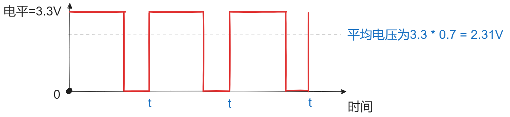
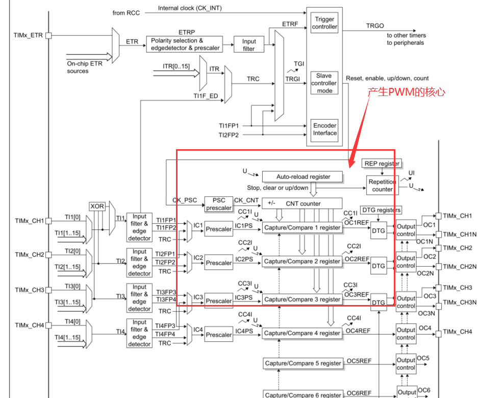
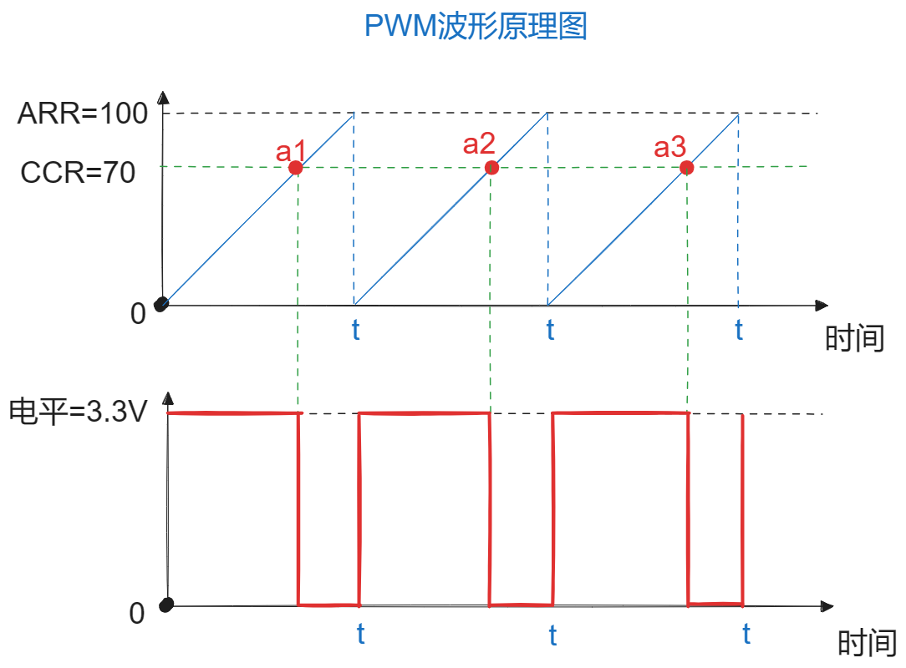
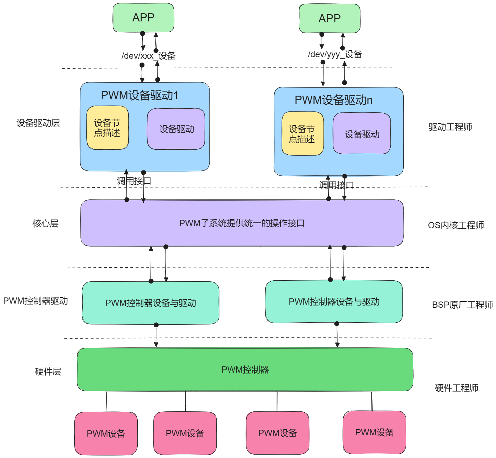
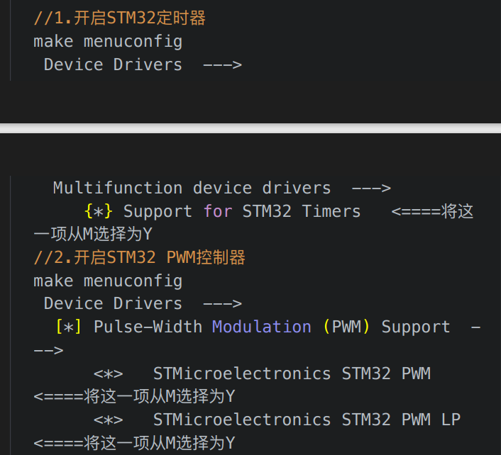
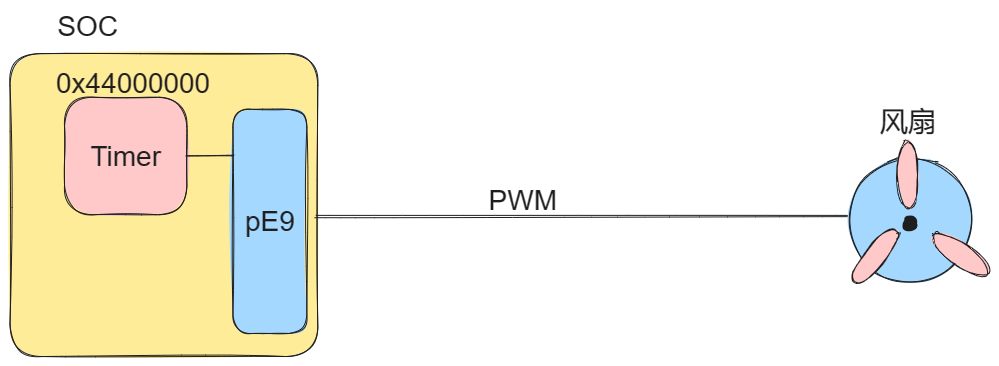

# 第一节、PWM简述：

## 1.PWM与占空比：

> **PWM（脉冲宽度调制）是一种用于产生模拟信号的技术，通常用于控制电子设备中的电机、灯光、声音等。PWM通过调整脉冲的宽度，以实现对输出信号的调节。**


**PWM是一种通过高低电平产生的梯度高低的方波信号。**

**频率：(Hz)单位，即1秒内产生的方波的个数。**

**周期：（s）秒，即1Hz所占用的时间。**



**占空间比：即高电压在整个周期的比值**

> **基本上，PWM是通过在****一个周期内改变信号的高电平时间（占空比）****来控制输出的。****占空比是高电平时间与一个完整周期的比例****。通过调整占空比，可以改变输出信号的平均电压，从而实现对设备的功率的控制。**
> **在嵌入式系统和电子控制领域，PWM广泛应用于各种场景，包括但不限于：**
> **电机控制： 通过PWM控制电机的速度和方向。**
> **LED亮度控制： 调整LED的亮度。**
> **音频控制： 生成模拟音频信号。**
> **电源管理： 在电源管理中，PWM可用于调整电压。**
> **PWM接口通常由硬件电路实现，而在软件层面，操作系统或驱动程序提供相应的接口来配置和控制PWM。在嵌入式系统中，微控制器、FPGA或其他嵌入式处理器通常集成了PWM功能。**


## 2.PWM实现原理与定时器内部逻辑：

高级定时器框图：



### 1. PSC分频器（Prescaler）:

作用：psc分频器用于将定时器的输入时钟降低到合适的频率，分频器的值决定了定时器的计数的步进速度：

工作原理：假设输入的时钟频率为200MHZ，分频值为200，那么分频后的时钟频率就是1MHZ

设置PSC寄存器的值，可以控制定时器计数的速度。

### 2.自动重载寄器（ARR，Auto-Reload Register）

作用：ARR决定了定时器计数的最大值。每当计数器达到这个值时，

工作原理：定时器从0计数到ARR的值，然后重新开始计数，这样形成一个周期性计数过程。ARR的值决定了PWM信号的周期。

设置ARR寄存器的值，可以控制PWM信号的周期。

### 3.计数器（CNT，Counter）

作用：计数器是定时器的核心器件，它按设定的时钟频率计数。

工作原理：计数器的值从0开始，每经过一个定时器的时钟周期（PSC分频器决定），计数器的值加+1.当计数器达到ARR的值时，

计数过程：计数器不断地从0计数到ARR值，再从0开始重新计数，这个循环决定了PWM信号的周期性。

### 4.捕获/比较寄存器（CCR，Capture/Compare Register）

作用：CCR用于设置PWM信号的点空比，它存储一个值，当计数器的值与CCR的值匹配时，定时器输出信号的电平会发生变化。

工作原理：在PWM模式下，

**设置CCR寄存器的值，可以控制PWM信号的高电平持续的时间，**



# 第二节、硬件PWM子系统框架：



Linux PWM子系统提供了一套标准的类型和接口函数，用于管理和控制PWM设备。通过实现PWM控制器驱动程序，并使用这些接口函数，开发者可以方便地在内核中配置和控制PWM信号，同时提供用户空间接口，便于用户空间程序访问和操作PWM设备(也可以通过sys/class/xxx来控制pwm信号)。

所以在使用硬件PWM子系统时，一定要去make menuconfig看一下内核中的没有选配BSP原厂支持的定时器与支持所PWM制制器的驱动，如果没有选配一定切记选配：

以STM32MP157A为例，就没有选配，所以一定要先选配这些BSP原厂的支持的驱动才可以：如图所示：



# 第三节、硬件PWM常用类型与接口：

## 1.PWM设备结构体：pwm_device:

```c
struct pwm_device {
    const char              *label;          // 设备标签，用于标识该PWM设备
    unsigned long           flags;           // 设备标志，存储与该设备相关的状态或配置信息
    unsigned int            hwpwm;           // 硬件PWM编号，表示该设备在硬件中的通道编号
    unsigned int            pwm;             // 全局PWM编号，在系统中的唯一标识

    struct pwm_chip         *chip;           // 指向所属的PWM芯片结构体的指针
    void                    *chip_data;      // 与PWM芯片相关的私有数据

    unsigned int            period;          // ① PWM周期，单位为纳秒
    unsigned int            duty_cycle;      // ② PWM占空比，单位为纳秒
    enum pwm_polarity       polarity;        // ③ PWM信号的极性，表示信号输出的高低电平状态
};
enum pwm_polarity {
    PWM_POLARITY_NORMAL,//正常极性，
    PWM_POLARITY_INVERSED,//反向极性，
};
PWM_POLARITY_NORMAL//正常极性：在一个 PWM 周期内，PWM 信号首先保持高电平，持续占空比指定的时间，然后变为低电平，持续剩余的时间。
示例：假设周期为 10 ms，占空比为 40%（4 ms），则 PWM 信号的前 4 ms 为高电平，后 6 ms 为低电平。
PWM_POLARITY_INVERSED,//反向极性：在一个 PWM 周期内，PWM 信号首先保持低电平，持续占空比指定的时间，然后变为高电平，持续剩余的时间。
示例：假设周期为 10 ms，占空比为 40%（4 ms），则 PWM 信号的前 4 ms 为低电平，后 6 ms 为高电平。
```

## 2.获取pwm_device： dev_of_pwm_get:

```cpp
struct pwm_device *devm_of_pwm_get(struct device *dev, struct device_node *np,
                               const char *con_id)
作用：从指定的设备树节点获取PWM。
参数：dev是指向调用此函数的设备，设备卸载时会自动回收内存。推荐使用此函数
参数np：指定从哪个设备节点获取PWM。
参数con_id: PWM 设备的连接 ID，一般用于指定特定的 PWM 设备，可以为 NULL
返回值：成功返回pwm_device对象指针，失败返回错误码指针。
```

## 2.设置占空比：pwm_config

```c
//1.配置PWM周期，占空比
int pwm_config(struct pwm_device *pwm, int duty_ns, int period_ns)
```

## 6.开启PWM / 停止PWM功能：

```cpp
int pwm_enable(struct pwm_device *pwm);//开启PWM功能
void pwm_disable(struct pwm_device *pwm)//停止PWM功能
void pwm_free(struct pwm_device *pwm)//回收pwm对象内存。//如果获取pwm资源加了前缀devm时，则无需回收。
```

# 第四节、PWM应用：控制电机转速控制、音量控制等

**甲方需求**

**风扇 ---TIM1_CH1------PE9端口------PWM功能（AF1,**

**TIM1内存映射地址：**

## 1. 查看原理图，画出连接关系：



## 2.PWM复用引用的功能，设备树节点的描述方式：

```cpp
  /{
      ... 
     //描述风扇设备节点信息：
        pwm-fan{
            compatible = "WX, pwm-fan";
            status = "okay";
            //描述连接pwm引脚信息：
            pwms = <&pwm1 0 1000 0>;
        };
};

&timers1{
    /delete-property/dmas;
    /delete-property/dma-names;
    status = "okay";

    pwm1:pwm {
        compatible = "st,stm32-pwm";
        #pwm-cells = <3>;
        status = "okay";
        //添加pwm引脚复用：PE9复用pwm功能：
        pinctrl-names = "default","sleep";
        pinctrl-0 = <&pwm1_pins_a>;
        pinctrl-1 = <&pwm1_sleep_pins_a>;
    };
}
&pinctrl{
    pwm1_pins_a: pwm1-0 {
        pins {
            pinmux = <STM32_PINMUX('E', 9, AF1)>; /* TIM1_CH1 */
        };
    };

    pwm1_sleep_pins_a: pwm1-sleep-0 {
        pins {
            pinmux = <STM32_PINMUX('E', 9, ANALOG)>; /* TIM1_CH1 */
        };
    };
};
```

## 3.驱动示例编写：

**甲方需求：**

```cpp
#include <linux/module.h>
#include <linux/init.h>
#include <linux/platform_device.h>
#include <linux/of_platform.h>
#include <linux/of.h>
#include <linux/pwm.h>
#include <linux/cdev.h>
#include <linux/fs.h>
#include <linux/slab.h>
#include <linux/string.h>

// 封装pwm_fan结构体：
struct Myfan
{
    struct pwm_device *pwm;
    u32 duty_ns;
    u32 priod;
    // 字符设备相关的属性：
    struct cdev *c_dev;
    struct class *class;
    struct device *dev;
};
struct Myfan pwm_fan = {
    .duty_ns = 0,    // 0占空比
    .priod = 1000000 // 1ms周期
};

int pwm_fan_open(struct inode *inode, struct file *file)
{
    printk("pwm_fan_open执行了\n");
    return 0;
}

// 在驱动的write中响应用户的输入，配置pwm占空比，启动pwm功能：
ssize_t pwm_fan_write(struct file *file, const char *usrbuf, size_t size, loff_t *offset)
{
    char k_buf[32] = {0};
    int recv_val = 0;
    printk("pwm_fan_write执行了\n");
    // pwm功能逻辑的构建：...
    if (size > sizeof k_buf)
    {
        size = sizeof k_buf;
    }
    copy_from_user_nofault(k_buf, usrbuf, size);
    // 把字符解析为相应数字整形：
    kstrtoint(k_buf, 10, &recv_val);
    pwm_fan.duty_ns = recv_val * 10000;
    // 配置占空比，并启用pwm功能：
    pwm_config(pwm_fan.pwm, pwm_fan.duty_ns, pwm_fan.priod);
    //启用pwm功能：
    pwm_enable(pwm_fan.pwm);
    return size;
}

int pwm_fan_release(struct inode *inode, struct file *file)
{
    printk("pwm_fan_release执行了\n");
    pwm_disable(pwm_fan.pwm);
    return 0;
}

struct file_operations fops = {
    .open = pwm_fan_open,
    .write = pwm_fan_write,
    .release = pwm_fan_release,
};

int pwm_fan_driver_probe(struct platform_device *pdev)
{
    printk("pwm_fan_driver_probe执行了\n");
    pwm_fan.pwm = devm_of_pwm_get(&pdev->dev, pdev->dev.of_node, NULL);
    if (IS_ERR(pwm_fan.pwm))
    {
        printk("获取pwm资源失败\n");
        return -ENODEV;
    }

    // 配置占空比

    // 启动pwm

    // 向上提供应用层接口及创建设备节点：
    pwm_fan.c_dev = cdev_alloc();
    cdev_init(pwm_fan.c_dev, &fops);

    alloc_chrdev_region(&pwm_fan.c_dev->dev, 0, 1, "FAN");

    cdev_add(pwm_fan.c_dev, pwm_fan.c_dev->dev, 1);

    // 自动创建设备节点：
    pwm_fan.class = class_create(THIS_MODULE, "pwm_fan");

    pwm_fan.dev = device_create(pwm_fan.class, NULL, pwm_fan.c_dev->dev, NULL, "pwm_fan");

    return 0;
}

int pwm_fan_driver_remove(struct platform_device *pdev)
{
    printk("pwm_fan_driver_remove执行了\n");
    device_destroy(pwm_fan.class, pwm_fan.c_dev->dev);
    class_destroy(pwm_fan.class);
    cdev_del(pwm_fan.c_dev);
    unregister_chrdev_region(pwm_fan.c_dev->dev, 1);
    kfree(pwm_fan.c_dev);
    return 0;
}

struct of_device_id of_pwm_fan_table[] = {
    [0] = {.compatible = "WX, pwm-fan"},
    [1] = {/*代表结束*/},
};

struct platform_driver pwm_fan_driver = {
    .probe = pwm_fan_driver_probe,
    .remove = pwm_fan_driver_remove,
    .driver = {
        .name = "pwm_fan_driver",
        .of_match_table = of_pwm_fan_table,
    },
};

// 入口函数：
int __init my_test_module_init(void)
{
    printk("A模块的入口函数执行了");
    platform_driver_register(&pwm_fan_driver);
    return 0;
}

// 出口函数：
void __exit my_test_module_exit(void)
{
    printk("出口函数执行了\n");
    platform_driver_unregister(&pwm_fan_driver);
}
// 指定许可：
MODULE_LICENSE("GPL");
MODULE_AUTHOR("gaowanxi, email:gaonetcom@163.com");
// 指定入口及出口函数：
module_init(my_test_module_init);
module_exit(my_test_module_exit);
```

4.应用层测试代码：

```cpp
#include <stdio.h>
#include <sys/types.h>
#include <sys/stat.h>
#include <fcntl.h>
#include <stdbool.h>
#include <unistd.h>
#include <string.h>
int main(int argc, char const *argv[])
{
    int fd = open("/dev/pwm_fan",O_WRONLY);

    char buf[32] = {0};

    while (true)
    {
        fgets(buf, sizeof(buf), stdin);
        int nbytes = write(fd, buf, strlen(buf));
        if(nbytes == -1)
        {
            perror("write err:");
            return -1;
        }
    }
    close(fd);
    return 0;
}

```

# 第五节、模拟PWM之高级定时器:

**假设：你的设备没有连接PWM引脚**

**亦可以通过GPIO口使用高级定时器hrtimer来模拟输出高低电压，从而模拟一个PWM输出，从而间接控制设备的功率：**

## 1. Linux高级定时器hrtimer介绍：

与timer_list类似：但精度更高：

```c
struct hrtimer {
	struct timerqueue_node		node;//定时器节点，添加定时器时由内核管理。
	ktime_t				_softexpires;//软超时
	enum hrtimer_restart		(*function)(struct hrtimer *);//超时回调函数
	struct hrtimer_clock_base	*base;
	u8				state;
	u8				is_rel;
	u8				is_soft;
	u8				is_hard;
};
```

## 2.高级定时器接口函数：

### 1. 高精度定时器初始化辅助函数:hrtimer_init:

```c
void hrtimer_init(struct hrtimer *timer, clockid_t clock_id,
enum hrtimer_mode mode);
参数:
struct hrtimer *timer：指向需要初始化的高精度定时器结构体的指针。
clockid_t clock_id：指定定时器使用的时钟源。常见的时钟源有：
    CLOCK_REALTIME：系统实时时钟。
    CLOCK_MONOTONIC：系统单调时钟。
    CLOCK_BOOTTIME：包含系统挂起时间的单调时钟。
    CLOCK_TAI：国际原子时钟。
enum hrtimer_mode mode：指定定时器的模式，可以是以下两种之一：
    HRTIMER_MODE_REL：相对时间模式，定时器的超时是相对于当前时间的一个偏移量。
    HRTIMER_MODE_ABS：绝对时间模式，定时器的超时是一个绝对时间点。
```

### 2.设置定时时间ktime_set:

```c
ktime_t ktime_set(const s64 secs, const unsigned long nsecs);
作用：设置超时时间，精度为纳秒。
参数secs:秒
参数nsecs:纳秒
返回值为：超时精度计量为：秒 + 纳秒
```

### 3.启动定时器hrtimer_start：

```c
void hrtimer_start(struct hrtimer *timer, ktime_t tim,
const enum hrtimer_mode mode);
作用：启动定时器
参数time:高精度定时器对象指针。
参数tim:纳秒级精度的超时时间。
参数mod:使用的模式。与初始化时使用的模式保持统一。
```

### 4.重新设置定时器hrtimer_forward：循环超时使用类似于timer_list:这个函数如果超时很短很简易出现阻塞，可以直接使用**hrtimer_start再次启动从而实现循环。<视频中的此函数解说有所谬误，请更正。>**

```cpp
u64 hrtimer_forward(struct hrtimer *timer, ktime_t now, ktime_t interval);
作用：重新设置定时器
参数timer:定时器对象指针
参数now:当前时间：
参数interval:重新设定的时间。
u64 hrtimer_forward_now(struct hrtimer *timer,  ktime_t interval);//推荐使用下面的这个新的API接口，更方便使用。
```

### 5.关闭定时器函数：hrtimer_cancel函数：

```cpp
int hrtimer_cancel(struct hrtimer* timer);
作用：关闭使用的定时器
参数：要关掉的定时器。
```

# 第六节、模拟PWM实验：呼吸灯

**甲方需求：**

```cpp
#include <linux/module.h>
#include <linux/init.h>
#include <linux/platform_device.h>
#include <linux/of_platform.h>
#include <linux/of.h>
#include <linux/cdev.h>
#include <linux/fs.h>
#include <linux/slab.h>
#include <linux/hrtimer.h>
#include <linux/gpio.h>
#include <linux/of_gpio.h>
#include <linux/of.h>
//封装产生pwm的虚拟设备：
struct virtual_pwm_device
{
    // 1.产生超时的时钟：高级运行时钟：
    struct hrtimer timer;
    // 2.添加控制gpio控制的gpio号：
    int gpio_id;
    // 3.占空比：
    u32 duty_ns;
    // 4.周期：
    u32 period_ns;
    // 5.超时时间：
    ktime_t jifies_ns;
    // 6.添加可以延时处理阻塞操作任务的工作队列：
    struct work_struct work;
};

struct virtual_pwm_device pwm = {
    .duty_ns = 0,
    .period_ns = 1000,
};
// 处理阻塞操作任务的工作队列：因为对高低电平的设置是一种阻塞操作：
void pwm_work_func(struct work_struct *work)
{
    //构建逻辑：实现计数，及比较计数的功能：
    //...
    static int counter = 0;
    counter++;
    if(counter == pwm.period_ns)
    {
        counter = 0;
    }

    if(counter < pwm.duty_ns)
    {
        //输出高电平：
        gpio_set_value(pwm.gpio_id, 1);
    }
    else{
        //输出低电平：
        gpio_set_value(pwm.gpio_id, 0);
    }


    //1.再次配置定时器：这个函数可以删除，如果超时时间短会出现阻塞
    //hrtimer_forward_now(&pwm.timer, pwm.jifies_ns);
    //2.重新再一次启动定时器：
    hrtimer_start(&pwm.timer, pwm.jifies_ns,HRTIMER_MODE_REL);
}

// 高级定时器超时发生时的回调函数：
enum hrtimer_restart hrtimer_function(struct hrtimer *timer)
{
    enum hrtimer_restart status = HRTIMER_NORESTART;
    // 高级定时器的回调函数是在软中断中执行的，所以不可能有出现阻塞的操作：
    schedule_work(&pwm.work);
    return status;
}

// 1.初始化接口：
int virtual_pwm_device_init(struct virtual_pwm_device *pwm, struct platform_device *pdev)
{
    pwm->gpio_id = of_get_named_gpio(pdev->dev.of_node, "breadthing_led_gpios", 0);
    if (pwm->gpio_id < 0)
    {
        printk("获取gpio资源失败\n");
        return -ENODEV;
    }
    // 申请gpio资源：
    devm_gpio_request(&pdev->dev, pwm->gpio_id, "breathing-led-gpios");
    //初始化gpio口的输出方向：
    pinctrl_gpio_direction_output(pwm->gpio_id);
    //初始化gpio口输出的电平：
    gpio_set_value(pwm->gpio_id,0);

    // 初始化高级定时器：
    hrtimer_init(&pwm->timer, CLOCK_MONOTONIC, HRTIMER_MODE_REL);

    // 设置定时器的超时时间：
    pwm->jifies_ns = ktime_set(0, 10);

    // 设置高级定时器超时发生时的回调函数：
    pwm->timer.function = hrtimer_function;

    // 初始化工作：
    INIT_WORK(&pwm->work, pwm_work_func);

    printk("pwm_device初始化完成\n");
    return 0;
}

// 2.配置pwm占空比的接口：
void virtual_pwm_config(struct virtual_pwm_device *pwm, u32 duty_ns, u32 period_ns)
{
    pwm->period_ns = period_ns;
    pwm->duty_ns = duty_ns > period_ns ? period_ns : duty_ns;
    //printk("配置了占空比\n");
}

// 3.启动pwm的函数：
void virtual_pwm_enable(struct virtual_pwm_device *pwm)
{
    //开启高级定时器：
    hrtimer_start(&pwm->timer,pwm->jifies_ns,HRTIMER_MODE_REL);
    //printk("pwm启动\n");
}

// 4.停止pwm的接口：
void virtual_pwm_disable(struct virtual_pwm_device *pwm)
{
    //停止高级定时器：
    hrtimer_cancel(&pwm->timer);
    gpio_set_value(pwm->gpio_id, 0);
    cancel_work_sync(&pwm->work);
    printk("pwm停止\n");
}
//-----------------------字符设备--------------------------//

//封装字符设备类型：
struct BreathingLed 
{
    struct cdev* c_dev;
    struct class* class;
    struct device* dev;
};
struct BreathingLed myled = {0};
int myled_open(struct inode *inod, struct file *file)
{
    printk("myled_open执行了\n");
    return 0;
}


ssize_t myled_write(struct file *file, const char *usrbuf, size_t size, loff_t *offset)
{
    char k_buf[32] = {0};
    int recv_val = 0;
    //printk("myled_write执行了\n");
    //响应用户发来的数据，通过虚拟pwm的占空比，进行控制led的明暗度：
    //拷贝用户空间的数据到内核空间：
    if(size > sizeof(k_buf))
    {
        size = sizeof(k_buf);
    }
    copy_from_kernel_nofault(&recv_val, usrbuf, size);

    //字符串转成数字整形：如果直接传的是整形可以将下面的kstrtoint函数注释掉：
    kstrtoint(k_buf, 10, &recv_val);
    pwm.duty_ns = recv_val * 10;

    //配置占空比：
    virtual_pwm_config(&pwm,pwm.duty_ns, pwm.period_ns);

    //启用：
    virtual_pwm_enable(&pwm);

    return size;
}

int myled_release(struct inode *inode, struct file *file)
{
    printk("myled_close执行了\n");
    virtual_pwm_disable(&pwm);
    return 0;
}


struct file_operations fops = {
    .open = myled_open,
    .write = myled_write,
    .release = myled_release,
};

int breathing_led_driver_probe(struct platform_device *pdev)
{
    printk("breathing_led_driver_probe执行了\n");
    //对虚拟pwm设备初始化：
    virtual_pwm_device_init(&pwm, pdev);
    //字符设备进行初始化：
    myled.c_dev = cdev_alloc();
    cdev_init(myled.c_dev, &fops);
    alloc_chrdev_region(&myled.c_dev->dev, 0, 1, "breathingled");

    cdev_add(myled.c_dev, myled.c_dev->dev, 1);

    //自动创建设备节点：
    myled.class = class_create(THIS_MODULE,"BREATHINGLED");
    myled.dev = device_create(myled.class, NULL, myled.c_dev->dev, NULL, "breathingled");


    return 0;
}

int breathing_led_driver_remove(struct platform_device *pdev)
{
    printk("breathing_led_driver_remove执行了\n");
    device_destroy(myled.class, myled.c_dev->dev);
    class_destroy(myled.class);
    cdev_del(myled.c_dev);
    unregister_chrdev_region(myled.c_dev->dev,1);
    kfree(myled.c_dev);

    return 0;
}

struct of_device_id of_led_table[] = {
    [0] = {.compatible = "WX,breadthing-led-001"},
    [1] = {/*代表结束*/},
};
struct platform_driver breathing_led_driver = {
    .probe = breathing_led_driver_probe,
    .remove = breathing_led_driver_remove,
    .driver = {
        .name = "breadthing-led-driver",
        .of_match_table = of_led_table,
    },
};


// 入口函数：
int __init my_test_module_init(void)
{
    printk("A模块的入口函数执行了");
    platform_driver_register(&breathing_led_driver);

    return 0;
}

// 出口函数：
void __exit my_test_module_exit(void)
{
    printk("出口函数执行了\n");
    platform_driver_unregister(&breathing_led_driver);
}
// 指定许可：
MODULE_LICENSE("GPL");
MODULE_AUTHOR("gaowanxi, email:gaonetcom@163.com");
// 指定入口及出口函数：
module_init(my_test_module_init);
module_exit(my_test_module_exit);
```

gpio模拟pwm设备树：

```cpp
/{
    ...
    //呼吸灯breathing_led设备节点的描述：
    breathing_led{
        compatible = "WX,breadthing-led-001";
        breadthing_led_gpios = <&gpioe 10 0>;
        status = "okay";
    };
};
```

 