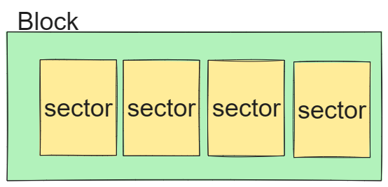
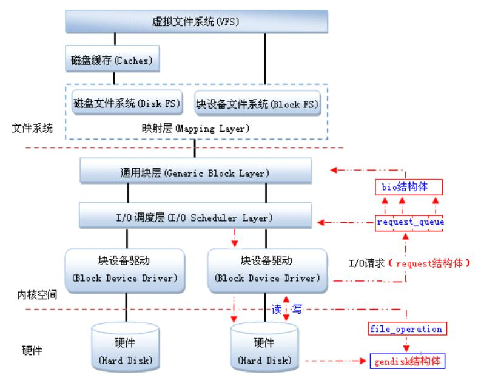
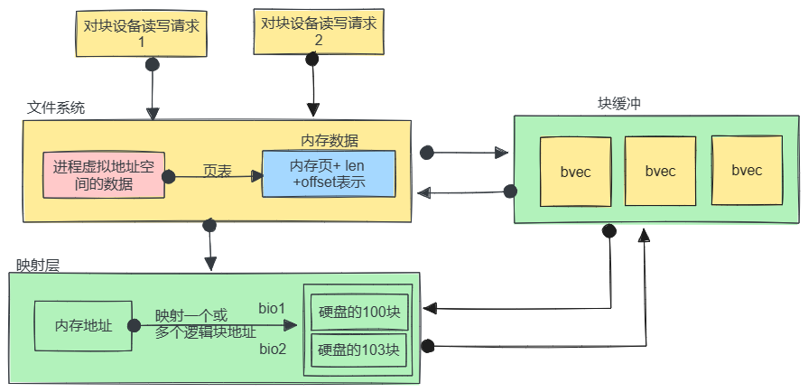
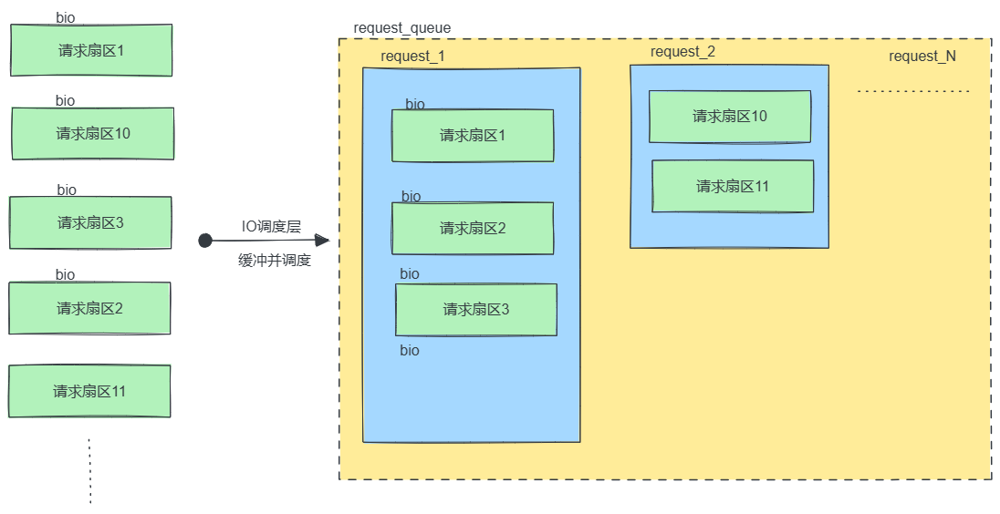
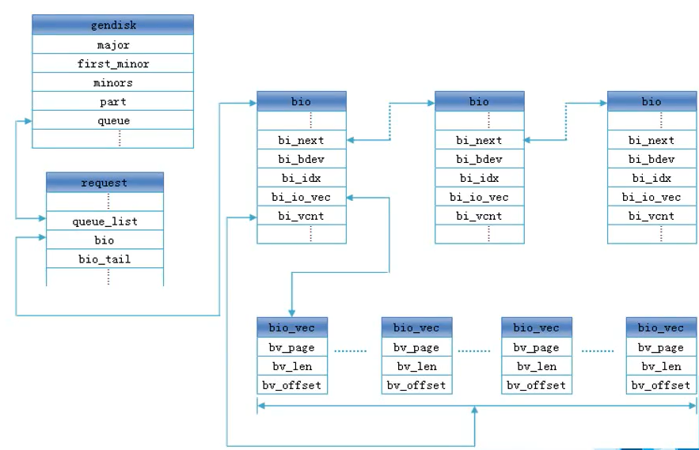

# 第一节、块设备：

## 1. 概念：数据传输以块为单位，有缓冲的设备，数据传输非实时性。

块设备与字符设备形成了对比，块设备数据传输以块为单位，而字符设备以字节为单位。块设备对数据请求有缓冲区，因此可以调整响应请求的顺序。块设备主要与内核文件系统打交道。

常见的块设备有：硬盘，光盘，SD卡，U盘等。

块设备相关的几个概念

- **扇区（sector）**，概念来自于早期磁盘，作为描述磁盘上数据存储的基本单位。往往是一个扇区= 512字节。

- **块（Block**），概念来自于文件系统，是内核对文件系统数据处理的基本单位，大小为若干个扇区，常见有512B、1KB、4KB等。



早期块设备中的几个概念：磁盘的几何物理信息：geo

- **磁头(Head)**：读写数据的传感器。

- **磁道（Tracks）**：每个盘片表面被划分成同心圆，每个同心圆称为一个磁道。

- **柱面(Cylinders)**：磁盘盘面上的磁道的集合。

注意：块设备驱动和字符设备驱动不同，应用层对块设备驱动的访问一般不是直接操作设备文件（/dev/block/xxx，或者/dev/sdax）应用程序通过文件系统的接口来read/write文件数据。

# 第二节、块设备驱动框架、



## 1.调用链：

1. 文件系统层：将读写请求转化为 bio 结构体对象，并调用 **submit_bio（通用块层的函数，非fops中的属性指针）** 提交请求。

1. 通用块层/IO调度层：submit_bio 中会把 bio 添加到 request中，并形成一个request_queue队列，并且使用调度算法对 request_queue 中的请求进行优化调度，并调用块设备驱动的 make_request_fn 处理请求。

1. 块设备驱动：从 request_queue 中提取请求，并通过硬件接口执行读写操作。

## 2.映射层：把虚拟地址转换为逻辑块地址：



bio_vec用于描述IO操作中的单个数据段的结构。

## 3.块设备驱动需要IO调度：

如果简单地以内核产生请求的次序直接将请求发向块设备的话，性能肯定让人难以接受，磁盘寻址是整个计算机中 的最慢的操作之一，每一次寻址，都要定位磁头到特定的某个位置，这需要花费很多的时间，为了优化寻址操作，内核既不会简单地按请求接收次序，也不会立即请其提交给磁盘，相反，它会在提交前，先执行名为合并与排序的预操作，这种预操作可以极大的提高系统的于于整体性能。在内核中负责提交IO请求的子系统被称为IO调度器。

常用的IO调度算法有：如：电梯调度法，合并请求法，最短寻道时间优先法等。。。图示：



# 第三节、块设备常用类型及接口：

## 1. 认识块设备抽象表示gendisk数据结构：



### 1.bio结构体：

```cpp
struct bio {
	struct bio		*bi_next;	/* request queue link */
	struct block_device	*bi_bdev;

	struct bvec_iter	bi_iter;/*映射的LBA起始扇区号在这个属性中*/

	unsigned short		bi_vcnt;	/* bio_vec's个数 */
	struct bio_vec		*bi_io_vec;	/* the actual vec list */
	struct bio_vec		bi_inline_vecs[];//多个bivec的数组：
};
```

### 2.bio_vec结构体：

```cpp
struct bio_vec {
    struct page *bv_page;     // 指向数据所在的页
    unsigned int bv_len;      // 数据段的长度（字节数）
    unsigned int bv_offset;   // 数据段在页中的偏移量
};
```

### 3.request请求结构体：

```cpp
struct request {
    struct request_queue *q;            // 指向请求队列的指针
    struct blk_mq_hw_ctx *mq_hctx;      // 硬件队列上下文
    struct blk_mq_ctx *mq_ctx;          // 请求上下文

    unsigned int cmd_flags;             // 请求标志
    rq_end_io_fn *end_io;               // 请求完成时的回调函数
    void *end_io_data;                  // 请求完成时的回调数据

    struct bio *bio;                    // 指向第一个 bio 结构体的指针
    struct bio *biotail;                // 指向最后一个 bio 结构体的指针

    sector_t __sector;                  // 请求的起始扇区号
    sector_t __data_len;                // 请求的数据长度（以扇区为单位）
    unsigned int nr_phys_segments;      // 请求的物理段数
    unsigned int nr_hw_segments;        // 请求的硬件段数
    struct gendisk *rq_disk;            // 请求所属的块设备

    struct blk_mq_ctx *mq_ctx;            // 请求的上下文
    int cpu;                              // 请求处理的 CPU
    ...//其它更从属性略
};
```

### 4.struct gendisk结构体：

```cpp
struct gendisk {
    int major;          //块设备的主设备号
    int first_minor;    //起始的次设备号
    int minors;         //次设备的个数，也是分区的个数。     
    char disk_name[DISK_NAME_LEN];  //块设备的磁盘的名字
    ...
    struct disk_part_tbl __rcu *part_tbl; //块设备的磁盘分区表的首地址
    struct hd_struct part0; //paro0分区的描述

    const struct block_device_operations *fops; //块设备的操作方式结构体
    struct request_queue *queue; //队列（重要属性）完成读写的操作在此进行。
    void *private_data;//私有数据传参使用
    ...
};

磁盘分区结构体：
struct hd_struct {
    sector_t start_sect;//起始扇区
    sector_t nr_sects;//扇区的个数
    ...
    int  partno;//分区号
    ...
};

struct block_device_operations {
    //老式的处理提交的 bio的回调，现新式blk_mq队列处理，已经不再使用了。
    blk_qc_t (*submit_bio) (struct bio *bio); 
    //打开块设备。当用户进程试图打开设备文件时调用。
    int (*open) (struct block_device *, fmode_t);
    //释放块设备。当用户进程关闭设备文件时调用。
    void (*release) (struct gendisk *, fmode_t);
    //处理控制命令（ioctl）。用于执行设备特定的操作。
    int (*ioctl) (struct block_device *, fmode_t, unsigned, unsigned long);
    ...
    //获取设备几何信息。这个函数用于返回设备的几何参数，如柱面数、磁头数、扇区数等
    int (*getgeo)(struct block_device *, struct hd_geometry *);
    //设置磁头，磁盘，磁道，扇区的个数 = 容量。
    ...
};
```

## 2.块设备驱动的的构建流程：与字符设备驱动类似：

### 1.申请块设备号：

```cpp
int register_blkdev(unsigned int major, const char* name);
majo :0 自动申请
major > 0 :静态指定
name 申请到的设备的名字，可以在proc/device目录下看到。
返回值： major = 0; 成功返回主设备号，失败返回错误码。
        major > 0;成功返回0，失败返回错误码。
        
int unregister_blkdev(unsigned int major, const char* name);
```

### 2.申请gendisk结构体：

```c
struct gendisk* alloc_disk(int minors)
功能：分配gendisk的内存，然后完成必要的初始化
参数：minors:分区的个数
返回值：成功返回分配到的内存的首地址，失败返回NULL;
//回收gendisk内存：
void put_disk(struct gendisk* disk);
```

### 3.填充gendisk结构体:

```cpp
1.是gdisk中的fops结构体中属性，一系统的回调函数。
实现几个常用的函数：比如打开open,close等，对应的块设备的挂载与卸载。
2.对请求队列进行初始化：request_queue *blk_mq_init_queue(struct blk_mq_tag_set *set);
3.块设备驱动的名称。
4.设置磁盘的容量：set_capacity(gendisk, 块数);
```

### 4.注册、注销gendisk结构体:

```cpp
//一系列初始化完成之后，就是注册块设备，不使用时就注销：
void add_disk(struct gendisk* disk);
//注销：
void del_gendisk(struct gendisk* disk);
```

### 5.IO请求队列的初始化及回调的处理：

```c
struct request_queue *blk_mq_init_sq_queue(struct blk_mq_tag_set *set,
                       const struct blk_mq_ops *ops,
                       unsigned int queue_depth,
                       unsigned int set_flags)
用于设置具有多队列操作的队列的辅助函数，给定队列深度和传入的多队列操作标志
//功能：用于初始化多队列的函数，注册队列到块设备层。适用于并发高与高性能块设备，如NVMe SSD
//参数：set:是一个多队列操作的标签集合对象，用于配置多队列的操作。
//参数：ops:请求处理的回调函数
//参数：quue_depth队列深度，就是可以容纳请求的个数。
//参数：set_flags:指队列处理优化选项，一般设置允许合并：BLK_MQ_F_SHOULD_MERGE
//成功返回requeue_queue的地址，失败返回NULL;
```

### 6.管理块设备多队列 (Multi-Queue) 处理的数据结构struct blk_mq_tag_set：

```cpp

 
struct blk_mq_tag_set {
    unsigned int nr_hw_queues;      /**< 硬件队列的数量，通常设置为 CPU 核心数*/
    unsigned int queue_depth;       /**< 每个硬件队列的深度 ，表示每个队列可以容纳的最大请求数*/
    unsigned int reserved_tags;     /**< 保留的标签数量 */
    unsigned int nr_maps;           /**< 映射集的数量 通常与 NUMA 节点或 CPU 组相关*/
    unsigned int *map_timeout;      /**< 每个硬件队列的超时值数组 */
    unsigned int timeout_seq;       /**< 用于超时处理的序列号 */
    struct blk_mq_ops *ops;         /**< 队列的操作集合 指向包含队列操作函数（如请求提交和完成）的结构体*/
    struct blk_mq_ctxs *ctxs;       /**< 每个 CPU 的上下文 */
    struct blk_mq_tags **tags;      /**< 标签结构体指针数组 每个指针代表一个硬件队列*/
    struct blk_mq_tag_set *shared_tags; /**< 共享标签集合的指针 */
    void *driver_data;              /**< 驱动程序特定的私有数据 */
    unsigned int cmd_size;          /**< 每个命令的大小 */
    unsigned int numa_node;         /**< NUMA 节点号 */
    unsigned int flags;             /**< 标志位 指示标签集合的各种选项和行为，例如请求合并*/
    unsigned int timeout;           /**< 请求的超时时间 单位为毫秒*/
    unsigned int reserved_gfp;      /**< 分配保留请求内存时使用的 GFP 标志 */
    unsigned int reserved_cpu;      /**< 保留的 CPU 数量 */
};
```

### 7.多队列处理请求的操作方式结构体：struct blk_mq_ops:

```cpp
struct blk_mq_ops {
    blk_status_t (*queue_rq)(struct blk_mq_hw_ctx *hctx,
                             const struct blk_mq_queue_data *bd);
    /**< 提交请求的函数，必需。 */

    void (*commit_rqs)(struct blk_mq_hw_ctx *hctx);
    /**< 提交所有排队的请求。 */

    bool (*get_budget)(struct blk_mq_hw_ctx *hctx);
    /**< 获取预算（budget）函数，用于控制队列中的请求数量，防止过载。 */

    void (*put_budget)(struct blk_mq_hw_ctx *hctx);
    /**< 释放预算（budget）函数，完成请求后释放预算。 */

    enum blk_eh_timer_return (*timeout)(struct request *rq, bool reserved);
    /**< 请求超时处理函数。 */

    int (*poll)(struct blk_mq_hw_ctx *hctx, unsigned int tag);
    /**< 轮询函数，用于检查请求的完成状态。 */

    int (*busy)(struct request_queue *q);
    /**< 检查队列是否繁忙的函数。 */

    void (*complete)(struct request *rq);
    /**< 请求完成处理函数。 */

    void (*initialize_rq_fn)(struct request *rq);
    /**< 初始化请求函数，在请求初始化时调用。 */

    void (*exit_hctx)(struct blk_mq_hw_ctx *hctx, unsigned int hctx_idx);
    /**< 退出硬件队列上下文函数，在销毁硬件队列时调用。 */

    int (*init_hctx)(struct blk_mq_hw_ctx *hctx, void *driver_data, unsigned int hctx_idx);
    /**< 初始化硬件队列上下文函数，在创建硬件队列时调用。 */

    void (*exit_request)(struct blk_mq_tag_set *set, struct request *rq, unsigned int hctx_idx);
    /**< 请求退出函数，在销毁请求时调用。 */

    int (*init_request)(struct blk_mq_tag_set *set, struct request *rq, unsigned int hctx_idx, unsigned int numa_node);
    /**< 请求初始化函数，在创建请求时调用。 */

    void (*map_queues)(struct blk_mq_tag_set *set);
    /**< 映射队列函数，用于将队列映射到硬件或 CPU。 */
};
```

### 8. I/O 请求（request）提交到硬件队列的回调属性：queue_rq：必需实现。

所谓的硬件队列是指处理多队列请求时所使用的多核心处理器队列。主要用来实现并行处理与资源分配的，这部分已经由内核实现。我们只需要关心这个处理的实现即可：

```cpp
blk_status_t (*queue_rq)(struct blk_mq_hw_ctx *hctx,
const struct blk_mq_queue_data *bd);     
//queue_rq 回调的函数的主要功能是将一个 I/O 请求（request）提交到硬件队列（hardware queue）中进行处理。
//这个函数是必需的，因为它定义了如何将请求传递给底层硬件或驱动程序。  
//参数：hctx:是指向硬件队列上下文的指针。这个结构体包含了硬件队列的相关信息，如队列的索引、CPU 上下文等  
//参数：bd 指向包含请求数据的队列数据结构的指针。这个结构体包含了需要提交的请求（request）以及其他相关信息. 
//返回值： 
blk_status_t描述的是: 返回请求提交的状态码，指示请求提交操作的结果。可能的返回值包括但不限于：
BLK_STS_OK：请求提交成功。
BLK_STS_RESOURCE：由于资源限制，无法提交请求（例如队列满）。
BLK_STS_DEV_RESOURCE：由于设备资源限制，无法提交请求。
BLK_STS_IOERR：请求提交过程中发生了 I/O 错误。  
此函数处理要遵从一定的框架:需要使用一系列辅助函数：
//1.获取请求方向的函数：是read还是write:
int status = rq_data_dir(rq);    //如果是写为1，如果是读为0
//2.开始处理请求：
void blk_mq_start_request(struct request *rq);

//3.结束处理请求：
void blk_mq_end_request(struct request *rq, blk_status_t error);        
```

### 9.辅助宏：遍历请求：rq_for_each_segment 宏：

```cpp
#define rq_for_each_segment(bv, rq, iter)    \    bio_for_each_segment_all(bv, rq->bio, iter)
bv: struct bio_vec 类型的变量，用于保存当前遍历到的数据段信息,为当前遍历到的bio中的bvec数据段。
rq: struct request * 类型的指针，指向需要遍历的请求。
iter: struct req_iterator 类型的变量，用于跟踪遍历过程中的状态，指向当前遍历到的bio。
```

## 3.块设备驱动示例：使用虚拟内存模拟磁盘设备。

块设备驱动实例代码：

```cpp
#include <linux/module.h>
#include <linux/init.h>
#include <linux/genhd.h>
#include <linux/blkdev.h>
#include <linux/blk-mq.h>
#include <linux/vmalloc.h>
#include <linux/hdreg.h>

// 封装一个虚拟磁盘设备类型：
struct VM_Disk
{
    // 通用的块设备属性
    struct gendisk *disk;
    // 虚拟磁盘的起始地址：
    void *vm_start_addr;
    // 虚拟磁盘的容量大小：
    u32 capacity;
    // 虚拟磁盘的分区个数：
    int minors;
    // 虚拟磁盘的名字：
    const char *name;
    // 虚拟磁盘的请求队列的操作标签属性：
    struct blk_mq_tag_set set;
};

struct VM_Disk vm_disk = {
    .capacity = 1024 * 1024 * 1,
    .minors = 5,
    .name = "vmdisk",
};

int myblk_open(struct block_device *blk_dev, fmode_t mod)
{
    printk("myblk_open执行了\n");
    return 0;
}

void myblk_release(struct gendisk *gend, fmode_t mod)
{
    printk("myblk_release执行了\n");
}

int myblk_getgeo(struct block_device *blk, struct hd_geometry *geo)
{
    geo->cylinders = 8;
    geo->heads = 8;
    geo->sectors = vm_disk.capacity / geo->cylinders / geo->heads / 512;
    return 0;
}

struct block_device_operations blk_ops = {
    .open = myblk_open,
    .release = myblk_release,
    .getgeo = myblk_getgeo,
};

// IO请求的处理函数：解析队列中的所有请求，然后执行操作
blk_status_t myblk_queue_rq(struct blk_mq_hw_ctx *ctx, const struct blk_mq_queue_data *data)
{
    blk_status_t status = BLK_STS_OK;
    // 解析队列并处理请求的逻辑：...
    struct request *rq = data->rq;
    struct bio_vec bvec;
    struct req_iterator rq_iter;
    u32 pos = rq->__sector * 512;

    blk_mq_start_request(rq);
    rq_for_each_segment(bvec, rq, rq_iter)
    {
        // 通过bvec数据的线性地址转换为内核虚拟地址:
        void *bvec_addr = page_address(bvec.bv_page) + bvec.bv_offset;
        if (rq_data_dir(rq) == WRITE) // 写方向
        {
            // 从bvec指定的内存位置取出数据,拷贝到,磁盘的相应的物理地址处:
            memcpy(vm_disk.vm_start_addr + pos, bvec_addr, bvec.bv_len);
        }
        else
        {
            // 从磁盘具体的物理地址处取出数据,拷贝到bvec指定的内存位置:
            memcpy(bvec_addr, vm_disk.vm_start_addr + pos, bvec.bv_len);
        }
        pos += bvec.bv_len;
    }
    printk("处理了一次请求\n");
    blk_mq_end_request(rq, status);
    return status; 
}

struct blk_mq_ops mq_ops = {
    .queue_rq = myblk_queue_rq,
};

int vm_disk_init(struct VM_Disk *vm)
{
    // 申请通用块设备属性的空间：
    vm->disk = alloc_disk(vm->minors);
    // 申请磁盘的空间：
    vm->vm_start_addr = vmalloc(vm->capacity);

    // 对gendisk属性的内部属性进行初始化：
    strcpy(vm->disk->disk_name, vm->name);
    // 申请块设备的设备号：major:
    vm->disk->major = register_blkdev(0, vm->name);
    vm->disk->first_minor = 0;
    // 设置磁盘的容量：
    set_capacity(vm->disk, vm->capacity / 512);
    // 设置磁盘的操作的方法：
    vm->disk->fops = &blk_ops;
    // 设置磁盘操作的请求队列：
    vm->disk->queue = blk_mq_init_sq_queue(&vm->set, &mq_ops, 128, BLK_MQ_F_SHOULD_MERGE);
    printk("---vmdisk初始化完成----\n");
    return 0;
}

void vm_disk_destory(struct VM_Disk *vm)
{
    // 回收请求队列：
    blk_cleanup_queue(vm->disk->queue);
    unregister_blkdev(vm->disk->major, vm->name);
    vfree(vm->vm_start_addr);
    put_disk(vm->disk);
}

// 入口函数：
int __init my_test_module_init(void)
{
    vm_disk_init(&vm_disk);
    // 注册通用的块设备对象：
    add_disk(vm_disk.disk);
    return 0;
}

// 出口函数：
void __exit my_test_module_exit(void)
{
    // 注销块设备：
    del_gendisk(vm_disk.disk);
    vm_disk_destory(&vm_disk);
    printk("出口函数执行了\n");
}
// 指定许可：
MODULE_LICENSE("GPL");
MODULE_AUTHOR("gaowanxi, email:gaonetcom@163.com");
// 指定入口及出口函数：
module_init(my_test_module_init);
module_exit(my_test_module_exit);
```

磁盘分区命令：fdisk /dev/xx_disk    -u 进入命令

使用n添加新分区;

使用w保存分区表并即出。

分区格式化：建立文件系统：

mkfs.extx  /dev/xx_diskx

通过添加分区及格式化，这个磁盘就可以使用了。使用mount挂载与umount取消挂载。 