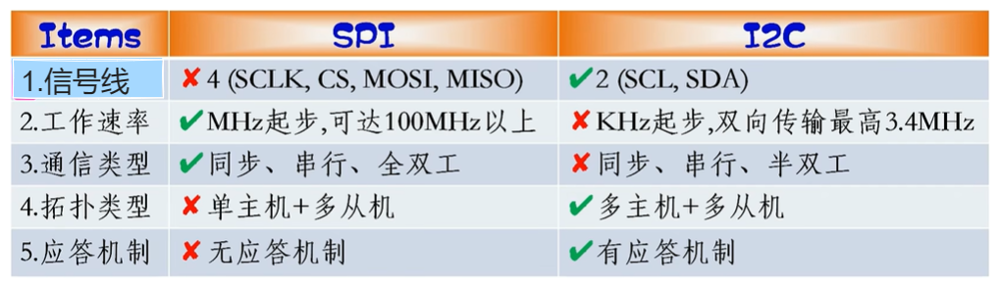
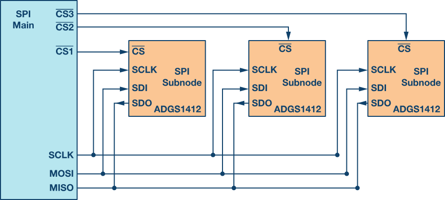
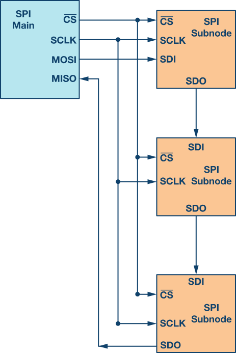
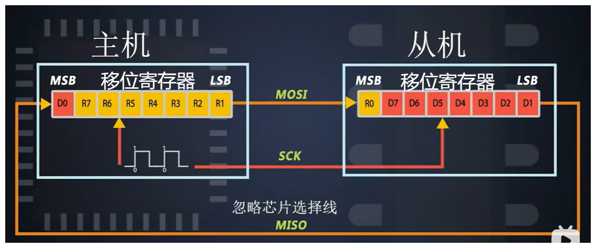
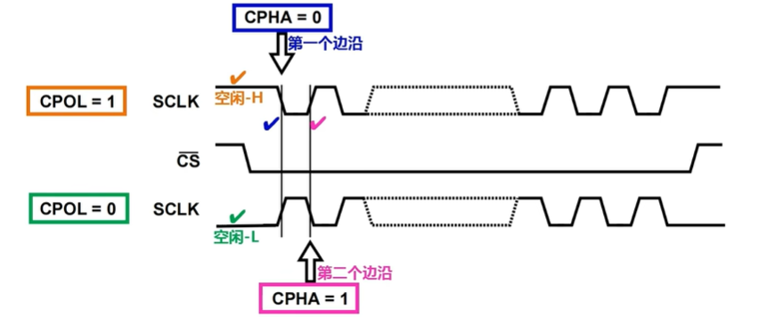
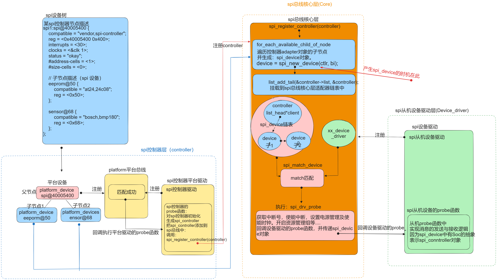
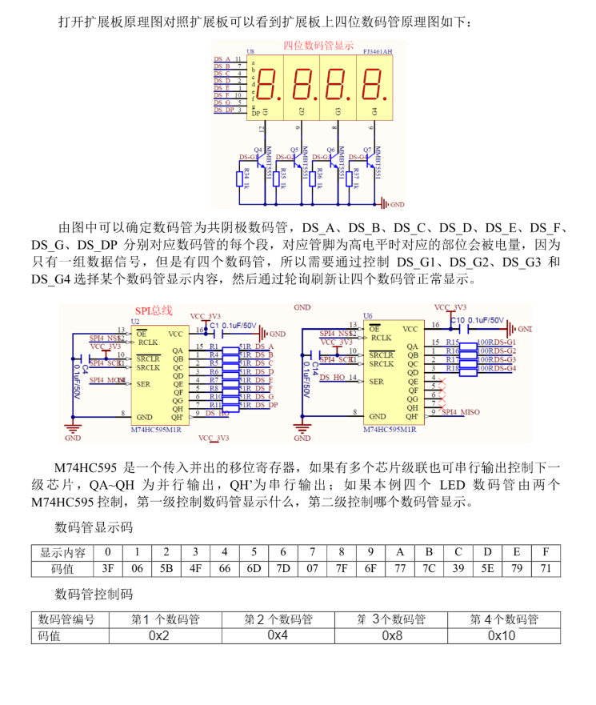
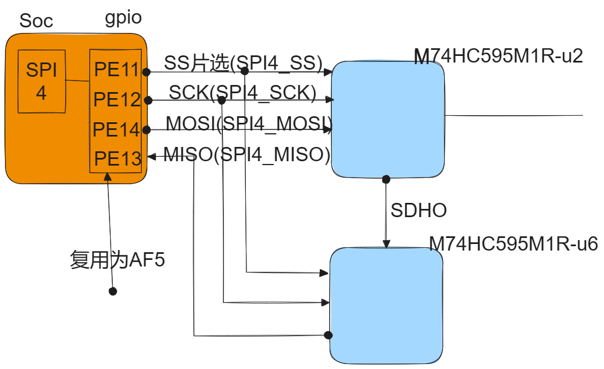

学习经验：SPI总线与I2C总线驱动模型类似，可以类比着学习，比I2C更简单。

# 第一节、SPI通信原理与相关概念：

## 1.SPI总线的特点：

SPI（serial peripheral interface）串行外设接口的缩写，它是Motorola公司推出的一种同步串行接口技术，是一种高速的，全双工的，同步的通信总线。

SPI是支持全双工通信， 通信简单，数据传输速率快，非差分的，一主多从的通信模式。

所谓为非差分与差分的概念是指在远距离传输时，是否通过比较两个根的电平的差来判断是传据是高还是低，一般远距离传输都是使用差分总线，近距离的都是非差分总线。SPI是非差分总线，R485就是一种差分总线。了解即可。

缺点：无应答机制确认是否接收到数据，所以与I2C总线协议比较在数据的可靠性上有一点差距，但是速度快啊。

与I2c相比：



## 2.三根共享线：SCK,MOSI,MISO,及1个或多个片选线：

### 1. 常规SPI模式：



### 2.一个片选的菊花链模式：



## 3.SPI数据传输方式：

SPI 主设备和从设备都有一个串行移位寄存器，主设备通过向它的 SPI 串行寄存器写入一个字节来发起一次传输。



## 4.SPI的采样模式：由CPOL（时钟极性）与 CPHA(时钟相位)



CPOL决定空闲时的电平的高低，CPHA决定采样的时机 

当：CPOL(时钟极性) = 0 时，即空闲时电平为低，第一个边沿意味为由低到高的上升边沿。

当：CPOL(时钟极性) = 1时，即空闲时电平为高，第一个边沿意味为由高到低的下降边沿。

当：CPHA(时钟相位) = 0时，即第一个边沿采样，下一个边沿传输。

当：CPHA(时钟相位) = 1时，即第一个边沿传输，下一个边沿采样。

所以就组合了四种模式：Mode0(CPOL=0, CPHA = 0), Model1(CPOL=0, CPHA = 1), Model2(CPOL=1,CPHA=0), Model3(CPOL=1,CPHA=1);

## 5.SPI协议：

1. 选择芯片的片选线拉低为低电平

2.确定采样方式

3.通过MOSI与MISO收发数据。

# 第二节、SPI总线驱动模型框架：

与i2c驱动框架类似：



# 第三节、常用SPI总线的类型与接口：

## 1. 分配spi驱动对象：struct spi_driver:了解这个结构体你会发现与i2c_driver很相似：

```c
#include <linux/spi/spi.h>
struct spi_driver {
	const struct spi_device_id *id_table;//platform_device匹配方式
	int			(*probe)(struct spi_device *spi);//匹配执行的函数：
	int			(*remove)(struct spi_device *spi);//卸载执行的函数
	void			(*shutdown)(struct spi_device *spi);//电源关闭时执行的函数
	struct device_driver	driver;//父类，与I2c总线一样的父类。
};
//以下为device_driver属性：
struct device_driver {
	const char		*name; //驱动的名字，用来生成节点
 ...




	const struct of_device_id	*of_match_table;//设备树匹配方式
 ...
	struct driver_private *p;//私有属性指针
};
```

## 2. 注册，注销，一键注册注册：

```c
//注册spi_driver:
#define spi_register_driver(driver) \
    __spi_register_driver(THIS_MODULE, driver)
//注销spi_driver:
void spi_unregister_driver(struct spi_driver *sdrv)    

//一键注册注销宏：                       
#define module_spi_driver(__spi_driver) \
module_driver(__spi_driver, spi_register_driver, \
            spi_unregister_driver)
```

## 3. spi_device及spi数据的收发：

因为spi中没有涉及到从机设备的呼叫及应答，所以就没有了类似于i2c中的传输的函数，而是内核中直接把数据的发送与读取封装好了，不需要自己去封装了。

### 1.spi从机设备对象结构：spi_device:

```c
struct spi_device {
    struct device        dev;                 // SPI 设备的通用设备结构体，用于设备模型的集成
    struct spi_controller *controller;        // 该 SPI 设备所属的控制器
    struct spi_controller *master;            // 兼容层，指向控制器，与 controller 成员相同
    u32                 max_speed_hz;         // 该 SPI 设备的最大时钟频率（Hz）

    u32                 mode;                 // SPI 模式，包含时钟相位和极性等信息
    int                 irq;                  // 该设备使用的中断号

    char                modalias[SPI_NAME_SIZE]; // 设备的模块别名
    int                 cs_gpio;              // 片选 GPIO 引脚（遗留字段）
    struct gpio_desc    *cs_gpiod;            // 片选 GPIO 描述符
    ...//其它属性


};
```

### 2.发送数据：int spi_write():

```cpp
Callable only from contexts that can sleep.
//千万不要在中断处理函数中使用。
int spi_write(struct spi_device *spi, const void *buf, size_t len)
//功能：发送数据
参数1：spi即类似于i2c_client的一抽象的接口对象
参数2：buf
参数3：len buf的字节数
//成功返回0，失败返回错误码
```

### 3.读取数据：int spi_read()

```cpp
Callable only from contexts that can sleep.
//千万不要在中断处理函数中使用，如果在中断中使用，请放在底半部工作队列中。
int spi_read(struct spi_device *spi, void *buf, size_t len)
//功能：读取数据
参数1：spi即类似于i2c_client的一抽象的接口对象
参数2：buf
参数3：len buf的字节数
//成功返回0，失败返回错误码
```

# 第四节、综合应用：实验：驱动m7hc595数码管控制芯片



## 1. 通过原理图画出连接关系：



## 2.设备树节点描述：

```c
/{
    ...
};
&spi4 {
    status = "okay";
    pinctrl-names = "default","sleep","idle","active";
    pinctrl-0 = <&spi4_pins_b>;
    pinctrl-1 = <&spi4_sleep_pins_b>;
    cs-gpios = <&gpioe 11 0>;

    //描述spi从机设备：
    m74hc595@0{
        compatible = "WX, m74hc595";
        reg = <0x0>;
        status = "okay";
    };
};
```

## 3.驱动代码实现： 

### 1.需求：从应用层终端输入一个数，可以数码管中显示出来:

驱动代码：

```c
#include <linux/module.h>
#include <linux/init.h>
#include <linux/spi/spi.h>
#include <linux/cdev.h>
#include <linux/fs.h>

//封装一个SPI从机设备。
struct M74HC595 
{
    struct spi_device* spi_dev;
    struct cdev* c_dev;
    struct class* class;
    struct device* dev;
};

struct M74HC595 m74hc595 = {0};  

struct of_device_id of_m74hc595_table[] = {
    [0] = {.compatible = "WX, m74hc595"},
    [1] = {/*代表结束*/},
};

int m74hc595_driver_probe(struct spi_device *spi)
{
    printk("m74hc595_driver_probe执行了\n");
    m74hc595.spi_dev = spi;
    return 0;
}

int m74hc595_driver_remove(struct spi_device *spi)
{
    printk("m74hc595_driver_remove执行了\n");
    return 0;
}

//定义一spi_dev_driver对象：
struct spi_driver m74hc595_driver = {
    .probe = m74hc595_driver_probe,
    .remove = m74hc595_driver_remove,
    .driver = {
        .name = "WX, m74hc595_driver",
        .of_match_table = of_m74hc595_table
    },
};

int mycdev_open(struct inode * inode, struct file *file)
{

    return 0;
}

ssize_t mycdev_write(struct file *file, const char *usrbuf, size_t size, loff_t *offset)
{
    char kernel_buf[3] = {0};
    if(size > sizeof kernel_buf)
    {
        size = sizeof(kernel_buf);
    }
    copy_from_user_nofault(kernel_buf, usrbuf, size);
    if(kernel_buf[0] == '1')
    {
        char sendbuf[] = {0x2,0x6};
        spi_write(m74hc595.spi_dev,sendbuf,2);
    }
    if(kernel_buf[0] == '2')
    {
        char sendbuf[] = {0x4,0x5b};
        spi_write(m74hc595.spi_dev,sendbuf,2);
    }
    if(kernel_buf[0] == '3')
    {
        char sendbuf[] = {0x8,0x4f};
        spi_write(m74hc595.spi_dev,sendbuf,2);
    }
    if(kernel_buf[0] == '4')
    {
        char sendbuf[] = {0x10,0x66};
        spi_write(m74hc595.spi_dev,sendbuf,2);
    }
    return size;
}

int mycdev_release(struct inode *inode, struct file *file)
{
    return 0;
}

struct file_operations fops = {
    .open = mycdev_open,
    .write = mycdev_write,
    .release = mycdev_release,
};

// 入口函数：
int __init my_test_module_init(void)
{
    spi_register_driver(&m74hc595_driver);
    m74hc595.c_dev = cdev_alloc();
    cdev_init(m74hc595.c_dev, &fops);
    alloc_chrdev_region(&m74hc595.c_dev->dev, 0, 1, "m74hc595");
    cdev_add(m74hc595.c_dev, m74hc595.c_dev->dev, 1);

    //自动创建设备节点：
    m74hc595.class = class_create(THIS_MODULE,"M74HC595");
    m74hc595.dev = device_create(m74hc595.class, NULL,m74hc595.c_dev->dev,NULL,"m74hc595");

    return 0;
}
// 出口函数：
void __exit my_test_module_exit(void)
{
    device_destroy(m74hc595.class,m74hc595.c_dev->dev);
    class_destroy(m74hc595.class);
    cdev_del(m74hc595.c_dev);
    unregister_chrdev_region(m74hc595.c_dev->dev,1);
    kfree(m74hc595.c_dev);
    spi_unregister_driver(&m74hc595_driver);
}

// 指定许可：
MODULE_LICENSE("GPL");
MODULE_AUTHOR("gaowanxi, email:gaonetcom@163.com");
// 指定入口及出口函数：
module_init(my_test_module_init);
module_exit(my_test_module_exit);
```

### 2.应用测试代码：

```cpp
#include <stdio.h>
#include <sys/types.h>
#include <sys/stat.h>
#include <fcntl.h>
#include <unistd.h>
#include <string.h>
#include <stdbool.h>
#include <sys/ioctl.h>

int main(int argc, char const *argv[])
{
    int fd = open("/dev/m74hc595", O_RDWR);
    if (fd == -1)
    {
        perror("open err");
        return -1;
    }
    char buf[128] = {0};
    int nbytes = 0;
    while (true)
    {
        printf("请输入：\n");
        fgets(buf,sizeof(buf),stdin);
        nbytes = write(fd,buf,strlen(buf));
        if(nbytes == -1)
        {
            perror("write err:");
            return -1; 
        }
    }
    close(fd);
    return 0;
}
```