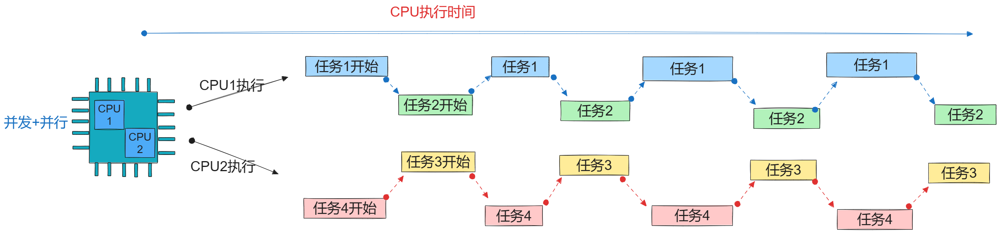

# 第一节、使用并发与并行带来的竞态问题，如何解决？

## 1. 并发：


## 2.并行：


## 3.并发 + 并行：



## 4.临界资源：

所谓的临界资源就是被多个任务（进程或线程）共享访问的资源，称为临界资源。

对临界资源的操作必须严格控制，避免在并发访问时，出现的数据冲突，而造成因数据混乱而出现内核崩溃及其它程序问题。

所以对临界资源的操作必须进行同步控制。    

## 5.应用层常用的同步机制： 

互斥锁，信号量，条件变量，读写锁等

## 6.内核中的同步机制：

**中断屏蔽，**

### 1.中断屏蔽：

关闭当前cpu的中断，可以保障保护的任务不会被切换，保证了任务执行的原子性，但是保护区内一定要快速完成，处理临界资源时不能延时，耗时，休眠的操作，不然内核会崩溃。中断屏蔽大多在系统启动及中断跳转时会进行中断屏蔽，但是这些操作已经由内核完成，开发人员一般很少使用中断屏蔽，因为中断屏蔽会对系统的实时性产生影响。

内核提供了关中断与开中断的函数宏：

```c
local_irq_disable();关中断宏
//...临界区操作（一会在实时操作）

local_irq_enable();开中断宏
```

# 第二节、自旋锁 spinlock 

## 1. 为啥叫自旋锁？

当一个进程获取到自旋锁之后，如果此时有另外一个进程也想获取这把锁，后一个进程处于自旋（原地打转）状态。

## 2.自旋锁的特点：

1.

2.自旋锁可能会产生死锁（在同一进程中多次获取同一把求解锁的锁会产生死锁）

3.

## 3.内核提供的自旋锁API接口：

```c
//1.定义一个自旋锁对象：
spinlock_t lock;
//2.初始化自旋锁的宏：
spin_lock_init(&lock);
//3.上锁：
viod spin_lock(spinlock_t* lock);
//4.解锁：
viod spin_unlock(spinlock_t* lock);
```

## 4.自旋锁代码演示：

驱动：

```c
#include <linux/module.h>
#include <linux/init.h>
#include <linux/fs.h>
#include <linux/uaccess.h>
#include <linux/io.h>
#include <linux/device.h>
#include <linux/cdev.h>
#include <linux/slab.h>
#include <linux/wait.h>
#include <linux/poll.h>
#include <linux/sched.h>
#define MYDEV_NAME "xxx_sample_chardev"

// 描述一个字符设备：应该有哪些属性：
// 1.设备名称，2.设备号：主设备好，次设备号，3.对设备进行操作的结构体struct file_operations
struct xxx_sample_chardev
{
    struct cdev *c_dev;
    // 添加设备类，设备属性：
    struct class *mydev_class;
    struct device *mydev;
    // 等待队列的属性：
    wait_queue_head_t wait_queue;
    u8 condition;

    //添加属性：异步队列的属性：
    struct fasync_struct* fap;
    //添加实现同步机制的自旋锁：
    spinlock_t lock;
    //添加一个设备是否在使用：
    u8 status;
    
};

char kernel_buf[128] = {0};
// 1.在全局中定义的 xxx_sample_charde的对象
struct xxx_sample_chardev my_chrdev;

// 在内核定义对应的函数接口：
// 与文件read对应的函数指针
ssize_t xxx_sample_chardev_read(struct file *file, char __user *userbuf, size_t size, loff_t *offset)
{
    // 先检查一文件的标记：
    if (file->f_flags & O_NONBLOCK)
    {
        if (my_chrdev.condition == 0)
        {
            // 条件不满足，则直接返回。
            return -EAGAIN;
        }
        else
        {
            if (size >= sizeof(kernel_buf))
            {
                size = sizeof(userbuf);
            }
            copy_to_user(userbuf, kernel_buf + *offset, size);
            my_chrdev.condition = 0;
            return size;
        }
    }

    // 此时当前进程不满足条件在此阻塞：
    wait_event_interruptible(my_chrdev.wait_queue, my_chrdev.condition);
    my_chrdev.condition = 0;
    if (size >= sizeof(kernel_buf))
    {
        size = sizeof(userbuf);
    }
    copy_to_user(userbuf, kernel_buf + *offset, size);
    printk("内核中的xxx_sample_chardev_read执行了\n");
    return size;
}
// 与write对应的函数指针
ssize_t xxx_sample_chardev_write(struct file *file, const char __user *usrbuf, size_t size, loff_t *offset)
{
    // 回调函数中参数：
    // 参数1：就是用户进程中使用open内核中创建的struct file的实例的地址。
    // 参数2：usrbuf:就是用户进程中数据的地址。
    // 参数3: size,用户进程中要拷贝的字节数。
    // 参数4：当前文件的偏移量。单元也是字节。

    // 调用copy_from_user从用户进程中获取数据：
    int ret = 0;
    if (size >= sizeof(kernel_buf))
    {
        size = sizeof(usrbuf);
    }
    memset(kernel_buf, 0, sizeof(kernel_buf));

    ret = copy_from_user(kernel_buf + *offset, usrbuf, size);
    if (ret)
    {
        printk("copy_from_usre failed");
        return -EIO;
    }
    printk("内核中的xxx_sample_chardev_write执行了kf[0] = %s\n", kernel_buf);
    // 唤醒等待队列中的进程：
    my_chrdev.condition = 1;
    wake_up_interruptible(&my_chrdev.wait_queue);
    //遍历异步队列中的fd并发出SIGIO信号：
    kill_fasync(&my_chrdev.fap, SIGIO, POLL_IN);
    return size;
}

// 与open对应的函数指针
int xxx_sample_chardev_open(struct inode *inode, struct file *file)
{
    printk("内核中的xxx_sample_chardev_open执行了\n");
    //上锁：
    spin_lock(&my_chrdev.lock);
    if(my_chrdev.status != 0)
    {
        spin_unlock(&my_chrdev.lock);
        return -EBUSY;
    }
    my_chrdev.status = 1;
    spin_unlock(&my_chrdev.lock);
    printk("当前获取自旋锁的进程为 = %d\n",current->pid);

    // 初始化设备的等待队列：
    return 0;
}
// 与close对应函数指针：
int xxx_sample_chardev_release(struct inode *inode, struct file *file)
{
    printk("内核中的xxx_sample_chardev_release执行了\n");
    my_chrdev.status = 0;
    spin_unlock(&my_chrdev.lock);

    return 0;
}
// 这就回调函数就是IO多路复用机制中进行回调的调函数。
unsigned int xxx_sample_chardev_poll(struct file *file, struct poll_table_struct *table)
{
    int mask = 0;
    // 1.把fd指定的设备中的等待队列挂载到wait列表。
    poll_wait(file, &my_chrdev.wait_queue, table);
    // 2.如果条件满足，置位相位相应标记掩码mask:
    // POLL_IN 只读事件产生的code, POLL_OUT只写事件， POLL_ERR错误事件，...
    if (my_chrdev.condition == 1)
    {
        return mask | POLL_IN;
    }

    return mask;
}

//定义一个异步操作的回调函数：
int xxx_sample_chardev_fasync(int fd, struct file *file, int on)
{
    return fasync_helper(fd, file, on, &my_chrdev.fap);
}

struct file_operations fops = {
    .open = xxx_sample_chardev_open,
    .read = xxx_sample_chardev_read,
    .write = xxx_sample_chardev_write,
    .release = xxx_sample_chardev_release,
    .poll = xxx_sample_chardev_poll,
    .fasync = xxx_sample_chardev_fasync,
};

// 入口函数：
int __init my_test_module_init(void)
{
    int ret;
    printk("A模块的入口函数执行了");
    // 2.3单独申请设备号的方式：
    my_chrdev.c_dev = cdev_alloc();
    if (my_chrdev.c_dev == NULL)
    {
        printk("cdev_alloc err:\n");
        return -ENOMEM;
    }
    // cdev初始化：
    cdev_init(my_chrdev.c_dev, &fops);
    // 申请设备号
    ret = alloc_chrdev_region(&my_chrdev.c_dev->dev, 0, 1, MYDEV_NAME);
    if (ret)
    {
        printk("alloc_chrdev_region err\n");
        return ret;
    }
    printk("申请到的主设备号 = %d\n", MAJOR(my_chrdev.c_dev->dev));

    // 把cde对象添加到内核设备链表中：
    ret = cdev_add(my_chrdev.c_dev, my_chrdev.c_dev->dev, 1);
    if (ret)
    {
        printk("cdev_add err:");
        return ret;
    }
    // 申请设备类：
    my_chrdev.mydev_class = class_create(THIS_MODULE, "MYLED");
    if (IS_ERR(my_chrdev.mydev_class))
    {
        printk("class_create失败\n");
        return PTR_ERR(my_chrdev.mydev_class);
    }
    // 申请设备对象：向上提交uevent事件：建立了设备节点与设备号之间的关系。
    my_chrdev.mydev = device_create(my_chrdev.mydev_class, NULL, my_chrdev.c_dev->dev, NULL, MYDEV_NAME);
    if (IS_ERR(my_chrdev.mydev))
    {
        printk("device_create失败\n");
        return PTR_ERR(my_chrdev.mydev);
    }
    // 初始化等待队列头：
    init_waitqueue_head(&my_chrdev.wait_queue);
    my_chrdev.condition = 0;
    //初始化设备中的自旋锁：
    spin_lock_init(&my_chrdev.lock);
    my_chrdev.status = 0;
    return 0;
}

// 出口函数：
void __exit my_test_module_exit(void)
{
    printk("出口函数执行了\n"); // 把调试信息放在了系统日志缓冲区，使用dmesg来显示。
    // 清理资源。
    // 先销毁设备，再销毁设备类：
    device_destroy(my_chrdev.mydev_class, my_chrdev.c_dev->dev);
    class_destroy(my_chrdev.mydev_class);
    cdev_del(my_chrdev.c_dev);
    unregister_chrdev_region(my_chrdev.c_dev->dev, 1);
    kfree(my_chrdev.c_dev);
}

// 指定许可：
MODULE_LICENSE("GPL");
MODULE_AUTHOR("gaowanxi, email:gaonetcom@163.com");
// 指定入口及出口函数：
module_init(my_test_module_init);
module_exit(my_test_module_exit);
```

# 第三节、信号量semaphra：

## 1. 内核中信号量：

当多个进程同时共享操作同一个临界资源时，其中一个进程获取信号量后，继续执行。没有获取信号量的进程将进入休眠。

## 2.信号量的特点：

1.进程在获取不到信号量时候会处于休眠状态，所以不消耗cpu的资源，所以

2.信号量一般工作在中断的下文（tasklet除外）。或者允许进程阻塞等待操作的函数中。

## 3.内核提供的信号量的API接口：

```c
1.定义信号号：
struct semaphore sem;

2.初始化信号量：
viod sema_init(struct semaphore* sem, int val);
此接口注意，只有val = 1时，才有互斥效果。

3. 获取信号量：
(阻塞版)
void down(struct semaphore* sem);//获取不到信号量就会阻塞休眠。直到信号量的值变为正数，再执行。
或：
(非阻塞版)
int down_trylock(struct semaphore* sem);
//尝试获取信号量，如果信号量获取成功返回0，如果信号量获取失败不会阻塞，返回1;

4.释放信号量：
void up(struct semaphore* sem);
```

## 4.信号量代码实例演示：

```cpp
#include <linux/module.h>
#include <linux/init.h>
#include <linux/fs.h>
#include <linux/uaccess.h>
#include <linux/io.h>
#include <linux/device.h>
#include <linux/cdev.h>
#include <linux/slab.h>
#include <linux/wait.h>
#include <linux/poll.h>
#include <linux/sched.h>
#include <linux/semaphore.h>
#define MYDEV_NAME "xxx_sample_chardev"

// 描述一个字符设备：应该有哪些属性：
// 1.设备名称，2.设备号：主设备好，次设备号，3.对设备进行操作的结构体struct file_operations
struct xxx_sample_chardev
{
    struct cdev *c_dev;
    // 添加设备类，设备属性：
    struct class *mydev_class;
    struct device *mydev;
    // 等待队列的属性：
    wait_queue_head_t wait_queue;
    u8 condition;

    //添加属性：异步队列的属性：
    struct fasync_struct* fap;
    // //添加实现同步机制的自旋锁：
    // spinlock_t lock;
    // //添加一个设备是否在使用：
    // u8 status;
    //添加同步机制信号量：
    struct semaphore sem;
    
};

char kernel_buf[128] = {0};
// 1.在全局中定义的 xxx_sample_charde的对象
struct xxx_sample_chardev my_chrdev;

// 在内核定义对应的函数接口：
// 与文件read对应的函数指针
ssize_t xxx_sample_chardev_read(struct file *file, char __user *userbuf, size_t size, loff_t *offset)
{
    // 先检查一文件的标记：
    if (file->f_flags & O_NONBLOCK)
    {
        if (my_chrdev.condition == 0)
        {
            // 条件不满足，则直接返回。
            return -EAGAIN;
        }
        else
        {
            if (size >= sizeof(kernel_buf))
            {
                size = sizeof(userbuf);
            }
            copy_to_user(userbuf, kernel_buf + *offset, size);
            my_chrdev.condition = 0;
            return size;
        }
    }

    // 此时当前进程不满足条件在此阻塞：
    wait_event_interruptible(my_chrdev.wait_queue, my_chrdev.condition);
    my_chrdev.condition = 0;
    if (size >= sizeof(kernel_buf))
    {
        size = sizeof(userbuf);
    }
    copy_to_user(userbuf, kernel_buf + *offset, size);
    printk("内核中的xxx_sample_chardev_read执行了\n");
    return size;
}
// 与write对应的函数指针
ssize_t xxx_sample_chardev_write(struct file *file, const char __user *usrbuf, size_t size, loff_t *offset)
{
    // 回调函数中参数：
    // 参数1：就是用户进程中使用open内核中创建的struct file的实例的地址。
    // 参数2：usrbuf:就是用户进程中数据的地址。
    // 参数3: size,用户进程中要拷贝的字节数。
    // 参数4：当前文件的偏移量。单元也是字节。

    // 调用copy_from_user从用户进程中获取数据：
    int ret = 0;
    if (size >= sizeof(kernel_buf))
    {
        size = sizeof(usrbuf);
    }
    memset(kernel_buf, 0, sizeof(kernel_buf));

    ret = copy_from_user(kernel_buf + *offset, usrbuf, size);
    if (ret)
    {
        printk("copy_from_usre failed");
        return -EIO;
    }
    printk("内核中的xxx_sample_chardev_write执行了kf[0] = %s\n", kernel_buf);
    // 唤醒等待队列中的进程：
    my_chrdev.condition = 1;
    wake_up_interruptible(&my_chrdev.wait_queue);
    //遍历异步队列中的fd并发出SIGIO信号：
    kill_fasync(&my_chrdev.fap, SIGIO, POLL_IN);
    return size;
}

// 与open对应的函数指针
int xxx_sample_chardev_open(struct inode *inode, struct file *file)
{
    int ret;
    printk("内核中的xxx_sample_chardev_open执行了\n");
    //上锁：
    // spin_lock(&my_chrdev.lock);
    // if(my_chrdev.status != 0)
    // {
    //     spin_unlock(&my_chrdev.lock);
    //     return -EBUSY;
    // }
    // my_chrdev.status = 1;
    // spin_unlock(&my_chrdev.lock);
    ret = down_trylock(&my_chrdev.sem);
    if(ret)
    {
       return -EBUSY; 
    }
    printk("当前获取自旋锁的进程为 = %d\n",current->pid);

    // 初始化设备的等待队列：
    return 0;
}
// 与close对应函数指针：
int xxx_sample_chardev_release(struct inode *inode, struct file *file)
{
    printk("内核中的xxx_sample_chardev_release执行了\n");
    // my_chrdev.status = 0;
    // spin_unlock(&my_chrdev.lock);
    up(&my_chrdev.sem);

    return 0;
}
// 这就回调函数就是IO多路复用机制中进行回调的调函数。
unsigned int xxx_sample_chardev_poll(struct file *file, struct poll_table_struct *table)
{
    int mask = 0;
    // 1.把fd指定的设备中的等待队列挂载到wait列表。
    poll_wait(file, &my_chrdev.wait_queue, table);
    // 2.如果条件满足，置位相位相应标记掩码mask:
    // POLL_IN 只读事件产生的code, POLL_OUT只写事件， POLL_ERR错误事件，...
    if (my_chrdev.condition == 1)
    {
        return mask | POLL_IN;
    }

    return mask;
}

//定义一个异步操作的回调函数：
int xxx_sample_chardev_fasync(int fd, struct file *file, int on)
{
    return fasync_helper(fd, file, on, &my_chrdev.fap);
}

struct file_operations fops = {
    .open = xxx_sample_chardev_open,
    .read = xxx_sample_chardev_read,
    .write = xxx_sample_chardev_write,
    .release = xxx_sample_chardev_release,
    .poll = xxx_sample_chardev_poll,
    .fasync = xxx_sample_chardev_fasync,
};

// 入口函数：
int __init my_test_module_init(void)
{
    int ret;
    printk("A模块的入口函数执行了");
    // 2.3单独申请设备号的方式：
    my_chrdev.c_dev = cdev_alloc();
    if (my_chrdev.c_dev == NULL)
    {
        printk("cdev_alloc err:\n");
        return -ENOMEM;
    }
    // cdev初始化：
    cdev_init(my_chrdev.c_dev, &fops);
    // 申请设备号
    ret = alloc_chrdev_region(&my_chrdev.c_dev->dev, 0, 1, MYDEV_NAME);
    if (ret)
    {
        printk("alloc_chrdev_region err\n");
        return ret;
    }
    printk("申请到的主设备号 = %d\n", MAJOR(my_chrdev.c_dev->dev));

    // 把cde对象添加到内核设备链表中：
    ret = cdev_add(my_chrdev.c_dev, my_chrdev.c_dev->dev, 1);
    if (ret)
    {
        printk("cdev_add err:");
        return ret;
    }
    // 申请设备类：
    my_chrdev.mydev_class = class_create(THIS_MODULE, "MYLED");
    if (IS_ERR(my_chrdev.mydev_class))
    {
        printk("class_create失败\n");
        return PTR_ERR(my_chrdev.mydev_class);
    }
    // 申请设备对象：向上提交uevent事件：建立了设备节点与设备号之间的关系。
    my_chrdev.mydev = device_create(my_chrdev.mydev_class, NULL, my_chrdev.c_dev->dev, NULL, MYDEV_NAME);
    if (IS_ERR(my_chrdev.mydev))
    {
        printk("device_create失败\n");
        return PTR_ERR(my_chrdev.mydev);
    }
    // 初始化等待队列头：
    init_waitqueue_head(&my_chrdev.wait_queue);
    my_chrdev.condition = 0;
    // //初始化设备中的自旋锁：
    // spin_lock_init(&my_chrdev.lock);
    // my_chrdev.status = 0;
    sema_init(&my_chrdev.sem,1);
    return 0;
}

// 出口函数：
void __exit my_test_module_exit(void)
{
    printk("出口函数执行了\n"); // 把调试信息放在了系统日志缓冲区，使用dmesg来显示。
    // 清理资源。
    // 先销毁设备，再销毁设备类：
    device_destroy(my_chrdev.mydev_class, my_chrdev.c_dev->dev);
    class_destroy(my_chrdev.mydev_class);
    cdev_del(my_chrdev.c_dev);
    unregister_chrdev_region(my_chrdev.c_dev->dev, 1);
    kfree(my_chrdev.c_dev);
}

// 指定许可：
MODULE_LICENSE("GPL");
MODULE_AUTHOR("gaowanxi, email:gaonetcom@163.com");
// 指定入口及出口函数：
module_init(my_test_module_init);
module_exit(my_test_module_exit);
```

# 第四节、内核互斥体mutex：

## 1. 互斥体的定义：

当一个进程获取到互斥体的时候，如果此时有另外一个进程也想获取互斥体时，后一个进程处理阻塞休眠状态。所以互斥体又叫互斥锁。互斥体是一种高效的信号量，在应用中使用也较多。

## 2.互斥体的特点：

1. 互斥体在获取不到资源的时候处于休眠状态，不消耗cpu资源。所以互斥体在保护的临界的资源可以很大，里在可以阻塞休眠的操作。

2.互斥体一般用于中断下文(tasklet除外)，允许使用可能让进程阻塞的函数中。

3.互斥体是一种更高效的信号量，一般情况下使用互斥体。

## 3.互斥体的接口API:

```c
1.定义互斥体：
struct mutex mtx;
2.初始化互斥体：
mutex_init(&mtx);
3.上锁:
    //阻塞版：即其它进程获不到锁时会在此休眠
    void mutex_lock(&mtx)
    //非阻塞版，即其它进程获不到锁时，立即返回
    int mutex_trylock(&mtx);
    尝试上锁，成功返回1，失败返回0，不会阻塞进程。
4.解锁：
    void mutex_unlock(&mtx);    
```

## 4.互斥体代码实例：

```cpp
#include <linux/module.h>
#include <linux/init.h>
#include <linux/fs.h>
#include <linux/uaccess.h>
#include <linux/io.h>
#include <linux/device.h>
#include <linux/cdev.h>
#include <linux/slab.h>
#include <linux/wait.h>
#include <linux/poll.h>
#include <linux/sched.h>
#include <linux/semaphore.h>
#define MYDEV_NAME "xxx_sample_chardev"

// 描述一个字符设备：应该有哪些属性：
// 1.设备名称，2.设备号：主设备好，次设备号，3.对设备进行操作的结构体struct file_operations
struct xxx_sample_chardev
{
    struct cdev *c_dev;
    // 添加设备类，设备属性：
    struct class *mydev_class;
    struct device *mydev;
    // 等待队列的属性：
    wait_queue_head_t wait_queue;
    u8 condition;

    //添加属性：异步队列的属性：
    struct fasync_struct* fap;
    // //添加实现同步机制的自旋锁：
    // spinlock_t lock;
    // //添加一个设备是否在使用：
    // u8 status;
    //添加同步机制信号量：
    //struct semaphore sem;
    //添加互斥体属性：
    struct mutex mtx;
    
};

char kernel_buf[128] = {0};
// 1.在全局中定义的 xxx_sample_charde的对象
struct xxx_sample_chardev my_chrdev;

// 在内核定义对应的函数接口：
// 与文件read对应的函数指针
ssize_t xxx_sample_chardev_read(struct file *file, char __user *userbuf, size_t size, loff_t *offset)
{
    // 先检查一文件的标记：
    if (file->f_flags & O_NONBLOCK)
    {
        if (my_chrdev.condition == 0)
        {
            // 条件不满足，则直接返回。
            return -EAGAIN;
        }
        else
        {
            if (size >= sizeof(kernel_buf))
            {
                size = sizeof(userbuf);
            }
            copy_to_user(userbuf, kernel_buf + *offset, size);
            my_chrdev.condition = 0;
            return size;
        }
    }

    // 此时当前进程不满足条件在此阻塞：
    wait_event_interruptible(my_chrdev.wait_queue, my_chrdev.condition);
    my_chrdev.condition = 0;
    if (size >= sizeof(kernel_buf))
    {
        size = sizeof(userbuf);
    }
    copy_to_user(userbuf, kernel_buf + *offset, size);
    printk("内核中的xxx_sample_chardev_read执行了\n");
    return size;
}
// 与write对应的函数指针
ssize_t xxx_sample_chardev_write(struct file *file, const char __user *usrbuf, size_t size, loff_t *offset)
{
    // 回调函数中参数：
    // 参数1：就是用户进程中使用open内核中创建的struct file的实例的地址。
    // 参数2：usrbuf:就是用户进程中数据的地址。
    // 参数3: size,用户进程中要拷贝的字节数。
    // 参数4：当前文件的偏移量。单元也是字节。

    // 调用copy_from_user从用户进程中获取数据：
    int ret = 0;
    if (size >= sizeof(kernel_buf))
    {
        size = sizeof(usrbuf);
    }
    memset(kernel_buf, 0, sizeof(kernel_buf));

    ret = copy_from_user(kernel_buf + *offset, usrbuf, size);
    if (ret)
    {
        printk("copy_from_usre failed");
        return -EIO;
    }
    printk("内核中的xxx_sample_chardev_write执行了kf[0] = %s\n", kernel_buf);
    // 唤醒等待队列中的进程：
    my_chrdev.condition = 1;
    wake_up_interruptible(&my_chrdev.wait_queue);
    //遍历异步队列中的fd并发出SIGIO信号：
    kill_fasync(&my_chrdev.fap, SIGIO, POLL_IN);
    return size;
}

// 与open对应的函数指针
int xxx_sample_chardev_open(struct inode *inode, struct file *file)
{
    int ret;
    printk("内核中的xxx_sample_chardev_open执行了\n");
    //上锁：
    // spin_lock(&my_chrdev.lock);
    // if(my_chrdev.status != 0)
    // {
    //     spin_unlock(&my_chrdev.lock);
    //     return -EBUSY;
    // }
    // my_chrdev.status = 1;
    // spin_unlock(&my_chrdev.lock);
    // ret = down_trylock(&my_chrdev.sem);
    // if(ret)
    // {
    //    return -EBUSY; 
    // }
    ret = mutex_trylock(&my_chrdev.mtx);
    if(ret == 0)
    {
        return -EBUSY;
    }
    printk("当前获取自旋锁的进程为 = %d\n",current->pid);

    // 初始化设备的等待队列：
    return 0;
}
// 与close对应函数指针：
int xxx_sample_chardev_release(struct inode *inode, struct file *file)
{
    printk("内核中的xxx_sample_chardev_release执行了\n");
    // my_chrdev.status = 0;
    // spin_unlock(&my_chrdev.lock);
    //up(&my_chrdev.sem);
    mutex_unlock(&my_chrdev.mtx);
    return 0;
}
// 这就回调函数就是IO多路复用机制中进行回调的调函数。
unsigned int xxx_sample_chardev_poll(struct file *file, struct poll_table_struct *table)
{
    int mask = 0;
    // 1.把fd指定的设备中的等待队列挂载到wait列表。
    poll_wait(file, &my_chrdev.wait_queue, table);
    // 2.如果条件满足，置位相位相应标记掩码mask:
    // POLL_IN 只读事件产生的code, POLL_OUT只写事件， POLL_ERR错误事件，...
    if (my_chrdev.condition == 1)
    {
        return mask | POLL_IN;
    }

    return mask;
}

//定义一个异步操作的回调函数：
int xxx_sample_chardev_fasync(int fd, struct file *file, int on)
{
    return fasync_helper(fd, file, on, &my_chrdev.fap);
}

struct file_operations fops = {
    .open = xxx_sample_chardev_open,
    .read = xxx_sample_chardev_read,
    .write = xxx_sample_chardev_write,
    .release = xxx_sample_chardev_release,
    .poll = xxx_sample_chardev_poll,
    .fasync = xxx_sample_chardev_fasync,
};

// 入口函数：
int __init my_test_module_init(void)
{
    int ret;
    printk("A模块的入口函数执行了");
    // 2.3单独申请设备号的方式：
    my_chrdev.c_dev = cdev_alloc();
    if (my_chrdev.c_dev == NULL)
    {
        printk("cdev_alloc err:\n");
        return -ENOMEM;
    }
    // cdev初始化：
    cdev_init(my_chrdev.c_dev, &fops);
    // 申请设备号
    ret = alloc_chrdev_region(&my_chrdev.c_dev->dev, 0, 1, MYDEV_NAME);
    if (ret)
    {
        printk("alloc_chrdev_region err\n");
        return ret;
    }
    printk("申请到的主设备号 = %d\n", MAJOR(my_chrdev.c_dev->dev));

    // 把cde对象添加到内核设备链表中：
    ret = cdev_add(my_chrdev.c_dev, my_chrdev.c_dev->dev, 1);
    if (ret)
    {
        printk("cdev_add err:");
        return ret;
    }
    // 申请设备类：
    my_chrdev.mydev_class = class_create(THIS_MODULE, "MYLED");
    if (IS_ERR(my_chrdev.mydev_class))
    {
        printk("class_create失败\n");
        return PTR_ERR(my_chrdev.mydev_class);
    }
    // 申请设备对象：向上提交uevent事件：建立了设备节点与设备号之间的关系。
    my_chrdev.mydev = device_create(my_chrdev.mydev_class, NULL, my_chrdev.c_dev->dev, NULL, MYDEV_NAME);
    if (IS_ERR(my_chrdev.mydev))
    {
        printk("device_create失败\n");
        return PTR_ERR(my_chrdev.mydev);
    }
    // 初始化等待队列头：
    init_waitqueue_head(&my_chrdev.wait_queue);
    my_chrdev.condition = 0;
    // //初始化设备中的自旋锁：
    // spin_lock_init(&my_chrdev.lock);
    // my_chrdev.status = 0;
    //sema_init(&my_chrdev.sem,1);
    //初始化互斥体：
    mutex_init(&my_chrdev.mtx);
    return 0;
}

// 出口函数：
void __exit my_test_module_exit(void)
{
    printk("出口函数执行了\n"); // 把调试信息放在了系统日志缓冲区，使用dmesg来显示。
    // 清理资源。
    // 先销毁设备，再销毁设备类：
    device_destroy(my_chrdev.mydev_class, my_chrdev.c_dev->dev);
    class_destroy(my_chrdev.mydev_class);
    cdev_del(my_chrdev.c_dev);
    unregister_chrdev_region(my_chrdev.c_dev->dev, 1);
    kfree(my_chrdev.c_dev);
}

// 指定许可：
MODULE_LICENSE("GPL");
MODULE_AUTHOR("gaowanxi, email:gaonetcom@163.com");
// 指定入口及出口函数：
module_init(my_test_module_init);
module_exit(my_test_module_exit);
```

# 第五节、原子操作：

## 1. 原子操作的定义：

原子操作，即不会被分割执行的操作，

原子操作即不自旋，也亦不阻塞。通过判断原子变量的值来达到互斥的特性。是一种无锁操作方式，所有更高效。

原子操作都是由一些固定的基本类型组成。比如atomic_t 就是一个int,

常用的原子类型：

```cpp
typedef struct {
	    volatile int val;
} atomic_t;
```

## 2.原子操作的API:

```c
1.定义原子变量并初始化：
atomic_t atm = ATOMIC_INIT(1);
或者：
atomic_t atm;//先定义，再初始化。
atomic_set(&atm, 1);
2.原子上锁：
int atomic_dec_and_test(&atm);
让原子变量值减1和0比较如果为0，返回真，说明获取锁成功，否则失败。
 
3.原子解锁：
atomic_inc(&atm)
//加1
```

# 第六节、总结：

