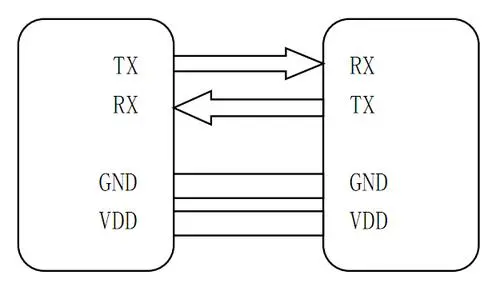
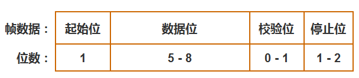
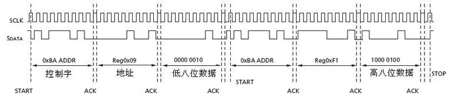
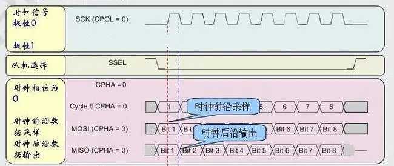

# 嵌入式基础（三）基础外设

## 1.什么是UART？与USART有什么区别⭐⭐⭐

### (1)什么是UART

通用异步收发传输器（Universal Asynchronous Receiver/Transmitter)，通常称作 UART，是一种**异步全双工串行通信协议**，它将要传输的资料在串行通信与并行通信之间加以转换。作为把并行输入信号转成串行输出信号的芯片，UART 通常被集成于其他通讯接口的连结上，它不是像 SPI 和 I2C 这样的通信协议，而是微控制器中独立的物理电路或独立的 IC。**UART 的工作原理是将数据的二进制位一位一位的进行传输。**

### 硬件连接

硬件连接比较简单，仅需要 **3** 条线，**注意连接时两个设备UART电平，如电平范围不一致请做电平转换后再连接，**如下图所示：



- **TX：发送数据端，要接对面设备的RX。**
- **RX：接收数据端，要接对面设备的TX。**
- **GND：保证两设备共地，有统一的参考平面。**

### 通信协议

UART 作为异步串口通信协议的一种，工作原理是将数据的字节一位接一位地传输。协议如下：



#### 空闲位：

UART 协议规定，当**总线处于空闲状态时信号线的状态为 1 即高电平**。

#### 起始位：

开始进行数据传输时发送方要先发出**一个低电平 0 来表示传输字符的开始**。因为空闲位一直是高电平所以开始第一次通讯时先发送一个明显区别于空闲状态的信号即为低电平。

#### 数据位：

起始位之后就是要传输的数据，数据可以是 5，6，7，8 位，构成一个字符，一般都是 8 位。先发送最低位 LSB，再发送最高位 MSB（小端模式）。

#### 奇偶校验位：

**数据位传送完成后，要进行奇偶校验，校验位其实是调整个数，串口校验分几种方式**

- 无校验（No Parity）
- 奇校验（Odd Parity）：如果数据位中 1 的数目是偶数，则校验位为 1 才能满足 1 的个数为奇数，如果 1 的数目是奇数，校验位为0。
- 偶校验（Even Parity）：如果数据为中 1 的数目是偶数，则校验位为 0 才能满足 1 的个数为偶数，如果 1 的数目是奇数，校验位为 1。
- Mark Parity：校验位始终为 1。
- Space Parity：校验位始终为 0。

#### 停止位：

数据结束标志，可以是 1 位，1.5 位，2 位的**高电平**。

#### 波特率：

异步通信以一个字符为传输单位，通信中两个字符间的时间间隔多少是不固定的，然而在同一个字符中的两个相邻位间的时间间隔是固定的。数据传输速率使用波特率来表示，单位 bps（bits per second）。常见的波特率 9600 bps，115200 bps 等等，其他标准的波特率是 1200，2400，4800，19200，38400，57600。举个例子，如果串口波特率设置为 9600 bps，那么传输一个比特需要的时间是：1 / 9600 ≈ 104.2us。

#### 二、UART和USART的区别

| **特点**   | **UART**                     | **USART**                                    |
| ---------- | ---------------------------- | -------------------------------------------- |
| 通信方式   | 只支持异步通信               | 可支持**异步和同步**通信                     |
| 全双工通信 | 可以进行全双工数据传输       | 可以进行全双工数据传输                       |
| 功能       | 通常只包括发送和接收功能     | 包括发送、接收、同步和异步等多种功能         |
| 数据线     |                              |                                              |
| 适用场景   | 适用于简单的低速异步通信应用 | 适用于更复杂的通信需求，包括同步和异步通信等 |

## 2.什么是I2C， I2C时序图?⭐⭐

### 一、I2C协议简介

**I2C（Inter-Integrated Circuit）是一种串行通信总线协议，用于在集成电路（IC）之间进行通信。它由两根线组成：串行数据线（SDA）和串行时钟线（SCL）。I2C 总线采用主从结构，可以支持多个设备在同一条总线上进行通信。**

I2C 通信的特点包括简单、灵活和可靠，适用于连接多个低速设备。每个设备都有一个唯一的地址，主设备通过发送地址将数据传输给从设备，从设备接收并响应这些数据。

### 二、I2C总线结构

I2C 总线在物理连接上非常简单，分别由 SDA(串行数据线)和 SCL(串行时钟线)及上拉电阻组成。通信原理是通过对 SCL 和 SDA 线高低电平时序的控制，来产生 I2C 总线协议所需要的信号进行数据的传递。在**总线空闲状态**时，这两根线一般被上面所接的上拉电阻拉高，**保持着高电平**。


### 三、I2C时序图



**开始条件：**在时钟线保持高电平时，数据线从高电平转为低电平，即检测到一个**下降沿**，会形成一个开始条件；

**停止条件：**在时钟线保持高电平时，数据线从低电平转为高电平，即检测到一个**上降沿**，会形成一个停止条件。

进行数据传输前也就是紧跟开始条件后，我们要传送地址字节，前 7 位是从设备地址（这也是为什么一个主机理论上最多能接 127 个从机，2^7-1），第八位是读/写标志位。每 8 bit 传输完成，第九位是应答位。如果是主设备发送数据，就是从设备应答，如果是主设备读取数据，就是主设备应答。

## 3.请说明总线接口USRT、I2C、USB的异同点（串/并、速度、全/半双工、总线拓扑等）⭐⭐⭐⭐

下面是 USRT、I2C 和 USB 总线接口的异同点比较表：

| **特性**      | **USRT**                      | **I2C**                                  | **USB**                        |
| ------------- | ----------------------------- | ---------------------------------------- | ------------------------------ |
| 类型          | 串行                          | 串行                                     | 串行                           |
| 速度          | 快 - 高达几 GHz               | 中等 - 最高可达400kHz                    | 可变 - 低速、全速、高速、超速  |
| 传输协议      | 可使用多种协议，如UART、SPI等 | 特定 I2C 协议                            | 特定 USB 协议                  |
| 通信线数      | 3 根或更多                    | 2 根                                     | 4 根至更多                     |
| 拓扑          | 点对点或多点                  | 主从结构                                 | 主从结构                       |
| 协议复杂性    | 中等                          | 简单                                     | 复杂                           |
| 主/从设备     | 可能有多个主设备和从设备      | 一个主设备和多个从设备                   | 一个主设备和多个从设备         |
| 半双工/全双工 | 全双工                        | 半双工                                   | 全双工或半双工                 |
| 应用          | 通常用于远距离通信，如 RS-485 | 适用于短距离通信，如传感器与微控制器之间 | 广泛应用于外设连接、存储设备等 |

## 4.什么是SPI，SPI的特性？⭐⭐⭐

#### 1、什么是SPI

**SPI 是串行外设接口（Serial Peripheral Interface）的缩写，是一种高速的，全双工，同步的通信总线，并且在芯片的管脚上只占用四根线，节约了芯片的管脚，同时为PCB的布局上节省空间，提供方便，正是出于这种简单易用的特性，越来越多的芯片集成了这种通信协议，主要应用在 EEPROM，FLASH，实时时钟，AD转换器，还有数字信号处理器和数字信号解码器之间。**

#### 2、SPI模式

SPI 分为主、从两种模式，一个SPI通讯系统需要包含一个（且只能是一个）主设备，一个或多个从设备。

提供时钟的为主设备（Master），接收时钟的设备为从设备（Slave），SPI 接口的读写操作，都是由主设备发起。当存在多个从设备时，通过各自的片选信号进行管理。

SPI 是全双工且 SPI 没有定义速度限制，一般的实现通常能达到甚至超过 10 Mbps

#### 3、SPI信号线

SPI接口一般使用四条信号线通信：

**SDI（数据输入），SDO（数据输出），SCK（时钟），CS（片选）**

- MISO：主设备输入/从设备输出引脚。该引脚在从模式下发送数据，在主模式下接收数据。
- MOSI：主设备输出/从设备输入引脚。该引脚在主模式下发送数据，在从模式下接收数据。
- SCLK：串行时钟信号，由主设备产生。
- CS/SS：从设备片选信号，由主设备控制。它的功能是用来作为“片选引脚”，也就是选择指定的从设备，让主设备可以单独地与特定从设备通讯，避免数据线上的冲突。

#### 4、SPI设备选择

SPI 是单主设备（ single-master ）通信协议，这意味着总线中的只有一支中心设备能发起通信。

1. 当 SPI 主设备想读/写［从设备］时：
2. 它首先拉低［从设备］对应的 SS 线（SS 是低电平有效）
3. 接着开始发送工作脉冲到时钟线上，在相应的脉冲时间上，［主设备］把信号发到 MOSI 实现“写”，同时可对 MISO 采样而实现“读”



6、SPI通信的四种模式

**SPI的四种模式，简单地讲就是设置SCLK时钟信号线的那种信号为有效信号**

它们的区别是定义了在时钟脉冲的哪条边沿转换（toggles）输出信号，哪条边沿采样输入信号，还有时钟脉冲的稳定电平值（就是时钟信号无效时是高还是低）。每种模式由一对参数刻画，它们称为时钟极（clock polarity）CPOL与时钟期（clock phase）CPHA。

- SPI通信有 4 种不同的操作模式，不同的从设备可能在出厂是就是配置为某种模式，这是不能改变的
- 但我们的通信双方必须是工作在同一模式下
- 所以我们可以对我们的主设备的 SPI 模式进行配置，通过 CPOL（时钟极性）和 CPHA（时钟相位）来控制我们主设备的通信模式

**具体如下：**

1. 时钟极性(CPOL)定义了时钟空闲状态电平：

   - CPOL=0，表示当 SCLK=0 时处于空闲态，所以有效状态就是 SCLK 处于高电平时（高有效）

   - CPOL=1，表示当 SCLK=1 时处于空闲态，所以有效状态就是 SCLK 处于低电平时（低有效）

2. 时钟相位(CPHA)定义数据的采集时间。

   - **CPHA=0，在时钟的第 1 个跳变沿（上升沿或下降沿）进行数据采样。在第 2 个边沿发送数据（1 采 2 发）**

   - **CPHA=1，在时钟的第 2 个跳变沿（上升沿或下降沿）进行数据采样。在第 1 个边沿发送数据（1 发 2 采）**

**具体如下：**

1. Mode0：CPOL=0，CPHA=0：此时空闲态时，SCLK 处于低电平；数据采样是在第 1 个边沿，也就是 SCLK 由低电平到高电平的跳变；所以**数据采样是在上升沿，数据发送是在下降沿。**
2. Mode1：CPOL=0，CPHA=1：此时空闲态时，SCLK 处于低电平；数据发送是在第 1 个边沿，也就是 SCLK 由低电平到高电平的跳变；所以**数据采样是在下降沿，数据发送是在上升沿。**
3. Mode2：CPOL=1，CPHA=0：此时空闲态时，SCLK 处于高电平；数据采样是在第 1 个边沿，也就是 SCLK 由高电平到低电平的跳变；所以**数据采集是在下降沿，数据发送是在上升沿。**
4. Mode3：CPOL=1，CPHA=1：此时空闲态时，SCLK 处于高电平；数据发送是在第 1 个边沿，也就是 SCLK 由高电平到低电平的跳变；所以**数据采集是在上升沿，数据发送是在下降沿。**

> 注：数据采样=准备数据
>
> CPOL=0：高有效，0 到 1，即上升沿是第一个边沿
>
> CPOL=1：低有效，1 到 0，即下降沿是第一个边沿

## 5.什么是GPIO？⭐⭐

**GPIO 是 General Purpose Input/Output（通用输入/输出）的缩写，它是一种在计算机系统中用于与外部设备进行数字信号交互的通用接口。每个 GPIO 引脚可以被配置为输入或输出，并且可以通过编程来读取或写入数字信号。**

## 6.如何使用TIM定时器实现定时中断和PWM输出？⭐⭐⭐⭐

1. **初始化 TIM 定时器：**使用适当的配置和预分频器设置来初始化 TIM 定时器。选择合适的计数模式，例如向上计数模式或向下计数模式，以及所需的计数器值。
2. **配置定时中断：**使能定时器中断功能，并设置适当的中断优先级。确保定时器溢出时会触发中断。
3. **配置 PWM 输出通道：**选择一个或多个输出通道来作为 PWM 输出。配置这些通道的工作模式为 PWM 模式，并设置相应的占空比（PWM 的高电平时间与周期时间的比例）。根据您的需求配置 PWM 周期和占空比的值。
4. **启动定时器：**调用启动定时器的函数，开始定时器的计数。
5. **在定时中断服务函数中编写代码：**在定时中断服务函数中编写处理程序，用于处理定时中断的逻辑。您可以在此函数中执行所需的操作，例如更新 PWM 的占空比、改变输出状态等

```
#include "stm32xxxx.h"  // 包含特定型号的 STM32 头文件
#include "stm32xxxx_hal.h"  // 包含 STM32 HAL 库头文件

TIM_HandleTypeDef htim2;  // 定义一个 TIM_HandleTypeDef 结构体变量用于配置 TIM2

void SystemClock_Config(void) {
  // 在这里配置系统时钟
}

void TIM2_Init(void) {
  TIM_MasterConfigTypeDef sMasterConfig;
  TIM_OC_InitTypeDef sConfigOC;
  TIM_HandleTypeDef htim;

  // 启用 TIM2 时钟
  __HAL_RCC_TIM2_CLK_ENABLE();

  // 配置 TIM2
  htim2.Instance = TIM2;
  htim2.Init.Prescaler = 0;
  htim2.Init.CounterMode = TIM_COUNTERMODE_UP;
  htim2.Init.Period = 1000;
  htim2.Init.ClockDivision = TIM_CLOCKDIVISION_DIV1;

  // 初始化 TIM2
  HAL_TIM_PWM_Init(&htim2);

  // 设置 PWM 输出
  sConfigOC.OCMode = TIM_OCMODE_PWM1;
  sConfigOC.Pulse = 500;  // 设置占空比，取值范围为 0 - 1000（0%-100%）
  sConfigOC.OCPolarity = TIM_OCPOLARITY_HIGH;
  sConfigOC.OCFastMode = TIM_OCFAST_DISABLE;
  HAL_TIM_PWM_ConfigChannel(&htim2, &sConfigOC, TIM_CHANNEL_1);  // 配置 TIM2 的通道 1

  // 配置 TIM2 的定时中断
  HAL_TIM_Base_MspInit(&htim2);
  sMasterConfig.MasterOutputTrigger = TIM_TRGO_RESET;
  sMasterConfig.MasterSlaveMode = TIM_MASTERSLAVEMODE_DISABLE;
  HAL_TIMEx_MasterConfigSynchronization(&htim2, &sMasterConfig);

  // 启动定时器
  HAL_TIM_PWM_Start(&htim2, TIM_CHANNEL_1);
  HAL_TIM_Base_Start_IT(&htim2);
}

void TIM2_IRQHandler(void) {
    // 处理定时中断的逻辑
    // ...
    
    HAL_TIM_IRQHandler(&htim2);
}

int main(void) {
  HAL_Init();
  SystemClock_Config();
  TIM2_Init();

  while (1) {
    // 主循环中的其他任务
  }
}
```

## 7.外部中断触发模式有哪些？请分别描述它们的特点和应用场景。⭐⭐⭐

| **触发模式** | **特点**                         | **应用场景**                                           |
| ------------ | -------------------------------- | ------------------------------------------------------ |
| 上升沿触发   | 信号从低电平到高电平时触发中断   | 检测按钮释放或传感器复位等低电平信号变化的场合         |
| 下降沿触发   | 信号从高电平到低电平时触发中断   | 检测按钮按下或传感器触发等高电平信号变化的场合         |
| 双边沿触发   | 信号的上升沿和下降沿均触发中断   | 需要同时检测上升沿和下降沿的场合，如通信协议的时钟信号 |
| 电平触发     | 信号维持相应电平期间持续触发中断 | 持续性信号的检测，如通信协议的数据线                   |

## 8.比较I2C和SPI接口的异同点，分别适用于哪些应用场景？⭐⭐⭐

| **特点**     | **I2C**                                                      | **SPI**                                                      |
| ------------ | ------------------------------------------------------------ | ------------------------------------------------------------ |
| 数据线数量   | 2 根（一根用于数据传输，一根用于时钟）                       | 多根（最少 4 根，通常包括数据线、时钟线、片选线等）          |
| 传输速率     | 低速，最高速率通常在几百 kHz                                 | 高速，速率可以达到几 Mbps 或更高                             |
| 设备连接方式 | 总线拓扑结构                                                 | 点对点连接或主从模式                                         |
| 主从设备数量 | 高，支持多个主设备和从设备同时连接                           | 通常只有一个主设备操作多个从设备                             |
| 硬件复杂性   | 相对较低，只需要实现 I2C 控制器和设备                        | 相对较高，需要实现 SPI 控制器和设备                          |
| 适用场景     | 传感器、EEPROM、温度传感器等小规模设备、系统中设备数量多、通信速率要求不高的场景 | 存储器、FPGA、音频编解码器等需要高速数据传输的设备、系统中设备数量少、通信速率要求较高的场景 |

## 9.在STM32中如何配置和使用ADC模块？⭐⭐⭐

```
#include "stm32f4xx.h"

void ADC_Configuration(void) {
    GPIO_InitTypeDef       GPIO_InitStructure;
    ADC_InitTypeDef        ADC_InitStructure;

    // 使能 GPIO 时钟
    RCC_AHB1PeriphClockCmd(RCC_AHB1Periph_GPIOA, ENABLE);
    // 使能 ADC1 时钟
    RCC_APB2PeriphClockCmd(RCC_APB2Periph_ADC1, ENABLE);

    // 配置 ADC 输入引脚为模拟模式
    GPIO_InitStructure.GPIO_Pin = GPIO_Pin_0;      // 假设使用PA0作为ADC输入引脚
    GPIO_InitStructure.GPIO_Mode = GPIO_Mode_AN;   // 模拟输入模式
    GPIO_InitStructure.GPIO_PuPd = GPIO_PuPd_NOPULL; // 不使用上下拉电阻
    GPIO_Init(GPIOA, &GPIO_InitStructure);

    // ADC 配置
    ADC_InitStructure.ADC_Resolution = ADC_Resolution_12b;     // ADC 分辨率为 12 位
    ADC_InitStructure.ADC_ScanConvMode = DISABLE;               // 非扫描模式
    ADC_InitStructure.ADC_ContinuousConvMode = DISABLE;         // 非连续转换模式
    ADC_InitStructure.ADC_ExternalTrigConvEdge = ADC_ExternalTrigConvEdge_None; // 不使用外部触发
    ADC_InitStructure.ADC_DataAlign = ADC_DataAlign_Right;      // 右对齐输出
    ADC_InitStructure.ADC_NbrOfConversion = 1;                  // 转换的通道数为1
    ADC_Init(ADC1, &ADC_InitStructure);

    ADC_Cmd(ADC1, ENABLE);    // 启用 ADC1

    // 配置ADC转换通道
    ADC_RegularChannelConfig(ADC1, ADC_Channel_0, 1, ADC_SampleTime_3Cycles);

    // 启动ADC校准
    ADC_GetCalibrationFactor(ADC1);
    while(ADC_GetCalibrationStatus(ADC1));

    // 启动ADC转换
    ADC_SoftwareStartConv(ADC1);
}
```

## 10.同步通信和异步通信⭐⭐⭐⭐

**同步通信：**在同步通信中，**发送方和接收方的时钟是相互关联的**，数据的传输和接收是基于一个共同的时钟信号进行同步的。发送方在每个时钟周期内按照时钟的节拍发送数据，接收方也按照同样的时钟节拍接收数据。双方通过时钟信号的同步来保证正确的数据传输。**同步通信对时序要求较高，需要在通信双方之间建立稳定的时钟信号。**

**异步通信：**在异步通信中，**发送方和接收方没有共同的时钟信号进行同步**。数据的传输和接收不依赖于特定的时钟信号，而是**通过特定的起始位和停止位来标识数据的传输开始和结束。**每个数据帧都有自己的起始和停止位，这样接收方可以通过检测起始和停止位来识别每个数据帧。异步通信相对较为灵活，但需要额外的控制位来标识起始和停止。

**区别：**

- 时钟同步：同步通信使用共同的时钟信号进行同步，异步通信没有共同的时钟信号。
- 数据帧结构：同步通信将数据划分为固定的时间片或时钟周期，而异步通信在数据之间插入起始和停止位来界定数据帧的开始和结束。
- 时序要求：同步通信对时序要求较高，通信双方需要保持严格的同步；而异步通信对时序要求较低，通信双方无需精确同步。
- 灵活性：同步通信相对刚性，因为通信双方必须始终保持同步；异步通信相对灵活，因为通信不依赖于特定的时钟信号。