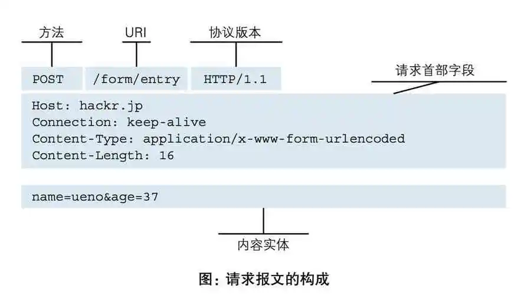
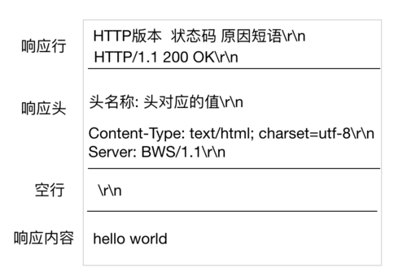

# 计算机网络高频（五）HTTP和HTTPS

## 1.什么是Http协议？⭐

### 基本介绍：

**HTTP（Hyper Text Transfer Protocol）： 全称超文本传输协议，是用于从万维网（WWW:World Wide Web ）服务器传输超文本到本地浏览器的传送协议。**

**HTTP 是一种应用层协议，是基于 TCP/IP 通信协议来传递数据的，其中 HTTP1.0、HTTP1.1、HTTP2.0 均为 TCP 实现，HTTP3.0 基于 UDP 实现。现主流使用 HTTP1.0 和 HTTP3.0。**

协议： 为了使数据在网络上从源头到达目的，网络通信的参与方必须遵循相同的规则，这套规则称为协议，它最终体现为在网络上传输的数据包的格式。

通俗点讲，协议就是要保证网络通信的双方，能够互相对接上号。就像是两个人传递纸条通过互相指定的暗号，如果发送天亮了，表示可以打游戏了等等

### HTTP协议的特点包括：

1. **简单性**：HTTP 协议的设计简单明了，易于理解和实现。
2. **无状态性**：HTTP 协议是无状态的，即服务器不会保存客户端的状态信息。每个请求都是独立的，服务器不会记住之前的请求。
3. **可扩展性**：HTTP 协议支持通过添加新的请求方法、头部字段等来扩展其功能。
4. **基于请求-响应模型**：客户端发送请求给服务器，服务器根据请求返回相应的响应。
5. **支持缓存**：HTTP 协议支持缓存机制，可以减少数据传输和提高性能。
6. **支持连接**：HTTP 协议支持持久连接，可以在一个 TCP 连接上传输多个请求和响应，减少连接的建立和关闭开销。

## 2. Socket和http的区别和应用场景⭐

Socket（套接字）： Socket 是一种通用的网络编程接口，它提供了一种在计算机网络上进行通信的方式。Socket 允许不同计算机之间的进程通过网络进行数据传输和交流。它提供了底层的数据传输功能，可以实现点对点的数据传输。

**Socket 的特点：**

- 基于传输层协议，如 TCP 或 UDP。
- 提供了底层的数据传输接口，可以直接读写数据。
- 可以实现实时的双向数据传输。
- 灵活性高，可以自定义通信协议。

**Socket 的应用场景： Socket 适用于需要实时、双向通信的场景，例如实时聊天、实时游戏、视频流传输等。它可以在网络上直接传输数据，可以自定义通信协议，适用于各种特定需求的应用。**

HTTP（超文本传输协议）： HTTP 是一种应用层协议，它建立在 Socket 之上，用于在 Web 上进行数据传输。 HTTP 是一种无状态、请求-响应的协议，客户端发送请求，服务器返回响应。HTTP 通常使用 TCP 作为传输层协议。

**HTTP 的特点：**

- 基于请求-响应模型，客户端发送请求，服务器返回响应。
- 使用 URL 来标识资源。
- 无状态，每个请求都是独立的，服务器不会保留客户端的状态信息。
- 支持多种请求方法，如 GET、POST、PUT、DELETE 等。

**HTTP 的应用场景： HTTP 适用于客户端与服务器之间的通信，特别是在 Web 应用中。它用于在浏览器和服务器之间传输 HTML 页面、图像、视频、音频等资源。HTTP 还广泛应用于 RESTful API，用于实现不同系统之间的数据交换和通信。**

## 3. 什么是 HTTP 的请求体？⭐⭐⭐

**HTTP 请求由请求方法（HTTP Method）、URL、协议版本和请求首部字段组成。**

以下是HTTP请求的基本结构：

1. 请求方法（HTTP Method）：指示服务器应该执行的操作类型。常见的 HTTP 请求方法包括：
   - GET：获取资源 
   - POST：提交数据，创建资源 
   - PUT：更新资源
   - DELETE：删除资源
   - HEAD：获取资源的头部信息
   - OPTIONS：获取服务器支持的请求方法和功能
   - PATCH：对资源进行部分更新
2. URL（Uniform Resource Locator）：指定要请求的资源的地址。URL 由协议、主机名、端口号和路径组成，例如：http://example.com/api/users。
3. 协议版本：指定使用的 HTTP 协议版本。常见的协议版本包括 HTTP/1.1 和 HTTP/2。
4. 请求首部字段：包含了请求的附加信息，以键值对的形式出现。常见的请求首部字段包括：
   - Host：指定服务器的主机名和端口号 
   - User-Agent：标识客户端的用户代理信息
   - Content-Type：指定请求体的数据类型
   - Content-Length：指定请求体的长度
   - Authorization：用于身份验证的凭据
   - Cookie：包含客户端的 Cookie 信息
   - Accept：指定客户端能够接受的响应内容类型
   - Referer：指示请求的来源 URL
5. 请求体：可选的，包含了请求的数据内容。它通常在 POST、PUT 等请求方法中使用，用于向服务器提交数据。

## 4. HTTP 的响应报文有哪些？⭐⭐

**HTTP 的响应报文由状态行（Status Line）、响应首部字段（Response Headers）、空行和响应体（Response Body）组成。**

以下是 HTTP 响应报文的基本结构：

1. 状态行（Status Line）：包含了 HTTP 响应的状态码和对应的状态消息。状态行的格式为 `HTTP版本 状态码 状态消息`，例如：`HTTP/1.1 200 OK`。常见的状态码包括：
   - 1xx：信息性状态码，表示请求正在处理
   - 2xx：成功状态码，表示请求已成功处理
   - 3xx：重定向状态码，表示需要进一步操作以完成请求
   - 4xx：客户端错误状态码，表示请求包含错误或无法完成请求
   - 5xx：服务器错误状态码，表示服务器无法完成请求
2. 响应首部字段（Response Headers）：包含了响应的附加信息，以键值对的形式出现。常见的响应首部字段包括：
   - Content-Type：指定响应体的数据类型
   - Content-Length：指定响应体的长度
   - Server：指示响应的服务器软件信息
   - Set-Cookie：设置响应的 Cookie 信息
   - Cache-Control：指定响应的缓存控制策略
   - Location：指示重定向的目标 URL
   - Last-Modified：指示资源的最后修改时间
3. 空行：一个空行用于分隔响应首部字段和响应体。
4. 响应体（Response Body）：包含了服务器返回的实际数据内容。响应体的格式和内容取决于响应首部字段中的 Content-Type 以及服务器返回的数据。

# 5. HTTP 和 HTTPS 的区别？⭐⭐

1. **HTTP（Hypertext Transfer Protocol）是一种用于在客户端和服务器之间传输数据的协议。它是基于TCP/IP协议的应用层协议。**
2. **HTTP 是明文传输协议，数据在传输过程中不加密，容易被窃听和篡改。**
3. **HTTPS（Hypertext Transfer Protocol Secure）是具有安全性的 TLS（Transport Layer Security）加密传输协议。**
4. **HTTPS 通过使用 SSL 或 TLS 协议对数据进行加密和身份验证，提供了更高的安全性。**
5. **HTTPS 在建立连接方面，除了三次握手之外，还需要进行 SSL 握手，用于协商加密使用的对称密钥。**
6. **使用 HTTPS 需要服务器申请并安装数字证书，确保浏览器能够验证服务器的身份，并确保通信的安全性。**
7. **HTTP 默认使用端口 80 进行通信，而 HTTPS 默认使用端口 443 进行通信。**

下面是一个表格，展示了 HTTP 和 HTTPS 之间的主要区别：

| 定义     | 超文本传输协议（HTTP）             | 安全超文本传输协议（HTTPS）            |
| -------- | ---------------------------------- | -------------------------------------- |
| 端口号   | 默认端口号为 80                    | 默认端口号为 443                       |
| 安全性   | 传输的数据是明文的                 | 传输的数据经过加密，具有更高的安全性   |
| 数据加密 | 不提供数据加密                     | 使用 SSL/TLS 协议对数据进行加密        |
| 证书     | 不需要证书                         | 需要使用数字证书进行身份验证和加密     |
| URL      | 以"http://"开头                    | 以"https://"开头                       |
| 连接方式 | 无连接，每个请求都建立新的连接     | 支持持久连接，可以复用连接进行多个请求 |
| SEO优化  | 相对较好，搜索引擎更容易索引和处理 | 相对较差，搜索引擎对加密内容的处理有限 |
| 使用场景 | 适用于不涉及敏感信息的普通网页请求 | 适用于涉及敏感信息的网页，如登录、支付 |

## 6. HTTPS工作原理⭐⭐⭐

HTTPS的工作原理可以简要概括为以下步骤：

1. **客户端发起HTTPS请求：**客户端（通常是Web浏览器）向服务器发送HTTPS请求。请求的URL以"https://"开头，指示使用HTTPS协议进行通信。

2. **服务器配置和证书验证**：服务器需要配置支持HTTPS的相关软件，并且通常会申请和安装数字证书。数字证书由可信任的第三方机构（如证书颁发机构）颁发，用于验证服务器的身份。

3. **服务器发送证书：**服务器在建立连接时会将数字证书发送给客户端。证书包含了服务器的公钥和其他相关信息。

4. **客户端验证证书：**客户端收到服务器发送的证书后，会验证证书的有效性。验证包括检查证书的签名是否有效、证书是否过期、证书中的域名是否与访问的域名匹配等。
5. **客户端生成对称密钥**：如果证书验证通过，客户端会生成一个用于对称加密的随机对称密钥，并使用服务器的公钥进行加密。

6. **服务器使用私钥解密：**服务器收到客户端发送的加密的对称密钥后，使用自己的私钥进行解密，得到对称密钥。
7. **建立加密通信：**客户端和服务器现在都拥有相同的对称密钥，可以使用该密钥对后续的通信进行加密和解密。双方之间的数据传输都会使用对称密钥进行加密。

**通过这个过程，HTTPS 确保了通信的机密性和完整性。客户端和服务器之间的数据在传输过程中经过加密保护，使得第三方无法窃听或篡改通信内容。同时，通过证书验证，确保了客户端与服务器之间的身份认证和安全性。**

## 7. 一次完整的 HTTP 请求所经历几个步骤?⭐⭐

一次完整的 HTTP 请求通常经历以下七个步骤：

1. **解析 URL：**客户端解析目标 URL，提取出主机名、端口号、路径等信息。

2. **建立 TCP 连接：**客户端使用目标主机的 IP 地址和端口号，通过三次握手建立与服务器的 TCP 连接。

3. **发起请求：**客户端向服务器发送 HTTP 请求，包括请求方法（GET、POST等）、请求头（包含用户代理、内容类型等信息）和请求体（POST 请求时携带的数据）。
4. **服务器处理请求并返回响应：**服务器接收到请求后，根据请求的路径和方法，执行相应的处理逻辑，可能包括读取数据库、处理业务逻辑等。服务器构建 HTTP 响应，包括响应状态码、响应头（包含内容类型、缓存控制等信息）和响应体（包含返回的数据）。

5. **接收响应：**客户端接收到服务器的响应，包括响应状态码、响应头和响应体。

6. **处理响应：**客户端根据响应的内容进行处理，可能包括解析响应头、读取响应体中的数据等。

7. **关闭连接：**客户端和服务器根据需要决定是否关闭 TCP 连接，如果需要继续通信，可以发送更多的 HTTP 请求。

## 8. 常用 HTTP 状态码是怎么分类的，有哪些常见的状态码？⭐

| 状态码 | 表示                  | 解析                                                         |
| ---- | --------------------- | ------------------------------------------------------------ |
| 100  | Continue              | 服务器已接收到请求的初始部分，并且客户端应继续发送剩余的请求。 |
| 101  | Switching Protocols   | 服务器已理解客户端的请求，并将通过Upgrade消息头通知客户端切换协议。 |
| 201  | Created               | 请求已成功，并在服务器上创建了新资源。                       |
| 204  | No Content            | 服务器成功处理了请求，但没有返回任何实体内容。               |
| 206  | Partial Content       | 服务器成功处理了部分GET请求，返回指定范围的实体内容。        |
| 301  | Moved Permanently     | 被请求的资源已永久移动到新位置，新的URL在Location头中给出，浏览器应该自动地访问新的URL。301为永久重定向。 |
| 302  | Found                 | 请求的资源现在临时从不同的URL响应请求。302为临时重定向。     |
| 304  | Not Modified          | 告诉浏览器可以从缓存中获取所请求的资源，没有发生改变。       |
| 400  | Bad Request           | 请求报文存在语法错误，服务器无法理解。                       |
| 401  | Unauthorized          | 请求要求身份验证，客户端需要提供有效的身份凭据。             |
| 403  | Forbidden             | 表示对请求资源的访问被服务器拒绝，客户端没有权限访问。       |
| 404  | Not Found             | 表示在服务器上没有找到请求的资源，请求的URL不存在或者已删除。 |
| 500  | Internal Server Error | 表示服务器端在执行请求时发生了错误，可能是服务器程序出错或配置错误。 |
| 502  | Bad Gateway           | 作为网关或代理服务器的服务器，从上游服务器接收到无效的响应。 |
| 503  | Service Unavailable   | 表明服务器暂时处于超负载或正在停机维护，无法处理请求。客户端应该稍后重试或等待服务器恢复正常。 |
| 504  | Gateway Timeout       | 作为网关或代理服务器的服务器，未及时从上游服务器接收到响应。 |

## 9. HTTP 协议中有那些请求方式⭐⭐⭐

以下是HTTP协议中常见的请求方式

| GET     | 获取指定资源的信息，通过URL传递参数，响应包含资源信息        |
| ------- | ------------------------------------------------------------ |
| POST    | 向服务器提交数据，常用于表单提交、文件上传等操作，响应包含结果 |
| PUT     | 创建或更新指定资源                                           |
| DELETE  | 删除指定的资源                                               |
| PATCH   | 对已存在的资源进行局部更新                                   |
| HEAD    | 类似于GET请求，仅返回资源的头部信息                          |
| OPTIONS | 获取服务器支持的请求方法和允许的请求头部信息                 |
| TRACE   | 用于回显客户端的请求，用于诊断和调试                         |

## 10. GET 方法与 POST 方法的区别⭐⭐⭐

| **区别**     | **GET 方法**                                                 | **POST 方法**                                                |
| ------------ | ------------------------------------------------------------ | ------------------------------------------------------------ |
| 数据位置     | 请求的数据以查询字符串的形式附加在URL的末尾                  | 数据包含在请求体中                                           |
| 数据长度限制 | 通常有长度限制，具体取决于浏览器或服务器的设置，一般为几千个字符 | 一般没有特定的数据长度限制                                   |
| 安全性       | 请求参数以明文显示在 URL 中，不适合传递敏感信息，如密码等    | 请求参数包含在请求体中，相对较安全，但建议使用加密手段保护敏感数据 |
| 数据类型     | 主要用于获取资源的信息，请求可以被缓存、收藏等               | 主要用于向服务器提交数据，请求一般不被缓存                   |
| 幂等性       | 幂等的，多次请求不会产生副作用，不会改变服务器状态           | 不是幂等的，多次相同的请求会产生相应的副作用                 |
| 使用场景     | 获取数据、查看资源等无副作用的操作                           | 提交数据、修改服务器状态等具有副作用的操                     |